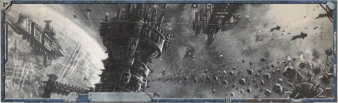
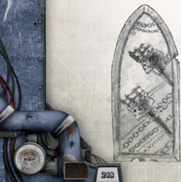

### Lesser Endeavour, +1 Profit Factor, 900 Achievement Points

The  surveyors  that  Lidiah  hired  return  after  six  months  with  a particularly underwhelming report and some poorly-made charts. The Game Master informs Lidiah that the Endeavour has failed, and she is also one Profit Factor point in the red. Lidiah's Navigator is convinced that something is amiss, and there must be something wrong with the survey that would explain both the quickness with which the surveyors finished the job, and the fact that nothing in particular was found. He and Lidiah pore over the charts and reports and the Game Master asks him to  make  a Hard (-20) Navigation Test. He  passes  with  two degrees of success, finds the navigational error and is informed by the Game Master that there's a whole sector of space in that cluster that the surveyors completely missed.

After some consultation with her officers, Lidiah decides to take the Litvyak out to this uncharted sector and see if there's something there that could take at least some of the sting out of this failure. Upon arriving, she and her officers make the appropriate Skill Tests and  discover  the  extremely  rich,  ore-laden  asteroid  field  that  the surveyors missed. After a quick scan and some scribbled equations, Lidiah figures that she could make one point of Profit Factor from the ore in this field after expenses. This would essentially make the Endeavour a wash. It would still be a failure, but the Profit Factor gained from the ore cancels out the point lost to the Endeavour.

If the Explorers had rolled extremely well here, or if the Game Master was feeling particularly generous, there could be even more opportunities for profit within the system. Perhaps with a large number of degrees of success on a Scrutiny Test, one of the officers discovers an ancient, abandoned space station orbiting one of the planets in the system. Is the station empty? A complete loss? Salvageable? Full of Genestealers? The possibilities are endless.

### Objective 1: Positively Identify Simkin's Reach

E ighteen months ago, the Adeptus Mechanicus at Port Wander began receiving  mysterious  and  ancient  vox transmissions  from  somewhere  in  the  Void.  These transmissions-strings  of  what  appeared  to  be  ship  transponder IDs,  navigational  coordinates  in  an  unknown  format,  and snippets  of  unfamiliar  languages-at  first  stirred  only  mild interest and tavern rumours amongst the station's denizens. Recently,  however,  interest  has  approached  fever  pitch  as information and rumours have leaked from the Mechanicus's translation efforts at Port Wander. The languages are ancient Terran dialects not heard since the end of the Horus Heresy. The transponder information identifies ancient colony ships whose names are  lost  to  history.  Finally,  the  source  of  the transmissions  seems  to  have  been  identified,  a  star  cluster called Simkin's Reach. All of this is regarded as tremendous news save  for  one  thing:  no  such  place  as  Simkin's  Reach exists on any known star chart.

This last bit of information hasn't dulled the excitement however,  and  a  Gold  Rush  mentality  has  gripped  Port Wander. Every Rogue Trader, Missionary, Merchant or twobit hoodlum with a spaceship has set about pressing voidmen into service, laying in supplies and expending huge amounts of resources to find out what and where Simkin's Reach is.Every able Voidman in every tavern in the yards is shipping out  tomorrow  with  a  prime  crew  and  a  first-rate  captain who knows where The Reach is and will be the first to reap the rewards. The truth is that no one knows the location of Simkin's Reach, or whether it exists at all. Even if it does, these transmissions are at least ten thousand years old, so it is uncertain if there's even anything there to find.

It's up to the Explorers to identify the location of Simkin's Reach and be one of the first, if not the first, delegation from the Imperium to open it for trade. This will be a monumental effort  requiring  massive  outlays  of  cash,  men  and  materiel, and could be just the thing that the Explorers to establish their names throughout the Expanse.

### Objective 2: Safeguard the Information and Provision the Ship for a Long Voyage

Simkin's Reach isn't so much a place as it is an idea. During the early years of the Imperium, a visionary prophet named Namaris  Simkin  founded  a  cult  based  on  ancient  political and theological  theories  in  what  would  eventually  become the  Calixis  Sector.  At  the  heart  of  his  movement  was  the idea  that  man  could  transcend  his  baser,  animal  instincts and become a being of pure reason. He preached a utopia of peace and harmony, far away from the Ecclesiarchy and the God-Emperor, where all were equal. A place where scientific, technological and philosophical advances would grant every man, woman and child a life of uninterrupted ease and luxury. His  ideas  and  powerful  personality  attracted  millions  of followers, and as they lavished him with adoration and tithes he formulated a plan to bring his utopia to fruition.

Using donations from his followers, many of whom were powerful  political  leaders  and  captains  of  industry,  Simkin was able  to  amass  enough  wealth  and  influence  to  finance the  construction  of  three  massive,  warp-capable  colony ships to take him and his people far away from the constant anxiety,  violence  and  privation  that  were  slowly  becoming the pervasive force in every human's life. Simkin claimed that a perfect location to restart humanity had come to him in a vision,  and  he  paraded  around  star  charts  and  navigational equations  that  no  one  could  clearly  identify  or  even  read. Once  the  ships  were  completed,  Simkin  and  his  followers boarded, along with years worth of provisions and everything they  would  need  to  colonise  a  new  world.  They  set  their course, dropped into the Warp, and weren't heard from again for thousands of years.

After  generations  of  wandering  the  trackless  void,  the three colony ships, long out of provisions and on their last legs, dropped into what is now SH-01-0151. For Millennia the pilgrims had wandered. Simkin was long dead and his original  ideas  twisted  or  forgotten.  The  ships  were  badly battered and on the verge of succumbing to fatigue and the countless damages incurred during the voyage. The colonists had survived, but over the generations their numbers grew thin thanks to disease, madness, mutation and mass suicides. There were still some vestiges of the original cult left among the  small  fleet's  leadership,  and  upon  landing  in  SH-010151-and taking stock of the sad, desperate state they were in, they declared that they had found the paradise promised by their leader, named the cluster Simkin's Reach (possibly in reference to Simkin's reach exceeding his grasp), and set to finding a place to live.

The pilgrims found a suitable system for colonisation in The  Reach  around  a  large  yellow  star  with  four  habitable planets.  Each  ship  chose  a  planet  and  they  split  company based  along  doctrinal  divisions  that  had  arisen  during  the long journey. The ships each landed on their separate planets, and  the  colonists  spent  the  next  few  generations  stripping them of  anything  useful.  Over  the  course  of  the  next  few thousand years, the worlds of Simkin's Reach slowly fell out of contact with one another as their technology broke down and they lost the materials and abilities to repair it. In their isolation, each world regressed to a different level of steam or  early-industrial  technology  over  the  next  few  thousand years.  Their  space  faring  past  slipped  from  fact  to  myth, and eventually they forgot about their cousins on the other colonised worlds, and even the God-Emperor Himself.

This all changed about three thousand years ago when each world rediscovered space flight at roughly the same time. As the first  crude  satellites  were  launched  into  orbit  to  see  if  anyone else was out there, they discovered that not only were they not alone as each had thought, but that their neighbours were in fact long-lost relatives. A race began on each planet to develop ships  capable  of  travelling  between  the  worlds,  and  networks of  communication  satellites  were  sent  up  to  better  facilitate communication between the planetary governments. Y ears passed and the people of Simkin's reach were reunited just in time to be set upon by Orks. After a long and bloody war the Orks were repelled,  but  only  after  staggering  losses  among  the  human forces. Each force retreated to its home world to lick its wounds and  attempt  to  slowly  rebuild  its  empires.  Tensions  began  to rise among the three homeworlds and various outposts, mining stations and colonies scattered around the system. Governments splintered, moons declared their sovereignty, and the whole of the system was plunged into a cold war that occasionally flared up into fleet battles or colony massacres.

For two thousand years, the people of Simkin's reach have been slowly expanding throughout the cluster. They have  only  recently  redeveloped  Warp  technology,  as  the number  of  psykers  among  these  people  is  infinitesimal, and there are probably no more than a dozen warp-capable ships in the cluster. Their paucity of Warp technology makes their  exploration  of  the  cluster  painfully  slow,  and  any contact with the larger galaxy nearly unthinkable. When the Explorers finally find them, they find a generally dour and cynical people, deeply suspicious of both xenos and fellow humans. While their technology is still thousands of years behind that of the Imperium, their ships are still fast  and  their  guns  can  still  kill  just  as  easily  as  anyone else's. These strange, isolated people, heathens who know not  the  light  or  blessings  of  the  God-Emperor,  are  ripe for conversion and live in a star cluster rich in natural resources.  Their  conversion  and  the  exploitation  of their  space  promises  untold  wealth  for  anyone good enough and strong enough to bring these lost pilgrims back into the fold.

### Objective 3: Slip Moorings

## Chart SH-01-0151

### Greater Endeavour, +3 Profit Factor, 1,200 Achievement Points

Everyone  aboard  Port  Wander  is  desperate  to  discover  the source of the mysterious transmissions from Simkin's Reach. There are more rumours than facts and most conversations start  with,  'I'm  not  one  to  talk,  and  you  never  heard  this from  me,  but...'  A  lucrative  underground  trade  has  even been established, peddling 'Accurate Location and Charts of Simkin's Reach.' The Explorers will have to filter through a lot of noise to get to the actual truth of the matter.

### Objective 1: Make Primary Survey of Stars Within Cluster

Themes:

None

Simkin's Reach is, in fact, Star Cluster SH-01-0151, a little known and unexplored open star cluster in the far reaches of the Koronus Expanse. While the name Simkin's Reach isn't on any charts, the Explorers can, with weeks of thorough investigation and a little luck, figure out that the Reach and SH-01-0151 are one in the same. Once the system is positively identified, the Explorers can go about quietly fitting out while trying to keep their discovery a secret and attempting to be the first ones to reach the cluster.

### Objective 2: Survey Any Promising Planets

Themes:

Exploration, Trade

Now that the Explorers have discovered the identity of Simkin's Reach,  they  need  to  start  planning  their  voyage.  First,  they must diligently protect their information if they have any hope of being the first to cash in on this new source of wealth. Any pressing  of  hands,  buying  provisions  and  other  preparations must be done as quietly as is possible to avoid tipping off rival Rogue Traders. The information itself must be kept secret, known only to the Rogue Trader and one or two of his most trusted officers. One loose bit of gossip from a crewman, one unchecked casual remark, and the whole station will know that the Explorers have

discovered the whereabouts of the Reach.

### Themes:

Themes:

Exploration

The Explorers must now chart their course and make way for  SH-01-0151.  They  should  leave  Port  Wander  with  as little fanfare as possible, and with as much misdirection and obfuscation  as  they  can  muster.  False  course  declarations, altered  bills  of  lading,  drastically  under-reported  musters, all  of  this  and  more  should  go  into  the  Explorers'  final preparations for departure.

### Objective 3: Make Contact With Human Planets

## Broker Peace Between the Major Power Blocs

Once  the  Explorers  arrive  at  their  destination,  they  are greeted by a sparse but beautiful spectacle. SH-01-0151 is an ancient Open Star Cluster containing roughly fifty stars and an unknown number of worlds. The Explorers will have their work cut out for them as they try to catalogue all the stars and planets and determine if any of them hold life.

### Lesser Endeavour, +1 Profit Factor, 700 Achievement Points

Themes:

Exploration

The first step of this survey should be investigating each star in the cluster and charting the Warp routes between them. This will involve a lot of tedious flying about, determining the make up of dozens of stars, cataloguing them, taking stock of their systems and making note of any promising planets or asteroid fields. The Explorers should also make note of any evidence of spacefaring technology while taking pains to avoid contact with any and all ships or stations that they may encounter.

### Objective 1: Identify and Meet With Major Planetary and Commercial Power Blocs

### Objective 2: Make Contacts Within Powerful Organisations

Exploration

Once the stars are charted and relatively  reliable  Warp  routes have been laid out, the Explorers should now concentrate on looking for life among the stars. Planets that were noted earlier as  promising should be revisited and scanned for any human inhabitation. They should be looking for signs of spacefaring tech and knowledge of the God-Emperor, listening for transmissions and making sure they're not seen doing so. Finally , the Explorers should be on the lookout for any trace of xenos inhabitation in the cluster, whether current populations or ancient ruins.There is life in SH-01-0151, but not a lot of it. There are roughly a dozen worlds of human habitation centred around two systems. The inhabitants have sub-stellar space technology, but little evidence of Warp capable ships. There is no indication that  these  people  are  aware  of  the  existence  of  the  GodEmperor, and many of the planets seem to at war with one another. There also seems to be seems to be a large, organised force of naval ships preying on both planetary warships and shipping that give every appearance of being corsairs.

### Objective 3: Negotiate a Ceasefire or Uneasy Peace.

Themes: Exploration, Military, Creed

Now  that  the  Explorers  have  a  rough  grasp  of  the  astropolitical  situation  within  SH-01-0151,  they  should  come up with a plan to make contact with the natives. This will entail  dealing  with  each  planet's  sub-stellar  navy,  sending emissaries, and generally making shows of wealth and power to awe the planetary governors.

## Pacify Pirate Clans

### Greater Endeavour, +3 Profit Factor, 1,200 Achievement Points

Once contact has been made, the Explorers quickly realise that the political situation in this little part of space is extremely volatile. Planetary governments, colonists, stellar corporations and pirates have been at each other's throats for generations now. Before any kind of trade can take place, the Explorers need to figure out how to navigate the dangerous political waters and try, by either diplomacy or force of arms, to bring some stability to the cluster.

### Objective 1: Locate Main Pirate Fleet in Each System

Themes: Creed, Military, Trade

Once the Explorers make initial contact, with the showing of the colours and a sufficient show of force, they will then need  to  spend  some  time  identifying  the  major  Explorers in the cluster and getting face time with them. Gifts will be exchanged, promises made, pacts sworn and bribes paid. The Explorers should make doubly sure that they can deliver what they promise, if they even intend to, and that whatever they do doesn't act to set of a major political incident. That could be problematic this far from support or backup.

### Objective 2: Find and Destroy Hidden Pirate Base

Themes: Trade, Military, Creed

Explorers should now work toward making strong contacts within the various powerful governments, business concerns and cartels. These contacts should be sought out to provide the  maximum  benefit  possible  for  the  coming  peace  and trade negotiations.

### Objective 3: Clean up Remains of Pirate Fleet

Themes: Military, Creed, Trade

Negotiating some kind of peace is the ultimate goal of this Endeavour. The Explorers will need a relatively stable political situation  in  the  cluster  before  they  can  begin  serious  trade negotiations. This is a delicate situation that will call for every bit of the Explorers' commercial and political savvy.

## Survey Asteroid Fields, Gas Clouds and Other Natural Resources

### Greater Endeavour, +3 Profit Factor, 1,200 Achievement Points

As  peace  negotiations  progress,  the  Explorers  realise  that  one sticking point are the numerous allied pirate clans that plague the different systems. The one thing that the major power blocs can agree on is that the pirates have gotten out of hand, and their navies are each having their own difficulties putting a stop to their predations. They agree to a temporary cease-fire in the event that the Explorers can help pacify these bloodthirsty pirates.

### Objective 1: Identify Any Known Resource Deposits

Themes: Military

Each system is plagued by a small, independent fleet of pirates that seem to be allied with one another. The Explorers' first step should be to seek these fleets out and destroy them or drive them out of the system.

### Objective 2: Gather Survey Ships, Crews and Equipment

Themes: Military

The Explorers and their consorts can never seem to fully rout the pirates from any one system, and as soon as they move the pirates pop up again and tear around the system looking for revenge. This seems to point to secret bases in each system, or some sort of Warp-capable vessel acting as a resupply ship. The truth is that the pirates are operating from a huge, ancient battleship of unknown provenance, using it as a mothership and mobile resupply station. This ship easily dwarfs the Explorers' ship, and is actually one of the original colony ships, lost in the dark outer reaches of the home system. Whether they flatout destroy the massive relic or take it a prize is entirely up to the Explorers. Either way, it will break the back of the Pirate fleet and get them one step closer to their trade routes. If the Explorers do take the ship a prize, they find that it is indeed of ancient human origin and packed full of archeotech. Taking the ship adds +1 to the Profit Factor award for this Endeavour.

### Objective 3: Survey Uncharted Deposits

Themes: Military

With  their  mothership  gone  and  their  organisation shattered,  the  pirates  have  now  scattered.  Small pockets  persist  in  the  major  systems  however, and  will  continue  to  harry  trade  and  naval ships  until  the  Explorers  deal  with  themas well. These remaining pirates should be very dogged and savage fighters, proving over and over again that there truly is nothing more dangerous than a man with nothing to lose.

## Sabotage Rival Trade Dynasty Making Inroads in Cluster

### Lesser Endeavour, +1 Profit Factor, 900 Achievement Points

Before any serious trading can begin, the Explorers must first know what they've got to deal with. Earlier, the Explorers charted  possible  deposits  of  natural  resources  during  their initial investigation of the cluster. Now is the time to see if any of these potential mother lodes will bear fruit.

### Objective 1: Stymie the Rival's Political and Diplomatic Mission

Themes:

Trade, Exploration

While there is certainly much that is unknown about the riches of the cluster, surely at least some of it has been surveyed for resource exploitation. Before the Explorers go trudging around the cluster scanning every rock and gas cloud, they should first see if there's been work done already . Through the contacts they should have been cultivating throughout the beginning of this Meta Endeavour, the Explorers should be able to find all manner of  navigational  charts,  astro-geological  surveys  and  records from established mining and shipping concerns. Gathering this information should make the rest of their survey go smoother.

### Objective 2: Bribes and Threats

Themes:

Trade, Exploration

All the star charts and annual mining reports aren't worth the paper they're printed on without a thorough and up to date survey.  To  achieve  this,  the  Explorers  will  need  more  than just  their  ship  and  their  people  if  they  want  to  finish  this task in any reasonable amount of time. They should spend this time searching out and hiring surveyors and survey ships, organising  a  small  exploration  fleet  and  charting  the  best course to maximise their time spent in each system.

### Objective 3: Commerce Raiding and Running the Rivals Out

Themes: Exploration

With their small fleet, the Explorers set out on the long and tedious  journey  of  searching  for  valuable  resources  on  and amongst the worlds of the cluster. A painstaking survey will take  months  and  be  mostly  mind-numbingly  boring,  but ultimately worth the effort.  SH-01-0151 is rich with numerous precious gems and valuable ores, mostly unexploited that will fetch a fortune in the Imperium if the players can find a way to get them back there.

## Establish Trade Routes From SH01-0151 to the Imperium

### Greater Endeavour, Profit Factor +4, 1,200 Achievement Points

Information has a way of getting out no matter how tightly it's  controlled.  The  Explorers  have  come  to  realise  that they're not the only Trade Dynasty working in SH-01-0151. Whether this rival dynasty is a new arrival that showed up while the Explorers were chasing pirates or scanning rocks, or whether they've been in the cluster the whole time, it all means the same thing. These rivals will need to be run out of the cluster or ruined by any means necessary. It's important to note that the Game Master can run this Endeavour more than once in the Meta Endeavour. There will never be a shortage of people coming from the Imperium and trying to horn in on the Explorers' action.

### Objective 1: Establish Infrastructure

Themes:

Criminal, Trade

The Explorers need to find a way to sour relations between their rivals and the ruling powers in the cluster. Spreading lies, paying bribes  and  entrapping  their  leaders  in  sensitive  and  delicate

situations engineered to cause the most insult and do the most damage are all part and parcel of this level of negotiations. This is where the Explorers can leverage any contacts that they've been cultivating as well as any political influence they may have to cause irreparable harm to their rival's reputations.

### Themes: Trade

Themes: Trade, Military, Criminal

Once the rival dynasty's reputation has been tarnished, it is time  to  ratchet  up  the  pressure.  Dealing  with  local  governments, militaries and criminal organisations, the Explorers can cause immense damage to the rival delegation by proxy. Ships can be impounded, crews pressed, work stoppages called, equipment stolen, contractors harassed and ship's personnel kidnapped. Explorers should be at their most devious and underhanded when taking actions like this. Commerce is war, and all is fair in love and war.

### Objective 2: Identify Markets Within the Imperium

Themes: Military, Trade, Criminal

Now that the Explorers have their rivals on the ropes, it's time to  strike  the  fatal  blow .  Hitting  the  rival  delegation's  trade ships, disrupting any supply lines and striking at any orbital or surface facilities may finally make them see the light and leave  the  cluster  while  they  still  can.  They  may  not  be  so easily chased out though, and the Explorers stand the risk of being victims of the same tactics.

### Objective 3: Plot Warp Routes

## Convert the Heathen

The Explorers now have trade goods and a pliable government; what they need is the infrastructure to get their goods from SH-01-0151 to markets within the Imperium. This endeavour requires a lot of heavy lifting on the part of the Explorers: setting  up  mining  and  smelting  operations,  plotting  warp routes,  negotiating  compacts  of  trade  and  getting  in  good with a powerful trading partner are all part and parcel of this Endeavour.

### Lesser Endeavour, +2 Profit Factor, 900 Achievement Points

### Objective 1: Gather Missionaries

Whether they do it themselves or partner with mining and hauling  concerns,  the  Explorers  are  going  to  need  men, equipment and know-how to get their ores, gems and gasses out of the ground and into the holds of trade ships. They will also  need  more  trade  ships,  smelting  and  processing  operations, clerks, scribes, warehouses and much, much more.

### Objective 2: Purge Heretics

Themes: Investigation, Trade

Now begin the long trips back and forth from the Imperium to the Reach in search of buyers for the Explorers' commodities. The Explorers will need to know what they have, how much they can reliably get and how quickly they can get it from the ground to market. While it won't be too terribly difficult to find buyers for the majority of what the Explorers are selling, finding fair  prices  and  trustworthy  brokerage  houses  is  the hard part.

### Objective 3: the Delegation From the Adeptus Mechanicus

Themes: Exploration, Trade

The  Explorers  now  need  to  find  the  quickest  way  to  get their  products  to  market.  This  is  the  most  dangerous  part of the Endeavour, where the entire thing could be scuttled by the vagaries of the Warp. Anything could happen during their long exploration of the Warp, and they will need to be extremely good and extremely lucky if they want to see the fruits of their labours blossom.

## Eliminate the Xenos in the Cluster

### Greater Endeavour, +3 Profit Factor, 1,200 Achievement Points

The  light  and  blessings  of  the  God-Emperor  have  yet  to reach  the  heathen  in  SH-01-0151.  The  Explorers  need  to get missionaries from the Imperium to convert heathens and burn heretics. Showing the might of the God-Emperor and how the faithful are rewarded both in this world and the next is  always  an  important  part  of  dealing  with  unenlightened cultures.

### Objective 1: Pacify Xenos

Themes: Trade, Creed

The  Explorers  should  have  no  problem  finding  willing missionaries to come to SH-01-0151 to save the people there from heresy. Moving the throngs of the faithful to the far end of space is the challenge, and the Explorers will need both ships to haul the faithful and blessings from the Ecclesiarchy to see that the correct tone is set for this Endeavour.

### Objective 2: Excavate Xenos Ruins

Themes: Military, Creed

Once the conversion is in full  swing,  the  good  news  of  the  GodEmperor spreads like wildfire throughout the cluster. There is one world that refuses  to  see  the  light,  with  a  particularly stubborn planetary government whose state religion is still the cult of utopia that Simkin and his followers carried here all those millennia ago. After a number of conversion attempts and riots, the planetary security forces rounded up all the missionaries and had them executed, returning their mutilated bodies to the Ecclesiarchy pilgrim ship  in  orbit.  The  Explorers,  now  the  lead representatives  of  the  Ecclesiarchy  in  theReach, are called upon to punish these heretics. They may use any means they see fit, but they must guarantee that the Cult of the Emperor takes hold on this world. The Ecclesiarchy will not be denied their souls.

### Objective 3: Cover up a Heresy

Themes:

Exploration, Creed

High ranking  officials  within  the  Adeptus  Mechanicus  have  gotten wind of the opening of SH-01-0151 from the observatory at Port Wander. The Explorers are summoned back to the station at the behest of the Adeptus Mechanicus. The Adeptus believes that there must be large amounts of ancient and heretical technology among  a  people  so  ancient  and  isolated.  The  Explorers  are requested to take a delegation of tech-priests back to the cluster and give them any and all assistance they require in the search for and acquisition of these artefacts. What these artefacts are, and if they exist at all, is solely up to the Game Master.

### Themes: Creed, Military

## Establish a Cold Trade in Newly Discovered Xenos Artefacts

During  their  initial  and  subsequent  surveys,  the  Explorers routinely  came  upon  evidence  of  xenos  habitation,  both  ancient and recent throughout the cluster. Further investigation has revealed a large population of primitive and aggressive xenos inhabiting a few planets that will need to be cleared out in anticipation of groups of colonists and pilgrims already said to be gathering at Port Wander.

### Lesser Endeavour, +1 Profit Factor, 900 Achievement Points

Themes: Military

These xenos are primitive, aggressive and posses very little in the way of technology. What they lack in sophistication they more than make up for with numbers, strength and savagery. They seem to prefer humid, tropical places and dense jungles which will make finding and killing them without ruining large swaths of otherwise perfectly useful planets exceedingly difficult. Once the fight is joined, and the Explorers have a chance to let some xenos blood, they discover that on at least a few worlds the creatures are inhabiting sprawling, ancient ruins of unknown provenance. Anyone fighting in the ruins notices two important things: the ruins are full of xenos tech and artefacts and there are bas-reliefs decorating many of the walls in the crumbling structures depicting the xenos that the Explorers are currently fighting.

### Objective 1: Strike a Deal and Collect a Sample

Themes: Exploration, Creed

With the Xenos out of the way, the Explorers and any allies they have are now free to explore the ruins. Spread over half a dozen worlds in two systems, these ruins each suggest powerful cities filled with highly-advanced peoples. The members of the Adeptus Mechanicus delegation that arrived in the cluster earlier will be very interested in what the Explorers have found.

### Objective 2: Making Contact

### Objective 3: Skimming Off the Top

During  the  excavation  of  one  of  the  ruins,  a  team  of xenoarcheologists comes across something that is so damning, so  heretical,  that  its  very  existence  is  enough  to  make  the faithful quake. This heresy could be some sort of extremely lethal  ancient  tech,  philosophical  or  theological  teachings, blasphemous  pieces  of  art,  nearly  anything  that  would  be looked down upon by the Ecclesiarchy. The Explorers now have to suppress the information of its discovery, as well as get the information to the right people within the Administratum so that professionals can deal with it.

*Source:* `Battle Fleet of the Koronus, pages 214–221`
