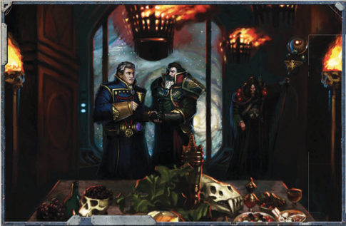

## Creating Meta Endeavours

As with exploration Challenges, interaction Challenges are an expanded version of a standard skill test wherein each player contributes  a  specific  skill  or  skills  toward  the  successful completion  of  a  task.  interaction  Challenges  typically  last a  specific  amount  of  time  as  set  by  the  GM,  and  can  take anywhere from minutes to months. Again, similar to the way an  exploration  Challenge  is  designed,  the  GM  takes  stock of  any  and  all  variables  in  the  social  situation  and  assigns a  total  number  of  degrees  of  success  required  to  complete the challenge. In general, the number of degrees of success

## Meta Endeavour Scope

Rogue Trader Lidiah Yefremova and her ship the Litvyak have  put  in  at  an  agri-world  on  the  fringes  of  the  Drusus Marches to establish a new trade route. As part of the lengthy and byzantine negotiations, she is invited to a gala dinner at the Government Spire. The GM decides that this is a Taxing Interaction Challenge needing six degrees of success.

To start the dinner off right, Lidiah knows that she and her officers will need to make an impressive entrance at the Government Spire to lend the event the proper tone. She makes a successful Challenging (+0) Charm Test and is able to choreograph an entrance  with  dash,  confidence  and  apparent  wealth.  While  no  degrees  of  success  toward  the  Challenge  were  gained,  Lidiah's impressive entrance sets her and her officers on the right foot and makes the next test easier.

Once introduced to the dinner at large, Lidiah and her officers are formally introduced to the Governor himself. The Imperial Governor,  a  fat  and  preening  blowhard,  seems  eager  to  be  flattered,  and  Lidiah's  Seneschal  Jarrion  decides  to play this to their advantage.  He  makes  a Hard (-20)  Scholastic  Lore:  Heraldry  Test (originally  Very  Hard  due  to  the  exacting  nature  of  the knowledge required, but now simply Hard due to the previous success) to see what he knows about the Governor and his lineage. The Seneschal rolls incredibly well and scores two degrees of success. Upon his introduction, Jarrion says some extremely fine things about the Imperial Governor and his family, deeply flattering the Governor and scoring two degrees of success toward completion of the challenge, as well as making the next Test easier.

After some mingling during which Lidiah and her men score two more degrees of success by being thoroughly charming (an Routine (+20) Charm Test ) and good at small-talk (an Easy (+30) Blather Test ), the guests are shown to their seats and dinner begins. Dinner proceeds with the crew making no particularly stunning successes or blunders, until the fourth course where the entire event begins to unravel. The Governor's chief Trade Lord asks Lidiah's Void-master Yuriy about the value of the trade route. Yuri knows that the trade route will be far more beneficial to the crew of the Litvyak than the Governor and his agri-world. In fact, the Governor could likely make more profit by seeking alternate arrangements. Yuriy attempts to Deceive the Trade Lord. Due to previous successes, this Test would normally be Simple (+40 ), but as the outcome promises to be Annoying (-10) to the Governor (although he doesn't know it!) the Test is made at a +30.

Yuriy  fails  the  Test  by  one  degree,  then  upon  spending  a  Fate  Point,  fails  even  more  spectacularly  by  two  degrees!  Yuriy's explanations make the Trade Lord suspicious, and he begins to ask probing questions. As the mood sours, (the party's original four successes out of the six needed have been reduced to two by Yuriy's bad roll), Jarrion quickly tries to smooth things over by making an apology for his shipmate and attempting to change the subject. Sadly, the damage is already done and Yuriy's outburst increases the  difficulty  of  Jarrion's  task,  an Easy  (+30)  Charm  Test (Yuriy's  failure  has  made  all  subsequent  tests  one  step  harder).  The difficulty  is  further  modified  by  the  fact  that  the  Trade  Minister  is  now Skeptical  (-20) ,  and  accepting  an  apology  without satisfaction would cause him to lose face in front of his peers, which is also Annoying (-10) , so the final modifier is +0. Jarrion fails with no degrees of failure, and while he does not lose the group any of their successes, he fails to mollify the Trade Lord and makes future Tests even more difficult. Now at a serious disadvantage, Lidiah and her officers are now going to need to work extra hard if they want to get anything out of this night.

needed can be similar to those found on page 263 of ROGUE TRADER. Convincing a minor customs provost to overlook a single crate would be a Simple (3 degrees of success needed) challenge, while conducting lengthy negotiations for a peace treaty  between  two  warring  factions  would  be  at  least  an Involved (12 degrees of success) challenge, or harder.

When undertaking an interaction Challenge, each participating player makes a skill test using any interaction skill he has at his disposal. It is the GM's job to decide whether a skill  is  helpful  or  harmful  in  a  situation,  and  his  is  the  final word on what skills are and are not relevant to the Challenge at hand. While a character can make multiple tests over the course

of  an  interaction  Challenge,  each  test  must  use  a  different interaction skill. For example, a Rogue Trader finds that Charm is getting him nowhere in his negotiation, so he decides that brute force will answer better and switches to Intimidate. The same interaction Skill can be attempted multiple times within each challenge, but only if attempted by different characters, such as each player trying to talk his way past a particularly suspicious Administratum Impost for instance. In undertaking an interaction challenge, the order of the interaction Tests can be of crucial importance, and it is up to the players to decide the best order in which to use their skills.

The difficulty of each individual test is set by the GM on a case by case basis, taking into account. The difficulty is further adjusted by the disposition of the NPC and how the outcome affects them, which can be found in Table 7-1: Dispositions and Table 7-2: Final Outcome of interaction Test . Since each test either directly or indirectly influences the outcome of  each  subsequent  test,  the  difficulty  of  a  given  test  can vary wildly depending on the success or failure of those that came before. Each successful interaction Skill Test within an interaction challenge reduces the difficulty of the next skill test by one step. Each degree of success on individual tests also  counts  toward  the  total  number  of  degrees  of  success needed  to  complete  the  interaction  Challenge.  While  each success  makes  subsequent  tests  easier,  so  does  each  failed test makes completing the interaction Challenge increasingly difficult. Each failed individual interaction Test increases the difficulty  of  the  following  test  by  one,  and  each  degree  of failure  on  a  given  test  removes  one  degree  of  success  from challenge as a whole. As with other challenges, Explorers may use  Fate  Points  to  influence  the  outcome  of  an  interaction Challenge if they choose to do so.

## Grand Endeavours as Part of Meta Endeavours

'My dear sir. The Imperium is not interested in your planet's resources. For the Imperium of Man, your planet is a resource.'

-Administratum Quaestor Soal D'lok

M eta and Background Endeavours are new Endeavours  designed  to  give  players  and  Game Masters more tools with which to flesh out their part of the Rogue Trader setting.

Meta Endeavours seek to expand the scope of Common Endeavours by creating campaign-scale Endeavours for the Explorers  to  take  part  in.  While  Common  Endeavours  as described in Rogue Trader are indeed grand and far reaching, they are, at their heart, one-off adventures. Even the Grandest of Common Endeavours are designed to be part of a larger campaign,  and  are  therefore  short-lived  by  nature.  Meta Endeavours allow Common Endeavours to be strung together into large, involved story arcs and even whole campaigns.

Background  Endeavours  aren't  a  specific  kind  of Endeavour, but a modification of Lesser and Greater Endeavours.  They  run  in  the  background  and allow  Explorers  to  avoid  tedious  or  menial tasks, like surveying or hauling bulk cargo,by  delegating  responsibility  for  the  Endeavours  to  their subordinates. While they are less profitable and carry a risk of calamitous failure, they also serve to free the Explorers up for other things and allow them to essentially complete multiple Endeavours at the same time.

## Designing Component Endeavours and Objectives

Meta Endeavours are campaign-level Endeavours in which the Explorers take an active role. Each Meta Endeavour is made up  of  a  number  of  separate  Common  Endeavours  that  are all part of a common theme. They grant a Game Master the tools with which to create an epic Rogue Trader campaign that provides both distinct goals that the Explorers need to meet to advance the story and the freedom to achieve these goals in whatever way they see fit. Like Common Endeavours, Meta Endeavours have a set number of Achievement Points that  the  Explorers  need  to  collect  to  successfully  complete them. These Achievement Points are accrued both through completion of the separate Common Endeavours as well as by completing smaller tasks which can grant small amounts of Achievement Points at the discretion of the Game Master.

## Example

Creating  a  Meta  Endeavour  is  a  laborious  but  ultimately satisfying project for both Game Masters and players. They are typically designed solely by the GM after discussions with his players regarding the scope and type of campaign they are looking for. For the Explorers, it gives them an idea about what characters would be appropriate and fun to play in the campaign, as well as an idea of what to expect from the GM. It also provides tangible goals for them to work toward, which ultimately helps the Game Master move the game along. For the Game Master, Meta Endeavours grant a broad framework to work within that grants both definite progress benchmarks and the freedom to alter them to best suit the direction the Campaign takes over the course of its life.

## Achievement Points

The first thing to consider when designing a Meta Endeavour is  the  scope.  A  Meta  Endeavour's  scope  tells  the  GM  and players approximately how long and involved the campaign will  be.  It  gives  a  rough  idea  of  the  number  and  type  of Common Endeavours required for success, and how much the Explorers will gain in both Profit Factor and reputation. The following Scopes, much like the size guidelines for Common Endeavours, are only guidelines for the GM to follow. Game Masters  should  feel  free  to  alter  the  size  and  requirements of the scopes to better fit their styles along with the playing styles of their players.

Monumental: Meta Endeavours with a Monumental Scope typically last for a few months to a year and are confined to one small part of space. A good example would be the  charting  of  a  new  star  cluster  in  the  Koronus Expanse and opening it up to trade.  They  will  have six  to  eight  Lesser  and  Greater  Endeavours as  their  primary  requirements,  as  well  as

## Going the Extra Mile: Achievement Point Rewards and Meta Endeavours

Grand  Endeavours  are  never  used  in  Monumental Meta Endeavours, and only rarely in Legendary ones. They are used in the construction of Epic Meta Endeavours,  but  even  then  the  Game  Master  should use  them  sparingly.  Thanks  to  their  size,  complexity and  potential  profitability,  they  should  be  reserved for the final, grand undertaking needed to complete a Legendary Meta Endeavour or used as major story line or  'chapter'  breaks  in  an  Epic  Meta  Endeavour. For example, if the Game Master is running an Epic Scale  Meta  Endeavour  in  which  the  ultimate  goal  is the total obliteration of a Tyranid Hive Fleet, one of the Grand Endeavours contained within could require the players to  find  and  destroy  advanced  flotillas  of Genestealers that are flooding into a nearby system.

numerous random encounters as they arise. Monumental Scale Endeavours tend to be part of larger campaigns, and can be combined with other Monumental or Legendary Endeavours as the Game Master sees fit.

Legendary: Legendary  Scope  Meta  Endeavours  can  take anywhere  from  one  to  two  years  and  could  require  the Explorers  to  cross  and  re-cross  Imperial  Space  to  achieve their  goals.  For  example,  the  Rogue  Trader  and  his  crew have been tasked with scouring the entirety of the Koronus Expanse in search of ancient technology at the behest of the Adeptus Mechanicus. Legendary Meta Endeavours will have eight to twelve Lesser and Greater Endeavours (and possibly one or two Grand Endeavours) as their primary requirement, as  well  as  numerous  random  encounters.  Legendary  Meta Endeavours, like their smaller Monumental Scale cousins, can be combined as the GM sees fit to make their campaign.

Epic: Epic  Meta  Endeavours  are  extremely  arduous  and rewarding  Imperium-spanning  campaigns  that  can  last  for years. Explorers will take part in events that have the ability to change the galaxy as they know it, events that could make them unimaginably wealthy and bring them to the attention of  highest  members  of  the  Imperial  government.  A  Meta Campaign with a truly Epic Scope could be one in which the Explorers set out to pacify the entirety of the Koronus Expanse in hopes of setting themselves up as its undisputed rulers.  Such a campaign would consist of twelve to sixteen Common Endeavours of each type along with countless side adventures and random encounters.

## Meta Endeavour Check List

Once the Scope of the Meta Endeavour has been agreed on, the  GM must decide on the Endeavour's Objectives. These objectives consist of the numerous Common Endeavours that make up the bulk of the Meta Endeavour. These Common Endeavours  are  designed  using  the  Endeavour  rules  found on page 276-279 of the ROGUE TRADER Core Rulebook,and function largely the same way that Objectives do in a Common Endeavour. Each Common Endeavour within a Meta Endeavour  acts  as  a  waypoint,  a  benchmark  by  which  the Explorers can measure their progress through the campaign. When  a  Common  Endeavour  is  completed,  it  is  resolved as normal. Achievement Points are recorded and any Profit Factor gained is added to the group's Profit Factor pool.

The  Game  Master  may  also  organise  the  Common Endeavours into groups linked by the themes usually assigned to  Common Endeavour Objectives.  These  groups  make  up chapters within the Meta Endeavour, and are an easy tool to use to frame the rough order in which Common Endeavours need to be undertaken. Objective Themes can be found on on page 278 of ROGUE TRADER .

## Resolving Meta Endeavours

The Rogue Trader is tasked with charting a new star cluster and opening it up for trade, a Legendary Scope Meta Endeavour. The first  chapter  would  contain  all  of  the  Common  Endeavours  that involve  Exploration.  Once  this  'chapter'  is  completed,  the  Rogue Trader would use this information to move on to the next chapter, the group of Endeavours that deal with Trade.

*Source:* `Battle Fleet of the Koronus, pages 206–210`
