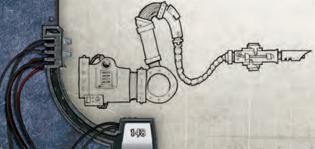
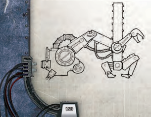
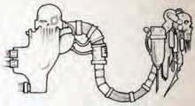
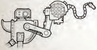
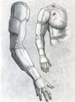
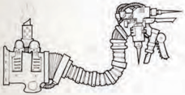

## Bionic Replacement Limbs and Body Parts

Bionic replacement limbs are assumed to operate at the same level of strength and dexterity as the body they are attached to-rather  than  risk  ripping  themselves  out  of  their  host through overpressure-though their robust construction does add 2 to the owner's Toughness Bonus against hits scored to  the  particular  location.  [Damage](character-injury.md)  taken  to  these  locations counts towards [Damage](character-injury.md) to the character, and Critical Damage dealt to these locations functions as normal. Any result that causes  bleeding  or  some  other  inappropriate  result  renders the bionic limb useless. Critical Damage to a limb that results in death has the full effect as it can be assumed that the limb explodes into shrapnel, incinerates, or discharges stored energy through its owner with lethal effect.

Replacement  and  additional  limbs-such  as mechadendrites-can only be used to perform tasks that the owner already knows how todo. So for [Example](rules-tests.md), a character with a medicae mechadendrite must have the Medicae skill in order to take advantage of the extra abilities the limb grants.

Note that bonuses and penalties relate only to Tests made using the bionic limb, and characters who possess two bionic limbs do not gain double the bonus, but rather they may apply the bonus regardless of which bionic limb they are using.

### Bionic Arm

Common versions of these systems mirror the function of the human arm and hand exactly, retaining strength,  dexterity, and sense of touch.

Poor versions halve the owner's Agility score where matters of fine dexterity are involved and Weapon Skill and Ballistic Skill Tests suffer a -10 penalty when using the limb.

Good bionic arms provide a +10 bonus on Agility Tests requiring delicate manipulation (such as Sleight of Hand) and add a +10 bonus to Strength Tests using the arm.

### Bionic Locomotion (legs, Hips, Pelvis, Etc.)

Common locomotion bionics must be fully integrated into the  spine  and  nervous  system  to  function  properly;  basic models accomplish this without any loss of function over the human norm.

Poor  versions  halve  the  character's  Movement  Rates-round up-and such characters that attempt to [Run](rules-combat-overview.md) must succeed on an Agility Test or fall at the end of their movement.

Good versions of these systems grant the owner the [Sprint](talents-descriptions.md) talent. In addition they add a +20 bonus to Tests made to [Jump or Leap](rules-combat-overview.md).

### Bionic Respiratory System

Common  bionic  lungs  and  implanted  respiratory  systems [Mimic](talents-descriptions.md) the action of human lungs and keep the body supplied with oxygen. Such characters gain a +20 bonus to Toughness Tests made to resist airborne toxins and gas [Weapons](weapons-general.md).

Poor bionic lungs offer the same benefits as the Common system. However, they are raucously loud affairs and characters suffer a -20 penalty to all Silent Move checks. A generally poor oxygen supply to the body means all tests involving strenuous physical activity are increased by one level of Difficulty .

Good bionic  lungs  count  as  a  full  life  support  systemthus if for any reason the user's own respiratory system fails, his  bionic  lungs  will  keep  his  blood  oxygenated-and  their presence may be unnoticeable if designed to be so.

## Implant Systems

What follows are some of the more widely used bionic and cybernetic implants desired to improve or [Salvage](starship-salvage-rules.md) the human body. Implants usually serve to grant a human some ability he did not already possess, or integrate external devices into his body.

Note: Mechadendrites are cybernetic limbs that are usually mounted on the back or shoulder. The maximum number of Mechadendrites a character may have mounted upon his body is equal to his Toughness bonus.

### Auger Arrays

These  implanted  devices  duplicate  the  effects  of  sensor systems  that  go  beyond  normal  human  senses.  In  all  cases their use requires concentration and a Half Action.

Common systems function identically to a standard handheld auspex device (see page 143).

Poor systems possess only a single detection ability (either heat,  radiation,  or  electromagnetics)  and  have  the  limited range of 20 metres.

Good systems function as a full auspex but also allow rerolls on all Perception based Tests when using its functions.

### Augmented Senses

This catch-all category can include additional aural and scent receptors,  atmospheric  pressure  detectors,  sonar  imaging systems, and more depending on the type of implant desired. These  can  work  in  concert  with  existing  bionics  or  even natural  senses.  This  implant  grants  the  Heightened  Senses Talent for any one sense (sight, smell, etc.).

### Baleful Eye

A legendary archeotech bionic eye pattern that incorporates a tiny las weapon, sacrificing some of the normal abilities of a cybernetic vision implant in order to include this device. Each baleful eye has been passed from recipient to recipient across centuries or millennia, reclaimed by the Machine Cult whenever  its  present  owner  dies.  As  might  be  imagined, it  is  very  intimidating when used as a part of negotiations with [Primitive](weapons-general.md)  societies.  A  character  with  this  implant  has a  weapon  equal  to  a  hellpistol  in  his  eye  with  a  range  of 10m.  The  baleful  eye  can  be  fired  even  if  the  character's hands are full, and the baleful eye may be used as a pistol in melee. The baleful eye of Sebastian Winterscale is said to have contained a much more potent weapon, but it has been lost for centuries.

### Ballistic Mechadendrite

This solid, shoulder-mounted mechadendrite is designed for self-defence.  This  two  metre  limb  is  mounted  with  a  sleek [Laspistol](weapons-general.md) of Adeptus Mechanicus design. This weapon counts as a [Laspistol](weapons-general.md) with the [Compact](weapons-upgrades.md) upgrade. The owner may use this mechadendrite as his Reaction for the Round or as a Half Action [Attack](combat-attack-rules.md) on his own turn, but it can only be fired onceper Round. The firer uses his full Ballistic Skill for [The Attack](rules-combat-overview.md). Note that this weapon has no optical targeting facilities built in. Y ou must have the appropriate [Mechadendrite Use](talents-descriptions.md) talent to operate this implant.

### Bionic Heart

The  paranoid  (or  prepared)  are  ever  willing  to  replace  crude flesh with more durable, armoured materials-the light [Armour](armour.md) shielding of a bionic heart provides a last line of defence. Superior models can be triggered to pump more rapidly to increase physical capacity , though this risks stroke or other catastrophe as the rest of the circulatory system is put under pressure. A character with this implant gains +1 [Armour](armour.md) to the body location-this bonus stacks with any armour worn-and gains the [Sprint](talents-descriptions.md) Talent.

### Calculus Logi Upgrade

Internal  cogitator  implants  which  aid  in  data  retention  and processing. The user can rapidly sift through stacked data-slates and  parchments,  applying  intuition  to  vast  reams  of  data  far beyond the capabilities of a normal man. This implant grants the user a +10 bonus to any Literacy , Logic, or Scholastic Lore Tests.

### Cortex Implants

These systems may be used to repair a severely damaged brain or augment its abilities.

Common cortex implants are used to restore paralysed and brain-damaged individuals to some semblance of normality . The best that can be managed by these systems is a permanent loss of 1d10 points from the character's W eapon Skill, Ballistic Skill, Agility , Intelligence and Fellowship. In addition, such characters gain 1d10 Insanity Points.

Poor cortex implants restore brain function but destroy the personality and memories of the subject, effectively making them a [Servitor](equipment-tools.md), and are therefore unsuitable for player characters.

Good cortex implants are unusual even among the Mechanicus, and  their  creation  is  an  almost  lost  art.  They  grant  the  trait Unnatural Intelligence (×2) (see  page  368)  and  in  addition  perform all the functions of a cogitator system. However, characters with this implant gain 1d10 Insanity Points.

### Cranial Armour

This augmentation covers or replaces most of the skull with layers of plasteel and gel padding to better prevent concussion and other brain injuries. This implant adds +1 [Armour](armour.md)-this bonus stacks with any worn [Armour](armour.md)-to the Head location.

### Cybernetic Senses

Sight, hearing, touch, and taste can be duplicated artificially, and more esoteric senses may be added.

Common  systems,  while  usually  very  obviously artificial and often oversized, manage to more or less duplicate the approximate human range of senses adequately and have no further game effects.

Poor  cybernetic  senses  are  problem-ridden imitations of the real thing (hearing may be troubled by static, vision rendered in low-resolution monochrome, and so on). A character with this system suffers a -20 penalty to Tests made involving the cybernetic sense.

Good cybernetic senses grant the Heightened Senses talent for that particular sense, and a +20 bonus to Tests made to resist attacks on the sense itself-such as deafening noises or blinding flashes. Basic and advanced cybernetic eyes may also incorporate magnifying lenses (counting as a [Telescopic Sight](weapons-upgrades.md), see page 134 for more details), a full photo-visor, and/or a system allowing the [Dark Sight](character-traits.md) trait (see page 364). Likewise, basic  or  advanced  cybernetic  hearing  may  also  include  an internal [Micro-bead](equipment-tools.md) system.

### Locator Matrix

Micro-cogitators  implanted  at  the  base  of  the  skull  allow the user to be aware of the direction of true magnetic north, present  location  to  within  a  few  metres,  relative  velocity, altitude, time of day, and other valuable information. The user must still have access to maps and other planetary in order to benefit from this information, however-knowing you are at a specific location on a planetary surface has little meaning if you have no idea what is over the next rise, or what direction you must travel to reach a given destination.

### Manipulator Mechadendrite

This powerful shoulder-mounted mechadendrite is designed for  heavy  lifting  and  manipulation  of  industrial  machinery. Built of ceramite and steel, it may extend to a length of 1.5m. When using  the  arm,  the  character  gains  a  +20  bonus  to Strength Tests. This limb is tipped with two sets of gripping and crushing pincers. These may be locked around a suitable anchor point as a Free Action to safely tether the tech-priest to lifting [Gear](equipment-gear.md), high gantries, and so on. Finally, a character may use the manipulator as a club. It counts as a [Primitive](weapons-general.md) weapon that deals 1d5+2 Impact [Damage](character-injury.md).

The manipulator may not be used for any task requiring fine manipulation such typing on a key pad or handling delicate objects. A character must have the appropriate [Mechadendrite Use](talents-descriptions.md) talent to operate this implant.

### Medicae Mechadendrite

This  two-meter  long,  [Flexible](weapons-general.md)  limb  is  designed  to  provide medical and surgical [Assistance](rules-tests.md) in the field. It grants a +10 bonus to Medicae Tests. The mechadendrite houses six [Injector](equipment-drugs-and-consumables.md) pistons, each of which may be filled with one dose of a drug. These must be supplied separately. In addition to providing first  aid,  the  mechadendrite's  flesh  staplers  may  be  used  to staunch  Blood  Loss  as  a  Half  Action.  A  small  chainscalpel attachment  reduces  the  difficulty  of  limb  amputation  to Challenging (+0). This blade may be used as an [Improvised](weapons-general.md) weapon, and on a hit it deals 1d5 Rending [Damage](character-injury.md). Finally, the medicae mechadendrite may be used to gain a +10 bonus to Interrogation Tests. This mechadendrite may be shoulder or sternum-mounted. A character must have the appropriate [Mechadendrite Use](talents-descriptions.md) talent to operate this implant.

### Memorance Implant

A  neurally  linked  datavault  and  pict-capture  array,  often incorporating augmetic replacement of one or both eyes, that records information of people or scenes viewed. It can then later replay that information, or overlay the present view with additional data on people and objects viewed. It is a tool of chroniclers,  remembrancers,  and  masters  of  ceremonies-as well as factors or nobles who like to see the secrets of their rivals  overlaid  upon  their  view  of  the  negotiating  table.  It can provide a +10 bonus to Trade (Remembrancer) Tests, or other Tests in social situations where the recorded information provides leverage or value. The implant also grants the user the [Total Recall](talents-descriptions.md) Talent if he does not already possess it.

### Mind Impulse Unit (miu)

These  devices,  also  known  as  sense-links,  allow  the  owner  to directly  interface  with  a  machine  or  technological  device.  MIUs  see widespread use among The Adeptus Mechanicus who regard them as objects of divine communion. A basic MIU implant involves a  single  spinal  or  cortex  connector,  while  advanced  variants include  wrist  connector  probes-and  possibly  mechadendrite connectors-in addition to the spinal plug.

Common  models  impose  no  modifiers  to  machine  spirit [Communication](rules-communication.md) and add a +10 bonus to Tech-Use, Pilot, or Drive Tests used in conjunction with devices capable of MIU linking.

Poor MIU systems require a successful Willpower Test to use and impose a -10 penalty to interact with machine spirits.

Good models grant a +10 bonus to communicate with machine spirits, and for Tech-Use, Pilot, Drive, Logic, Inquiry , and BallisticSkill  Tests  when interfaced with MIU systems. In addition, an MIU gives the user the ability to experience the senses of any familiars he controls (such as a servo-skull or [Grapplehawk](equipment-tools.md), see page 375) as if he were present.

### Miu Weapon Interface

Unlike  the  more  advanced  version  normally  only  granted  to priests of The Adeptus Mechanicus, this version is more simplified, allowing the user to remotely operate a single weapon which is normally attached to the shoulder. While not as elaborate, it is easier to use and a favourite of many militant professions.

This system allows user to fire an additional ranged weapon as a Free Action-using his full Ballistic Skill-no matter what other actions he may be taking at the time. This additional weapon must be connected to the user via the MIU weapon interface, and are often equipped as a shoulder-mount.

### Optical Mechadendrite

This  highly  [Flexible](weapons-general.md)  mechadendrite  set  with  pict-capture  and sensor devices is designed to assist in inspection and detection. This  mechadendrite  extends  to  a  length  of  three  metres,  and can reduce its width to pencil thickness. It grants a +10 bonus to all Perception-based Tests. The pict-devices mounted on the mechadendrite allow the user to examine surfaces at a microscopic level and may be used as a [Telescopic Sight](weapons-upgrades.md). The mechadendrite is also mounted with an infra-red torch and [Sensors](starship-anatomy-detailed.md). A character using the mechadendrite suffers no penalties due to [Darkness](combat-special-circumstances.md) and gains  a  +20  bonus  to  vision-based  Perception  Tests  at  night. Finally , the mechadendrite is fitted with a light that may be tinted a variety of different colours, depending on the controller's whim. This  mechadendrite  may  be  shoulder  or  sternum-mounted.  A character must have the appropriate [Mechadendrite Use](talents-descriptions.md) talent to operate this implant.

### Respiratory Filter Implant

These are implanted inside the lungs and can sift out most [Toxic](weapons-general.md) gases. Inhaled particulate matter is also filtered, making breathing easier in heavily polluted atmospheres. This implant allows the user to ignore any inhaled [Toxic](weapons-general.md) gases or atmospheric contaminants.

### Scribe-tines

The hand and lower forearm are replaced with specialised and sensitive [Tools](equipment-tools.md) ideal for page turning, autoscribing, [Data-slate](equipment-tools.md) manipulation, and other invaluable abilities for a sage. While somewhat  disquieting  in  appearance,  they  are  viewed  with favour by hive-world scholars and lexmechanics. This implant gives the user a +10 bonus to all Investigation Skill Tests.

### Subskin Armour

Thin carapace plating  is  inserted  under  the  skin  in  various  locations, giving the user added protection against [Damage](character-injury.md). While not as impressive as most augmentations, and sometimes uncomfortable, subskin armour is very [Reliable](weapons-general.md). This implant adds +2 [Armour](armour.md) to the Arms, Body, and Legs locations. The [Armour](armour.md) bonus is added to any other armour for those locations.

### Synthetic Muscle Grafts

Vat-grown  muscle  tissue,  hyperdense  and  augmented  with flakweave,  is  implanted  into  existing  muscle  groups  to increased their strength. Users gain a +1 to their Strength Bonus for a normal implantation. Best-[Craftsmanship](components-craftsmanship.md) grafts will grant the Unnatural Strength (x2) Trait but also impose a -10 penalty to any Agility Tests due to the misshapen nature of the body.

### Utility Mechadendrite

This  two-meter  long  limb  houses  a  variety  of  [Tools](equipment-tools.md)  and attachments  designed  to  assist  a  tech-priest  in  the  course of  his  holy  duties.  The  mechadendrite  counts  as  a  combitool, granting a +10 bonus to all Tech-Use Tests. The limb also houses six [Injector](equipment-drugs-and-consumables.md) pistons, each of which may be filled with one dose of sacred unguent. These must be supplied separately.  In  addition  to  this,  the  limb  contains  an electrically powered censer, which can gust incense fumes  over  particularly  troublesome  faults.  The censer  generates  one  'blast'  of  [Smoke](weapons-general.md)  every fifteen minutes. This may be employed in## Attaching Bionics and Implants

Implants and bionics are only available if the character has access to both the resources and skilled labour to have them installed; commonly this is only available in substantial medicae facilities and worlds with a very high technological base.

If  a  character  can  find  a  doctor  willing  to  install a  bionic  or  implant  then  the  process  takes  no  less than 2d10 days, minus one day for each point of his Toughness  Bonus-to  a  minimum  of  one  day.  How difficult it is to attach a bionic or implant is up to the GM. He may decide that given enough time, and in an  advanced  enough  facility,  it  is  automatic,  or  he may call on the doctor to make a series of Medicae or even Tech-Use Tests that could lead to such things as permanent crippling or [Blood Loss](character-injury.md) (see C hapter IX: Playing the Game, page 260 ).

melee [Combat](rules-combat-overview.md) to distract and choke, imposing a -5 penalty to  Weapon  Skill  Tests  made  by  all  living  creatures  within a  two  metre  radius  for  one  Round.  This  is  a  Half  Action. Unless  the  censer  is  deactivated,  all  Perception  Tests  made to detect the Tech-Priest that rely on a sense of smell gain a +10 bonus. Finally, the mechadendrite contains a cutting blade.  This  counts  as  a  [Knife](weapons-general.md)  with  the  Defensive  quality and Mono upgrade. A character must have the appropriate [Mechadendrite Use](talents-descriptions.md) talent to operate this implant.

## Voidskin

Subdermal skin tissue is treated with flakweave and chemical toughening agents, such that the wearer can tolerate a longer term  of  void  exposure  before  ill  effects  occur.  Chemplant agents  also  minimize  the  [Damage](character-injury.md)  suffered  due  to  the  raw energies of the void. Voidskin allows the user to resist [Damage](character-injury.md) due to void exposure for an additional d10+3 [Rounds](rules-combat-overview.md) past the normal duration.

## Volitor Implant

The subject has cranial surgery to work in neural receptors and  artificial  nerve  routing,  and  can  be  compelled not  to  reveal  a  certain  item  of  information,  remain within a set area, or perform a specific task. If the subject  attempts-or  is  forced-to  counter this compulsion, his brain  shuts  down

| Table 5-16: Cybernetics    | Table 5-16: Cybernetics   |
|----------------------------|---------------------------|
| Name                       | [Availability](economy-availability-rules.md)              |
| Augur Array                | Rare                      |
| Augmented Senses           | Rare                      |
| Baleful Eye                | Near Unique               |
| Ballistic Mechadendrite    | Very Rare †               |
| Bionic Limb                | Scarce                    |
| Bionic Locomotion          | Scarce                    |
| Bionic Respiratory System  | Rare                      |
| Bionic Heart               | Rare                      |
| Calculus Logi Upgrade      | Very Rare                 |
| Cortex Implants            | Very Rare                 |
| Cranial Armour             | Scarce                    |
| Cybernetic Senses          | Rare                      |
| Locator Matrix             | Rare                      |
| Manipulator Mechadendrite  | Very Rare †               |
| Medicae Mechadendrite      | Very Rare †               |
| Memorance Implant          | Rare                      |
| Mind Impulse Unit          | Rare                      |
| MIU Weapon Interface       | Rare                      |
| Optical Mechadendrite      | Very Rare †               |
| Respiratory Filter Implant | Rare                      |
| Scribe-tines               | Scarce                    |
| Subskin Armour             | Very Rare                 |
| Synthetic Muscle Grafts    | Rare                      |
| Utility Mechadendrite      | Very Rare †               |
| Voidskin                   | Scarce                    |
| Volitor Implant            | Rare                      |
| Vox Implant                | Scarce                    |

† Some  cybernetic  systems  are  only  provided  to  tech-tdepts  of  the † Some  cybernetic  systems  are  only  provided  to  tech-tdepts  of  the † Adeptus Mechanicus-though it is possible that skilled hereteks might risk the Machine Cult's wrath by implanting crude versions of these systems in anyone willing to pay their price.

into [Unconsciousness](character-injury.md)-or even death for some severe volitor patterns.  Many  bodyguards  receive  this  implantation  in  the course of their employment.

## Vox Implant

This implant is a built in [Micro-bead](equipment-tools.md), often hardwired to a ship's vox frequencies.

## Bionics and Craftsmanship

The [Craftsmanship](components-craftsmanship.md) of individual bionic parts should have an impact on roleplaying as well as the in-game mechanics.  For  instance,  poor-[Craftsmanship](components-craftsmanship.md)  bionics may  be  crude,  obvious  augmetics  that  creak,  grind, squeal, or constantly leak fluids. On the other hand, good-Craftsmanship  bionics  may  be  so  unobtrusive that they are mostly invisible to the naked eye. BestCraftsmanship  bionics  should  be  gold-  and  brassinlaid works of art to reflect an advanced and refined design.

*Source:* `Roguetrader Corerulebook, pages 148–153`
