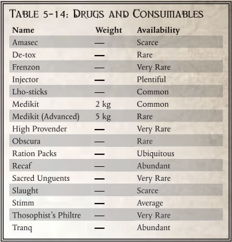

## Amasec

Amasec is a popular alcoholic drink distilled from wine. It can range from lesser brews barely fit for firebombs, to well-aged brands suitable for only the finest of the Emperor's servants.

## De-tox (drug)

This drug can negate the effects of most dangerous gases and toxins  if  administered  fast  enough.  A  dose  of  de-tox  immediately ends the ongoing effects, both positive and negative, of any drugs, toxins, or gases affecting the character (unless the effect states that de-tox is not effective against them).

Using  de-tox,  however,  is  both  painful  and  debilitating, causing such unpleasant side effects as vomiting, nose bleeds, and a great voiding of the bowels. Upon taking this drug, a character is [Stunned](character-injury.md) for a number of [Rounds](rules-combat-overview.md) equal to 1d10 minus his Toughness Bonus. A result of 0 or less means that the character suffers no ill effects.

## Frenzon (drug)

A generic name for a variety of [Combat](rules-combat-overview.md) drugs most often used within  penal  legion  units.  Once  administered,  the  subject becomes [Fearless](talents-descriptions.md) and fanatical in [Combat](rules-combat-overview.md). A character using frenzon gains the [Frenzy](talents-descriptions.md) talent and also gains immunity to [Fear](character-fear-and-damnation.md). A single dose of frenzon lasts for 1d10 minutes.

## Injector

Injectors can take many forms from cheap low-tech disposable syringes up to sophisticated hypo-sprays and even bio-attuned skin patches. An injector can hold a single dose of any drug, which a character may administer as a Full Action.V:  Armoury

Armoury

## Excessive Drug Use

When the same drug is used too often, especially in a short period of time, there is a chance for it to have no effect. This represents an Explorer's body building an immunity. If you use more than one dose of a drug within a 24 hour period you must make a Toughness Test for each use after the first, with a cumulative -20 penalty.  Should you fail,  the  drug  has  no  effect  and further doses do not affect you for a full 24 hours.

## Lho-sticks

Lho-sticks are common with Imperial Guard troopers and many menial  workers.  Each  rolled  paper  tube  contains  a  scented, mildly narcotic (and addictive) plant-derived substance, which is then lit and the resulting [Smoke](weapons-general.md) inhaled through the tube.

## Medikit

This is vital bit of equipment for any medic. A typical medikit contains various cataplasm patches, contraseptics, and synthetic skin applicators. A character who has a medikit at hand when using the Medicae skill gains a +20 bonus to their Test.

## Medikit (advanced)

A practical item for vessels with no properly trained medicae support, these kits can be used by almost anyone. Each contains essential  items  such  as  sythetic  skin  spray,  counterseptics, cast  spray,  toxin  wands,  and  more,  all  with  easy  to  follow instructions and built-in cogitators for diagnostic advice. This item grants a +20 bonus to Medicae skill Tests and can be used even if user does not have the skill.

## High Provender

The nobility of the Imperium dine upon such delicacies as real, unprocessed meat from strange beasts, fruits won from Death Worlds at the cost of many lives, and [Exotic](weapons-ammunition.md) grains from private  hydroponic  gardens.  Some  intricate  delicacies  are created solely for the purpose of demonstrating great wealth, but no self-respecting noble would sink so low as to eat and drink the same rations as their servants-or, Emperor forbid, the filth that serfs and mid-hivers consume.

## Obscura (drug)

Prohibited and the subject of widespread crackdowns, obscura remains a widely used  narcotic  among  Imperial  subjects.

| Table 5-14:          | Drugs and   | Consumables   |
|----------------------|-------------|---------------|
| Name                 | Weight      | [Availability](economy-availability-rules.md)  |
| Amasec               | -           | Scarce        |
| De-tox               | -           | Rare          |
| Frenzon              | -           | Very Rare     |
| Injector             | -           | Plentiful     |
| Lho-sticks           | -           | Common        |
| Medikit              | 2 kg        | Common        |
| Medikit (Advanced)   | 5 kg        | Rare          |
| High Provender       | -           | Very Rare     |
| Obscura              | -           | Rare          |
| Ration Packs         | -           | Ubiquitous    |
| Recaf                | -           | Abundant      |
| Sacred Unguents      | -           | Very Rare     |
| Slaught              | -           | Scarce        |
| Stimm                | -           | Average       |
| Thosophist's Philtre | -           | Very Rare     |
| Tranq                | -           | Abundant      |

Smugglers can make a good living importing and selling the drug to all classes of civilians and military personnel. Obscura users  enter  a  dream-like  state  for  1d5  hours  (if  required to  engage  in  [Combat](rules-combat-overview.md)  consider  them  under  the  effects  of  a [Hallucinogen](weapons-general.md) grenade). Then for 1d10 hours after the effects wear off, they enter a deep depression, unless another dose of obscura is taken.

## Ration Packs

Most  food  in  the  Imperium  is  packaged,  processed,  and usually  completely  unrecognisable  as  anything  edible.  The quality of ration packs varies widely, ranging from simple and poor fare such as corpse starch rations or cultured algae to flavoured strips of grox meat and fine nutrislurry.

## Recaf

Recaf  is  a  popular  hot  beverage,  made  from  crushed  and brewed  leaves.  The  composition  can  vary  from  planet  to planet, but most blends incorporate some form of stimulant such as caffeine or detoxified pharamoxine compounds.

## Sacred Unguents

Sacred unguents blessed by the Omnissiah are much sought after for their mystical properties when applied to machines. If applied to a weapon (a Full Action) it becomes immune to Jamming (see Chapter Ix: Playing the Game, page 249 ) for  a  number of shots equal to its clip [Size](character-traits.md). If the weapon is  Jammed and the unguent is then applied, it immediately unjams, but there is no further effect.

## Slaught (drug)

Also  know  as  'onslaught',  this  drug  heightens  awareness and  improves  reaction  time,  literally  speeding  up  the  user but  causing  [Fatigue](character-injury.md)  and  neural  [Damage](character-injury.md)  with  prolongeduse.  Taking  a  dose  increases  the  user's  Agility  Bonus  and Perception  Bonus  by  3  for  2d10  minutes.  When  the  drug runs its course, the user must Test Toughness or take a -20 penalty to Agility Tests and Perception Tests for 1d5 hours.

## Stimm (drug)

Stimm  is  a  powerful  drug  that  works  to  mask  pain  and drive  fighters  on  when  their  bodies  would  otherwise  give up. A dose of stimm lasts 3d10 [Rounds](rules-combat-overview.md). During this time a character ignores any negative effects to his [Characteristics](starship-anatomy-detailed.md) from  [Damage](character-injury.md)  or  Critical  [Damage](character-injury.md)  and  cannot  be  Stunned. When the stimm wears off, the character takes a -20 penalty to Strength, Toughness and Agility Tests for one hour.

## Theosophist's Philtre

A heady, thick liquor of Archaos, forbidden by ancient law upon that world. It is said to give a drinker depth and clarity of thought, and though this is likely no more than the mystique that attends any forbidden item, this rare intoxicant is prized as a sign of Culture and wealth amongst Calixian sophisticates.

## Tranq

The term 'tranq' covers an array of artificial, alcoholic chemdistillates  made  by  the  low-hive  masses  of  the  Golgenna Reach. The techniques for producing tranq have been carried throughout The Calixis Sector by crew-[Scum](rules-allies-enemies-rivals.md), criminals, and Guardsmen.  Drinking  tranq  numbs  the  body  and  mind,  a very different  feeling  to  being  drunk  on  rotgut,  amasec  or other spirits. Though similar in end result, the effects of tranq are unpleasant, depressive, and an acquired taste.

*Source:* `Roguetrader Corerulebook, pages 142–144`
