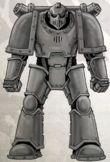

As most solid projectile weapons rely on a chemical detonation to  provide  thrust  for  the  ammunition,  they  are  normally ineffective in a void where the gas pressure in the barrel leaks away. Void Rounds contain special sabot-like coatings around each shell to ensure a better seal when fired, ensuring each round emerges at maximum velocity.

Effects: The  firearm  operates  as  it  normally  would,  even when used in an atmosphere-free environment. When used in a normal atmosphere, the added weight of the coating isn't offset by the lack of atmosphere, and they suffer -1 Damage to the weapon's normal effects.

Used With:

Any Solid Projectile weapons.

*Source:* `Into the Storm, page 130`
