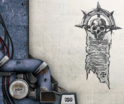

Thermal  Protective  Wear  (commonly  called  Frost  Armour) was originally developed for work in high-temperature environments  such  as  on  inner  planets  or  in  reactor  heat exchangers. They offer no more protection than a light flak suit, but are specialised to negate the effects of extreme heat. With a  combination  of  slick  flame-resistant  fabrics  and  thermally conductive weave, the suits wick away almost all of the intense heat the user might face, and are a favourite in close quarters fighting, where a warrior knows he may face flamers or similar defensive weapons.

Frost Armour comes with a re-breather to protect against flame and smoke inhalation.

*Source:* `Into the Storm, page 131`
