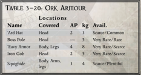
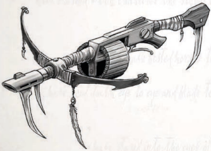
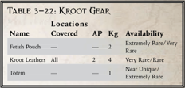

Made from the tanned hides of the common squig, these heavy leathers are the most common type of Ork armor. Capable of being dyed, Orks often use the colour of their squighide to show allegiance to a particular Clan or Warboss. Squighide counts as Primitive, unless it is worn by an Ork.

| Table       | 3-20: Ork Armour   | 3-20: Ork Armour   | 3-20: Ork Armour   | 3-20: Ork Armour   |
|-------------|--------------------|--------------------|--------------------|--------------------|
| Name        | Covered            | AP                 | kg                 | Avail.             |
| 'Ard Hat    | Head               | 2                  | 3                  | Scarce/Common      |
| Boss Pole   | Head               | -                  | 5                  | Very Rare/Rare     |
| 'Eavy Armor | Body, Legs         | 4                  | 8                  | Very Rare/Scarce   |
| Iron Gob    | Head               | 2                  | 5                  | Very Rare/Scarce   |
| Squighide   | Body. Arms, legs   | 3                  | 4                  | Scarce/Plentiful   |

145## Fetish Pouch

'They may look like something you' d see on a muck-covered feral worlder, but their weapons are actually strangely advanced.'

-Xenographer Klung

L ike the Orks, Kroot Explorers have their own armoury separated  from  the  remainder  of  the  book  for  their convenience.  Unlike  Ork  Explorers,  however,  Kroot are perfectly willing to use other species equipment, which is why the Kroot Armoury is smaller.

Throughout this armoury, most items have two different Availabilities listed. The first is for non-Kroot Explorers, the second is for Kroot Explorers.

## Kroot Leathers

The  Krootbow  is  an  unusual  weapon  only  rarely  seen  in Kindreds  visiting  the  Koronus  Expanse.  At  first  glance,  it appears  to  be  nothing  more  than  an  unusual,  if  primitive, crossbow. Closer inspection reveals that considerable upgrades have been applied to this weapon, utilising unusual advanced magnetic technology of alien origin. It is suspected that some Tau artisan was involved in their construction, but whatever the truth, Krootbows possess a rotary firing system that allows the weapon to fire a flurry of quarrels with a single pull of the trigger. The quarrels possess mono-edged metallic heads and are often poisoned by the Kroot with various toxins. are often poisoned by the Kroot with various toxins.

## Kroothawk Totem

A variant on the normal Kroot rifle, this weapon lacks the normal close combat attachments and is a single-shot breechloader. The Kroot hunting rifle uses the same charged pulse ammunition as the Kroot rifle, but it is far more accurate and performs admirably when sniping at long range.

*Source:* `Battle Fleet of the Koronus, pages 146–147`
