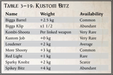

## 'Ard Hat

Though this Kustom Bit is little  more  than  a  small  red  light bulb, Orks swear it improves a weapon's accuracy . This upgrade functions as a Red-Dot Laser Sight ( ROGUE T OGUE T OGUE RADER page 134). R page 134). R Upgrades: Any ranged weapon.

## Boss Pole

The weapon has been fitted with capacitors and a cluster of prongs that release massive electrical discharges on contact. This weapon gains the Shocking quality.

Upgrades: Any melee weapon.

## 'eavy Armour

The weapon is covered in spikes, sharp protrusions, and additional blades.  A  ranged  weapon  with  this  upgrade  counts  as  an  Unbalanced sword in close combat. Melee weapons gain +1 Damage. Upgrades: Any weapon.

## Iron Gob

Ork Armour usually consists  of  massive  plates  of  metal  or sheets  of  tough  squig-hide  leather  draped  over  the  Ork's frame. In  general,  Orks  cannot  wear  human  armour, as  it  is  far  too  small,  and  humans  cannot  wear  Ork armour, as it is far too heavy.

## Squighide Coat and Leggins

Made from a slab of metal beaten into a rough bowl shape and embellished with rivets, an 'ard hat complements the protection offered by the Ork's legendarily thick skull.

| Table 3-19: Name   | Kustom Bitz Weight   | Availability   |
|--------------------|----------------------|----------------|
| Bigga Barrel       | +2.5 kg              | Common         |
| Bigga Klip         | x1 1/2               | Abundant       |
| Kombi-Shoota       | Per linked weapon    | Very Rare      |
| Kustom Job         | +0 kg                | Very Rare      |
| Loudener           | +2 kg                | Average        |
| More Shooty        | +3 kg                | Common         |
| Red Light          | +1 kg                | Rare           |
| Sparky Knobz       | +2 kg                | Scarce         |
| Spikey Bitz        | +4 kg                | Abundant       |

*Source:* `Into the Storm, page 146`
