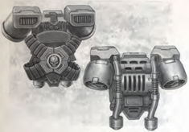
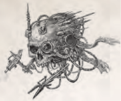

## Almanac Astrae Divinitus

A tech-device of the Divine Astrometricum, a Calixian faction of  tech-priests  concerned  with  cataloguing  stars,  [Nebulae](starship-travel-non-combat.md), and distant events in the voids. Its clicking arrangement of spheres and hololithic projections form a catalogue of sorts, which is of use to those who make their way between stars. It can provide a +10 bonus to Navigation, Pilot, Scholastic Lore (Astromancy), or Trade (Astrographer) Tests where its information is directly relevant to the circumstances.

## Arms Coffer

A long protective case of many quick-release compartments and sockets for power packs designed to be slung over the back. It is intended to protect the diverse wargear of a professional militant from the environment and pilfering hands.

## Auspex/scanner

These devices are used to detect energy emissions, motion, and biological life signs. A character using an auspex gains a +20 bonus to Awareness Tests and may make a Tech-Use Test to spot things not normally detectable to human senses alone,  such  as  invisible  gases,  nearby  bio-signs,  or  ambient radiation. The standard range for an auspex is 50m, though walls more than 50cm thick and certain shielding materials can block the scanner.

| Table 5-15: Tools Name            | kg   | [Availability](economy-availability-rules.md)   |
|-----------------------------------|------|----------------|
| Almanac Astrae Divinitus          | 4    | Extremely Rare |
| Arms Coffer                       | 6    | Average        |
| Auspex/Scanner                    | 0.5  | Scarce         |
| Auto-quill                        | -    | Scarce         |
| Calculance Array                  | 120  | Scarce         |
| Combi-tool                        | 1    | Rare           |
| Data-loom (Hadd-pattern)          | 13   | Very Rare      |
| Data-slate                        | 0.5  | Common         |
| Demolition Charge                 | 1    | Scarce         |
| Diagnostor                        | 4    | Very Rare      |
| Glow-globe/Lamp Pack              | 0.5  | Abundant       |
| Grapnel                           | 2    | Average        |
| Grapplehawk                       | -    | Very Rare      |
| Grav Chute                        | 15   | Rare           |
| Jump Pack                         | 25   | Rare           |
| Lord-Captain's Baton              | 1    | Very Rare      |
| Magboots                          | 2    | Rare           |
| Magnoculars                       | 0.5  | Average        |
| Manacles                          | 1    | Plentiful      |
| Mefonte's Orthodoxy               | 2    | Scarce         |
| Melta-bomb                        | 12   | Very Rare      |
| Micro-bead                        | -    | Average        |
| Multikey                          | -    | Scarce         |
| Multicompass                      | 4    | Near Unique    |
| Navis Prima                       | 1    | Very Rare      |
| Pict Recorder                     | 1    | Common         |
| Psy-focus                         | -    | Rare           |
| Renumeration Engine               | 7    | Very Rare      |
| Shipboard Emergency Kit           | 6    | Common         |
| Screamer                          | 1.5  | Average        |
| Servitor (Labor, Simple Monotask) | -    | Scarce         |
| Servitor (Combat)                 | -    | Rare           |
| Servitor (Complex Multitask)      | -    | Rare           |
| Servo-Skull                       | -    | Scarce         |
| Stummer                           | 2    | Average        |
| Venom Ring                        | -    | Very Rare      |
| Vox Caster                        | -    | Scarce         |

## Auto Quill

These scribing devices of arcane appearance allow the user to copy text at an impressive rate with great accuracy. A character with the Trade (Rememberancer) skill can use an auto quill to gain a +10 to their Skill Tests.## Calculance Array

Grand mercantile initiatives are attended by a swarm of scribes and ledgers, and the greatest can only thrive when supported by machines such as the calculance array . It is a noisy, man-sized stack  of  chugging,  promethium-fueled  rod-cogitators,  often mounted upon a tracked platform. Its machine spirit accepts reams of figures, and other data, ordering them and spitting forth parchment summations and predictions upon command. It provides a +10 bonus to all Commerce Skill Tests.

## Combi-tool

Commonly found in the hands of member of The Adeptus Mechanicus, combi-tools are  versatile,  if  somewhat  bizarre, mechanical devices. A character using a combi-tool gains a +10 bonus to Tech-Use Tests.

## Data-slate

Data-slates  are  commonplace  in  the  Imperium,  the  primary means of storing and reading printed text and other media such as video or audio recordings. They are so cheap and easy to make that many contain a single media recording, such as text, and can only play that single file. Others can re-record new information, or transmit and receive data from other devices.

## Demolition Charge

A demolition charge is a simple explosive device, commonly used  for  blowing  open  doors,  breaching  bulkheads,  and destroying infrastructure. The listed weight for a demolition charge  represents  1  kg  of  explosives,  though  it  is  possible to  rig  charges  together-thus  increasing  their  destructive potential.  When  a  demolition  [Charge](rules-combat-overview.md)  explodes,  anyone  (or anything) caught within its blast radius takes 3d10 Explosive [Damage](character-injury.md)  plus  an  additional  2  points  of  [Damage](character-injury.md)  for  every kilogram used. The blast radius of the [Charge](rules-combat-overview.md) is 5 metres for each kilogram used. For setting and defusing explosives see the Demolition Skill in Chapter Iii: Skills, page 80 .

## Diagnostor

The diagnostor is a sophisticated medical device used among high ranking  planetary  officials  and  other powerful individuals. It can detect and The diagnostor is a sophisticated ranking  planetary  officials  and  other

<!-- image -->

diagnose almost every ailment known to the Imperium, and can be incorporated into medical kits, servo-skulls, and other dedicated [Servitors](crew-servitors.md). Rogue Traders who are often away from proper medical [Assistance](rules-tests.md) feel that such devices are essential on their voyages.

A  Diagnostor  provides  +20  to  Medicae  or  Perception Tests  to  determine  an  ailment.  Any  success  indicates  the proper medical countermeasures.

## Glow-globe/lamp Pack

A common source of light at night or in darkened areas, these handy devices can illuminate an area a dozen or more metres in diameter. A typical glow-globe or lamp pack lasts 1d5 hours before it needs to be recharged or have its power cell replaced.

## Grapnel

A  small  launcher  or  gun  that  fires  a  hooked  or  magnetic grapnel,  connected  to  the  launcher  with  a  thin  but  strong 100m wire. Once the grapnel attaches to the desired spot, such  as  a  rooftop,  the  user  can  manually  climb  the  line  or activate a powered winch. In a pinch they can also be used as  a  crude-and  messy-projectile  weapon,  counting  as  a single-[Shot](weapons-ammunition.md) [Crossbow](weapons-general.md).

## Grapplehawk

Aerial  machines  fashioned  in  the  shape  of  avian  predators, Grapplehawks are an unusual form of cyber-familiar used by some Adeptus Arbites squads and wealthy bounty-hunters (see page 375 for details). Once launched into the air a Grapplehawk glides  in  search  of  its  target  before  swooping  to  strike  with metallic claws and stunning electrical discharges. Potent internal [Suspensors](weapons-upgrades.md) provide enough lift for a Grapplehawk to carry a man's weight through the air for short distances.

## Grav Chute

A smaller version of a jump pack, these rely on suspensor fields to counter gravity to slow descent. Two small jets on either side above the shoulders offer extra braking as well. Unlike a jump pack it is designed to allow the user to land safely from a long fall-such as [Combat](rules-combat-overview.md) drop from a transport-rather than leap into the air.

The  grav  chute  allows  for  a  safe,  guided  fall  from  any height.  The  user  can  hover  in  place  for  up  to  a  minute  at a time if so desired. After an hour of use, the power supply must be replaced.

## Hadd-pattern Data-loom

A limited data-engine and geometric display that has proven useful to those faced with challenging problems of logic or fragmentary information. It gives a +10 bonus to Logic skill Tests, and at the GM's discretion may reduce the time taken for research or investigations, provided that the investigator has the Tech-Use skill.

## Lathe-pattern Jump Pack

Jump packs are large backpacks containing powerful turbofan or rocket engines. A user triggers a jump pack to lift high into the  air  and  then  swoop  down  as  part  of  their  assault.  Jump packs are also useful in leaping over high obstacles and reaching rooftops in a single bound, but without training most users will seriously injure themselves in crashes. Though bulky, loud, and somewhat dangerous to use they are ideal for the maximum inpersonal mobility on the ground or even in the void.

Jump packs require the operator to have the Pilot (Personal) skill. A standard jump pack allows for a safe, guided fall from any height and, with a thruster boost, make an unlimited series of short jumps (landing at the end of each Round's movement). Alternatively, the pack can duplicate the [Flyer](character-traits.md) (12) trait for up to a minute at a time.

A jump pack's power supply will last for about an hour of strenuous operation before requiring replacement.

## Lord-captain's Baton

Many  officers  of  the  Imperial  Navy carry  one  of  these  short  rods  as  an insignia  of  rank  and  station.  Most  are highly engraved and ornamented with the  heraldry  of  their  ship  and  fleet. Underlings  refer  to  them  dismissively as 'Calixian Crutches' or worse, seeing them only as another symbol of their oppression. What most do not knowand only find out too late-is that naval batons are often strongly reinforced and can  easily  shatter  bones.  Some  even contain specialised micro-cogitators or datavaults-for exmaple, the [Bridge](starship-anatomy-detailed.md) Underlings  refer  to  them  dismissively them only as another symbol of their oppression. What most do not know-

baton of the Rogue Trader ship Aigiarn contains  the  codeprayers  for  the  [Bridge](starship-anatomy-detailed.md)  machine  spirits.  It  is  ceremoniously re-inserted into the main helm station as part of each shift change  in  an  elaborate  ceremony  of  phrases  and  counterphrases. Failure to properly perform this ritual results in the lockdown of all command systems-a means of preventing piracy or mutiny.

## Magboots

Heavy and bulky, these oversized boots contain electromagnets that  allow  the  wearer  to  adhere  to  metallic  surfaces  such  as exterior [Hull](starship-anatomy-detailed.md) plating and are often found in void-ship emergency lockers.  Magboots  reduce  Movement  and  AB  by  half  when used, but otherwise allow normal movement in low- or zerogravity areas provided there is a suitable surface to walk upon.

## Magnoculars

These are powerful vision aids that magnify distant objects. More advanced, high-quality magnoculars can also do such things as give range read-outs, detect heat sources, calculate target location positioning, and take pict-captures of a view for later analysis.

## Manacles

These are solid restraints often used by bounty hunters and enforcers-and  can  also  be  found  in  the  hands  of  more nefarious individuals or used for darker purposes.

## Mefonte's Orthodoxy

A  tome  or  data-slate  containing  a  thrice-blessed  collection of  catechisms,  castigations,  and  psalms  first  assembled  by Pius Mefonte in the 4th century M41. These are some of the best-known verses of the Calixian Ministorum, and the work itself-ornamented, gilded, and set with flowing pennons of scripture-is a sign that he who owns it is holy and wellversed in the God-Emperor's teachings. It grants a +10 bonus to [Charm](equipment-gear.md) Tests involving religious oratory or inspiration and an Imperial audience.

## Melta Bomb

Melta bombs are affixed to their target with mag-adhesives designed to quickly adhere to metallic surfaces.  They detonate with a powerful shaped [Charge](rules-combat-overview.md) of intense heat akin to a melta-gun beam, and are ideal for destroying bulkheads, vehicle  [Hulls](hulls-overview.md),  and  other  heavily  armoured  targets.  Melta bombs are typically [Unwieldy](weapons-general.md) and not designed to be thrown, only  placed  in  contact  with  their  target  material  to  ensure the [Charge](rules-combat-overview.md) explodes to maximum effect. When a melta bomb explodes  it  deals  6d10  E  [Damage](character-injury.md)  to  anything  within  two metres  with  a  Penetration  of  12.  Anything  surviving  must take an Agility Test or catch on fire.

## Micro-bead

A  micro-bead  or  comm-bead  is  a  short-range [Communication](rules-communication.md)  device  worn  in  the  ear,  good  for [Communication](rules-communication.md)  out  to  about  one  kilometre.  Bad  weather, dense  terrain,  and  intervening  rock  or  plasteel  can  greatly reduce this range, however.

## Multikey

As it can open most standard Imperial locks, the multikey is not a standard item for most honest Imperial citizens. For the same reason though, they are widely sought after by criminals and other disreputable elements. A character with a multikey gains a +30 bonus to any Security Test when trying to open locks.

## Multicompass

When exploring new worlds, a device of this ancient tech-pattern is indispensablebut  few  have  the  means  or  [Influence](economy-influence-rules.md) to  acquire  one.  After  a  few  seconds  of analysing  planetary  data,  a  multicompass can display directions, show topographical When exploring new worlds, a device of this ancient tech-pattern is indispensableto  acquire  one.  After  a  few  seconds  of analysing  planetary  data,  a  multicompass

<!-- image -->

maps, point out compass bearings, indicate altitude, and much more. Even the Mechanicus Calixis do not fully understand all the capabilities of such a rare and hallowed device. Possessing a multicompass adds a +10 bonus to all Survival and Navigation (Land) Tests.

## Navis Prima

These are perhaps some of the most valuable items an Explorer can possess, as they outline safe routes through [The Warp](warp-imperial-space-travel.md), or at least as safe as [Warp Travel](warp-imperial-space-travel.md) can get. Some [Cover](combat-special-circumstances.md) jump locations and travel times known to many, but others can reveal translation timetable plots  known only to a few who guard their secrets with their lives. Even rarer are those maps presumed lost, describing jump passages thought forgotten or only known as hearsay or legend. These are all items that can spur decades-long quests, either establishing new fortunes and houses or wrecking them utterly . These items are exceptionally rare and can be the goals of  lifelong  pursuits  to  chase  down  even  the  faintest  rumour of  such  a  map.  Common-[Craftsmanship](components-craftsmanship.md)  examples  of  this item grant no bonus, but Good-[Craftsmanship](components-craftsmanship.md) primas grant a +10 to Navigation (Stellar) Tests. Best-Craftsmanship primas increase this bonus to +20.

## Pict Recorder

Pict  recorders  (or  simply  picters)  are  relatively  simple  livemedia recording devices, and some have holographic capabilities. Most also allow for playback as well as recording, and some are even built into dedicated pict-[Servitors](crew-servitors.md) so they can capture important archaeological quests, [Weapons](weapons-general.md) tests, alien interrogations, and other dangerous events.

## Psy-focus

Pyskers often use devices to help them focus their powers. A psy-focus could be a sacred bone, carved wytch stave, blessed icon, or a chain of crystals. When a Psyker with a Psy-focus makes an Invocation Skill Test (see Chapter Iii: Skills, page 83 ) he gains a +10 bonus.

## Remuneration Engine

A  tool and  symbol  of  status for wealthy factors  and brokers, the optics and prongs of this heavy device rapidly stack,  count,  and  assay  the  worth  of  diverse  currencies. Any  attempt  to  cheat  by  Sleight  of  Hand  or  similar method of distraction suffers a -30 penalty where a Remuneration Engine is used. Its temperamental machine spirit requires the constant attention of tech-adepts, however.

## Screamer

Screamers are proximity alarms that detect motion or sounddepending on the model-and alert their users to incoming dangers by making a horrendous noise. To use a screamer, you must succeed on a Tech-Use Test. The GM rolls this test in secret so you are not sure of whether or not the device will work properly. Once set, a screamer has a Perception of 75 for the purposes of detecting sounds or motions. If it detects an intruder, it sounds its alarm, which can be heard anywhere out  to  one  kilometre.  Doors,  walls  and  other  barriers  may reduce the alarm's range.

## Shipboard Emergency Kit

Even the most secure and [Reliable](weapons-general.md) ship possesses emergency kits on most decks-though often decks can measure in the kilometres. Some work crews will also carry smaller versions in  case  of  [Hull](starship-anatomy-detailed.md)  beaches  or  bulkhead  failure.  A  standard  kit weighs roughly 20kg and can include:

Glowstick: Good for 1d5 hours of steady illumination.

Universal  Power  Cell: Using  either  integral  plugs  or adaptor leads, it can power a glowstick or emergency vox for 1d5 hours or a [Laspistol](weapons-general.md) for 5 shots.

Ration  pack  and  water  canister: Contains  enough to  provide  sustenance  for  roughly  1  day,  because  if  rescue doesn't come by then it probably won't come at all.

Emergency Vox: Usually pre-tuned to the ship's vox, but advanced models are more versatile, and may also be capable of  issuing  automatic  distress  cants  such  as  the  standard '[Voidfarer](rules-allies-enemies-rivals.md)'s Prayer for Aid.'

Air bottle and mask: Contains roughly 30 minutes of air, usually enough to get through toxic passageways.

Anti-radiation tablets: Essential when exposed to plasma drive leaks or the raw energies of the void.

[Hull](starship-anatomy-detailed.md)  sealant  spray-gel: This  foul-smelling  gel  can  be sprayed onto vents and bulkheads to seal against the void. Each tube can [Cover](combat-special-circumstances.md) 20 or so small (10 sq cm) punctures.

## Servitor

A servitor is an automaton whose controlling [Components](starship-anatomy-detailed.md) are organic and mostly human in origin. Some are grown in vats, while others are formed from the aged bodies of honoured tech-priests  or  despised  criminals  whose  punishment  is  to serve the Imperium in this fashion. The process of creating a servitor purges higher brain functions and psychic pattern of the subject, rendering him a blank slate for reprogramming. The  most  common  forms  of  servitor  are  mindless  labour drones,  dedicated  to  a  small  selection  of  simple  tasks,  and fitted with devices necessary to this toil. Some are not even mobile, being built into the machinery they control. Examples familiar to voidfarers include [Bridge](starship-anatomy-detailed.md) [Servitors](crew-servitors.md), pilot [Servitors](crew-servitors.md), and the hulking monotask servitors that transport cargo pallets in Imperial docking transepts. More complex or specialised servitors  are  less  common,  and  have  correspondingly  more rare  Availabilities-where  the  Mechanicus  Calixis  agree  to provide them at all (see Page 374 for details).## Servo-skull

A human skull-often that of a favoured servant or lowly techadept-that  has  been  fitted with a rudimentary machinespirit,  support  systems,  and a  suspensor  device  to  allow it  to  float  through  the  air. A human skull-often that of a

These limited constructs are devoted to a particular task and have  the  basic  equipment  to  carry  out  their  purpose.  Their small [Size](character-traits.md) and manoeuvrability allows them to enter otherwise inaccessible spaces and act as eyes and ears for their masters. The servo-skull is synonymous with The Adeptus Mechanicus, whom these creations serve faithfully. Servo-skulls can also be found as cyber-familiars, weapon-bearing guardians, librarium functionaries,  medical  assistants,  lumen-bearers,  proclaimers, and scroll-carriers in the greater Imperium. Servo-skull equipment is usually one pair of simple manipulator pincers, a weapon, pict-capture device, surgical implements, stab-light, or loudhailer, but many other functions and servo-skull patterns exist (see page 375 for details).

## Stummer

The reverse of a screamer, stummers generate sound waves to  cancel  out  ambient  sounds  and  noises  made  by  moving personnel  in  a  small  area.  A  character  carrying  an  active stummer gains a +30 bonus to Silent Move Tests. A stummer typically has enough power for 20 minutes of continuous use before needing to be recharged-a process that takes about one hour.

## Venom Ring

A tool of assassins and dangerous nobility, the ring contains a small reservoir compartment that discretely opens with the right muscle movements of the finger bearing it. It gives a -20 penalty to any Test required to notice that the ring-wearer is introducing a substance into food or drink.

## Vox-caster

A vox-caster is a simple [Communication](rules-communication.md) device that can be used to send signals over great distances, up to and including ships  in  orbit  from  a  planet's  surface. Using a vox to receive or transmit signals through  interference  or  other  unusual conditions requires a successful Ordinary (+10) Tech-Use Test . device that can be used to send signals over great distances, up to and including

*Source:* `Roguetrader Corerulebook, pages 144–148`

# Tools

## Table of Contents
  - [Aquila Magnificus](#aquila-magnificus)
  - [Bloodlock Bolt](#bloodlock-bolt)
  - [Bomb Spray](#bomb-spray)
  - [Concealed Holster](#concealed-holster)
  - [Detcord & Det-tape](#detcord-det-tape)
  - [Disguise Kit](#disguise-kit)
  - [Emergency Hab](#emergency-hab)
  - [Flak Spray](#flak-spray)
  - [Flex-tent](#flex-tent)
  - [Flip-belt](#flip-belt)
  - [Firewater](#firewater)
  - [Glidewing](#glidewing)
  - [Gravity Generator](#gravity-generator)
  - [Jovian-pattern Modular Hab Base](#jovian-pattern-modular-hab-base)
  - [Lingua-vox Servitor](#lingua-vox-servitor)
  - [Locke-pattern Longrange Auspex](#locke-pattern-longrange-auspex)
  - [Locke-pattern Stasis Pod](#locke-pattern-stasis-pod)
  - [Nephitic Acid](#nephitic-acid)
  - [Perimeter Defence System](#perimeter-defence-system)
  - [Physik Kit](#physik-kit)
  - [Plaguewort Venom](#plaguewort-venom)
  - [Power Board](#power-board)
  - [Promethium](#promethium)
  - [Psycrystal](#psycrystal)
  - [Ryboth Travel Survival Kit](#ryboth-travel-survival-kit)
  - [Skinplant](#skinplant)
  - [Screaming Tourniquet](#screaming-tourniquet)
  - [Strait-cape](#strait-cape)

As  long  as  Ghostfire  has  been  used  to  produce  Frenzon  and many of the other combat stimulants in Calixis, there has been the refined extract commonly called Cold Fire. While Frenzon induces a near-suicidal state of aggression (which is fine for Penal Legionaries), Cold Fire allows for more self-control, although it is still illegal unless issued by regimental commanders. Users gain the Battle Rage Talent, lasting for 3d10 rounds per dose.

## Aquila Magnificus

A common drug for those who live by the sword, spur infuses the user with boundless energy until he  feels  ready  to  tackle  any  situation.  The powerful stimulant increases reaction times and overall stamina for a short period, with the inevitable crash of depression and weariness following soon after. Each dose lasts 2d10 minutes, during which the user cannot be Stunned and takes no Fatigue. Afterwards, however, the character takes a -20 Penalty for Toughness and Agility Tests for one hour, as well as one Fatigue level for every two they would have received while the drug was active. If used more than five times in a week long period, the user must make a Hard (-20) Willpower Test , or ingest the drug daily as he becomes addicted.

| Table 3-12: Drugs and Name Weight   | Consumables   | Consumables   |
|-------------------------------------|---------------|---------------|
|                                     |               | Availability  |
| Attention Spanner                   | ²             | 9ery Rare     |
| Blush                               | ²             | Rare          |
| Cold Fire                           | ²             | Rare          |
| Ploin -uice                         | ²             | 8biquitous    |
| Raenka                              | ²             | Scarce        |
| Spur                                | ²             | Scarce        |
| Wideawake                           | ²             | Plentiful     |
| White 9oid                          | ²             | Rare          |

## Bloodlock Bolt

An addictive and illegal drug mostly found amid front line units entrenched in seemingly endless combat, White Void creates a  beatific  feeling  of  well  being.  Common  methods  of  usage involve either sprinkling the powder onto damp lho sticks, or immersing the sticks in dissolved powder then smoking them once dry. Long-term usage slowly removes coloration from the eye, eventually leaving a small black dot surrounded by white. Users gain +20 WP for 1d10 minutes per dose. If used more than twice in a week long period, the user must make a Hard (-20) Willpower Test or become addicted, unable to fight his cravings and ingesting the drug on a daily basis.

## Bomb Spray

A simple drug made in numerous styles from many different ingredients, Wideawake acts to ward off feelings of drowsiness and keeps the user alert for many hours beyond his normal limit.  While  multiple  doses  will  keep  the  user  awake  even longer, once the effects wear off the resulting collapse will last  much  longer  and  lead  to  feelings  of  listlessness  for several days. Wideawake allows the user to stay awake and alert, ignoring one level of Fatigue for 1d5 hours. Additional doses  prolong  the  affect,  but  do  not  counteract  more  than one Fatigue level. fter the drug wears off the user suffers an additional level of Fatigue.

## Concealed Holster

This section includes all manner of devices that may prove useful in an Explorer's adventures. Unless specified otherwise, Good  and  Best  Craftsmanship  versions  of  a  device  weigh two-thirds and half the listed weight. Poor versions weigh half again the listed weight, and may have other defects at the GM's discretion.## Detcord & Det-tape

One of the sacred duties entrusted to all Rogue Trader expeditions into the unknown reaches beyond the Calixis Sector is to find the lost remnants of humanity and bring them back to the loving embrace of the Adeptus Ministorum, lest their souls be forever lost to the darkness. While this duty is undertaken with varying degrees of enthusiasm and diligence (often depending on how many Thrones will be gained in the process), those Explorers with close ties to the Ministorum often carry many of these impressive pylon-like apparatuses with them in their travels, as they cannot always tarry behind to see to these lost sheep. Each is planted into the ground using deep spike-anchors. They stand 10 meters tall, with the metallic symbol of the Imperium of Man perched at the top, illuminated day and night via internal batteries and solar cells. A variety of homing beacons, vox broadcasters, and recording auspex sensors operate inside the wide base to alert any passing Ministorum vessels that this flock is ready to receive its shepherds. Common Craftmanship versions will operate for five years without repairs, Good and Best Craftmanship versions operate two and three times as long, respectively .

## Disguise Kit

Rogue Traders by their very nature deal with the extremely valuable and impossibly precious, items of irreplaceable worth beyond the dreams of mere planetary governors or Imperial warlords. Such things are of course to be guarded heavily, for between the time of taking possession to the time they are sold  there  could  be  many  opportunities  for  others  to  steal them  away.  To  keep  such  prizes  safe,  some  explorers  use the  famed  bloodlock  bolt,  a  special  chest  combining  stasis technology with sophisticated auspex medicae sensors. Once the chest is secured, the combination lock is set by dripping the user's blood into the lock portal which sequences not only the exact blood makeup and gene-patterns, but also any other chemicals  in  the  blood  such  as  alcohol  levels,  drug  types, and the like. By carefully dosing himself with an exact set of  liquids  and  chemicals,  the  user  essentially  sets  the  exact combination to open the chest back up-for it will take not only his exact blood but also the exact combination of drugs and consumables as well. The stasis field, set within the chest, ensures that until the lock is properly opened the contents remain  safe-if  the  lock  is  simply  blown  apart,  the  field collapses and destroys the contents.

## Emergency Hab

Also known as Dry Death, this concoction of several liquids can be sprayed as an aerosol or even simply poured directly onto almost any surface. As long as it stays liquid it is safe, but once dry it will react to any sudden impact (such as a bullet strike or even a thrown rock) with a violent detonation. While not as powerful as regular manufactured explosives, it is very useful for setting surprise  attacks  or  ambushes,  or  sabotaging  a  vehicle.  Bomb Spray explosives inflict 1d5+3 X Damage per kilogram used, and a blast radius of two metres per their weight in kilograms.

## Flak Spray

It is a fact that very little can move faster than a deal gone bad, so many traders incorporate hidden holsters with fast-action draws to aid in the expeditious and favourable settlement of such  negotiations.  Basic  models  attach  simply  to  the  small of  the  back,  ankle,  or  under  robes  or  coat.  Fancier  models include  mechanical  rapid-access  devices  to  quickly  slam a  pistol  into  the  hand  from  a  forearm  or  bicep  mounting, granting  a  lightning-quick  response  to  the  situation.  Such holsters can only be used with compact pistol weapons.

A Common or Good Craftsmanship concealed holster imposes a -20 to all tests (Awareness, Scrutiny , or Search) to discover the weapon on the person. A Best Craftsmanship version also allows the wielder to draw the weapon in the holster as a Free Action.

## Flex-tent

The two most common types of explosives timer used in the Imperial Guard due to their reliability and simplicity, often used in  conjunction  with  tube-charges.  The  delay  is  set  by  either pealing back the tape or cutting the cord to the desired length. Both  can  be  used  as  a  low-grade  explosive  material  in  an emergency as well, inflicting 1d5 X Damage per kilogram used, and a blast radius of five metres per their weight in kilograms. Best Craftsmanship Detcord does 1d5+1 X damage, instead.

## Flip-belt

There are many times when an Explorer may wish to conceal his appearance or take on the guise of another. Several Rogue Traders  have  even  established  rumours  of  their  own  demise then surreptitiously returned from the Expanse, the better to smuggle highly illegal goods. Disguise kits range from basic makeup and prosthetic flesh appliances to elaborate skin dyes, vocal augmenters, and even false dermal layering to fool gene scanners. Disguise Kits grant a +20 bonus to use of the Disguise Skill, with Best Craftsmanship versions granting +30 instead.

## Firewater

This heavy cloth can be formed into a very durable shelter with  the  simple  addition  of  water,  either  from  the  user  or from nature. When exposed to water (or most liquids) one side of the material stiffens into rockcrete, while a layer of silicasheet on the inside acts to keep the hab dry. Most kits come with simple support rods to provide shape to the cloth as it sets, allowing users to form a variety of hab shapes as desired, with room for up to three people. Needless to say, the cloth is stored in a very water-proof container (which can then double as a water bag). Good and Best Craftsmanship versions can contain four and six people, respectively.

## Glidewing

This  spay  is  often  used  by  covert  operatives,  as it  can  be  dispensed  by  a  seemingly  innocuous applicator.  Sprayed  onto  regular  fabric  it bonds  rapidly, turning it into impactarmour  strong  enough  to  shield  against  most  blows.  The effects fade quickly, however, as body movement gradually breaks down the adhesion and the protection wears away. But for someone moving from a civilian event into a firefight (or taking a civilian into a fire-fight), it makes for a perfect  accessory.  Flak  Spray  makes  any  clothing  act  as Guard Flak Armour for 3d10 rounds.

## Gravity Generator

This  thin  fabric  turns  utterly  rigid  when  a  small  electrostatic charge is applied. It is part of many emergency shelter kits, as it is very light weight and needs no supports; users can simply unroll and activate to form a strong shelter against the elements. When the charge is deactivated, the fabric collapses and can be reused if  needed, making it a popular item in long distance marches. Common Craftsmanship versions hold two people, Good and Best hold three and four people, respectively .

## Jovian-pattern Modular Hab Base

Anti-grav Flip-belts are used by the decadent Eldar of the socalled Harlequin cult, in a sheer affront to the laws of physics. They allow the user to partially negate the effects of gravity; the impossibly acrobatic movements allowed by the belt along with the  wearer's  natural  agility  and  skill  make  the  taunting  xenos extremely difficult targets to hit despite their outlandish costumes and coloration. A flip-belt grants the Hover trait (6) and +20 on all Agility-based Tests, and requires the Pilot (Personal) Skill to use. All Flip-belts are at least Good Craftsmanship.

## Lingua-vox Servitor

Found  primarily  in  the  gas  giants  in  systems  near  the Cauldron, this oily blue-green liquid is rather unremarkable except  that  it  spontaneously  bursts  into  a  dark  blue  flame when exposed to oxygen. Rebel and recidivist strike forces sometimes use it in booby traps, or simply throw glass bottles of the liquid at their enemy. Firewater explosions inflict 1d10 E Damage per kilogram used, and a blast radius of two meters per the weight in kilograms. Those caught in the blast area must make an Agility Test or catch on fire. There is no Good or Best Craftsmanship version of this item.

## Locke-pattern Longrange Auspex

These large metallic folding wings are made of multiple flat plates  resembling  long  feathers.  Combined  with  suspensor fields, they allow the user to glide long distances and even fly  for  some  time.  When  folded  they  are  bulky  and  about half a metre thick on the user's back; extended the wings are quite  wide  and  very  noticeable,  especially  when  vain  users adorn  them  with  real  feathers  and  colorful  paint  schemes. Glidewings  grants  the  user  the  Flyer  Trait  (12),  and require the Pilot (Personal) Skill to use. However the user must launch himself from an elevated position (at  least  15  metres  high)  for  them  to  be  used. Best Craftsmanship Glidewings grant a +10 bonus to Skill Tests to use them.

## Locke-pattern Stasis Pod

Bulk versions of the standard grav plating found on all Imperial voidships and stations, gravity generators are huge squares of metal which can be laid out on the surface to replicate the feeling of Blessed Terra either by increasing or reducing the local gravity field. They are useful when operating in areas of much greater or lesser gravity than is the norm, for meeting with  natives,  negotiating  trade  accords,  securing  cargo,  or other short-term dealings. They can also be used as portable restraining  cells,  keeping  prisoners  secure  under  very  high gravitational restraint.

## Nephitic Acid

Designed for speed of deployment and ease of assembly, these pre-fabricated units can be set into place by landing craft or even drop pods. Once in the desired location, rocket pinions anchor each  unit  into  place,  then  each  is  connected  into  the  larger overall base via enclosed corridors. Modular habs such as these (or the Phaeton pattern) can be used in a variety of environments including inhospitable or even toxic atmospheres.

A  Common Craftsmanship  Modular  Hab  Base  includes: one barracks for up to 40 people, commissary, medicae facility, command and communications hub (complete with vox and auspex arrays),  two  storage  sheds,  a  small  genatorium,  and a  prefab  landing  pad.  Good  Craftsmanship bases include a prefabricated bulwark, capable of surrounding the base, and two  Sabre  defence  platforms  armed  with  two  twin-linked heavy  stubbers.  Best  Craftsmanship  versions  also  include  a laboratory facility.

## Perimeter Defence System

Useful to diplomats and explorers, a Lingua-Vox Servitor is a specially designed servo-skull equipped with an advanced linguistic  cogitation  engine.  The  Lingua-Vox  hovers  just over the shoulder of its master, aiding him in translating and understanding unfamiliar tongues. An Explorer with an active Lingui-Vox  Servitor  treats  all  Speak  Language  Skills  as Basic Skills. Best Craftsmanship Linqua-Vox drones are capable of deciphering Secret Tongues. Lingui-Vox  Servitor  treats  all  Speak  Language  Skills  as Basic Skills. Best Craftsmanship Linqua-Vox drones are capable of deciphering Secret Tongues.

## Physik Kit

This  is  a  larger  and  more  powerful version of the hand-held auspex devices  used  by  Imperial  agents, usually mounted on a large, transportable chassis for added stability . Though bulky, it can scan huge areas of terrain as well as the sky  above  and  the  ground  below to  detect  movement  patterns,  vox signals,  seismic  disturbances,  and other programmed criteria. Its onboard cogitators analyse and This  is  a  larger  and  more  powerful version of the hand-held auspex devices  used  by  Imperial  agents, sky  above  and  the  ground  below

<!-- image -->display detected information. The Long-range Auspex counts as an Auspex in all respects, save its range is 5 kilometres and it can penetrate walls up to a metre thick. Good Craftsmanship versions increase the range to 10 kilometres, and Best versions grant a +30 to Awareness Tests made with the device, instead of a +20.

## Plaguewort Venom

While fabulously rare, the stasis pods produced by the forge world  of  Locke  are  exceedingly  well  crafted.  Each  will preserve one humanoid-sized item in a state of unchanging time for as long as power can be maintained. Though used infrequently given the more widely-available nature of saviour systems, stasis pods are ideal for containing dangerous xenos or animal life during transport without the risk of escape or damage.  Rogue  Traders  who  specialise  in  beast  hunts  may have many dozens of pods lining their cargo holds, containing everything  from  the  nightmare  creatures  of  Burnscour  to savage Genestealers stolen from drifting space hulks.

## Power Board

The origin of Nephitic Acid is one of the many secrets of the Adeptus Mechanicus. It is unknown whether this grey-green liquid  was  derived  from  a  xenos  breed  or  devised  through the  aid  of  ancient  STC  datavaults.  It  quickly  dissolves  most materials in seconds and then fades into an inert grey paste. Only pure silicate  glass  can  hold  it  effectively  and  even  the most airtight of bottles still emits the acid's strong bitter odour. When applied to other materials, it deals 2d10+10 E Damage before becoming inert (the damage is applied once during a single Round). A single dose can eat through the equivalent of five centimetre thick square metre of adamantium in that time.

## Promethium

Used  frequently  on  many  newly-colonised  planets,  these systems  are  formed  from  dozens  of  large  pylons  bristling with power relay nodes, all linked together in line to form an invisible protective barrier around important installations or  structures.  They  draw  a  great  deal  of  power  and  can easily keep most native animals or civilians at bay, but will normally falter against aggressive attacks from armed forces or monstrous creatures. The field causes 2d10+6 E Damage with  the  Shocking  quality.  Good  and  Best  Craftsmanship versions do an additional 1d10 damage.

## Psycrystal

Though indeed primitive, in skilled hands it can operate as effectively as any advanced medikit. Filled with basics such as needles, scalpels, bandages, antiseptics, gauze, pain-killers, synthetic  flesh  spray,  wound  glue,  and  more,  it  is  ideal  for most minor wounds suffered in combat. A Physik Kit grants +10 when using the Medicae skill for first-aid treatment. Best Craftsmanship versions grant +20 instead.

## Ryboth Travel Survival Kit

This deadly poison is extracted from the neurotoxic sap of the widespread  Calixian  plaguewort  plant's  crushed  leaves.  Skin contact causes numbing, and if introduced into the bloodstream (for  example by coating a bladed weapon or spear with the sweet smelling liquid) it can lead to paralysis and death. Any weapon coated  with  this  venom  gains  the  Toxic  quality  for 1d5 Rounds of combat. In addition to the Toxic damage, if the target fails its Toughness Test, it suffers 1d10 Agility damage. There is no Good or Best Craftsmanship version of this item.

## Skinplant

Many still refuse to believe these featureless flat planks exist. Power Boards are very much real, most older than many a starship  but  still  gleaming  and  unmarked.  Each  allows  the user  to  glide  through  the  air,  using  anti-grav  engines  of unknown design. Internal power cells recharge slowly after use, but each charge can last hours depending on the speed and distance desired. Users operate a board with their own body orientation, and most affix footholds to prevent falls. Most users also decorate their boards with bold and colourful patterns  and  sayings,  the  better  to  advertise  their  reckless nature, as riding a board well is truly the mark of a skilful individual. A Power Board grants the user the Flyer (15) Trait, but any user must have the Pilot (Personal) Skill to use one.

## Screaming Tourniquet

The  common  Imperial  petrochemical-based  liquid  fuel,  most often used to refer to the jelly-like chemical used to power most Imperial  Flamer  weapons.  It  can  also  be  used  to  create  antipersonnel explosives and bombs as it is often readily available in most war zones. Most voidships carry huge reserves as well, both to power many systems as well as for trading with local systems. Refined Promethium is valued across the stars, and is the basis for many bartering cultures. Promethium explosives inflict 1d10 Energy Damage per kilogram used, and a blast radius of four meters per their weight in kilograms. Those caught in the blast area must make an Agility Test or catch on fire. There is no Good or Best Craftsmanship version of this item.

## Strait-cape

These small, rare quartz-like crystals emit a soft purple glow when psychic energy is being used nearby, with the intensity varying depending on the degree of power released. They are found mostly on barren worlds devoid of life, an unquietly common phenomenon in the Expanse. Psycrystals  perform best when used by non-psykers, paradoxically enough, giving off  false  indications  or  even  causing  mental  distress  when held by those who can channel the warp. Each crystal glows if psychic powers are being used by an individual within a short distance, usually five metres, or are targeting an individual within the same radius. There is no Good or Best Craftsmanship version of this item.

*Source:* `Into the Storm, pages 135–138`
