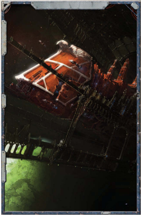

Most void-going vessels are built at 'local' shipyards  by a planetary authority or commercial concern, perhaps as part of a tithe to the Imperium. The Imperium normally only tithes interstellar  ships  from  major  systems  capable  of  building them, but interplanetary types may be called for where system defences need to be bolstered.

Building a void-ship from scratch is a massive undertaking; it  can  take  years  to  complete  an  escort-class  vessel  and centuries to build a capital ship. Such a vast effort requires countless numbers of workers and huge amounts of refined materials. A great work like this might not be completed for generations.  The  eventual  departure  of  its  ever-present  star from a world's night sky might be a time of celebration or mourning depending on the demeanour of the people.

From the Imperial [Commander](rank-commander.md)'s point of view, such effort is well rewarded. A single capital ship or several [Squadrons](squadrons-overview.md) of escort ships can satisfy a huge part of a developed world's tithe burden to  Imperial  authority.  Tithing  ships  finds  particular favour with The Adeptus Terra as it leaves The Administratum only the minimal burden of supplying Navy crews to man the  ships  and  take  them  anywhere  they  are  needed.  By comparison,  tithes  of  manufactured  goods,  Imperial  Guard regiments  or,  worse  still,  raw  materials  only  add  to  the logistical  burdens  of  the  Imperium  and  can  sometimes find short shrift with Sector-prefects. In contrast, the construction  of  commercial  void-ships  is  heavily regulated  by  Imperial  authority  and  can  only proceed with the appropriate charters already in  place.  A  ship  is  rarely  built  to  be  sold outright; the investment it represents is one that can only be recouped by long service trading between the stars.

*Source:* `Battle Fleet of the Koronus, page 47`
