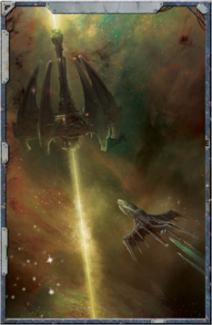

The  -40  penalty  imposed  on  Tests  to  hit  Holofield equipped  ships  also  affects  the  targeting  of  [Nova Cannons](weapons-nova-cannons.md),  [Torpedoes](weapons-torpedoes.md),  and  [Attack](combat-attack-rules.md)  craft.  However,  the ship  does  not  have  any  protection  against  a  Nova Cannon  exploding  within  1  VU  of  the  vessel-a massive [Plasma](weapons-general.md) explosion does not care if a holofield equipped  ship  is  actually  a  few  hundred  kilometres away from where it appears to be.

close  to  a  desired  target  before  starting  their  attack.  Once they arrive,  their  holofields  render  them  nearly  invisible  to augurs of all kinds, while their ship's solar sails enable them to  approach  an  unsuspecting  victim  without  the  glare  of  a plasma drive to give them away.

Once they begin their attack, Corsairs is relentless. They strike swiftly and accurately, seeking to disable their targets, usually  by  targeting  the  engines.  To  make  matters  worse, attacking  Eldar  often  divide  into  two  (or  more)  wings, enabling them to strike from several directions at once.

Only after rendering their quarry adrift in space will [The Eldar](faction-eldar-overview.md) board, at which point almost all hope is lost for the remaining crew. In some ways, the Eldar known as The Crow Spirits are the best of the lot, as they simply destroy ships outright, as opposed to looting them and slaying the crew.

*Source:* `Battle Fleet of the Koronus, page 87`
