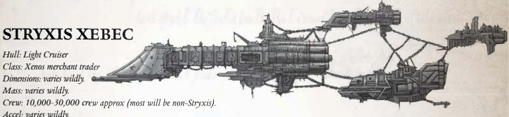

The following  rules  apply  to  all  Stryxis  ships  that  contain these [Components](starship-anatomy-detailed.md) (other xenos components can be assumed to behave mechanically to their Imperial counterparts)

Forth Eye Currents (Xenos Warp Engine): This Component  works  in  the  same  way  as  a  Warp  Drive,  but Component  works  in  the  same  way  as  a  Warp  Drive,  but when used has a 40 percent chance of decreasing a voyage time by 1d10 months, to a minimum of one day.

Sights  Unseen  (Ghost-eye  Deep  Void  Scanner): Stryxis ships may use any actions involving active scanning while on Silent Running and remain undetected (or may use such actions at  other  times,  such  as  alongside  a  trading  partner,  without other parties being able to detect any emissions or activity).

Ghost-light  (Ghost-light  Macroweapons): Whenever  a hit  from  a  Ghost-light  Macroweapon  strikes  a  ship  and  is not absorbed by [Void Shields](components-void-shields.md)-even if it does not do [Damage](character-injury.md) to  Hull  Integrity-it  does  1  damage  to  Crew  Population. In  salvos,  each  individual  hit  still  does  1  damage  to  Crew Population. This damage is in addition to all normal effects from [Macrobatteries](starship-supplemental-components.md). from macrobatteries.

Accel: varies wildly.

[The Stryxis](faction-stryxis-overview.md) Xebec is one of the largest caravans The Stryxis 'vessel' often consists of several scavenged ship [Hulls](hulls-overview.md) from any number of races, towed in a line by a vessel augmented with additional engines. Sometimes the Stryxis will even sell individual hulls off their 'caravan.' The Stryxis Xebec is one of the largest caravans The Stryxis 'vessel' often consists of several scavenged ship hulls from any

Speed: 3

Manoeuvrability: -10

Detection:

+50

Void Shields: 3

[Armour](armour.md):

15

Hull Integrity:

55

Morale: 95

Crew Population:

100

Crew Rating: Veteran (40)

Turret Rating: 2

Weapon Capacity: Dorsal 1, Keel 1, Port 1, Starboard 1

## Subpages
- [Essential Components](starship-essential-components.md)
- [Supplemental Components](starship-supplemental-components.md)
- [Using Xebecs and Stryxis Ships](ships-xebec-and-stryxis-usage.md)

*Source:* `Battle Fleet of the Koronus, page 97`
