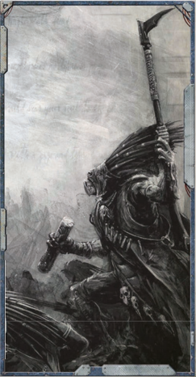
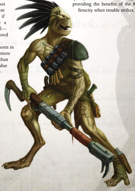
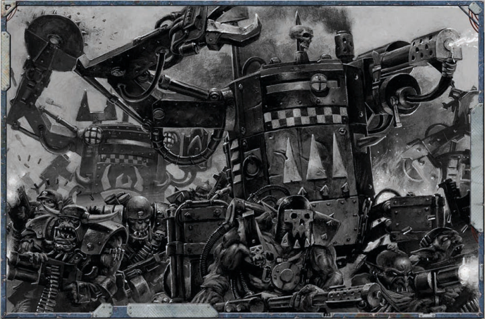

Kroot  are  a  very  adaptive  species,  and  show  no hesitation in using other races' weaponry as well as their own. Kroot do not gain the Xenos Weapon Training Talent Orks  can  take, instead gaining additional access to Exotic Weapon Training Talents.

The Kroot may enter a trance  during  his  normal  sleep  cycle. During this trance, he may receive a vision that grants him some foreknowledge of the future. The Kroot may re-roll one failed Test during the next 24 hours. In addition, the GM may (if he chooses) describe a vision that  is  granted  to  the  Shaper.  This vision should provide a hint or a clue as to significant events that are likely to occur to the Shaper (or to those he is closely connected with, such as other members of his Kindred or other player characters). These visions may relate to something that is likely to occur in the next week or even years hence.

## Medical Attention

'The Kroot are bred for battle.'

-Teknar Krawk, Kroot Mercenary

The Tau Empire has entirely integrated the Kroot homeworld of Pech, but that is not to say that all Kroot fight  for  the  Tau.  In  fact,  many  mercenary  forces  of Kroot can be found fighting alongside Eldar and human forces-and occasionally even amongst the ranks of foul Chaos  renegades  or  the  Ork  hordes.  Kroot  mercenaries hold  no  prejudices  against  any  particular  race,  and  care only that they are well paid for their services. Naturally, such  behaviour  is  anathema  to  the  Tau's  philosophy  of the Greater Good. Thus, the Kroot hide their mercenary activities and avoid contact with Tau forces if at all possible. In  the  end,  strengthening  the  Kroot's  genetic  makeup  is of paramount importance, and the Koronus Expanse is an opportunity the Kroot simply cannot ignore.

Like  all  Kroot,  the  mercenaries  can  interpret  sensory information  very  quickly,  and  their  senses  are  all  finely tuned,  linked  through  a  series  of  ganglia  that  run  the length of their crests. This makes it very difficult to hide from  a  Kroot,  and  some  mercenaries  have  been  known

to track prey across hundreds  of

miles  of  inhospitable  terrain  in order  to  make  the  kill.  Kroot mercenaries  are  also  content to wait out their prey if necessary,  and  can  initiate  a state  of  hibernation  at  willsustained  by  the  energy  stored in their nymunes.

Kroot are fearsome opponents in an assault, able to fight far more effectively at close quarters than most  humans-this  ability  due in  part  to  the  Kroot's  sharp senses and superior corded musculature. However, unlike other soldiers who fight  for  what  they believe  in,  secure  in  the

## If the Glove Fits...

Starting Skills: Awareness, Concealment, Dodge, Silent Move, Speak Language (Kroot, Low Gothic, Tau) Starting Talents: Basic Weapon Training (Universal), Exotic Weapon Training (Kroot Rifle), Melee Weapon Training (Universal), Heightened Senses (Sight), Heightened Senses (Hearing), Mercenary

Starting Traits: Natural Weapons (Beak), Unnatural Strength (x2).

Starting Gear: Kroot Rifle, mono-knife, kroot leathers, Kroot-modified void-suit, micro-bead.

knowledge that they are serving a higher purpose, Kroot fight  solely  for  reward.  This  philosophy means that Kroot mercenaries  fight  harder  and  more  tenaciously  for  greater payments,  so  their  battlefield  discipline  is  unpredictable  at best. Many individuals in the Koronus Expanse who disobey Imperial prohibitions on xenos contact and would otherwise deal  with  xenos  species  will  avoid  arrangements  with  the Kroot for this very reason.

However, the vast wealth and resources of a Rogue Trader are  a  perfect  fit  for  the  Kroot  Mercenary's  approach,  and more than a few Rogue Traders who operate in the Koronus Expanse, such as the famous Madam Charabelle, are known to employ Kroot amongst their armsmen. Some particularly cunning  or  resourceful  Kroot  take  their  place  amongst  a Rogue  Trader's  closest  confidantes  and  advisors.  In  this capacity, Kroot serve as a bodyguard or chief warrior whilst providing  the  benefits  of  the  Kroot's  superior  senses  and| Kroot Characteristic Advances   | Kroot Characteristic Advances   | Kroot Characteristic Advances   | Kroot Characteristic Advances   | Kroot Characteristic Advances   |
|---------------------------------|---------------------------------|---------------------------------|---------------------------------|---------------------------------|
| Characteristic                  | Simple                          | Intermediate                    | Trained                         | Expert                          |
| Weapon Skill                    | 100                             | 250                             | 500                             | 750                             |
| Ballistic Skill                 | 250                             | 500                             | 750                             | 1,000                           |
| Strength                        | 100                             | 250                             | 500                             | 750                             |
| Toughness                       | 250                             | 500                             | 750                             | 1,000                           |
| Agility                         | 100                             | 250                             | 500                             | 750                             |
| Intelligence                    | 500                             | 750                             | 1,000                           | 2,500                           |
| Perception                      | 100                             | 250                             | 500                             | 750                             |
| Willpower                       | 250                             | 500                             | 750                             | 1,000                           |
| Fellowship                      | 500                             | 750                             | 1,000                           | 2,500                           |

| Rank 1 Kroot Mercenary Advances      | Rank 1 Kroot Mercenary Advances   | Rank 1 Kroot Mercenary Advances   | Rank 1 Kroot Mercenary Advances   |
|--------------------------------------|-----------------------------------|-----------------------------------|-----------------------------------|
| Advance                              | Cost                              | Type                              | Prerequisites                     |
| Awareness                            | 100                               | Skill                             | -                                 |
| Climb                                | 100                               | Skill                             | -                                 |
| Common Lore (War)                    | 100                               | Skill                             | -                                 |
| Concealment                          | 100                               | Skill                             | -                                 |
| Dodge                                | 100                               | Skill                             | -                                 |
| Intimidate                           | 100                               | Skill                             | -                                 |
| Silent Move                          | 100                               | Skill                             | -                                 |
| Tracking                             | 100                               | Skill                             | -                                 |
| Survival                             | 100                               | Skill                             | -                                 |
| Wrangling                            | 100                               | Skill                             | -                                 |
| Forbidden Lore (Xenos)               | 200                               | Skill                             | -                                 |
| Exotic Weapon Training (Kroot Rifle) | 100                               | Talent                            | -                                 |
| Polyglot                             | 200                               | Talent                            | -                                 |
| Basic Weapon Training (Universal)    | 500                               | Talent                            | -                                 |
| Melee Weapon Training (Universal)    | 500                               | Talent                            | -                                 |
| Hyperactive Nymune Organ             | 500                               | Talent                            | Kroot                             |

| Rank 2 Kroot Mercenary Advances          | Rank 2 Kroot Mercenary Advances   | Rank 2 Kroot Mercenary Advances   | Rank 2 Kroot Mercenary Advances   |
|------------------------------------------|-----------------------------------|-----------------------------------|-----------------------------------|
| Advance                                  | Cost                              | Type                              | Prerequisites                     |
| Acrobatics                               | 200                               | Skill                             | ²                                 |
| Barter                                   | 200                               | Skill                             | ²                                 |
| Climb 10                                 | 200                               | Skill                             | Climb                             |
| Concealment 10                           | 200                               | Skill                             | Concealment                       |
| Contortionist                            | 200                               | Skill                             | ²                                 |
| Dodge 10                                 | 200                               | Skill                             | Dodge                             |
| Scrutiny                                 | 200                               | Skill                             | ²                                 |
| Search                                   | 200                               | Skill                             | ²                                 |
| Silent Move 10                           | 200                               | Skill                             | Silent Move                       |
| Survival 10                              | 200                               | Skill                             | Survival                          |
| Swim                                     | 200                               | Skill                             | ²                                 |
| Exotic Weapon Training (Choose 2ne) (x3) | 200                               | Talent                            | ²                                 |
| Mimic                                    | 200                               | Talent                            | ²                                 |
| Sound Constitution (x3)                  | 200                               | Talent                            | ²                                 |
| .root /eap                               | 500                               | Talent                            | .root, Strength 45, Agility 45    |
| 8nnatural Perception x2                  | 500                               | Trait                             | Per 45                            || Rank 3 Kroot Mercenary   | Advances   |        |                   |
|--------------------------|------------|--------|-------------------|
| Advance                  | Cost       | Type   | Prerequisites     |
| Acrobatics 10            | 200        | Skill  | Acrobatics        |
| Awareness 10             | 200        | Skill  | Awareness         |
| Barter 10                | 200        | Skill  | Barter            |
| Climb 20                 | 200        | Skill  | Climb 10          |
| Concealment 20           | 200        | Skill  | Concealment 10    |
| Dodge 20                 | 200        | Skill  | Dodge 10          |
| Intimidate 10            | 200        | Skill  | Intimidate        |
| Scrutiny 10              | 200        | Skill  | Scrutiny          |
| Search 10                | 200        | Skill  | Search            |
| Silent Move 20           | 200        | Skill  | Silent Move 10    |
| Survival 20              | 200        | Skill  | Survival 10       |
| Swim 10                  | 200        | Skill  | Swim              |
| Greed is Good            | 500        | Talent | Mercenary Trait   |
| Ambidextrous             | 200        | Talent | Ag 30             |
| Assassin Strike          | 200        | Talent | Ag 40, Acrobatics |

| Rank 4 Kroot Mercenary Advances   | Rank 4 Kroot Mercenary Advances   | Rank 4 Kroot Mercenary Advances   | Rank 4 Kroot Mercenary Advances    |
|-----------------------------------|-----------------------------------|-----------------------------------|------------------------------------|
| Advance                           | Cost                              | Type                              | Prerequisites                      |
| Acrobatics +20                    | 200                               | Skill                             | Acrobatics +10                     |
| Awareness +20                     | 200                               | Skill                             | Awareness +10                      |
| Barter +20                        | 200                               | Skill                             | Barter +10                         |
| Common Lore (War) +10             | 200                               | Skill                             | Common Lore (War)                  |
| Contortionist +20                 | 200                               | Skill                             | Contortionist +10                  |
| Forbidden Lore (Xenos) +10        | 200                               | Skill                             | Forbidden Lore (Xenos)             |
| Gamble                            | 200                               | Skill                             | -                                  |
| Scrutiny +20                      | 200                               | Skill                             | Scrutiny +10                       |
| Search +20                        | 200                               | Skill                             | Search +10                         |
| Berserk Charge                    | 200                               | Talent                            | -                                  |
| Bloodtracker                      | 200                               | Talent                            | -                                  |
| Catfall                           | 200                               | Talent                            | Ag 30                              |
| Blademaster                       | 500                               | Talent                            | WS 30, Melee Weapon Training (Any) |
| Combat Master                     | 500                               | Talent                            | WS 30                              |
| Counter Attack                    | 500                               | Talent                            | WS 40                              |

| Rank 5 Kroot Mercenary Advances     | Rank 5 Kroot Mercenary Advances   | Rank 5 Kroot Mercenary Advances   | Rank 5 Kroot Mercenary Advances   |
|-------------------------------------|-----------------------------------|-----------------------------------|-----------------------------------|
| Advance                             | Cost                              | Type                              | Prerequisites                     |
| Ciphers (Mercenary Cant)            | 200                               | Skill                             | ²                                 |
| Common /ore (War) 20                | 200                               | Skill                             | Common /ore (War) 10              |
| Forbidden /ore (;enos) 20           | 200                               | Skill                             | Forbidden /ore (;enos) 10         |
| Combat Sense                        | 500                               | Talent                            | Per 40                            |
| Crushing Blow                       | 500                               | Talent                            | S 40                              |
| Deadeye Shot                        | 200                               | Talent                            | BS 30                             |
| Exotic Weapon Training (Choose 2ne) | 200                               | Talent                            | ²                                 |
| Furious Assault                     | 500                               | Talent                            | WS 35                             |
| Hard Target                         | 200                               | Talent                            | Ag 40                             |
| Hardy                               | 200                               | Talent                            | T 40                              |
| Hip Shooting                        | 200                               | Talent                            | BS 40,Ag 40                       |
| /eap 8p                             | 200                               | Talent                            | Ag 30                             |
| /ight Sleeper                       | 200                               | Talent                            | Per 30                            |
| Marksman                            | 200                               | Talent                            | BS 35                             |
| Two-Weapon Wielder (Melee)          | 500                               | Talent                            | WS 35,Ag 35                       || Rank 6 Kroot Mercenary Advances   | Rank 6 Kroot Mercenary Advances   | Rank 6 Kroot Mercenary Advances   | Rank 6 Kroot Mercenary Advances   |
|-----------------------------------|-----------------------------------|-----------------------------------|-----------------------------------|
| Advance                           | Cost                              | Type                              | Prerequisites                     |
| Brutal Charge                     | 500                               | Trait                             | S 45                              |
| Intimidate 20                     | 200                               | Skill                             | Intimidate 10                     |
| Sure Strike                       | 200                               | Talent                            | WS 30                             |
| Precise Blow                      | 500                               | Talent                            | Sure Strike                       |
| 4uick Draw                        | 200                               | Talent                            | ²                                 |
| Resistance (Fear)                 | 200                               | Talent                            | ²                                 |
| Resistance (Psychic Techniques)   | 200                               | Talent                            | ²                                 |
| Talented (Dodge)                  | 200                               | Talent                            | ²                                 |
| Talented (Silent Move)            | 200                               | Talent                            | ²                                 |
| Talented (Concealment)            | 200                               | Talent                            | ²                                 |
| Takedown                          | 200                               | Talent                            | ²                                 |
| Sharpshooter                      | 500                               | Talent                            | BS 40, Deadeye Shot               |
| Step Aside                        | 500                               | Talent                            | Ag 40, Dodge                      |
| Swift Attack                      | 500                               | Talent                            | WS 35                             |
| Wall of Steel                     | 500                               | Talent                            | Ag 35                             |

| Rank 7 Kroot Mercenary Advances          | Rank 7 Kroot Mercenary Advances   | Rank 7 Kroot Mercenary Advances   | Rank 7 Kroot Mercenary Advances   |
|------------------------------------------|-----------------------------------|-----------------------------------|-----------------------------------|
| Advance                                  | Cost                              | Type                              | Prerequisites                     |
| Ciphers (Mercenary Cant) 10              | 200                               | Skill                             | Ciphers (Mercenary Cant)          |
| Deceive                                  | 200                               | Skill                             | ²                                 |
| Sound Constitution (x3)                  | 200                               | Talent                            | ²                                 |
| Peer (Mercenaries)                       | 200                               | Talent                            | ²                                 |
| Gamble 10                                | 200                               | Skill                             | Gamble                            |
| Wrangling 10                             | 200                               | Skill                             | Wrangling                         |
| Wrangling 20                             | 200                               | Skill                             | Wrangling 10                      |
| Flame Weapon Training (8niversal)        | 500                               | Talent                            | ²                                 |
| Pistol Weapon Training (8niversal)       | 500                               | Talent                            | ²                                 |
| Exotic Weapon Training (Choose 2ne) (x2) | 200                               | Talent                            | ²                                 |
| Navigation (Surface)                     | 200                               | Skill                             | ²                                 |
| Navigation (Surface) 10                  | 200                               | Skill                             | Navigation (Surface)              |

| Rank 8 Kroot Mercenary        | Advances   |        |                             |
|-------------------------------|------------|--------|-----------------------------|
| Advance                       | Cost       | Type   | Prerequisites               |
| Ciphers (Mercenary Cant) 20   | 200        | Skill  | Ciphers (Mercenary Cant) 10 |
| Sound Constitution            | 200        | Talent | ²                           |
| Deceive 10                    | 200        | Skill  | Deceive                     |
| Deceive 20                    | 200        | Skill  | Deceive 10                  |
| Carouse                       | 200        | Skill  | ²                           |
| Carouse 10                    | 200        | Skill  | Carouse                     |
| Die Hard                      | 200        | Talent | WP40                        |
| Duty 8nto Death               | 500        | Talent | WP45                        |
| Gamble 20                     | 200        | Skill  | Gamble 10                   |
| Navigation (Surface) 20       | 200        | Skill  | Navigation (Surface) 10     |
| Swim 20                       | 200        | Skill  | Swim 10                     |
| Good Reputation (Mercenaries) | 200        | Talent | ²                           |
| /ightning Attack              | 500        | Talent | Swift Attack                |
| 8nnatural Perception x3       | 1,000      | Trait  | 8nnatural Perception (x2)   |

<!-- image -->'W AAAGH!'

-Typical Ork Freebooter

A longside  humans,  Orks  are  the  most  numerous species  in  the  galaxy,  and  their  kind  can  be  found almost  everywhere.  Their  prolific  nature  is  made all  the  more  perilous  by  their  belligerence  and  inclination towards violence, for the Orks are a species who crave one thing above all else: war. It is no surprise, then, that mankind and the greenskins have come into violent conflict frequently since  humanity  first  took  to  the  stars  tens  of  thousands  of years ago-it is even rumoured that Orks were the first Xenos species ever encountered by mankind. Orks appear to have simply  always  been  there,  careening  from  world  to  world seemingly without aim or purpose other than the enthusiastic slaughter of everything they meet.

That the Orks have not rallied together and swept aside all that stand before them is something many are thankful for, and it is the same predilection for violence that makes them a threat that also keeps them from uniting in such a terrifying manner. When there are no other adversaries immediately on hand, Orks will cheerfully make do with each other, engaging in anything from simple fist fights to all-out war, simply to satisfy their need for noise and mayhem. This in itself should be cause for relief, yet Orks revel in such warfare, and grow larger and stronger through constant battle.

Orks, then, are a race driven by the need to fight. Their species is considered, as a whole, to consist of little more than violent  animals  wielding  crude  weapons  and  riding  aboard ramshackle starships that hurtle between the stars at random until they find something to attack. The truth is quite different. Viewed as unintelligent, Orks possess a straightforward mindset that has little time for refined or ephemeral matters and  concerns  itself  primarily  with  base  needs-food,  drink, shelter and aggression. Their technology is more sophisticated than many will comfortably give credit for, patched together from what appears as little more than scrap metal and junk yet capable of devastating effects that escape the comprehension of all but the finest scientific minds of the Adeptus Mechanicus.

Their  society  is  one  with  apparently  very  little  internal strife-while violence is endemic to them, they consider it a natural part of life and seem to bear no ill-will towards their enemies. Ork culture is comprised of a robust caste system defined by the size, strength and aptitudes of the individuals contained within. Similarly, the issues of heresy and sedition are almost unknown amongst the Orks; lacking the inclination to muse about the nature of existence and being frequently quite content with the state of things, few Orks ever think of rebellion or the worship of the Ruinous Powers at  all,  let  alone  consider  them  as  alternatives  to  the  Orks' own belligerent deities; entities known simply as 'Gork' and 'Mork.' These twin gods are sometimes said to embody the ideals of brutality and cunning, respectively, though few are certain which god embodies which ideal.

It  should  come  as  little  surprise,  then,  to  imagine  that Orks comprise a significant portion of the raiders and pirates

*Source:* `Battle Fleet of the Koronus, pages 52–53`
