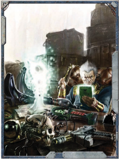
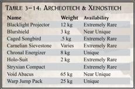

## Archeotech Blurshield

Skinplants are a more sophisticated version of the electooentire devices can be built just under the skin using crystal technology provided by the Machine Cult. Users can replicate electronic ID systems, lamplights, chronos, and a host of other non-mechanical  items.  Highly  fashionable,  they  adorn  the arms and hands of many of the sector's wealthiest and most stylish individuals. Good and Best Craftsmanship versions are usually more detailed designs or more complex devices (at the GM's discretion).

## Blacklight Projector

This advanced item is a staple in many medikits. It uses sonic waves that penetrate deep into the flesh to staunch bleeding. Wrapped around a limb, it closes off arteries and can be tuned to stop bleeding without interfering with regular blood flow, thus preventing anoxia and possible loss of the limb. When used to stop blood loss, this device grants a +10 bonus to any Medicae Test. Good and Best Craftsmanship versions grant a +20 instead.

## Caged Songbird

Once prisoners (or bounties) are caught, strait-capes are often used to secure them. Made from heavy, durable fabric, each is lined with memory wire so that when thrown over a body and  activated  they  constrict  and  wrap  the  foe  into  a  tight bundle. Once locked, they are almost escape-proof and allow for easy transport of the now-mummified target. Strait-capes can be used as a thrown weapon with the Inaccurate and Snare Qualities, and impose a -10 penalty on all tests to escape its coils, no matter what variety.

| Table 3-13: Tools    | Table 3-13: Tools   |                |
|----------------------|---------------------|----------------|
| Name                 | Weight              | Availability   |
| Aquila Magnificus    | 25 kg               | 9ery Rare      |
| Bloodlock Bolt       | 125 kg              | Extremely Rare |
| Bomb Spray           | .02 kg              | 9ery Rare      |
| Concealed Holster    | 2 kg                | Scarce         |
| Det-cord, Det-tape   | 1 kg                | Common         |
| Disguise .it         | 5 kg                | Rare           |
| Emergency Hab        | 10 kg               | Scarce         |
| Firewater            | 1 kg                | Rare           |
| Flak Spray           | 4 kg                | 9ery Rare      |
| Flex Tent            | 2 kg                | Scarce         |
| Flip-Belt            | 2 kg                | Extremely Rare |
| Glidewing            | 25 kg               | Extremely Rare |
| Gravity Generator    | 500 kg              | 9ery Rare      |
| Hab Base             | not applicable      | Extremely Rare |
| /ingua-9ox Servitor  | 2.5 kg              | 9ery Rare      |
| /ong-Range Auspex    | 175 kg              | 9ery Rare      |
| Nephitic Acid        | ²                   | 9ery Rare      |
| Perimeter System     | 175 kg per pylon    | 9ery Rare      |
| Physik .it           | 2 kg                | Common         |
| Plaguewort 9enom     | ²                   | Rare           |
| Power Board          | 15 kg               | Near 8nique    |
| Promethium           | 1 kg                | Abundant       |
| Psycrystal           | .3 kg               | Near 8nique    |
| Skinplant            | ²                   | Scarce         |
| Stasis Pod           | 250 kg              | Extremely Rare |
| Travel Survival .it  | 15 kg               | Rare           |
| Screaming Tourniquet | 2 kg                | 9ery Rare      |
| Strait-Cape          | 4 kg                | Scarce         |

## Carnelian Sievestone

'Come now, are these precautions necessary? It is just a harmless bauble.'

-Vox-log fragment found at the site of a lost Egarian Dominion Expedition

R ogue  Traders  are  some  of  the  few  members  of  the R ogue  Traders  are  some  of  the  few  members  of  the R Imperium who can handle the strange items of the xenos R Imperium who can handle the strange items of the xenos R without  being  immediately  condemned  to  death  for R without  being  immediately  condemned  to  death  for R doing so. Even with their wide remit, however, a Rogue Trader should be careful lest some overzealous Inquisitor or Imperial official decide to punish his 'transgression.' However, some items crafted by human hands can be just as strange as those created by xenos, and these are often very valuable to a Rogue Trader. All of these items are automatically Good Craftsmanship-Common and Poor versions are likely frauds passed as the real thing.

## Chronal Energizer

Rather than actually providing physical protection, a blurshield creates a fuzzy blur around the wearer so that itis not clear exactly where the target is. While useful against most ranged weapons and even melee attacks, it offers little help against flame or blast weapons that rely more on the area of effect than precision targeting. Blurshields impose a -20 penalty on all Ballistic Skill Tests made to attack the wearer.

## Holo-suit

The dead world of Foulstone first produced these small angular machines (sometimes known as Shadowcasters), when Questors of the Adeptus Mechanicus discovered a cache buried in what was  thought  to  be  a  mausoleum.  Testing  displayed  their most obvious value-when one end was depressed, the other would emit a beam of purest midnight, deep enough to cloak any visible light and submerge anyone within the area in an instant nightfall. That it only blankets the wavelengths humans associate  with  vision  is  a  troubling  matter  for  of  the  Ordo Xenos; it is still unknown if they were designed deliberately as a weapon against humans who may have ventured into the Expanse long ago or if this is simply the byproduct of a lessnoticeable effect. Anyone under the area effect of a Blacklight suffers -40 to all Perception based tests involving vision

## Stryxian Compact

These tiny, winged mechanical birds were originally thought of  as  simple  baubles,  remnants  of  one  of  the  many  extinct civilisations that dot the Unbeholden Reaches, their soothing warbles fit for shipboard amusement in many a Rogue Trader's quarters to help pass the long days of travel. It was Captain Reddertun Kavile who first reported their greater worth, when his  began  to  shriek  loudly  shortly  before  his  Gellar  Field suffered a severe fluctuation. Kavile made the connection, and after some very risky testing established that they could indeed sense  intrusions  of  the  warp.  Now  the  birds  can  be  found more often on bridges than in cabins, their uncanny and as-yet unexplained  ability  to  preternaturally  detect  an  approaching Gellar Field failure a prized part of any vessel. If the ship suffers a  Gellar  Field  failure  or  fluctuation,  this  item  will  provide  a warning 1d10 Rounds beforehand. They will also warn the bearer if they are within 10 metres of a daemon, although this is not a guarantee (certain daemons can disguise their presence, and this ability is left to the GM's discretion).

## Teleportation Pack

These flattened, dark-red bowls were first discovered in the drifting xenos-palaces orbiting Stanx, and seemed yet another unusual but unprofitable discovery of the Expanse-until a crewman used one to collect dripping bilge water from a leaky ceiling pipe. To his dismay, what looked like waterproof stone was actually very permeable, slopping bilge water all over the floor. Strangely, though, that water looked crystal clear, while that in the bowl was still foul and riddled with effluent. A quick check showed the bowl had indeed filtered away all contaminants, allowing only utterly pure water to pass. What had been a worthless curio became a highly sought-after relic, probably of deliberate xenos manufacture as more were found in a variety of other shapes. The sieves can filter any liquid from  blood  to  promethium  to  amasec  easily,  inexpensively and nearly flawlessly. Since their initial find, they have turned up on a surprising number of worlds throughout the Heathen Stars in a variety of forms, from huge urns that create potable water supplies for hundreds of colonists to smaller barrels for fuel refinements or liqueur distillations.

## Void Abacus

It  is  uncertain  if  these  incredibly  rare  devices  are  of  ancient  human design or the work of the unclean xenos, but many collectors of the rare and arcane spend many years in search of one. Most take the form of small black tetrahedrons covered with what could be unfathomable runes, circuitry designs of dark green, or perhaps both. When the top is twisted, a temporal warp develops around the device to envelop the user. The surrounding world takes on an eldritch, emerald glow as outside motion slows to a crawl. Those viewing the user perceive him as a blurred image, barely discernible as his body vibrates out of tune with the materium. As  the  top  slowly  moves  back  into  its  starting  position,  the effect wears off and the user returns to the passage of normal time. Dark stories abound of desperate users who have stretched time too long and were never seen again; possibly scattered into other dimensions, or trapped in a terrible flux state, alive but unable to interact with the real world. When used, the user may take two Full Actions in a single Round, (and may take two Combat Actions instead of one). During the subsequent Round, he may take no actions, and suffers 1 level of Fatigue. This item's benefit does not stack with any other powers that grant similar effects.

| Table 3-14:          | Archeotech   | & Xenostech    |
|----------------------|--------------|----------------|
| Name                 | Weight       | Availability   |
| Blacklight Projector | 12 kg        | Extremely Rare |
| Blurshield           | 3 kg         | Near 8nique    |
| Caged Songbird       | .5 kg        | Extremely Rare |
| Carnelian Sievestone | 9aries       | Extremely Rare |
| Chronal Energi]er    | 8 kg         | 8nique         |
| Holo-Suit            | 2 kg         | Extremely Rare |
| Stryxian Compact     |              | Extremely Rare |
| 9oid Abacus          | 65 kg        | Near 8nique    |
| Warp -ump Pack       | 25 kg        | 8nique         |

*Source:* `Battle Fleet of the Koronus, pages 139–140`
