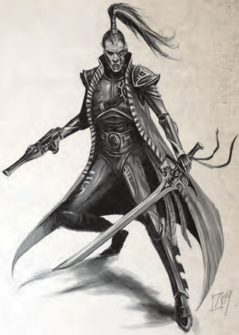
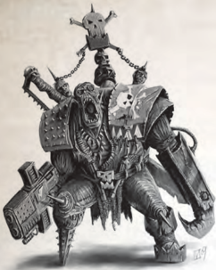
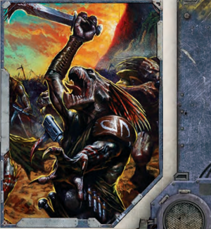

## Eldar Corsair

Few  humans  know  much  of  the  enigmatic  ancient  race know as [The Eldar](faction-eldar-overview.md), save reports of haughty disdain, quixotic Temperament,  powerful  technology,  and  the  unnatural  and subtle  cruelties  of  merciless  [Raiders](hulls-overview.md)  who  strike  like  ghostly phantoms. Despite these conflicting reports there are those foolish  and  wealthy  enough  to  take  up  the  extortionately priced  services  of  these  so-called  corsairs.  Those  who  do employ the skills of these most efficient mercenaries take a very grave risk. The tales of mastery and splendour in battle attributed  to  them  are  almost  equalled  by  those  telling  of their fickle loyalty, sudden betrayals, and gleeful slaughtering Grace, silken [Armour](armour.md) a-sheen with the blood of former allies.

Within  the  Koronus  Expanse  the  two  most  infamous groups of eldar corsairs at large are known to humanity as the fickle and deadly mercenaries of The Children of Thorns and the mysterious exterminators called The Crow Spirits.

|   WS |   bS |   S |   T |   Ag |   Int |   Per |   WP |   Fel |
|------|------|-----|-----|------|-------|-------|------|-------|
|   48 |   48 |  33 |  35 |   52 |    39 |    40 |   43 |    25 |

Movement: 5/10/15/30 [Wounds](character-injury.md): 12

Skills: Acrobatics  (Ag),  Awareness  (Per)  +10,  Barter  (Fel), Deceive (Fel) +10, [Dodge](rules-combat-overview.md) (Ag), Evaluate (Int) +10, Forbidden Lore (The Black Library, Xenos, [The Warp](warp-imperial-space-travel.md)) (Int), Gamble (Int), Navigation (Stellar) (Int), Pilot (Interface Craft, Jump Pack) (Ag), Medicae (Int), Silent Move (Ag) +10, Speak Language (Eldar, Low Gothic, Void Cant) +10.

Talents: [Basic Weapon Training](talents-descriptions.md) (Las), [Catfall](talents-descriptions.md), [Exotic Weapons](weapons-general.md) Training (Shuriken Catapult, [Shuriken Pistol](weapons-general.md)), Leap Up,  Melee  Weapon  Training  (Power,  Primitive),  Pistol Weapon Training (Las), Quick Draw, Resistance (Fear, [Psychic Techniques](psychic-techniques-list.md)), Sprint.

[Traits](character-traits.md):

Unnatural Agility (x2).

[Armour](armour.md): Xeno mesh void armour (Body 5, Head 5, Arms 4, Legs 4).

Weapons: Shuriken catapult (60m; S/3/10; 1d10+4 R; Pen 6;  Clip  100;  [Reload](rules-combat-overview.md)  2Full;  Reliable),  xeno-crafted  laspistol (30m;  S/-/-;  1d10+2  E;  Pen  0;  Clip  30;  Reload  Full; Reliable),  xeno-crafted  mono-sword  (1d10+3  R;  Pen  2; Balanced), 2 plasma grenades, 4 blind grenades.

[Gear](equipment-gear.md): 3 spare clips of shuriken catapult [Ammunition](economy-wealth-and-acquisitions.md), waystone gem, xenos-crafted medkit, xenos-crafted void-sealed armour that grants full life support, [Long Range](combat-special-circumstances.md) encrypted vox, auspex, and  Dark  Sight.  Inbuilt  void  impellor  units  in  the  armour grant [Flyer](character-traits.md) 12 in null gravity.

## Ork Freebooter

Imperial  lore  has  it  that  throughout  history  the  brutal  ork has  contested  mankind's  dominion  of  the  stars.  Built  for bloodshed,  violence,  and  little  else,  the  average  ork  is  a hulking simian humanoid with tough, sallow-greenish hide and  a  protruding  jaw  lined  with  jagged  tusk-like  fangs. Frighteningly  strong  (most  can  easily  pull  a  human  being apart  in  their  clawed  hands),  orks  are  also  phenomenally resistant  to  [Injury](character-injury.md),  largely  [Fearless](talents-descriptions.md),  and  can  thrive  in  many hazardous  environments  unaided.  Orkiods  demonstrate  a staggering variety of physical types and subspecies, with the largest and most brutal always in command. While lacking intellect, orks possess an innate low cunning and simple but effective  grasp  of  tactics.  This,  combined  with  a  talent  for scavenging and creating their own crude but highly effective tech,  makes them a danger far beyond the near-animalistic xenos predator they at first appear to be.

Barbarous and strife-torn ork empires are scattered

throughout  known  space,  and  the  Koronus  Expanse  is  no exception with a volume of space known as Undred-Undred Teef the home of a long established ork domain from which frequent [Raids](mass-combat-raids.md) and pirate attacks from scavenging ork warbands of loota krews and freebooter pirates are infamous.

### Ork Freebooter Profile

|   WS |   bS |   S | T      |   Ag |   Int |   Per |   WP |   Fel |
|------|------|-----|--------|------|-------|-------|------|-------|
|   45 |   20 |  50 | (8) 45 |   30 |    26 |    30 |   28 |    22 |

Movement:

3/6/9/18

[Wounds](character-injury.md):

16

Skills: Awareness (Per), Barter (Fel), Intimidate (S).

Talents: Basic  Weapon  Training  (Primitive,  SP),  [Bulging Biceps](talents-descriptions.md), Common Lore (Ork), [Crushing Blow](talents-descriptions.md), Furious Assault, Hardy, Heavy Weapon Training (SP), Iron Jaw, Melee Weapon Training (Chain, [Primitive](weapons-general.md), Power), Pistol Weapon Training (Primitive,  SP),  Speak  Language  (Ork,  Low  Gothic),  True Grit.

[Traits](character-traits.md): [Brutal Charge](character-traits.md), Mob Rule†, Resistance (Cold, Heat, Radiation), Sturdy, Unnatural Toughness (x2).

[Armour](armour.md): Looted [Armour](armour.md) (Body 5, Head 4, Arms 2, Legs 2). [Weapons](weapons-general.md): Chain axe (1d10+9 R; Pen 2 Tearing), 1d5 frag grenades, shoota (60m; S/3/10; 1d10+4 I; Pen 0; Clip 30; [Reload](rules-combat-overview.md) Full; Inaccurate, Unreliable).

[Gear](equipment-gear.md): 2d10 ork teeth ('Teef '), shiny bitz, scavenged machine [Components](starship-anatomy-detailed.md)  and  trophies,  3  spare  clips  for  the  shoota, respirator, crude hand vox.

†Mob Rule: Orks grow in confidence and brutality in the company of their own kind. For every additional ork within

10m, the ork's Willpower is increased by +10 to resist the effects of [Fear](character-fear-and-damnation.md) and [Pinning](combat-special-circumstances.md).

## Kroot Mercenary

Encountered very rarely in the Koronus Expanse, The Kroot are not indigenous to the local stars but nomadic wanderers from half a galaxy away. A mercenary race, their feral, clannish mindset hides both a perception and intelligence few would credit them with. A carnivorous and highly adaptable species, an individual kroot stands considerably taller than a human and possesses many features that betray their avian heritage. Sporting a crest of quills, a beaked mouth, and the ability to move with incredible speed and lithe physical power, a kroot is a formidable opponent. Their martial prowess-combined with an unpleasant reputation for eating those they slaygives  these  freelance  warriors  a  justly  fearsome  reputation, and they command a high price from the merchant criminals and recidivist elements willing to flout Imperial law by taking them into their employ.

### Kroot Mercenary Profile

|   WS |   bS | S      |   T |   Ag |   Int | Per    |   WP |   Fel |
|------|------|--------|-----|------|-------|--------|------|-------|
|   42 |   33 | (6) 35 |  40 |   44 |    25 | (8) 44 |   30 |    18 |

Movement:

4/8/16/32

[Wounds](character-injury.md):

12

Skills: Acrobatics (Ag), Awareness (Per), Barter (Fel), Climb (S)  +10,  Concealment  (Ag)  +20,  [Dodge](rules-combat-overview.md)  (Ag)  +10,  Silent

Move (Ag) +20, Speak Language (Low Gothic, Kroot) (Int), Tracking (Int) +10, Survival (Int) +20.

Talents: Basic  Weapon  Training  (SP,  [Primitive](weapons-general.md)),  Furious [Attack](combat-attack-rules.md), [Leap up](talents-descriptions.md), [Lightning Reflexes](talents-descriptions.md), Melee Weapon Training (Primitive), Resistance (Fear), Sprint, Swift Attack.

[Traits](character-traits.md): [Natural Weapons](character-traits.md) (Beak) † , Unnatural Perception (x2), Unnatural Strength (x2).

† A Kroot's beak follows all rules for natural weapons, except it inflicts 1d5 [Damage](character-injury.md) instead of 1d10.

[Armour](armour.md): Hide [Armour](armour.md) (Body 2, [Primitive](weapons-general.md)).

Weapons: Kroot  rifle †† (110m;  S/-/-;  1d10+5 E; Pen 1; Clip 6; [Reload](rules-combat-overview.md) 2Full), beak (1d5+6 R, Primitive), bolas.

† May be used in melee (1d10+6 R; Balanced).

[Gear](equipment-gear.md): Cut meat, bandolier of 30 spare charges for rifle, fetish pouch.

*Source:* `Roguetrader Corerulebook, pages 377–378`
