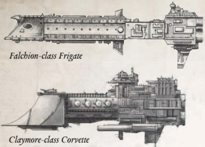

Dimensions: 2.2 km long, 0.3 km abeam at fins approx.

Mass: 6.5 megatonnes approx.

Crew: 27,000 crew, approx.

Accel: 4.6 gravities max sustainable acceleration.

The  Falchion  is  considered  a  new  class,  having  only  been laid down in 261.M41. Given The Imperial Navy's deference towards the truly ancient ships in its arsenal, the class (given its mere 550 years of service) is regarded as an untried and untested  pretender  to  the  throne  of  more  established  ships like  the  venerable  [Sword](weapons-general.md). As such, it has engendered some undisguised  and  unfair  hostility  from  the  more  hidebound and traditional sections of the Battlefleet Calixis officer class.

This is a pity , for the Falchion, like all V oss [Forge World](chargen-stage2-origin-path.md) ships, is a thoroughly well-constructed and innovative design. It is more flexible  than  many  [Frigates](hulls-overview.md),  having,  unusually ,  the  capacity  to carry [Torpedoes](weapons-torpedoes.md). This has led to the class being used in a more aggressive capacity than perhaps suits it, more reactionary officers tending to treat it as an upgunned heavy destroyer. This ignores its abilities as an escort vessel for larger craft, its original purpose.

Battlefleet  Calixis  currently  has  only  one  squadron  of  these ships,  the  three-vessel  Broadsword  Squadron  patrolling  a  long loop around the Scintilla/Iocanthus/Sepheris Secundus triangular

trade route. There is, however, talk of diverting the squadron to conduct long-range scouting [Patrols](patrols.md) into The Halo Stars. trade route. There is, however, talk of diverting the squadron to conduct long-range scouting patrols into the Halo Stars.

Rogue  Traders,  being  freethinking  innovators,  are  less likely  to  adopt  the  Navy's  unsympathetic  approach  to  the new class, and it is not surprising that some Falchions have already been sighted within the Koronus Expanse.

Speed: 8

Manoeuvrability: +17

Detection: +14

[Hull](starship-anatomy-detailed.md) Integrity:

36

[Armour](armour.md):

18

Turret Rating:

1

Space:

34

SP: 42

Weapon Capacity: Prow 1, Dorsal 2 (of these slots, 1 prow slot pre-equipped with Components)

Torpedo  Specialist: The  Falchion has been designed as  a  torpedo  gunship.  The  Falchion's  Prow  weapon  slot  is occupied by a Voss-pattern Torpedo Tube Component. This Component  may  not  be  removed,  and  has  half  the  usual [Ammunition](economy-wealth-and-acquisitions.md) capacity. The space required is already taken into account, but when this ship is constructed, it must provide one power to this Component.

*Source:* `Battle Fleet of the Koronus, page 27`
