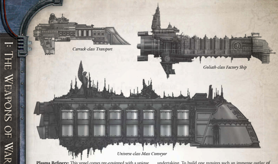

Dimensions: 4.9 km long, 0.9 km abeam at fins approx.

Mass: 16 megatonnes approx.

Crew: 41,000 crew, approx.

Accel: 1.5 Gravities max sustainable acceleration.

The Goliath-class factory ships are Mechanicus vessels, gigantic energy-processing vessels that harvest the very essence of stars. They devour solar [Plasma](weapons-general.md) to power their own arcane [Fuel](weapons-ammunition.md) production techniques, in order to sate the endless hunger of  the  Imperium's  Hive  worlds.  Even  larger  than  the  Jericho class,  they  are  fragile  and  potentially  explosive  craft  treated with much respectful caution by other spacefarers, given their propensity  to  detonate  in  catastrophic  explosions  that  are capable of scouring the atmosphere from entire worlds.

The  Goliaths  plod  slowly  through  certain  traditional  trade routes, the principle Calixian route consisting of Sepheris Secundus, Scintilla, and an obscure blue star known only as Delta 7815. The full round trip-which can take up to two yearsbegins  at  Sepheris  Secundus,  where  the  Goliaths  take  aboard millions of tons of unrefined ore, hacked from the frozen surface of the ice world by billions of serfs. The ship refines this ore to extract  the  priceless  rare  elements  contained  within,  converting them in primal furnaces to their base molecules-suspended in a  plasma  state  and  stored  within  fragile  spinning  containment fields. These plasmas are highly desired to fuel the most powerful reactors.  This  hugely  demanding process drains the ship's own enormous power plants,  so  it  plunges  from  the  warp  to  scoop the plasma of the brilliant blue-giant star Delta 7815, restoring its  own  power  reserves,  before  slowly  propelling  itself  back  to Scintilla to off-load its precious cargo of energy-rich plasma fuel.

The Goliaths of The Calixis Sector are an ancient and inelegant class; bulbous and totally utilitarian, they are of interest to Rogue Traders  because  of  their  potentially  infinite  range  (subject  to finding stars of the correct type to recharge their plasma engines) and their not inconsiderable transport capability .

Speed: 3

Manoeuvrability: -10

Detection:

+4

[Hull](starship-anatomy-detailed.md) Integrity:

50

[Armour](armour.md):

14

Turret Rating: 1

Space:

40

SP: 25

Weapon Capacity:

1 Dorsal, 1 Port, 1 Starboard

Cargo  Hauler: This  vessel  was  designed  for  transporting goods and fuel, and no amount of retrofitting can fully change this.  This  Hull  comes  pre-equipped  with  two  Main  Cargo Hold Components (See page 203 of the Rogue TRadeR core rulebook). The hull's Space has already been reduced to account for these, however when the ship is constructed it must be able to provide a total of 4 Power to these Components.

undertaking. To build one requires such an immense outlay of resources that they can only be constructed above the richest Imperial worlds and voidstations. They are pure cargo haulers, relatively simple in design, but conceived on a truly epic scale. They are almost self-contained worlds, where entire voidborn communities  live  out  their  lives,  uncaring  as  to  the  vessel's current  owners'  motives  or  identities.  Simply  unloading  the vessel  is  a  mighty  undertaking,  requiring  months  at  a  time. There are larger ships (the Bountiful Beast of the Calixis Sector is  16  km  long,  for  [Example](rules-tests.md),  and  the Misericord approaches that  length  while  being  substantially  more  massive)  but  the Universe class still dwarfs most Imperial ships it comes across. undertaking. To build one requires such an immense outlay of

It is rare for Rogue Traders to take one of these ships into the Koronus Expanse, as they are slow and inflexible craft. However, everything counts in large amounts.

Speed: 2

Manoeuvrability: -20

Detection:

+5

Hull Integrity:

65

Armour:

12

Turret Rating: 1

Space:

94

SP: 45

Weapon Capacity:

1 Dorsal, 1 Port, 1 Starboard

Oversized  Monstrosity: This  vessel's  Speed  cannot  be increased by Components-if a Component would increase its Speed, it has no effect instead.

Secondary Power Genetorium: The Universe class is so large it  comes pre-equipped with a unique Component, a  Secondary Power Genetorium. The hull's Space has already been reduced to account for this Component, which provides +10 power to the vessel in addition to that provided by the ship's Plasma Drive.

Cargo  Hauler: This  vessel  was  designed  for  transporting goods  on  a  massive  scale,  and  no  amount  of  retrofitting  can fully change this. This Hull comes pre-equipped with four [Main Cargo Hold](starship-supplemental-components.md) Components (See page 203 of the Rogue TRadeR core  rulebook).  The  hull's  Space  has  already  been  reduced  to account for these, however when the ship is constructed it must be able to provide a total of 8 Power to these Components.

Plasma Refinery: This vessel comes pre-equipped with a unique Component, a Plasma Refinery, used to create high-grade fuel for plasma engines. This is a huge facility mounted amidships. This grants the ship the ability to scoop plasma from the stars, refine it, and sell it on. The profits gained by this enterprise are closely matched to the costs of running the vessel, however the Explorers can use it to augment their own [Endeavours](economy-endeavours.md). The refining process simply  requires  a  large  supply  of  low-grade  ore,  however  the plasma harvesting process is more involved. The ship must enter a retrograde orbit around a blue-giant star, a [Manoeuvre](rules-combat-overview.md) that takes three days and requires two Ordinary (+10) Pilot (Space Craft) +Manoeuvrability Tests . Failure of either of these Tests by five degrees or more results in the ship's destruction. Success means the ship gains enough additional plasma to convert one full load of  ore,  granting  the  Explorers  +100  Achievement  Points  to  an ongoing Endeavour (the refined plasma can either be used in the Endeavour, or sold to generate funds). Plasma Refinery: This vessel comes pre-equipped with a unique

Powered  by  Stars: Provided  the  Goliath  harvests  plasma roughly once a year, its Plasma Drive generates +10 power.

*Source:* `Battle Fleet of the Koronus, page 30`
