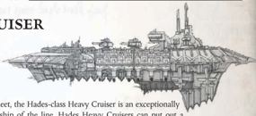

[Hull](starship-anatomy-detailed.md): Heavy Cruiser

Class: Hades Class

Dimensions: 5.2 km long, .8 km abeam approx.

Mass: 33.5 Megatonnes approx.

Crew: 130,000 crew approx.

Accel. 2.4 Gravities max acceleration.

Once a design considered for the backbone of a battle fleet, the Hades-class Heavy Cruiser is an exceptionally dangerous and well-armed vessel, a dire threat to any ship of the line. Hades Heavy [Cruisers](hulls-overview.md) can put out a Once a design considered for the backbone of a battle fleet, the Hades-class Heavy Cruiser is an exceptionally dangerous and well-armed vessel, a dire threat to any ship of the line. Hades Heavy Cruisers can put out a

devastating amount of firepower at [Long Range](combat-special-circumstances.md), including dual banks of [Lances](starship-supplemental-components.md) and heavy clustered [Weapons](weapons-general.md) batteries on each broadside. It is suspected that the Hades Class contains certain non-euclidian quirks of architecture, perhaps placed deliberately by its planners, that inexorably lead towards madness and worshipping beings of [The Warp](warp-imperial-space-travel.md). Whatever the truth, it is well-known that this heavy cruiser is often found serving at the forefront of traitor battle formations.

Speed: 7

Manoeuvrability: +5

Detection:

+10

[Void Shields](components-void-shields.md): 2

[Armour](armour.md):

20

Hull Integrity:

75

Morale:

100

Crew Population:

100

Crew Rating:

Veteran (50)

Turret Rating: 2

Weapon Capacity:

Dorsal 1, Prow 1, Port 2, Starboard 2

## Essential Components

[Jovian Pattern Class 4 Drive](starship-essential-components.md), Strelov 2 Warp Engine, Gellar Field, Multiple Void Shield Array, Ship Master's Bridge, Vitae Pattern Life Sustainer, Pressed-crew Quarters, M-100 Augur Array.

## Supplemental Components

Prow and Dorsal Banefire Lance Battery: (Lance; Strength 2; [Damage](character-injury.md) 1d10+2; Crit Rating 3; Range 12)

Deathstrike  Missile  Broadside: (Macrobattery;  Strength  6; Damage 1d10+3; Crit Rating 5; Range 9)

Pirate  Holds: If  this  ship  is  captured  while  this  Component is undamaged, it grants an additional 100 [Achievement Points](economy-endeavours.md) towards any one of the Explorers' current Objectives.

Secondary [Command Bridge](starship-essential-components.md): The bonuses for this [Commander](rank-commander.md)'s sanctum are included in Modifiers.

*Source:* `Battle Fleet of the Koronus, page 110`
