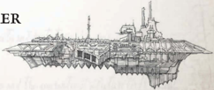

## Essential Components

[Light Cruiser](starship-anatomy-detailed.md) [Plasma](weapons-general.md) Drive, [Warp Drive](warp-drive-rules.md), Gamma Level Warpbane Field, Void Shield Array, Invasion Bridge, Exhalation Sustainer, [Crew Quarters](starship-essential-components.md), Augur Array

## Supplemental Components

Dorsal  Hellus  Macrocannons: (Macrobattery; Strength 4; [Damage](character-injury.md) 1d10+3; Crit Rating 4; Range 6)

Prow  Skullhammer  Bombardment  Cannon: (Macrobattery; Strength 3; Damage 1d10+6; Crit Rating 2; Range 3)

Port and Starboard Launch Bay: (Launch Bay: Strength 1) Each Launch Bay has one squadron of Swiftdeath Fighters and Doomfire Bombers, for two [Squadrons](squadrons-overview.md) of each total.

Dreadclaw Drop Pod Bays: Able to hold 30 Dreadclaws and launch 10 at a time, this Component only allows them to fire at a planetary surface and cannot be used in space [Combat](rules-combat-overview.md), but can be put to use invading planets (see page 118).

Plunder Holds :  Hellbringers  contain  vast  cargo  bays  designed to  hold  the  looted  remains  of  conquered planets. If  this  ship  is captured with this Component intact, it awards 50 [Achievement Points](economy-endeavours.md) to the completion of a current Objective.

## Modifier Summary

These modifiers apply to the Hellbringer due to its [Components](starship-anatomy-detailed.md):

- Powerful  Bombardment: All  Ballistic  Skill  Tests  against planetary based targets gain a +10 bonus, and any units in vox [Communication](rules-communication.md) with the Hellbringer count as being equipped with a [Multicompass](equipment-tools.md). In addition, the Hellbringer gains +20 to

## Using Chaos Warships

The  forces  of  Chaos  are  the  archetypal opponents of the forces of the Imperium, and this is apparent in their opposing warships.

Chaos  warships  are  generally  faster  than  their Imperial counterparts and armed with longerrange [Lances](starship-supplemental-components.md) and macrobatteries. However they lack armoured  prows  and  many  [Torpedoes](weapons-torpedoes.md),  relying  on [Attack Craft](attack-craft-rules.md) instead. In [Combat](rules-combat-overview.md), Chaos ships try and stand clear of the gun range of their opposition, trying to pound them as long as possible with their longer reach  and  [Attack](combat-attack-rules.md)  craft  before  closing.  In  some  cases (the Idolator and Slaughter being two examples) this isn't possible, in which case the ships use their superior speed to close fast before the enemy is aware of them.

One  thing  to  keep  in  mind  when  using  these ships  is  what  their  [Motivation](chargen-stage2-origin-path.md)  is.  Chaos  ships  might be  opportunistic  pirates,  or  they  might  be  part  of  an organized force. Their motivations determine what level of opposition they will take on, and how much [Damage](character-injury.md) they take before they attempt to flee (if they flee at all).

Intimidate Tests against planetary based characters, and when bombarding with its bombardment cannon, doubles the effected area, does 20 additional damage to large units, and 10 additional damage to individuals and vehicles (see page 133).

*Source:* `Battle Fleet of the Koronus, pages 105–106`
