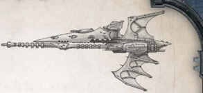

[Hull](starship-anatomy-detailed.md): Frigate

Class: Hellebore-class frigate

Dimensions: 1.8 km long approx, 0.3 km abeam approx.

Mass: 5 megatonnes approx.

Crew: Unknown

Accel: 9.5 gravities max sustainable acceleration

Gaining infamy as 'the most heavily armed frigate in the Gothic Sector' during the devastating Gothic War, Hellebores are designed to sow confusion among a target fleet through a swift dispersal of [Torpedoes](weapons-torpedoes.md). It then follows up with a barrage of battery and pulsar fire. Gaining infamy as 'the most heavily armed frigate in the Gothic Sector' during the devastating Gothic War, Hellebores are

Speed: 14

Manoeuvrability: +42

Detection:

+25

[Void Shields](components-void-shields.md): -

[Armour](armour.md): 14

Hull Integrity:

25

Morale: 100

Crew Population: 100

Crew Rating: Veteran (50)

Turret Rating: 1

Weapon Capacity: Prow 2, Keel 1

## Essential Components

Solar Sails, Warp-Plotter, [Command Bridge](starship-essential-components.md), Eldar Life Sustainer, Eldar Crew Quarters, Sensor Array

## Supplemental Components

Prow Pulsar Lance:

(Lance; Strength 1, [Damage](character-injury.md) 1d10+3; Crit Rating 3; Range 3; Pulsed Fire)

Prow Starcannon Cluster Battery: (Macrobattery; Strength 3; Damage 1d10+2; Crit Rating 4; Range 4; Superior Accuracy) Keel [Torpedo Tubes](components-torpedo-tubes.md): (Torpedo Tubes; Strength 2; Damage 2d10+14; Range 40; [Defensive](weapons-general.md) Holofield, Terminal Penetration [3]) These torpedo tubes are loaded with Eldar plasma [Torpedoes](weapons-torpedoes.md), though they could also be loaded with different torpedoes such as vortex

torpedoes at the GM's discretion. This component has 12 torpedoes.

Holofield:

See page 86 for full rules.

## Modifier Summery

The following modifiers apply to the Hellebore.

- -1 Movement if heading towards the nearest sun, +1 Movement if at right angle, no effect if moving away.
- May re-roll Pilot Tests for [Manoeuvre Actions](starship-combat-rules.md)
- Add 1 to Crew Population loss suffered.
- Subtract 1 from Morale loss suffered (to a minimum of 1).
- -40 on any Test to hit [The Eldar](faction-eldar-overview.md) ship with [Lances](starship-supplemental-components.md), [Torpedoes](weapons-torpedoes.md), [Attack Craft](attack-craft-rules.md) or by ramming. -20 to hit the ship with macrobatteries.
- -30 to any opponent's Extended Actions that involve detecting the Eldar ship.
- +10 to all Ballistics Tests involving the Starcannon Cluster Battery .
- Torpedoes negate Turret Rating bonuses and use Seeking Rules. orpedoes negate Turret Rating bonuses and use Seeking Rules.

*Source:* `Battle Fleet of the Koronus, page 88`
