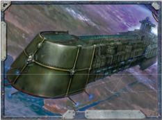
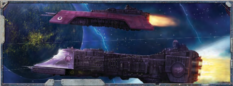
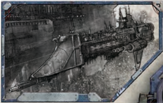
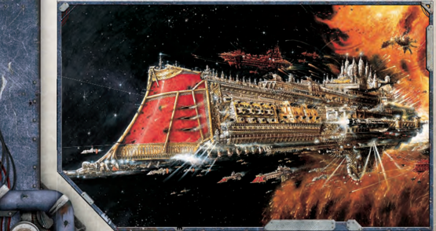

## Transports

[Transports](ships-transports-overview.md) are unexciting but vital to galactic commerce.

### Jericho-class Pilgrim Vessel

Dimensions: 2.25 km long, 0.3 km abeam approx.

Mass: 9 megatonnes approx.

Crew: 20000 crew, approx.

Accel: 1.6 gravities max acceleration

The  gigantic  Jericho  pilgrim  ships  are  converted  refinery vessels.  Their  huge  [Fuel](weapons-ammunition.md)  tanks  are  rebuilt  into  hundreds  of passenger  compartments,  and  a  single  ship  can  hold  many thousands  of  the  faithful.  Accommodations  vary;  for  those with the Thrones, the trip can be relatively pleasant, but most must  make  do  with  bilge-berths  and  corpse  rations  in  the ship's cavernous cargo bays. A Jericho can also be repurposed to carry cargo.

The ships themselves are large, slow, and [Unwieldy](weapons-general.md). Most do sport some [Weapons](weapons-general.md) to discourage pirates, though most buccaneers might look for richer targets.

Speed: 3

Manoeuvrability: -10

Detection:

+5

[Hull](starship-anatomy-detailed.md) Integrity:

50

[Armour](armour.md):

12

Turret Rating: 1

Space:

45

SP: 20

Weapon Capacity:

1 Prow, 1 Port, 1 Starboard

Cargo Hauler: This vessel  was  designed  for  transporting  goods, and no amount of retrofitting can fully change this. This [Hull](starship-anatomy-detailed.md) comes pre-equipped with one [Main Cargo Hold](starship-supplemental-components.md) Component (see page 203). The hull's Space has already been reduced to account for this, however, when the ship is constructed it must be able to provide 2 Power to this Component.

### Vagabond-class Merchant Trader

Dimensions: 2 km long, 0.4 km abeam approx.

Mass: 8 megatonnes approx.

Crew: 18000 crew, approx.

Accel: 2.1 gravities max acceleration

A common sight throughout The Calixis Sector, Vagabonds are small, multi-purpose merchant vessels able to transport a wide variety of cargos and even passengers.  Popular  amongst  poorer  Chartist [Captains](imperial-starship-types.md),  these  ships  are  unassuming  but [Reliable](weapons-general.md), and have even been known to mount small broadsides for defence.

Speed : 4

Manoeuvrability: -5

Detection:

+10

[Hull](starship-anatomy-detailed.md) Integrity:

40

[Armour](armour.md):

13

Turret Rating: 1

Space:

40

SP:

20

Weapon Capacity:

1 Dorsal, 1 Prow

Cargo Hauler: This  vessel  was  designed  for  transporting  goods, and no amount of retrofitting can fully change this. This [Hull](starship-anatomy-detailed.md) comes pre-equipped with one [Main Cargo Hold](starship-supplemental-components.md) Component (see page 203). The hull's Space has already been reduced to account for this, however, when the ship is constructed it must be able to provide 2 Power to this Component.

## Raiders

Corsairs and pirates prize these fast but fragile vessels.

### Hazeroth-class Privateer

Dimensions: 1.5 km long, 0.25 km abeam approx.

Mass: 5 megatonnes approx.

Crew: 22000 crew, approx.

Accel: 5.6 gravities max acceleration

The Hazeroth class comprises a variety of raider vessels of similar [Size](character-traits.md) and firepower. Many have been known to operate

from the infamous Hazeroth Abyss (hence the name), and are popular with privateers. Most sacrifice cargo space and [Armour](armour.md) for  improved  engines  and  reinforced  interior  bulkheads, allowing them to flee anything they cannot fight.

Speed:

10

Manoeuvrability: +23

Detection:

+12

[Hull](starship-anatomy-detailed.md) Integrity:

32

[Armour](armour.md):

14

Turret Rating: 1

Space:

35

SP: 30

Weapon Capacity: Dorsal 1, Prow 1

### Havoc-class Merchant Raider

Dimensions: 1.6 km long, 0.4 km abeam approx.

Mass: 6 megatonnes approx.

Crew: 24000 crew, approx.

Accel: 5 gravities max sustainable acceleration

The Havoc class is a heavy raider whose origins date back to before the reconquest of The Calixis Sector. A typical Havoc has fast engines, sizeable cargo space, and a battery strength to  [Rival](talents-descriptions.md)  many  frigates.  However,  their  [Armour](armour.md)  is  relatively weak, meaning that these 'glass cannons' have a hard time going toe-to-toe with a comparable naval vessel.

Speed: 9

Manoeuvrability: +25

Detection:

+10

[Hull](starship-anatomy-detailed.md) Integrity:

30

[Armour](armour.md):

16

Turret Rating: 1

Space:

40

SP: 35

Weapon Capacity:

Dorsal 1, Prow 1

## Frigates

Frigates are fast, small, but powerful craft, used in any number of roles.

### Sword-class Frigate

Dimensions: 1.6 km long, 0.3 km abeam at fins approx.

Mass: 6 megatonnes approx.

Crew: 26,000 crew, approx.

Accel: 4.5 gravities max sustainable acceleration

The  [Sword](weapons-general.md)  frigates  have  been  a  mainstay  escort  vessel  for Battlefleet Calixis ever since its founding. Every system aboard one of these frigates has been tried and tested in innumerable engagements. Its laser-based [Weapons](weapons-general.md) and turrets are accurate and hard-hitting, its [Plasma Drives](starship-essential-components.md) are rugged and reliable in extreme conditions. Few task forces do not include at least a pair of Swords to guard the flanks of larger vessels or pursue smaller, faster [Raiders](ships-raiders-overview.md). More than a few Rogue Traders have noticed the stellar performance of these vessels and obtained one. With a few minor conversions to increase holds, Swords suit their needs quite well.

Speed: 8

Manoeuvrability: +20

Detection:

+15

[Hull](starship-anatomy-detailed.md) Integrity:

35

[Armour](armour.md): 18

Turret Rating: 2

Space:

40

SP: 40

Weapon Capacity:

Dorsal 2

### Tempest-class Strike Frigate

Dimensions: 1.5 km long, 0.4 km abeam at fins approx.

Mass: 6.1 megatonnes approx.

Crew: 30500 crew, approx.

Accel: 4.7 gravities max sustainable acceleration

The Tempest is a specialised [Frigate](starship-anatomy-detailed.md) produced in the Calixis and surrounding Sectors. It trades long ranged firepower for heavy, short-ranged broadsides designed to devastate enemies at '[Knife](weapons-general.md)-fight' distances. To get to those distances, Tempests have triple-armoured prows and boosted [Drives](components-drives.md), and often carry assault  boats  and  large  complements  of  [Ratings](crew-ratings.md)  for  boarding actions. These larger quarters and hanger bays have been found very useful for other, more commercial purposes as well.

Speed: 8

Manoeuvrability: +18

Detection:

+12

[Hull](starship-anatomy-detailed.md) Integrity:

36

[Armour](armour.md):

19

Turret Rating: 1

Space: 42

SP: 40

Weapon Capacity:

Dorsal 2

## Light Cruisers

They are the eyes and ears of the fleet, or scouts in the deepest void.

### Dauntless-class Light Cruiser

Dimensions: 4.5 km long, 0.5 km abeam at fins approx.

Mass: 20 megatonnes approx.

Crew: 65000 crew, approx.

Accel: 4.3 gravities max sustainable acceleration

Light,  scouting  cruisers  are  the  eyes  and  ears  of  Imperial fleets.  They carry enough [Fuel](weapons-ammunition.md) and supplies for [Patrols](patrols.md) that last months or even years, and enough firepower to dispatch any smaller vessels foolish enough to close with them. The Dauntless is popular because it combines the manoeuvrability of a [Frigate](starship-anatomy-detailed.md) with a daunting forward lance armament.

Speed: 7

Manoeuvrability: +15

Detection:

+20

[Hull](starship-anatomy-detailed.md) Integrity: 60

[Armour](armour.md):

19

Turret Rating: 1

Space: 60

SP: 55

Weapon Capacity:

Prow 1, Port 1, Starboard 1

## Cruisers

These warships are the backbone of any fleet.

### Lunar-class Cruiser

Dimensions: 5 km long, 0.8 km abeam at fins approx.

Mass: 28 megatonnes approx.

Crew: 95000 crew, approx.

Accel: 2.5 gravities max sustainable acceleration

The Lunar class [Cruiser](starship-anatomy-detailed.md) makes up the backbone of Battlefleet Calixis.  Its  (relatively)  uncomplicated  design  dates  back to the dawn of the Imperium, and it can be constructed at worlds normally unable to build a ship of the line. Its variety of  [Weapons](weapons-general.md) batteries, [Lances](starship-supplemental-components.md), and [Torpedoes](weapons-torpedoes.md) make it both a versatile combatant and dangerous foe. Most Rogue Traders remove the [Torpedo Tubes](components-torpedo-tubes.md) to add more cargo space instead.

Speed: 5

Manoeuvrability: +10

Detection:

+10

[Hull](starship-anatomy-detailed.md) Integrity:

70

[Armour](armour.md):

20

Turret Rating: 2

Space:

75

SP: 60

Weapon Capacity: Prow 1, Port 2, Starboard 2

*Source:* `Roguetrader Corerulebook, pages 194–197`
