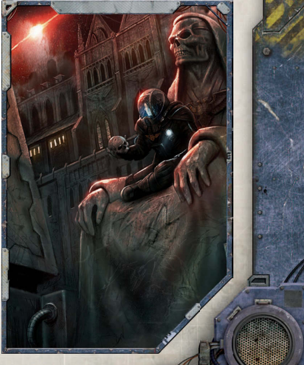

Most Navy [Captains](imperial-starship-types.md) detest convoy duties. Wallowing along, nurse-maiding a clutch of Chartist vessels does not fit with the glorious traditions of the fleet. Fortunately some gifted

officers in Battlefleet Calixis see the true value of protecting the  lifeblood  of  the  Imperium.  Commodore  Wake,  for example, runs convoys through the Golgenna Reach with the regularity of magrail timetables and only a foolhardy raider gets  in  his  way.  Thanks  to  Commodore  Wake's  virtually single-handed efforts, the rich trade triangle between Sepheris Secundus, Iocanthos and Scintilla is the safest in the sector.

A typical convoy might comprise as few as a half-dozen merchant ships to twenty or more commanded by an elected senior Chartist-[Captain](rank-captain.md). The number of Navy ships allocated to protect them depends on the cargo and the circumstances. If no major enemy warships are known to be prowling the area there may be a single destroyer or [Frigate](starship-anatomy-detailed.md) for five or six merchantmen-still enough to give many pirates pause.

In times of war, escorts need to be stepped up but shortages often  lead  to  larger  convoys  with  the  same  proportion  of escorts  instead.  Capital  ships  are  spared  for  convoy  duty only for the most vital cargos or breaking through blockades to  beleaguered  worlds.  Capital  ships  are  more  commonly deployed to patrol areas where they can reach several convoys quickly if help is needed.

*Source:* `Battle Fleet of the Koronus, page 52`
