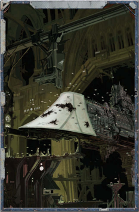

## War of Faith

By  far  the  single  most  common  reason  to  wage  war throughout  the  Imperium  of  Man,  the  religious  war  is perhaps also the easiest to justify. The opening salvo of many a bloody [Campaign](rules-campaign.md) has come on the tail of the phrase, 'the God-Emperor  wills  it.'  Indeed,  it  could  be  said  that  the justification  for  all  wars  the  Imperium  embarks  on  are,  at their heart, fuelled by zealous piety-or at least draped in its trappings. These are 'just wars,' wars based on Ecclesiarchical doctrine whose atrocities and crimes are justified, even called for, by the God-Emperor himself. The reasons behind them rarely matter, even to the generals and admirals commanding the vast Imperial military forces. For them it is enough that the God-Emperor wills it, and so it shall be done.

## The Trader Militant

[The Warrant of Trade](economy-backing.md) is a potent document, not only allowing Rogue Traders to trade beyond the bounds of the Imperium and operate beyond Imperial oversight, but also make war in the Emperor's name. While many Rogue Traders make use of a minor war or conflict at some point in their careers, some favour war over all other [Endeavours](economy-endeavours.md). These bloodthirsty Rogue Traders are commonly known by the general populace of the Imperium as Traders Militant, and their Warrant is often referred to by their fellows as a 'Warlord Warrant.' These Traders Militant behave in a similar fashion as a senior military [Commander](rank-commander.md). Their Warrant sanctions them to conscript and equip great numbers of men, to maintain these men under arms in addition to their house troops, to contract with mercenary corps, and even enlist the aid of Imperial Guard, Imperial Navy or Adeptus Astartes units, and the average Trader Militant makes good use of these abilities.

A true Trader Militant is a rare breed, however. Though their Warrants may technically allow them the right to requisition troops, the reality is many Imperial Governors and senior members of the Imperial Adeptus have the political and military power to resist these requests. Therefore, Traders Militant tend to be either Rogue Traders who already possess great wealth and political power, or proven and [Reliable](weapons-general.md) former servants of the Imperium such as high-ranking Imperial Guard and Imperial Navy officers granted a Warrant of Trade for their deeds. It is up to the GM and a character's history as to whether they have the martial background to qualify as a Trader Militant, but if they do the GM can allow them  a +10 to all [Acquisition](economy-acquisition-rules.md) and [Interaction](rules-interaction.md) Tests related to negotiating contracts, planning battles or leading men into [Combat](rules-combat-overview.md).

Due to the nature of the Imperial Creed, wars of faith may be  waged against  any  who  oppose  the  rightful  rule  of  The Imperium of Man, be they alien, heretic, or rebel. However, the Imperium reserves a special [Hatred](talents-descriptions.md) for one foe-the forces of the Ruinous Powers.

These  wars  can  be  faster  and  more  intense  than  other wars  (although  this  is  by  no  means  a  guarantee),  since  their goal  destruction  more  than  conquest.  They  usually  end  when the  aggressor  has  either  wiped  out  the  heathens  and  heretics, converted  them,  or  taught  them  a  sufficiently  hard  lesson. Afterwards,  the  aggressor  will  leave  behind  some  religious officials and missionaries to see that their work stuck and that their  new  converts  remain  on  the  narrow  path.  Garrisons  of troops  may  be  left  behind  as  well  to  keep  peace  and  enforce new doctrines, but the majority of the invading forces will be withdrawn to their  bases,  leaving  the  rest  of  the  work  to  the priests and adepts.

Due to  their  relative  quickness,  high  potential  for  gain, and the ease with which a person can get an enemy labelled a  heretic  in  the  Imperium,  religious  wars  are  quite  popular among  Rogue  Traders.  Whether  based  on  true  religious fervour or simply used as a convenient excuse, many a Rogue Trader has waged war with conspicuous displays of prayer and breast-beating. Unlike wars of conquest, in which they tend to take secondary roles, Rogue Traders often take a very active and enthusiastic role in religious wars. What better way is there to prove your piety than by killing the enemies of the God-Emperor? Indeed, many Warrants of Trade specifically call for wielder to make war amongst the heretic and bring His holy light to the godless heathens at the furthest reaches of space.

## Xenocide

Xenocide, similar in theory to its cousin genocide, is the act of [Waging War](mass-combat-waging-war.md) for the sole purpose of completely eradicating an alien species. To the Imperium, xenocide is accepted and even advocated as a religious imperative of humanity, and is yet another common mandate dictated to Rogue Traders by their Warrants of Trade.While  not  all  Rogue  Traders  are  compelled  to  pursue campaigns  of  xenocide  in  their  Warrants,  nearly  all  are expected to assist Imperial forces in campaigns against xenos. While all Rogue Traders tacitly agree to this upon receipt of their warrants, in practice it is a different matter altogether. Away  from  the  watchful  eyes  of  the  Imperium,  many  a pragmatic  Rogue  Trader  has  turned  his  back  on  human settlements  besieged  by  xenos  when  the  cost  of  assisting outweighed the benefits  of  leaving  their  fellow  humans  to their fates.

## Defensive War

A true defensive war is waged in answer to an aggressor's [Attack](combat-attack-rules.md). Of course, many warmongers would have it believed that their wars  are  [Defensive](weapons-general.md)  wars.  They  justify  their  aggression  by  real or  imagined  threats,  but  their  wars  are  predicated  on  a  desire for wealth, land, and power. A true defensive war is fought to deny the enemy territory, or resources, and often there is little reward save the preservation of what one already possesses. The ongoing defence of the Cadian Gate in the Gothic Sector against the Black [Crusades](mass-combat-crusades.md) of Chaos is one [Example](rules-tests.md) of a defensive war, as is the recent war fought on Damaris against the Ork invaders.

While  those  fighting  a  defensive  war  are  typically  caught flat-footed  in  the  early  stages  of  the  conflict,  they  will  have certain advantages over their attackers due to fighting on familiar ground, being closer to supply lines, and even the knowledge that they must win or perish. Due to the smaller potential profits of a defensive war, it is not something Rogue Traders get involved with often. However, the potential [Rewards](economy-rewards.md) (in both finances and reputation) for coming to the aid of an embattled people should never be overlooked. The reputation of Esme Chorda changed from  pirate  and  blackguard  to  hero  of  the  Imperium  almost overnight after the Rogue Trader participated in the destruction of the space hulk Cauldron of Savagery in 673.M40.

## War as Distraction

What better way to [Cover](combat-special-circumstances.md) illicit activities and shady dealings than  with  a  bloody  armed  conflict?  As  heinous  as  it  may sound to some, inciting war for purposes of misdirection and obfuscation can be a perfectly legitimate, if perhaps slightly underhanded,  business  practice.  A  war  pursued  by  way  of distraction is often fought by proxies. Thanks to their usual business dealings, Rogue Traders often have a [Ready](rules-combat-overview.md) supply of mercenaries and hired thugs that they can call upon for just such an occasion. While the hirelings sow discord and fomenting  armed  conflict,  the  Rogue  Trader  can  go  about their business.

## War by Proxy

Sometimes, a Rogue Trader must wage a war, but cannot be seen to have done so. When a Rogue Trader needs some dirty work done and it's either inconvenient or impolitic to  get  dirt  on  his  own  hands,  there  are  plenty  of private military organisations more than willing to do it for him-including other Rogue Traders. War by proxy is a war fought on behalf of one  party,  typically  unknown  to  the  actual  combatants  and hired  through  numerous  cutouts  and  front  organisations,  by professional  mercenaries  or  other  agents.  While  it  can  be  a clean and expedient way to wage war, the risks of doing so should not be underestimated. Without direct control of events, such  wars  have  a  way  of  spiralling  out  of  control,  possibly hampering the very goals they were supposed to obtain.

## War Profiteering

Sometimes it is more profitable to supply a war than it is to fight it. War profiteering is as old as the act of war itself, and, much  like  war,  is  both  lauded  and  detested.  War  profiteers are  individuals  or  groups  who  make  their  profits  by  selling important  materiel  to  belligerents  in  an  armed  conflict,  and can  range  from  a  Guardsman  selling  the  [Lasgun](weapons-general.md)  of  a  [Dead Comrade](character-fear-and-damnation.md) to the manufactorums of The Calixis Sector such as the Merovech Combine, Loi Metalworks, and Lindwyrm Armoury.

Although  war  profiteering is typically thought  of as the  selling  of  weapons,  fighting  vehicles  and  other  wartime impedimenta,  the  need  for  any  valuable  commodity  can  be exploited for profit in times of war. Medical supplies, foodstuffs, and raw materials all tend to be in high demand in a warzone.

It's  not  unheard  of  for  a  canny  war  profiteer  to  sell  his wares to both sides of a conflict. There have even been cases of  war  profiteers  instigating  armed  conflicts  for  the  sole purpose of supplying arms and resources to  the belligerents involved-at wartime prices, of course.

Rogue Traders are adept at war profiteering. They are well placed to buy commodities low, ship them to willing war zones, and sell them for a tidy profit to all comers. In fact, the business of making war a business is many a dynasties' core dealings.

*Source:* `Battle Fleet of the Koronus, pages 119–121`
