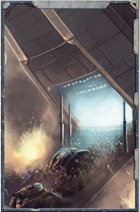

Once a force has been mustered and equipped, all that's left is to move it where it's needed and deploy it to the battlefield. This will  involve  specially  configured  voidships  to  transport  all  the men and materiel, escorts to protect them, and shuttles, landing craft or drop pods to ferry everything from orbit to the surface. Once on the surface, units are assumed to have with them the appropriate vehicles, such as tanks, fighter craft, or riding beasts, as fits their unit as these were acquired during the outfitting stage.

| Table 4-6: Modifiers   | [Gear](equipment-gear.md) Quality Morale   |
|------------------------|-----------------------|
| Quality                | Morale Modifier       |
| Poor                   | -1d10                 |
| Common                 | 0                     |
| Good                   | '+1d10                |

If the Explorers don't have the necessary ships and aircraft on hand, or can't acquire them easily from their dynasty, they will need to contract for passage. A Rogue Trader's best choice would be an ally or colleague Rogue Trader or Free [Captain](rank-captain.md) who  specialises  in  hauling  troops.  Their  ships  will  already be configured as troop carriers, they are trustworthy, and can typically  be  had  for  the  price  of  some  favours.  Failing  that, a Rogue Trader's next best bet is a private military company specialising  in  what  is  known  in  the  business  as  'voidlift work', the profession of transporting men and materiel from war zone to war zone. It is important to note that The Imperial Navy may or may not be willing to aid in void transport. This usually  depends  on  a  Rogue  Trader's  Warrant  and  relations with the Navy-as an [Admiral](rank-admiral.md) is more likely to aid a respected Rogue Trader than one who is practically a pirate. However, Rogue Traders are peers of the Imperium, and their ability to requisition aid includes the Imperial Navy . However, the Navy is unlikely to transport non-Imperial forces.

Transporting and deploying forces can be made either a Logistical Goal in a war endeavour or set-up as a background endeavour by the players as they do something more important. If [Run](rules-combat-overview.md) as a background endeavour, there is  always  the  risk  that  something  goes  awry  as the job is entrusted to the players' hirelings. For more information on BackgroundEndeavours,  see InTo  The s ToRm .  This  allows  the  GM  to create any appropriate [Complications](ships-npc-vessels.md) that he sees fit, which may pave the way for other adventures or problems within the endeavour. For more information about war and background [Endeavours](economy-endeavours.md), see the [Warfare Endeavours](mass-combat-endeavours.md) section on page 137.

*Source:* `Battle Fleet of the Koronus, page 128`
