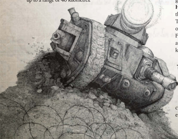

Once the unit's [Size](character-traits.md), type, and tech level are decided, the  following  rules  are  used  to  find  its  four primary [Characteristics](starship-anatomy-detailed.md): Power, Unit Strength, Morale, and Movement.  Once  the  unit's characteristics  are  recorded,  all  it  needs  is equipment  and  a  name  and  it's  [Ready](rules-combat-overview.md) Once the unit's size, type, and tech level are decided, the  following  rules  are  used  to  find  its  four primary characteristics: Power, Unit Strength, Morale, and Movement.  Once  the  unit's characteristics  are  recorded,  all  it  needs  is equipment  and  a  name  and  it's  ready

*Source:* `Battle Fleet of the Koronus, page 124`
