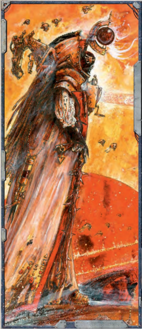

## A Cloud in the Warp

By understanding and perceiving the currents of [The Warp](warp-imperial-space-travel.md), the Navigator can hide his presence from those that would use the Immaterium to detect him. Whilst it does not in any way mask his presence in the real universe, it can ably hide him from detection by Psykers and confuse creatures whose essence and existence are linked to [The Warp](warp-imperial-space-travel.md), such as Daemons and other warp entities. As the Navigator grows in power, he will become harder to detect, as well as being able to mask others if they stand nearby.

Novice: By making a Willpower test, the Navigator becomes shrouded in an immaterial cloak, forcing those that use any kind  of  psychic  sight,  detection  or  divination  to  make  a Challenging (+0) Perception Test to  see  him  with  such powers. This power also has the same effect on the perception of all Daemons and warp entities. This power will last as long as  the  Navigator  maintains  it,  however  whilst  he  does  so, he cannot use any other powers (though he may take other actions normally).

[Adept](rules-allies-enemies-rivals.md): As  above,  except  the  test  to  detect  the  Navigator becomes Difficult (-10).

Master: As above, except the power gains a radius equal to the  Navigator's  Willpower  Bonus  in  metres  centred  on  his person. Any creature within the radius may be shrouded at the choice of the Navigator.

## Foreshadowing

By using his warp eye to filter small secrets from the near future, the Navigator can choose to make slight adjustments to  his  actions  to  avoid  harm  and  manipulate  the  course  of events. Only if the Navigator tries to dig too deep into the near future for secrets does this power become unpredictable

## Are Navigators Psykers?

[Navigators](psychic-psyker-types.md) are not marked as psykers in the traditional sense  within  the  Imperium,  though  they  do  have  a connection  with  the  warp  and  use  its  power  to  [Fuel](weapons-ammunition.md) their  abilities.  For  all  game  purposes,  however,  a Navigator character is considered a psyker. This means that [Weapons](weapons-general.md), powers, and creatures that have special effects on a character that is a psyker will have similar effects on a Navigator character.

and he may become victim of [The Warp](warp-imperial-space-travel.md)'s lies.

Novice: With  a  successful  Perception  Test,  the  Navigator draws three secrets from the future. He may then 'spend' a secret on his following turn to gain a +10% bonus on any Test. Using one secret in this way carries no danger. However, he may choose to spend either of his other two secrets to add an additional +10 bonus to the roll for each secret spent (for  a  total  bonus  of  +20  for  2  secrets  used,  and  +30  for three  secrets  used).  For  each  additional  secret  used  beyond the first, the Navigator must roll a d10; if this roll comes up 7, 8, 9, or 10, then the secret causes the Navigator to suffer a -10% penalty instead of granting a bonus. Secrets not used in the following round are lost as time marches on. Using this power more than once in the same hour is dangerous, as no one should know too much about his own future. For every use after the first in a single hour, the Navigator suffers 1d5 Insanity Points.

[Adept](rules-allies-enemies-rivals.md) : As above, except secrets will only deduct rather than add on a roll of 9 or 10.

Master: As above, except secrets can be used up to five [Rounds](rules-combat-overview.md) after the power is used.

## Gaze Into the Abyss

This power allows a Navigator to see a creature's or object's reflection in [The Warp](warp-imperial-space-travel.md) and learn things hidden from the real universe. This power is most useful in unmasking both psykers and  daemons,  but  has  other  applications,  such  as  reading residual psychic taint on objects and tracking powerful psychic entities.

Novice: With a successful Perception Test, the Navigator can determine if a creature or object holds the taint of [The Warp](warp-imperial-space-travel.md). This will tell the Navigator if the person or object has a [Psy Rating](talents-descriptions.md) or is [Tainted](chargen-stage2-origin-path.md) (roughly speaking if they have more than 20  [Corruption](character-corruption.md)  Points,  warp  [Mutations](character-mutations-list.md),  are  possessed,  etc.). Psykers who have made dark pacts with the warp and daemons are more resistant to this power, however. These creatures may make a Willpower Test opposed by the Navigator's Perception, which if successful will hide their true natures. This power can also be used to track powerful psychic or warp creatures using the rules for Tracking on page 88.

[Adept](rules-allies-enemies-rivals.md): As  above,  with  the  additional  effect  that  the Navigator  can  detect  major  disturbances  in  the  warp, such as warp portals and ships entering and exiting the Immaterium within a radius of 100 kilometres times  his  Perception  Bonus.  In  Starship  [Combat](rules-combat-overview.md) (see page 212), this power functions withina number of VUs equal to the Navigator's Perception Bonus. Master: As above but the Navigator can also use the power to detect the use of psychic powers within a radius of 10 metres per point of his Perception Bonus.

## Held in My Gaze

The unflinching eye of a Navigator locks a creature in place with a gaze that pierces flesh and bone to see the immaterial essence  of  all  things.  Most  commonly  employed  against psykers,  this  ability  can  be  used  to  render  them  effectively powerless and prevent them from calling upon their abilities. It is also undeniably effective against creatures with a strong connection to [The Warp](warp-imperial-space-travel.md), such as daemons, for which it can have spectacular and devastating consequences.

Novice: The Navigator chooses a target which he has line of sight to and is no further away than 5 metres per point of his Perception Bonus. He then makes an Opposed Willpower test with the target. If he is successful, then the target is locked and will remain so as long as the Navigator does not use any other powers. A locked target must beat the Navigator in an Opposed Willpower test each time it wishes to use a psychic power or invoke the [Daemonic](character-traits.md) Presence Trait. If the target moves out of range or line of sight, the power ends. Daemons affected by this power suffer 1 point of additional [Damage](character-injury.md) for [Warp Instability](character-traits.md).

[Adept](rules-allies-enemies-rivals.md): As  above, however the range increases to the 20 metres per point of the Navigator's Perception Bonus and daemons affected by this power suffer 2d10 points of [Damage](character-injury.md) instead of 1 point when suffering Warp Instability.

Master: As above, with the addition that the Navigator no longer needs to have line of sight to the target and daemons suffering any damage from Warp Instability are immediately destroyed and cast back into [The Warp](warp-imperial-space-travel.md).

## The Course Untravelled

Time is  not  an  arrow  that  flies  straight  and  true,  but  rather ,a  tangled  web  of  moments  and  possibilities.  The  Course Un-travelled power allows a Navigator to negotiate this web, stepping fractionally from one moment to another, and in the process, altering his position in the physical world. The use of such power is extremely dangerous, however, as the Navigator is not actually physically travelling in place as such, but rather choosing an alternate future in which wish to inhabit. He risks both [Injury](character-injury.md) and madness in trying to step outside the flow of time in this way .

Novice: If  the  Navigator  succeeds  at  a Difficult  (-10) Willpower Test, he may move to any point within a distance equal to his Perception Characteristic in metres, so long as he could have walked, climbed, or swam there normally without impediment. If he fails this test, he is [Stunned](character-injury.md) for 1 round and fails to change position. If he fails this test by three degrees or more, he is Stunned for 1d10 [Rounds](rules-combat-overview.md) and gains an Insanity Point.  Whether  or  not  this  power  is  successful,  the Navigator suffers a level of Fatigue at [The End of the Round](starship-combat-rules.md) thanks to the strain on his body.

[Adept](rules-allies-enemies-rivals.md): As  above,  except  the  test  is  only Challenging (+0) and the range is increased to double the Navigator's Perception Characteristic in metres. Master: As above, except he may now perform this power as a Free Action or as a Reaction.

## The Lidless Stare

If a Navigator opens his warp eye fully, anyone gazing into its depths will witness the power and mind breaking unreality of  the  warp.  In  an  instant,  they  witness  the  chaos  boiling beneath the skin of existence and for many, it is the last thing they ever see.

Novice: The Navigator makes an Opposed Willpower Test with anyone looking into his Warp Eye. Make a single test for the Navigator and compare it to the results of each of his opponents. If the Navigator achieves more degrees of success, the opponent suffers 1d10+ the Navigator's Willpower bonus in Energy [Damage](character-injury.md). This [Damage](character-injury.md) is not reduced by [Armour](armour.md) or Toughness Bonus. Anyone taking damage from this power is  also  Stunned for 1 round as they are ripped with agony. Using this power is taxing and inflicts a level of Fatigue on the Navigator. If the Navigator fails this Test by one degree of failure or more, he suffers two levels of Fatigue.

[Adept](rules-allies-enemies-rivals.md): As above, however, the damage is increased to 2d10+ (the  Navigator's  WP  bonus)  and  the  time  the  victims  are Stunned  increases  to  1d5  [Rounds](rules-combat-overview.md).  Victims  also  suffer  1d5 Insanity Points.

Master: As above, with the additional effect that any creature possessing an Intelligence of 20+ suffering damage from this power must make an immediate Difficult (-10) Toughness Test or be slain. If they pass, they suffer 1d10 Insanity points rather than 1d5.

### Avoiding a Navigator's Gaze

The Lidless Stare will affect anyone, friend or foe, that looks into the Navigator's third eye when this power is activated. This has an effective range of 15m (reduced to 5m in fog or mist) and has no effect on unliving targets, [Untouchables](psychic-psyker-types.md), and daemons or other entities from [The Warp](warp-imperial-space-travel.md). Those forewarned can look away, though even then being within line of sight of a Navigator is dangerous. The power of his eye is persuasive, and  looking  away  only  grants  them  +30  on  their  rolls  to resist  its  power.  Those who are unaware of the Navigator's presence gain this bonus as well.

## Tides of Time and Space

By examining the flow of [The Warp](warp-imperial-space-travel.md) around him, the Navigator can anticipate near future actions and thus move outside the normal  flow  of  events  by  choosing  strands  of  reality  and slipping  between  them.  Whilst  this  power  can  be  of  great benefit to the Navigator, it is also very dangerous, and should he lose control, the results can be disastrous.

Novice: Each round the Navigator wishes to use this power he must make a Perception test to read the strands of time. On a success, he doubles his Agility Bonus for the purposes of  determining  [Initiative](starship-combat-rules.md)  and  may  take  an  additional  Half Action  that  turn.  The  additional  Action  may  not  have  the Concentration  subtype.  On  a  failure,  he  halves  his  Agility

Bonus  for  [Initiative](starship-combat-rules.md)  and  may  only  take  a  Half  Action  that turn as he loses his grip on reality, becoming confounded and disorientated.  Should  he  fail  by  three  degrees  or  more,  he winks out of existence for 1d5 [Rounds](rules-combat-overview.md), reappearing where he was at the end of this duration. Should something else occupy that space when the Navigator returns, he shifts his position as much as necessary to a point of the player's choice should something else occupy that space. Whether or not this power is successful, however, the Navigator suffers a level of [Fatigue](character-injury.md) at the end of the Round each time it is used. This power does not give the Navigator an additional Reaction.

[Adept](rules-allies-enemies-rivals.md) : As above, except he triples his Agility Bonus for the purposes of determining Initiative.

Master: As above, however, he quadruples his Agility Bonus for Initiative. In addition, he may take two extra [Half Actions](rules-combat-overview.md) or a Full Action in addition to his other actions this round (rather than a single Half Action as results from the Novice manifestation of this power).

## Tracks in the Stars

When a ship travels though either real space or [The Warp](warp-imperial-space-travel.md) it leaves  a  faint  trail,  the  lingering  shadow  of  its  warp  drive. Using his third eye, the Navigator can follow this trail across the stars.

Novice: Using Perception, the Navigator can track [The Warp](warp-imperial-space-travel.md) trail of a ship through real space in the same way as if he was using the Tracking skill (see page 88). To track a warp trail, it can be no older than the Navigator's Perception Bonus in weeks, although the [Size](character-traits.md) and power of the vessel involved may mitigate this.

[Adept](rules-allies-enemies-rivals.md): As  above,  however,  the  warp  trail  may  be  up  to  a number of months old equal to the Navigator's Perception Bonus.  He  may  also  track  ships  in  the  warp  in  the  same manner.

Master: As above, except he can follow a warp trail equal to the Navigator's Perception bonus in years old, although this information may be erratic and fragmentary.

## Void Watcher

Using this power and gazing into the void whilst aboard ship, the Navigator can learn things about space in the immediate vicinity of his vessel. This can reveal hidden dangers such as mines, void creatures, and concealed ships, as well as more mundane  perils  like  asteroids  and  debris.  With  skill  and practice,  a  Navigator's  void  sense  can  become  amazingly precise and reach out across millions of kilometres of space. Novice: The Navigator can make a Perception test (modified by  range  and  [Size](character-traits.md)  of  potential  objects  as  the  GM  thinks appropriate) to detect objects in space up to a distance equal to the Navigator's Perception Bonus in Void Units (see page 212 in Chapter Viii: Starships ). If the power is not being used during space [Combat](rules-combat-overview.md), the distance equals 1,000 kilometres times the Navigator's Perception Bonus. Information gained about such objects is only what the Navigator could discover through normal observation.

[Adept](rules-allies-enemies-rivals.md): As above, however, range is increased to a distance equal  to  double  the  Navigator's  Perception  Bonus  in  Void Units (see page 212 in Chapter Viii: Starships ), or 10,000 km times the Navigator's Perception Bonus if the power is not being used during space [Combat](rules-combat-overview.md). He may make a Difficult (-10) Willpower Test to gain some information about the nature  of  the  object  (i.e.,  what  minerals  are  in  an  asteroid, what kind of crew a starship has).

Master: As above, except range becomes equal to five times the Navigator's Perception Bonus in Void Units (see page 212  in Chapter  VIII:  Starships ,  or  100,000  km times the Navigator's Perception Bonus if the power is  not  being  used  during  space  combat.  The test  to  gain  additional  information  becomes Ordinary (+10).

*Source:* `Roguetrader Corerulebook, pages 180–182`
