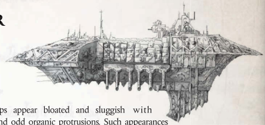

[Hull](starship-anatomy-detailed.md): Light Cruiser

Class: Chaos Pestilaan-class light cruiser

Dimensions: 5 km long, .9 km abeam approx.

Mass: 39 megatonnes approx.

Crew: 50,000 crew approx., plus countless lesser daemons

Acceleration: 2 gravities max sustainable acceleration

A  disturbing predator in the Expanse,  Pestilaan-class ships appear bloated and  sluggish with tarnished, rusted metal, open sores scattered across the hull and odd organic protrusions. Such appearances A  disturbing predator in the Expanse,  Pestilaan-class ships appear bloated and  sluggish with tarnished, rusted metal, open sores scattered across the hull and odd organic protrusions. Such appearances

belie the power of such a vessel, as its very diseased nature [Drives](components-drives.md) the energies that sustain both it and its crew . It is  thought that the Pestilaan class is a long forgotten ancient light cruiser, upgunned and armoured at the price of speed. Most of the Pestilaans are thought to be these once-proud vessels, now debased into unclean servitude after mutiny or capture by the Archenemy . belie the power of such a vessel, as its very diseased nature drives the energies that sustain both it and its crew . It is  thought that the

Speed: 5

Manoeuvrability: +5

Detection:

+10

[Void Shields](components-void-shields.md): 1

[Armour](armour.md):

22

Hull Integrity: 65

Morale: 100

Crew Population:

100

Crew Rating: Competent (30)

Turret Rating: 1

Weapon Capacity:

1 Dorsal, 1 Prow, 1 Port, 1 Starboard

## Essential Components

Retrofitted Saturine-pattern drive, [Warp Drive](warp-drive-rules.md), Malfunctioning Gellar Field, Void Shield Array, Shrine [Bridge](starship-anatomy-detailed.md), Rotting [Crew Quarters](starship-essential-components.md), Fungal Respirators

## Supplemental Components

Port and Starboard Hellus Macrocannon Broadsides: (Macrobattery; Strength 5; [Damage](character-injury.md) 1d10+3; Crit Rating 4; Range 6) Dorsal Melta-cannons: (Macrobattery; Strength 3; Damage 1d10+4; Crit Rating 3; Range 3)

Prow [Torpedo Tubes](components-torpedo-tubes.md): (Torpedo Tubes; Strength 4; Damage 2d10+10; Range 40; Terminal Penetration [1]) These torpedo tubes are loaded with [Virus](weapons-general.md) [Torpedoes](weapons-torpedoes.md) (see page 8) but can be loaded with [Boarding Torpedoes](weapons-boarding-torpedoes.md). This Component has 32 torpedoes.

## Special Rules and Modifier Summary

Plagueship : These vessels are resplendent with the very finest of sicknesses and diseases, to the point where any attempt to enter it is unthinkable. Attempts to board or conduct [Hit and Run](starship-combat-rules.md) attacks on this vessel automatically fail by 1d5+3 Degrees of Failure. Nurgle's Rot : The crew of this ship are all infected with horrific diseases. Whenever this vessel conducts or is the target of a Hit and Run [Attack](combat-attack-rules.md) or Boarding Action, the opponent automatically loses an additional 1d5 [Crew Population and Morale](starship-crew-population-morale.md). There is also a 50% change that some disease will catch, and the ship will suffer a long-term ship sickness ( Rogue TRadeR core rulebook page 227). In this case, the Medicae Test is Very Hard (-30) , and the sickness does its [Damage](character-injury.md) once a week until contained. that some disease will catch, and the ship will suffer a long-term ship sickness ( Rogue R T ogue T ogue R TR T ade R R core rulebook page 227). In this case, R core rulebook page 227). In this case, R , and the sickness does its damage once a week until contained.

*Source:* `Battle Fleet of the Koronus, page 108`
