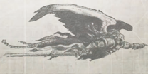

## Auto-séance

0

Any psychic attack that attacks the mind of the psyker must pass an Opposed Willpower Test in order to succeed. If an opposed Willpower Test is already required, the psyker gains a +20 bonus to his Test.

1

2

3

4+

Psychic attacks that attack the mind of the psyker with a Psy Rating of 2 or less are negated.

Psychic attacks that attack the mind of the psyker with a Psy Rating of 3 or less are negated.

Psychic attacks that attack the mind of the psyker with a Psy Rating of 4 or less are negated.

Psychic attacks that attack the mind of the psyker with a Psy Rating of 5 or less are negated. In addition to this, the psyker is also immune to the effects of Fear as long as the power is maintained.

## Table 6-2: Detect Taint

Value:

200xp

Prerequisites:

Inspire

Focus Power Test:

Willpower

Focus Power Time:

Half Action

Range:

Self or 1m x Psy Rating

Sustained:

Yes

Within the Scholastica Psykana and the Adeptus Astra Telepathica, there are many exercises and meditations that are taught to the psykers and Astropaths to enhance their senses and make up for the loss of their sight. In addition, there are also  certain  powers  that  can  enhance  the  mental  clarity  and acuity of the psyker or a nearby ally, giving him a much needed edge in terms of mental awareness. By making a Focus Power Test, the psyker gains a bonus to his Perception characteristic. Should  the  Test  succeed,  the  psyker  gains  a  bonus  to  his Perception that is equal to his Psy Rating plus his Willpower Bonus. In addition, he may also bestow this bonus onto any ally who is within range. This bonus lasts for 1 round.

## Degrees of Success Results

Value:

100xp

Prerequisites: None

Focus Power Test:

Willpower

Focus Power Time:

Half Action

Range:

Self

Sustained: Yes

There are many ways to gain entry into the mind of another person. With this power, those ways become much more limited. The psyker is able to erect psychic defences and bulwarks that help prevent mental attacks. In fact, the psyker is even able to use this power to steel his mind against such events as Fear. The psyker makes a Focus Power Test and the degrees of success determine how much protection is gained by use of this power (see Table 6-1: Mind Ward ). This power may not be made at the Fettered Psychic Strength. The benefits on the table stack.

## Detect Taint

Divination  concerns  itself  with  the  prediction  of  future events,  and  seeing  the  truth  in  the  present.  However,  the warp is extremely fickle, making accurate predictions highly difficult-and often dangerous.

## The Action Again

Value:

200xp

Prerequisites: Psychometry

Focus Power Test:

Psyniscience

Focus Power Time:

Two Full Actions

Range:

special

Sustained:

Yes

Astropaths are far more than mere telepaths. With their psychic abilities  they  are  able  to  peer  into  the  streams  of  time  and space and see events from past, present, and future. A hallmark power taught within the hallowed halls of the Adeptus Astra Telepathica,  the  auto-séance  is  a  power  by  which  the  psyker opens up his mind and analyses the auras and psychic resonances around  him.  Through  this  power,  he  is  able  to  augment  and enhance the powers of another psyker. By doing this, he also acts as a buffer-preventing the worst parts of any psychic feedback or attacks as a result of using other psychic powers. The most common use of the auto-séance is to enhance another psyker's use of Psychometry to read the auras of other objects and to detect any taint of warp-craft or other warp-intrusions. However, it can be used to enhance any power from the Divination Discipline.

When using this power, the psyker clears his mind and makes a Focus Power Test. Should the Focus Power Test succeed, the other psyker that is being enhanced activates any divination power that he knows. If that power succeeds, then that psyker gains a bonus to his Psy Rating equal to half of the Psy Rating of the psyker using the auto-séance power. In addition, up to half of any damage suffered by the other psyker from either the  use  of  other  divination  powers  or  through  any  Psychic Phenomena or Perils of the Warp events may be transferred to the psyker maintaining the auto-séance power.

*Source:* `Battle Fleet of the Koronus, pages 194–195`
