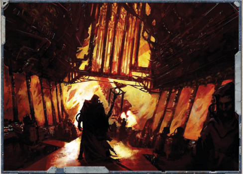

With this power, the Navigator is able to quickly snap open and  close  his  Warp  Eye,  unleashing  a  whip-quick  blast  of energy that immediately sheers flesh from bone. In a gruesome display, a Navigator who knows such powers can reduce an opponent to a pile of steaming bones and quivering meat in a matter of moments!

Novice: To use this power the Navigator makes an Opposed Willpower Test against the Target. Should he achieve more degrees  of  success,  he  does  1d10  Rending  Damage  to  the Target. This damage may be reduced by Toughness, but not by armour (unless warded). In addition to this, the Target is also automatically knocked prone.

Adept: As  per  Novice  except  that  the  damage  is  increased to 1d10 Rending Damage with bonus damage equal to the degrees of success of the Opposed Willpower Test .

Master: As per Novice except that the damage increases to 2d10  Rending  Damage  with  bonus  damage  equal  to  the degrees  of  success  of  the Opposed  Willpower  Test .  In addition to being knocked down, the Target must also make a Pinning Test, unless they are immune to Pinning.

## Beacon

Navigators, by their training, are taught the basics of starship naval combat. Navigators are also able to perceive flickering shadows of possible future events. By peering into the streams of time and space and studying the currents and eddies of the warp, the Navigator can attempt to position his vessel for a more optimum firing solution, angle it such a way that the ship's armour is able to better deflect an incoming attack, or even point the ship in the best direction for a tactical retreat. Novice: The Navigator makes a Difficult (-10) Perception Test. If the Test succeeds, he may add his Intelligence Bonus x5 to any Manoeuvre Action or single Ballistic Skill Test to fire the starship's guns.

Adept: The Navigator can make a Hard (-20) Perception Test. If  the  Test  succeeds,  the  Navigator  may  take  his Intelligence Bonus and divide out the points among any of the following starship characteristics to increase them: Speed or Armour. This increase lasts for 1 Strategic Turn, but the Navigator  cannot  use  this  ability  again  for  the  rest  of  the combat. Should he fail this Test by one or more degrees, the Navigator suffers two levels of Fatigue.

Master: As  per  Adept,  except  that  the  increases  last  for 1d5 Strategic Turns. In addition, using the power at this level is extremely taxing. As such the Navigator gains two levels of Fatigue or four if the Test fails by one or more degrees.

*Source:* `Battle Fleet of the Koronus, pages 192–193`
