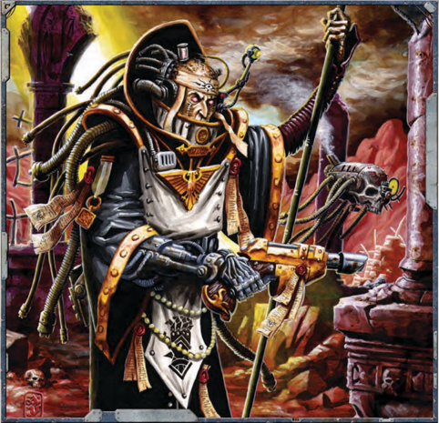

## The Telepathy Discipline

Activation Time:

Free Action.

Maintainable:

Yes.

Range:

1km x [Psy Rating](talents-descriptions.md)

[Focus Power](psychic-techniques-list.md) Test:

No

Power Scale: At [Psy Rating](talents-descriptions.md) 1-2, the psyker can only send or receive verbal communications but no images. At Psy Rating 3-4, the psyker can send or receive visual [Communication](rules-communication.md) as well, but all images will only be in black and white, with a dream-like  quality.  At  Psy  Rating  5-6,  any  images  will  be crisp,  clear,  in  colour,  and  accompanied  by  other  sensory input-sound, taste, etc-as appropriate. At Psy Rating 7+, the  psyker  sends  so  powerfully  that  any  [Communication](rules-communication.md)  at higher  than  the  Fettered  Psychic  Strength  level  will  come across as 'shouting' unless carefully modulated.

Technique Trees:

Communication, Domination

### Basic Technique: Thought Sending

The  psyker  can  send  his  thoughts  into  the  minds  of  those  around him. This can be a select group, either to individuals he can see, or minds he is familiar with within range, or a generalised broadcast to every mind within range indiscriminately at the psyker's  discretion.  Much  of  the  mind's  processes  are  still affected by the structure of Language, so that if telepathy is attempted without a shared Language it suffers a -20 penalty. Minds who do not wish to be open to such a [Communication](rules-communication.md) can resist with an Opposed Willpower test.

### Special Power: Astral Telepathy

Value:

Free (Astropaths only)

Prerequisites:

[Soul-bound](character-traits.md) to the Emperor

[Focus Power](psychic-techniques-list.md) Test:

Willpower

As part of the Soul Binding process, [Astropaths](psychic-psyker-types.md) become able to send and receive messages across vast distances using [The Warp](warp-imperial-space-travel.md)  as  a  medium.  Using  astro-telepathic  abilities  in  this way requires careful concentration, meditation, and freedom from distraction, and so cannot be done 'on the move,' let alone during [Combat](rules-combat-overview.md) or strife. Transmitting a message over interstellar distances normally takes 1d5 hours (this time may be adjusted at the GM's discretion based on the length and complexity of the message).

Astropathic [Communication](rules-communication.md) in this way is a matter of sending and receiving messages that must themselves be encapsulated and encrypted lest they become lost in [The Warp](warp-imperial-space-travel.md), hopelessly garbled, or worse yet, intercepted. As a result, messages sent over long distances are often 'packets' of information, akin in some ways to letters or brief recordings from the real world absorbed and sent on their way to be (hopefully) caught and possibly  relayed  on  by  other  [Astropaths](psychic-psyker-types.md)  to  their  intended destination. This process is not instantaneous. However, it is considerably  faster  than  warp  travel-an  astropathic  signal will  cross  a  solar  system  in  moments,  across  a  subsector  in hours, a sector in days and, if strong enough, a Segmentum in weeks and so on.

An  astropath's  'signal  strength'-broadly  how  far  in average conditions in the warp he may transmit clearly with a successful focused use of his power-is determined by his [Psy Rating](talents-descriptions.md) (see Table 6-5: Astral Signals ). After this distance, unless relayed on, the signal will sharply degrade, imposing a -20 penalty to understand per additional range bracket until it dissolves into nothingness.

Picking up an astropathic [Communication](rules-communication.md) by its intended target within clear range is a Routine (+10) Psyniscience Test for an astropath in a meditative state to receive one, and a  Challenging  (+0)  test  for  one  going  about  ordinary  life, increasing to Hard (-20) if he is in life or death [Combat](rules-combat-overview.md) or other such distracting circumstances.

### Telepathic Communication Techniques

#### Mental Bond

Value:

300 xp

Prerequisites: Mind Link

[Focus Power](psychic-techniques-list.md) Test:

Willpower

Range:

1 km x [Psy Rating](talents-descriptions.md)

With  a  successful  Focus  Power  Test,  the  psyker  can  create a permanent  Fettered Strength telepathic connection to another being. The psyker must succeed at a Difficult (-10) [Focus Power](psychic-techniques-list.md) Test in order to forge the link, and doing so takes  1d5  hours.  If  the  Test  is  failed,  the  psyker  must  start the process again. If he succeeds, a permanent mental link is formed. No effort is needed to establish or maintain the link, it automatically works as long as the psyker and his target are within range of each other and the psyker wishes to engage| Table 6-4: Telepathic Communication Techniques   | Table 6-4: Telepathic Communication Techniques   | Table 6-4: Telepathic Communication Techniques   | Table 6-4: Telepathic Communication Techniques   |                   |
|--------------------------------------------------|--------------------------------------------------|--------------------------------------------------|--------------------------------------------------|-------------------|
| Name                                             | Focus Time                                       | Sustain                                          | xp Value                                         | Focus Power Test  |
| Astral Telepathy                                 | Varies                                           | No                                               | Free                                             | Willpower         |
| [Short Range](combat-special-circumstances.md) Telepathy                            | Half Action                                      | Yes                                              | 100                                              | Willpower         |
| Mind's Eye                                       | N/A                                              | N/A                                              | 200                                              | No                |
| Mind Link                                        | Full Action                                      | Yes                                              | 200                                              | Willpower         |
| Mind Probe                                       | Full Action                                      | Yes                                              | 200                                              | Opposed Willpower |
| Terrify                                          | Full Action                                      | Yes                                              | 200                                              | Willpower         |
| Mind Scan                                        | Full Action                                      | Yes                                              | 300                                              | Willpower         |
| Mental Bond                                      | N/A                                              | N/A                                              | 300                                              | Willpower         |
| Psychic Scream                                   | Half Action                                      | No                                               | 300                                              | Willpower         |

it. The psyker can only maintain one Mental Bond at a time. If the target dies, the bond is dissolved, and the psyker suffers 1d10 Insanity points in the backlash. If the psyker wants to eliminate the bond at any time, he must succeed at a Hard

(-20) Willpower Test .

#### Mind's Eye

Value:

200 xp

Prerequisites: None

[Focus Power](psychic-techniques-list.md) Test:

None

This technique allows the psyker to increase the range of all of his Telepathic communications (with the exception of Astrotelepathy) by a factor of 10. Thus, standard Telepathy would have a range of 10km x [Psy Rating](talents-descriptions.md), [Short Range](combat-special-circumstances.md) Telepathy would be 100m x [Psy Rating](talents-descriptions.md), and so forth.

#### Astropathic Relays

Astropathic relays are techno-arcane installations found both aboard major star vessels and in spires and facilities on important worlds designed to boost an astropath's gifts. Sending and receiving from a relay provides an astropath with the following benefits.

Astropathic Choir: For each astropath in the choir assisting the sending astropath, the sending astropath's [Psy Rating](talents-descriptions.md) for transmission is boosted by +1 to a maximum of +5. However, weaker [Astropaths](psychic-psyker-types.md) are at risk of burn out. If a signal is sent at the Push Psychic Strength, the astropath suffers a +20 on any rolls on the [Psychic Phenomena](psychic-phenomena-table.md) or Perils of [The Warp](warp-imperial-space-travel.md) charts.

Dispersal Scoop: +10 to Psyniscience tests to detect astral signals.

Hexagrammatic Warding: All rolls on the [Psychic Phenomena](psychic-phenomena-table.md) and Perils of [The Warp](warp-imperial-space-travel.md) Charts are at -10. The following table displays the base time for an astrotelepathic message to reach its destination, the distance that such a message travels, the required [Psy Rating](talents-descriptions.md) one needs to send it, and the [Focus Power](psychic-techniques-list.md) [Test Difficulty](rules-tests.md) for doing so.

| Table 6-5: Astrotelepathic Signals   | Table 6-5: Astrotelepathic Signals   |                       |                    |
|--------------------------------------|--------------------------------------|-----------------------|--------------------|
| Time                                 | Distance                             | Required Psy Rating † | Base Difficulty †† |
| Instant                              | Orbit                                | 2                     | Routine (+20)      |
| 1d5 [Rounds](rules-combat-overview.md)                           | Nearby Solar                         | 2                     | Ordinary (+10)     |
| 1d10 [Rounds](rules-combat-overview.md)                          | Distant Solar                        | 3                     | Challenging (+0)   |
| 1d10 Minutes                         | Nearby System                        | 6                     | Difficult (-10)    |
| 1d5 Hours                            | Sub Sector                           | 10                    | Hard (-20)         |
| 1d5 Weeks                            | Sector                               | 15                    | Very Hard (-30)    |
| 1d5 Months                           | Segmentum                            | 18                    | Very Hard (-30)    |

#### Mind Link

Value:

200 xp

Prerequisites: None

[Focus Power](psychic-techniques-list.md) Test:

Willpower

Range:

1km x [Psy Rating](talents-descriptions.md)

A successful [Focus Power](psychic-techniques-list.md) Test allows the psyker to create a Fettered Strength telepathic [Communication](rules-communication.md) link for a number of willing minds up to his Willpower Bonus at the same time. This technique does not require line of sight.#### Table 6-6: Mind Probe

| Round One (Contact)             | The psyker makes initial contact, and learns basic information about the target such as his name, mood, Insanity level, and the state of his physical health.                                                                                                                                                                             |
|---------------------------------|-------------------------------------------------------------------------------------------------------------------------------------------------------------------------------------------------------------------------------------------------------------------------------------------------------------------------------------------|
| Round Two (Surface Thoughts)    | Now the psyker can sense the thoughts uppermost in the target's mind, such as immediate fears/concerns, conscious lies, etc. The target's [Corruption](character-corruption.md) level is also now known to the psyker.                                                                                                                                               |
| Round Three (Short Term Memory) | The psyker can now sort through the target's memories over the last 12 hours. Less casual information the subject may keep as secrets-such as simple passwords or recent experiences he might wish to hide-may also be available at this level.                                                                                           |
| Round Four (Subconscious)       | The psyker now gains detailed information about people, places, or objects that the target considers as important and how they relate to each other. The target's beliefs, motivations and personal goals are known, as any contacts or complicated hidden ciphers. The psyker is also aware of the pivotal moments in the target's life. |
| Round Five (Broken)             | The psyker may plunder the target's mind at will. Any information contained in the target's psyche is an open book for the psyker. The psyker can also use this technique to identify implanted memories or personalities.                                                                                                                |

#### Mind Probe

Value:

200 xp

Prerequisites: None

[Focus Power](psychic-techniques-list.md) Test: Opposed Willpower

Range: 1m x [Psy Rating](talents-descriptions.md)

This  technique  allows  the  psyker  to  peel  back  the  layers of  another's  mind  to  read  the  basic  surface  thoughts  and beyond.

It takes 5 [Rounds](rules-combat-overview.md) of sustained effort to complete the mind probe. The psyker must win an Opposed Willpower Test to successfully establish the forced link to the target's mind. Each Round, the psyker digs successively deeper into the subject's consciousness.  If  the  psyker  wins  the  Opposed  Willpower Test,  he  gleans  certain  information  from  the  target's  mind, depending  on  what  level  of  contact  he  has  achieved  (see Table 6-6: Mind Probe ).  If  the psyker fails the Opposed Willpower Test, the probe is rebuffed, the technique fails, and the  psyker  suffers  one  level  of  [Fatigue](character-injury.md)  for  every  degree  of failure. This is also not a gentle process, brute force is a factor, and the target will be aware that his mind is being plundered. However, the psyker retains any knowledge he received at each level he successfully attained.

If  the  psyker  wants  to  perform  the  Probe  without  the target's knowledge, then the psyker takes a -20 penalty to the Opposed Willpower Test and can only use this technique at the Fettered Psychic Strength.

#### Mind Scan

Value:

300 xp

Prerequisites: Mind's Eye, Mind Probe

[Focus Power](psychic-techniques-list.md) Test:

Willpower

Range:

250m x [Psy Rating](talents-descriptions.md)

The psyker extends his mind to contact and identify other sentient minds within range. This technique does not require line of sight, enabling the psyker to garner impressions and information  about  the  consciousnesses  within  range.  The

information  the  psyker  receives  from  this  technique  is based on the degrees of success from the [Focus Power](psychic-techniques-list.md)

Test:

relation to them.

Two Successes: The psyker knows the number, general location  and  relative  'strength'  of  conscious  minds  within the  area  of  effect,  and  may  determine  if  those  minds  are themselves  psykers  with  a  successful Challenging  (+0) Psyniscience Test .

Three Successes: As  per  two successes, plus the psyker may attempt to initiate telepathic [Communication](rules-communication.md) with any of the minds he has sensed in the area.

Four or More Successes: As per three successes, plus the psyker may attempt to carry out a Mind Probe on one of the minds he has sensed in the area.

[Untouchables](psychic-psyker-types.md),  mindless  creatures-such  as  [Servitors](crew-servitors.md)  or robots-and  other  psychically  inert  creatures  are  invisible to Mind Scan. Also, individuals with the [Resistance](talents-descriptions.md) (Psychic Techniques) Talent inflict a -10 penalty on the Psyker's Focus Power Test  (the  penalty  does  not  stack  with  itself ).  Other creatures or individuals that are resistant to psychic powers may be hidden entirely at the GM's discretion.

#### Psychic Scream

Value:

300 xp

Prerequisites:

Mind Probe

[Focus Power](psychic-techniques-list.md) Test:

Willpower

Range:

5m x [Psy Rating](talents-descriptions.md)

By focusing all of his will behind one massive psychic scream, the psyker can injure or [Stun](weapons-general.md) an opponent out to a range of 5m x [Psy Rating](talents-descriptions.md). The psyker must pass a [Focus Power](psychic-techniques-list.md) Test to hit his target, and deals 1d10 Impact [Damage](character-injury.md) (with a bonus of +1 per Psy Rating) with the [Shocking](weapons-general.md) quality (see page 116). The target suffers a penalty to his Toughness Test to resist Stunning equal to -5 times the psyker's Psy Rating. If the target fails the Toughness Test, he is [Stunned](character-injury.md) for a number of [Rounds](rules-combat-overview.md) equal to half of the psyker's Psy Rating (rounding up).

One  Success: The  psyker  gains  a  crude impression of the number of conscious minds in  his  range  and  his  general  position  in#### [Short Range](combat-special-circumstances.md) Telepathy

Value:

100 xp

Prerequisites: None

Focus Power Test:

Willpower

Range:

10m x Psy Rating

A successful Focus Power Test allows the psyker to establish and  maintain  a  single  telepathic  connection  to  another character at Unfettered Psychic Strength. However, using this ability does not provoke [Psychic Phenomena](psychic-phenomena-table.md).

#### Terrify

Value:

200 xp

Prerequisites:

Mind Probe

[Focus Power](psychic-techniques-list.md) Test:

Willpower

Range:

5m x [Psy Rating](talents-descriptions.md)

By using his psychic abilities to intrude forcefully on another mind, the psyker assails his target with raw [Fear](character-fear-and-damnation.md) and horrific imagery. If the psyker succeeds at the [Focus Power](psychic-techniques-list.md) Test, the target is affected as if the psyker possessed the [Fear](character-fear-and-damnation.md) (1) Trait. The psyker may increase the level of the Fear Trait by 1 for every 3 [Psy Rating](talents-descriptions.md) he uses in the Focus Power Test.

### Telepathic Domination Techniques

#### Beastmaster

Value:

200 xp

Prerequisites: None

[Focus Power](psychic-techniques-list.md) Test:

Opposed Willpower

Range:

5m x [Psy Rating](talents-descriptions.md)

The psyker can establish rudimentary control over animals. He can affect a number of animals (creatures with the [Bestial](character-traits.md) trait) equal to his [Psy Rating](talents-descriptions.md), and if the psyker succeeds at the Opposed Willpower Test, the target animals must follow his psychic commands. Each round, the psyker may spend a Reaction to give a single animal a simple command such as 'Come here', 'Guard me,' '[Run](rules-combat-overview.md),' '[Attack](combat-attack-rules.md),' and so forth. The animal will do its best to follow the command. If the animal feels threatened, becomes injured, or is commanded to act in manner contrary to its nature, it may make a further Opposed Willpower Test against the psyker with a +10 bonus to break free of the psyker's control. How the animal reacts if it breaks free depends largely on how the psyker treated the animal.

#### Compel

Value:

200 xp

Prerequisites:

Delude

[Focus Power](psychic-techniques-list.md) Test:

Opposed Willpower

Range:

5m x [Psy Rating](talents-descriptions.md)

The next level of compulsion, this technique allows the psyker to  force  others  to  briefly  act  against  their  will.  The  psyker makes an Opposed Willpower Test against the target. If the psyker succeeds, the target must follow his commands. The commands must be simple and achievable in one round. Some examples include 'Flee,' 'Fall,' '[Attack](combat-attack-rules.md) the closest target,' and so  forth.  If  the  command  is  a  potentially  suicidal  act,  the target gets a +20 to his Opposed Willpower Test.

#### Delude

Value:

100 xp

Prerequisites: None

[Focus Power](psychic-techniques-list.md) Test:

Opposed Willpower

Range:

1m x [Psy Rating](talents-descriptions.md)

One  of  the  simpler  Telepathic  tricks,  Delude  allows  the psyker to subtly mask his intentions and manipulate others into reacting favourably to him for a short time. The psyker makes an Opposed Willpower Test against the target. If the psyker succeeds, the target will find the psyker to be a person deserving  of  respect  and  react  positively  to  any  friendly overtures he makes. For as long as the psyker maintains this power,  he  gains  a  +30  bonus  to  all  [Interaction](rules-interaction.md)  Skill  Tests against  the  target.  Note  that  this  technique  is  not  'mind control'  as  such  and  the  psyker  cannot  force  others  to  act against their better judgement, harm themselves, nor hide acts of overt hostility by the psyker.

#### Dominate

Value:

300 xp

Prerequisites:

Sensory Deprivation

[Focus Power](psychic-techniques-list.md) Test:

Opposed Willpower

Range:

5m x [Psy Rating](talents-descriptions.md)

The psyker has gained the most infamous power attributed to witches and renegades, the control of another's mind. The psyker makes an Opposed Willpower Test against the target. If the psyker succeeds, the target is controlled as if he were a puppet. For as long as the psyker maintains the power, he can divide his Actions between himself and the target. The dominated target uses its own [Characteristics](starship-anatomy-detailed.md), but at a -10

| Table 6-7: Telepathic Domination Techniques   | Table 6-7: Telepathic Domination Techniques   | Table 6-7: Telepathic Domination Techniques   | Table 6-7: Telepathic Domination Techniques   | Table 6-7: Telepathic Domination Techniques   |
|-----------------------------------------------|-----------------------------------------------|-----------------------------------------------|-----------------------------------------------|-----------------------------------------------|
| Name                                          | Focus Time                                    | Sustain                                       | xp Value                                      | [Focus Power](psychic-techniques-list.md) Test                              |
| Inspire                                       | Half Action                                   | Yes                                           | 100                                           | Willpower                                     |
| Delude                                        | Half Action                                   | Yes                                           | 100                                           | Opposed Willpower                             |
| Beastmaster                                   | Half Action                                   | Yes                                           | 200                                           | Opposed Willpower                             |
| Compel                                        | Half Action                                   | No                                            | 200                                           | Opposed Willpower                             |
| Sensory Deprivation                           | Half Action                                   | Yes                                           | 200                                           | Opposed Willpower                             |
| Dominate                                      | Half Action                                   | Yes                                           | 300                                           | Opposed Willpower                             |
| Puppet Master                                 | Full Action                                   | Yes                                           | 300                                           | Opposed Willpower                             |
| Reprogram                                     | Full Action                                   | Yes                                           | 500                                           | Opposed Willpower                             || Table 6-8: Reprogram   | Table 6-8: Reprogram                                                                                                                                                                                                                                                                                         |
|------------------------|--------------------------------------------------------------------------------------------------------------------------------------------------------------------------------------------------------------------------------------------------------------------------------------------------------------|
| Degrees of Success     | Effect                                                                                                                                                                                                                                                                                                       |
| 1 (Sow Confusion)      | The psyker can shroud a single event or memory in the subject's mind in doubt and mental fog, inflicting a -20 penalty to his recall of facts concerning it.                                                                                                                                                 |
| 2 (Implant Falsehood)  | The psyker can now implant simple information like a false face on a killer in a witness's mind, a false pass code, or any other single sentence's worth of knowledge the subject will now recall as fact.                                                                                                   |
| 3 (Rewritten History)  | The psyker can now alter a single event or series of events in the subject's recent memories to his specification. The subject will now earnestly believe this 'new' version of events to be the truth.                                                                                                      |
| 4 (Sculpt Synapses)    | The psyker can now supplant a single major long term memory or obliterate it entirely, affecting potentially the perception of an entire sequence of events in the subject's lives, and perhaps influencing the subject's personality in the process. This also inflicts 1D5 Insanity Points on the subject. |
| 5+ (Psychic Block)     | In addition to his other workings, the psyker can put in place a basic psychic block that grants the target a +10 bonus to his Willpower Test when resisting Mind Probes. This also conceals the psyker's tampering.                                                                                         |

penalty to all Tests-except Opposed Willpower Tests-due to  the  crudity  of  the  control.  Any  action  deemed  suicidal forces another Opposed Willpower Test to try and break the hold. The range for Dominate counts for both for the initial Test and for ongoing control.

#### Inspire

Value:

100 xp

Prerequisites: None

[Focus Power](psychic-techniques-list.md) Test:

Willpower

Range:

2m x [Psy Rating](talents-descriptions.md)

The psyker can bolster his comrades by sending out waves of reassurance and martial spite. A number of targets equal to the psyker's [Psy Rating](talents-descriptions.md) (including the psyker himself ) may immediately overcome the effects of [Pinning](combat-special-circumstances.md) and gain a +10 bonus to all Willpower rolls to resist [Fear](character-fear-and-damnation.md). This effect lasts as long as the targets stay within range of the psyker and the psyker maintains the power.

#### Puppet Master

Value:

300 xp

Prerequisites:

Dominate

[Focus Power](psychic-techniques-list.md) Test:

Opposed Willpower

Range:

1 km x [Psy Rating](talents-descriptions.md)

This rare and dreaded power takes psychic domination to its final  expression.  The  psyker  makes  an  Opposed Willpower Test against the target-in this Test, the psyker suffers a -10 penalty. If  the  psyker  wins,  the  target's  body  is  completely under his control. The psyker's mind leaves his body behind to take over the victim's body completely, whilst the victim's consciousness is suppressed into a nightmarish dream state. The psyker's own body is vulnerable during this time, as if he were in a deep sleep. The psyker may end this power at any time but suffers 1d5 [Fatigue](character-injury.md) levels for doing so.

The possessed target retains its prior physical [Characteristics](starship-anatomy-detailed.md)  (Weapon  Skill,  Ballistic  Skill,  Strength, Toughness, and Agility), but its mental [Characteristics](starship-anatomy-detailed.md) (Intelligence, Willpower, and Fellowship) are those of the psyker. The psyker in control of the body may use either his skills  or  the  target's  at  a -10  penalty.  Any  action  deemed  suicidal forces another Opposed Willpower Test to try and break the hold.  However,  the  target  is  now  suffering  a  -10  penalty rather than the psyker. Should the target's body be killed, the psyker's  consciousness  is  hurled  violently  out  of  the  dying vessel,  suffering  1d5  [Wounds](character-injury.md)-these  Wounds  bypass  all defences-and 1d10 Insanity Points.

If the distance between the psyker and his victim reaches beyond  the  technique's  range,  the  link  is  severed,  and  the psyker returns to his own body whilst suffering 1d5 Fatigue levels in the process.

#### Reprogram

Value:

500 xp

Prerequisites:

Dominate, Mind Probe

[Focus Power](psychic-techniques-list.md) Test:

Opposed Willpower

Range:

1m

Requiring utmost skill and experience, this technique enables the  psyker  to  enter  into  another  mind  and  completely reprogram the contents, insidiously  reshaping  its  memories and  experiences  as  he  desires.  This  can  be  something  as simple  as  an  engram  designed  to  fool  casual  searches  by other telepaths, or something more crafted and elaborate to remake an entire personality and constructed as 'false self ' the unfortunate victim will believe to be true.

The briefest expression of this power takes 2d5 [Rounds](rules-combat-overview.md). The psyker must win an Opposed Willpower Test against the victim, delving one level deeper into the target's mind with every  two  degrees  of  success.  If  the  target  wins,  he  rejects the  reprogramming  and  forces  the  psyker  out  ending  the procedure and inflicting a [Fatigue](character-injury.md) level on the psyker, who may not re-attempt this technique for 1d5 hours. This is also not a gentle process, and the target will be aware that his mind is being reordered until the reprogramming is successful, at which  point  the  reprogramming  itself  will  be  forgotten  as an event, buried deep in the subject's unconscious mind. For every 2 [Psy Rating](talents-descriptions.md) the psyker uses, he gains a +10 bonus to the Opposed Willpower Test. The effects of Reprogramming are permanent unless they are forcibly broken down (see The Danger of Paradox section). At the end of this process, the psyker's results will depend on the amount of successes he has achieved.

Major Reprogramming: Given extensive time, effort and the malign will to do so, a psyker with this power can freely implant  a  complete  new  personality,  restructure  memories, counterfeit  experience,  and  implant  hate  with  this  ability. However, the level of effort and detailed attention required to do this without overtaxing the psyker and driving the subject mad is far beyond most immediate game use, and requires a minimum of 2d10 hours.

The Danger of Paradox: The mind is a complex thing, and  a  reprogrammed  individual-if  faced  with  evidence of  the  truth,  or  major  discrepancies  between  what  he  has been manipulated into believing and the facts-may break through his reprogramming. If the GM judges such an event occurs, the victim must succeed at a Hard (-20) Willpower Test . If successful, the mental reprogramming breaks down. If the Test is failed, the victim goes on believing what he has been manipulated into thinking is the truth. In either case the mental strain inflicts 1d10 Insanity points on the subject.

#### Sensory Deprivation

Value:

200 xp

Prerequisites:

Compel

[Focus Power](psychic-techniques-list.md) Test:

Opposed Willpower

Range: 10m x [Psy Rating](talents-descriptions.md)

The psyker  has  learned  how  to  block  the  messages  of  the target's senses. The psyker makes an Opposed Willpower Test against  the  target.  If  he  succeeds,  the  target  is  struck  deaf, [Blind](weapons-general.md), and is unable to scent or taste for as long as the psyker maintains the power plus 1d5 [Rounds](rules-combat-overview.md).

This power can also be used as a crude form of effective 'invisibility' allowing the psyker to pass unnoticed to sight or sound. The psyker selects a number of targets equal to his Willpower Bonus and selects which single sense he wishes to suppress. This must be the same sense for each target. Each target  must  make an Opposed Willpower Test. Those that fail notice nothing out of the ordinary, and the sensory information is successfully masked by the psyker until he stops maintaining the power.| Table 6-9: Divination Imperial Tarot Techniques   | Table 6-9: Divination Imperial Tarot Techniques   | Table 6-9: Divination Imperial Tarot Techniques   | Table 6-9: Divination Imperial Tarot Techniques   |                  |
|---------------------------------------------------|---------------------------------------------------|---------------------------------------------------|---------------------------------------------------|------------------|
| Name                                              | Focus Time                                        | Sustain                                           | xp Value                                          | [Focus Power](psychic-techniques-list.md) Test |
| Psycholocation                                    | Half Action                                       | Yes                                               | 100                                               | Psyniscience     |
| Foreshadow                                        | Half Action                                       | No                                                | 100                                               | No               |
| In Harm's way                                     | Free Action                                       | No                                                | 200                                               | No               |
| Augury                                            | Half Action                                       | Yes                                               | 200                                               | Psyniscience     |
| Psychometry                                       | Half Action                                       | Yes                                               | 200                                               | Psyniscience     |
| Divining the Future                               | Full Action                                       | Yes                                               | 200                                               | Psyniscience     |
| Walking the Path                                  | Free Action                                       | Yes                                               | 200                                               | Awareness        |
| Blessed by the Emperor                            | Free Action                                       | Yes                                               | 300                                               | Awareness        |

## The Divination Discipline

Activation Time:

Full Action.

Maintainable: Yes.

Range:

You

[Focus Power](psychic-techniques-list.md) Test:

Psyniscience

Power Scale: At [Psy Rating](talents-descriptions.md) 1-3, the psyker receives images that  are  hazy  and  indistinct.  At  Psy  Rating  4-6,  the  same images are clearer and sharply in focus. At [Psy Rating](talents-descriptions.md) 7+, any images will be crisp, clear, and accompanied by other sensory input-sound, taste, etc.-as appropriate.

Technique Trees:

Emperor's Tarot

### Basic Technique: Aura Reading

Diviners can read a person's aura, the unconscious projection of his being in to [The Warp](warp-imperial-space-travel.md). This is a very pale shadow, beneath the notice of most beings, but the diviner can study this aura to learn about the person.

The psyker  can  attempt  to  read  the  aura  of  any  person he can see as a Full Action. This requires a successful [Focus Power](psychic-techniques-list.md)  Test,  with  every  degree  of  success  providing  more information. A psyker can only maintain this power on one target.  If  he  wishes  to  divine  the  well-being  of  a  different person, he must activate the power again.

If the psyker maintains the power on the same target, he can increase his Degrees of Success by +1 per round cumulatively, eventually getting to the full 3 Degrees of Success.

| Table 6-10: Aura Reading   | Table 6-10: Aura Reading                                                                                                                                                                                                                                                                                                                                                                                                                                                            |
|----------------------------|-------------------------------------------------------------------------------------------------------------------------------------------------------------------------------------------------------------------------------------------------------------------------------------------------------------------------------------------------------------------------------------------------------------------------------------------------------------------------------------|
| Degrees of                 | Degrees of                                                                                                                                                                                                                                                                                                                                                                                                                                                                          |
| Success                    | Result                                                                                                                                                                                                                                                                                                                                                                                                                                                                              |
| 0                          | The psyker gains superficial impressions about the target person. This includes the three strongest emotions the target is currently experiencing, his race, whether or not he has any psychic powers, and a rough idea of his state of mental and physical health (No numbers, just good, poor, weak, etc.). Lastly, it determines if the target is an untouchable-naturally, in this case, the psyker receives no further information, including the effects from this technique! |
| 1                          | The psyker gets all of the information above, plus he gets a deeper insight in to all of the target's feelings, granting a +10 to all Fellowship Tests made against the target while Divination is active. The psyker also gets a better idea about the target's well-being, including current [Wounds](character-injury.md) and [Fatigue](character-injury.md) levels. Finally, if the target is also a psyker, he can sense the target's [Psy Rating](talents-descriptions.md).                                                                            |
| 2                          | The psyker gets all of the above results, plus he can now determine the target's Insanity Points, as well as which addictions or madness he might be suffering from. If the target is a psyker, he can determine which Discipline(s) and Techniques the target possesses.                                                                                                                                                                                                           |
| 3                          | The psyker gets all of the above information, and now he can determine how many [Corruption Points](character-corruption.md) the target might have accumulated. Also, the psyker can determine if the aura is genuine, or has been produced by some other means-technologically, psychically, daemonically, etc.                                                                                                                                                                                               |

### Divination Discipline: the Emperor's Tarot Techniques

#### Augury

Value:

200 xp

Prerequisites:

Foreshadow

[Focus Power](psychic-techniques-list.md) Test:

Psyniscience

Range:

1m

By  reading  the  Emperor's  Tarot  for  a  specific  individual, the psyker can grant insight into what troubles lay ahead. A specific question must be asked, though it can be as detailed as 'What must we overcome to defeat [The Xenos](faction-xenos-overview.md) on Choir?' or as broad as 'How can I turn a greater profit?' After that, the psyker will read the Emperor's Tarot for the subject as they both concentrate on the question asked. At the end of this time, typically 30 minutes-though some readings take longer  to  interpret-the  psyker  makes  a  Psyniscience  Test. Every  two  degrees  of  success  reveals  more  information. However, any rolls on the Psychic Phenemona chart that are provoked from this technique also add +10.| Table Degree of Success   | 6-11: Augury Result                                                                                                                               |
|---------------------------|---------------------------------------------------------------------------------------------------------------------------------------------------|
| 0                         | Opposition: The psyker can determine the greatest opposition that the subject will face.                                                          |
| 2                         | Fears: The psyker also can determine other negative forces that may be in play-the number of these is equal to the [Psy Rating](talents-descriptions.md) used in this power. |
| 4                         | Hopes: The psyker can now determine the greatest advantage or tool the subject has at hand.                                                       |
| 6+                        | Outcome: The psyker may offer a single sentence of advice to the subject about the clearest path to his answer.                                   |

#### Blessed by the Emperor

Value:

300 xp

Prerequisites:

Divining the Future

[Focus Power](psychic-techniques-list.md) Test:

Psyniscience

Range:

5m x [Psy Rating](talents-descriptions.md)

At this level of skill, the psyker has learned how to explore multiple outcomes to different choices and actions, and to be able to sort through them to choose the safest course. The psyker must succeed at a [Focus Power](psychic-techniques-list.md) Test. If successful, the psyker gains a +20 bonus to all Weapon Skill and Ballistic Skill Tests, and Ballistic Skill Tests against him are at a -30 penalty. Additionally, he can shout warnings to his comrades within 5m x [Psy Rating](talents-descriptions.md) and warn them of incoming attacks. Allies beyond this range are outside of the scope of his power to  foresee.  All  Ballistic  Skill  Tests  against  those  so  warned suffer a -10 penalty. This technique may not be used at the Fettered Psychic Strength.

#### Divining the Future

Value:

200 xp

Prerequisites: Augury

[Focus Power](psychic-techniques-list.md) Test:

Psyniscience

Range:

Personal

Divining the Future represents the psyker's growing affinity for the Emperor's Tarot, and his ability to access answers about the future with greater speed and precision. Just like Augury, a specific question must be asked, though it can be as detailed as  'When will Da Wurldbreaka return  to  this  planet?'  or  as broad as 'How can I turn a greater profit?' However the time involved  is  considerably  less-only  one  minute  is  required for a use of this technique. The psyker makes a Psyniscience Test. Every two degrees of success reveals more information. However, any rolls on the [Psychic Phenomena](psychic-phenomena-table.md) chart that are provoked from this technique also add +10.

#### Foreshadow

Value:

100 xp

Prerequisites: None

[Focus Power](psychic-techniques-list.md) Test:

Willpower

Range:

Personal

Peering in to the future for a brief instant, the psyker is able to see possible outcomes and potential dangers. Until the end of the next turn, the psyker gains a +30 bonus to one skill roll. This power must be used at the Unfettered Psychic Strength.

#### In Harm's Way

Value:

200 xp

Prerequisites: None

[Focus Power](psychic-techniques-list.md) Test:

Willpower

Range:

Personal

By taking a deep look into the near future, the psyker can anticipate the actions of his enemies. Until the end of the next turn, the psyker gains a +20 bonus to all Weapon Skill and Ballistic  Skill  Tests.  Moreover,  all  Ballistic  Skill  tests  made against him are at a -20 penalty. This power must be used at the Unfettered Psychic Strength.

#### Psycholocation

Value:

100 xp

Prerequisites: None

[Focus Power](psychic-techniques-list.md) Test:

Psyniscience

Range:

1km x [Psy Rating](talents-descriptions.md)

By succeeding at a Psyniscience Test, the psyker can locate and track down a single object or person in his immediate vicinity.  The  psyker  can  find  anything,  but  there  must  be some degree of familiarity. Touching a lock and trying to find the key to that lock is fine, but just thinking 'I want a key'

| Table 6-12:         | Divining The Future                                                                                                                                                                                                                                                                   |
|---------------------|---------------------------------------------------------------------------------------------------------------------------------------------------------------------------------------------------------------------------------------------------------------------------------------|
| Degree of Success 0 | Result Opposition: The psyker can determine the greatest opposition that the subject will face.                                                                                                                                                                                       |
| 2                   | Fears: The psyker also can determine other negative forces that may be in play-the number of these is equal to the [Psy Rating](talents-descriptions.md) used in this power.                                                                                                                                     |
| 4                   | Hopes : The psyker can now determine the greatest advantage or tool the subject has at hand.                                                                                                                                                                                          |
| 6+                  | Outcome: The psyker may offer two sentences of advice to the subject about the clearest path to their answer. This grants the subject a +10 bonus on a number of Tests equal to the psyker's Psy Rating for the next month or until the question is resolved, whichever occurs first. |#### Table 6-13: Psycholocation Degrees of Success Result

0

The psyker knows the rough direction of the subject.

2

4

The psyker knows the specific direction of the subject, and roughly how far away it is.

The psyker knows the specific direction of the subject, and exactly how far away it is.

without a corresponding lock will not work. In the same vein, the psyker must have seen the person he wants to find-either directly or through some image, painting, etc.-or have the target's true name.

Once  the  psyker  has chosen  a target, he  makes  a Psyniscience Test modified by the following factors:

- Intimately familiar with target (Knows subject well, or · has  an  item  that  has  been  with  the  subject  for  a  long time): +10
- Has a portion of the subject (Fragment from the item, · lock of hair from a person): +5
- Subject is surrounded by others of its kind (a coin in a · coin purse, a person in a crowd, etc.): -10
- Subject is within 50m x Psy Rating: +5 ·
- Subject is over 2 km away: -20 ·

If the psyker passes the Psyniscience Test, and the subject is within range, the psyker receives a rough idea of where the subject is located, based on how many degrees of success he has scored.

#### Psychometry

Value:

200 xp

Prerequisites: Augury

[Focus Power](psychic-techniques-list.md) Test:

Psyniscience

Range:

1m x [Psy Rating](talents-descriptions.md) radius

Learning to read the Tarot is in part the act of learning to divine the Emperor's word from psychic impressions. Refining this skill allows the psyker to learn more about others from the crude psychic traces they leave behind on objects and places in the world around them. In its simplest form, the psyker can gain rough impressions from an object or a general area by maintaining physical contact and making a Psyniscience Test. More  information  beyond  the  strongest  emotions  requires time, and the longer the psyker stays in a given area, the more information  he  can  ascertain.  These  numbers  are  modified by  the  raw  strength  of  the  psyker,  and  he  may  subtract  a number of [Rounds](rules-combat-overview.md) equal to his [Psy Rating](talents-descriptions.md) from each result level. [Example](rules-tests.md): A psyker with Psy Rating 5 will get the first result in 5 [Rounds](rules-combat-overview.md), the second result in 10, etc.

#### Table 6-14: Psychometry

#### Rounds Result

- 10 The  psyker  can  detect  the  strongest  emotion associated with the area or object.
- 20 The  psyker  can  see  the  general  features  of  the person who experienced the emotion
- 30 The psyker gets a clear image of the person who experienced the emotion
- 40 The  psyker is able to identify the person's occupation (e.g. [Career](chargen-stage2-origin-path.md) and Rank)
- 50 The psyker can now determine the name of the person
- +10 The psyker discovers an additional fact about the person as determined by the GM.

#### Walking the Path

Value:

200 xp

Prerequisites:

Divining the Future

[Focus Power](psychic-techniques-list.md) Test:

Psyniscience

Range: Personal (1m x [Psy Rating](talents-descriptions.md))

At this level of skill, the psyker has learned how to explore multiple  outcomes  to  different  choices  and  actions,  and  to be able to sort through them in less than a heartbeat. The psyker must succeed at a [Focus Power](psychic-techniques-list.md) Test. If successful, the psyker gains a +10 bonus to all Weapon Skill and Ballistic Skill Tests, and Ballistic Skill Tests against him are at a -20 penalty-these benefits apply for one round, unless the psyker sustains this technique. Additionally, he can see glimpses of the  dangers  in  his  immediate  vicinity  and  shout  warnings to  his  comrades  within  1m  x  Psy  Rating  to  warn  them  of incoming attacks. Allies beyond this range are outside of the scope  of  his  power  to  foresee.  All  Ballistic  Attacks  against those so warned suffer a -5 penalty. This technique may not be used at the Fettered Psychic Strength.

## The Telekinesis Discipline

Activation Time:

Half Action.

Maintainable: Yes.

Range:

up to 5m x [Psy Rating](talents-descriptions.md)

Focus Power Test:

Willpower/Opposed Willpower

Power Scale: The majority of the power scale in Telekinesis is reflected in the actual power or psychic techniques. However at lower levels (below Psy Rating 4), a psyker's telekinesis will seem tentative; the hold on objects/people will be shaky. At higher levels, this will turn into a rock solid mental force.

Technique Trees:

Telekinetic Force

### Basic Technique: Mind Over Matter

Telekinesis is the ability to move physical objects with force of  will.  The  psyker's  initial  gift  in  Telekinesis  has  several applications. The psyker may lift or move any object within his [Range and Line of Sight](psychic-techniques-list.md) that does not exceed the weight limit of 10 kg x [Psy Rating](talents-descriptions.md). The object may be moved slowly within the range of the power. Objects move far too slowly to be used as an [Attack](combat-attack-rules.md), however. Additionally, this raw lifting ability  does  not  function  on  living  beings,  as  the  smallest movements tend to unbalance the psyker's mental focus. Once an object is released from Telekinesis, it begins to slowly settle back to earth as the last vestiges of the power leave it.

A more forceful approach can be taken with lighter objects, weighing up to 5 kg x [Psy Rating](talents-descriptions.md). These may be accelerated with greater speed and force, out to a maximum of 5 metres x Psy Rating. To hit a target, the psyker makes a Ballistic Skill Test. [Damage](character-injury.md) is equal to 1d10 Impact [Damage](character-injury.md) plus 1 point per 5 kg of the missile's weight.

Lastly, the psyker can direct a sharp wave of force against a target to shove it away. The psyker must make an Opposed Test, pitting his Willpower against the target's Strength. If the psyker wins, he knocks the target to the ground and pushes it away a number of metres equal to his Psy Rating.

### Telekinesis Discipline: Telekinetic Force Techniques

#### Precision Telekinesis

Value:

100 xp

Prerequisites: None

[Focus Power](psychic-techniques-list.md) Test:

Willpower

Range:

5m x [Psy Rating](talents-descriptions.md)

Unlike the first gross manipulations of Telekinesis, this allows the psyker to fine tune his ability until he can do anything at range that he could do with his bare hands. In any situation where  the  task  in  question  would  require  a  Characteristic Test, the psyker substitutes Willpower instead. The psyker's [Psy Rating](talents-descriptions.md) substitutes for his Strength Bonus when using this technique.

#### Force Bolt

Value:

100 xp

Prerequisites:

None

[Focus Power](psychic-techniques-list.md) Test:

Willpower

Range:

10m x [Psy Rating](talents-descriptions.md)

The psyker can hurl a bolt of force at an opponent. The psyker makes a Ballistic Skill Test to hit the target, and deals 1d10 Impact [Damage](character-injury.md) with a bonus of +2 [Damage](character-injury.md) per [Psy Rating](talents-descriptions.md).

#### Telekinetic Crush

Value:

200 xp

Prerequisites:

None

[Focus Power](psychic-techniques-list.md) Test:

Opposed Willpower

Range:

10m x [Psy Rating](talents-descriptions.md)

The psyker can wrap a target in crushing bands of force. Make an Opposed Test, pitting the psyker's Willpower against the target's Toughness. If the psyker wins, he may inflict 1d10 Impact [Damage](character-injury.md) with a bonus of +1 [Damage](character-injury.md) per [Psy Rating](talents-descriptions.md). The psyker may also [Grapple](rules-combat-overview.md) the opponent (see page 240), substituting his Willpower bonus for his Strength bonus.

#### Telekinetic Weapon

Value:

200 xp

Prerequisites:

Force Bolt

[Focus Power](psychic-techniques-list.md) Test:

Willpower

Range:

Personal

Shaping  the  force  of  the  psyker's  mind  into  a  blade  of  destructive force, the Telekinetic Weapon is a powerful manifestation of

| Table 6-15: Telekinetic Force Techniques   | Table 6-15: Telekinetic Force Techniques   | Table 6-15: Telekinetic Force Techniques   | Table 6-15: Telekinetic Force Techniques   | Table 6-15: Telekinetic Force Techniques   |
|--------------------------------------------|--------------------------------------------|--------------------------------------------|--------------------------------------------|--------------------------------------------|
| Name                                       | Focus Time                                 | Sustain                                    | xp Value                                   | [Focus Power](psychic-techniques-list.md) Test                           |
| Precision Telekinesis                      | Half Action                                | Yes                                        | 100                                        | No/Willpower                               |
| Force Bolt                                 | Half Action                                | No                                         | 100                                        | Willpower                                  |
| Telekinetic Crush                          | Half Action                                | No                                         | 200                                        | Opposed Willpower                          |
| Telekinetic Weapon                         | Half Action                                | Yes                                        | 200                                        | Willpower                                  |
| Telekinetic Shield                         | Half Action                                | Yes                                        | 200                                        | No                                         |
| Force Shards                               | Half Action                                | Yes                                        | 400                                        | Willpower                                  |
| Storm of Force                             | Full Action                                | Yes                                        | 500                                        | Willpower                                  |the psyker's discipline and control. The Telekinetic Weapon counts as a [Sword](weapons-general.md) in the hand of the psyker, but there is no penalty for lacking the required Weapon Training Talent.

To strike  with  the  Psychic  Weapon,  the  psyker  makes  a Weapon Skill Test-the Telekinetic weapon may be parried, but is not destroyed by [Weapons](weapons-general.md) with the Power Field quality (see  page  116).  If  the  weapon  hits,  it  does  1d10  Rending [Damage](character-injury.md)  with  a  bonus  of  +1  [Damage](character-injury.md)  per  Psy  Rating. Additionally, the weapon has a Penetration value equal to the psyker's [Psy Rating](talents-descriptions.md).

#### Telekinetic Shield

Value:

200 xp

Prerequisites:

Telekinetic Crush

[Focus Power](psychic-techniques-list.md) Test:

Willpower

Range:

Personal

The psyker can create a field of telekinetic energy for selfdefence. The form-fitting shield grants the psyker 1 point of AP per [Psy Rating](talents-descriptions.md)-this technique lasts for one round unless the  psyker  chooses  to  sustain  it.  This  protection  counts  as [Armour](armour.md) on every location that stacks with any other [Armour](armour.md) the  psyker  may  be  wearing.  The  shield  is  not  opaque  and does not block line of sight. The defence provided by this power will also work against attacks with [The Warp](warp-imperial-space-travel.md) Weapon quality.

#### Force Shards

Value:

400 xp

Prerequisites : Precision Telekinesis, Telekinetic Weapon

[Focus Power](psychic-techniques-list.md) Test:

Willpower

Range:

5m x [Psy Rating](talents-descriptions.md)

This  technique  is  an  elegant  manifestation  of  the  psyker's killing  will  in  the  form  of  multiple  hovering  blades  of destructive force, visible as hazy distortions in the air. When activated,  the  psyker  brings  a  number  of  force  shards  into existence  equal  to  his  Willpower  Bonus.  The  force  shards hover  around  the  psyker,  acting  as  a  potential  barrier  to incoming attacks. Any opponent attacking the psyker when he  has  one  or  more  force  shards  orbiting  suffers  a  -10  to Weapon Skill or Ballistic Skill tests. The force shards can be launched singly or as a group at ranged targets. The psyker makes a Ballistic Skill Test to hit the target, and deals 1d10 Rending [Damage](character-injury.md) with a bonus of +1 [Damage](character-injury.md) per [Psy Rating](talents-descriptions.md). For every Degree of Success, the psyker hits his target with an additional force shard, up to the total amount of shards generated  by  this  technique.  Additionally,  the  force  shards have a Penetration value equal to the Psy Rating used in the technique.

#### Storm of Force

Value:

500 xp

Prerequisites:

Telekinetic Weapon

[Focus Power](psychic-techniques-list.md) Test:

Willpower

Range:

5m x [Psy Rating](talents-descriptions.md) radius

The psyker has developed his powers to the furthest reaches. He  can  generate  a  Rain  of  force  bolts  that  can  smash  his enemies in a savage storm of psychic fury.  The  psyker  can pick out a number of targets equal to his [Psy Rating](talents-descriptions.md) for each round that he maintains this power. The psyker must make a Ballistic Skill Test to hit each of the targets, and deals 2d10 Impact [Damage](character-injury.md) with a bonus of +2 [Damage](character-injury.md) per Psy Rating. No target may be hit more than once a round.

*Source:* `Roguetrader Corerulebook, pages 163–173`
