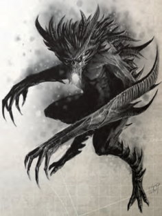

'…And I beheld [The Warp](warp-imperial-space-travel.md) in the burning nothingness of its eyes and fell to my knees and wept, my faith gone asunder, cursing the name of the mother that gave birth to me for the truth of existence is too terrible to know…'

-From the Canticle of Shebanus the Fallen

B eyond our physical reality lies [The Warp](warp-imperial-space-travel.md), a turbulent and ever-shifting cosmos of unreality and raw energy shaped not by paltry physical laws, but by fathomless insanity and echoing impulse and possibility; it is this very realm of madness ships must travel through to leap interstellar distances, and dwelling within its depths are entities fashioned from the stuff  of  nightmares  and  bounded  by  no  law  save their hungers.

## Warp Predator (ebon Geist)

These near-mindless creatures are animalistic predators whose hunger for life is boundless. They are drawn to the soul sparks of mortal life like sharks to bloody water. Such a predator is the Ebon Geist, a thing blacker than the emptiest void, a killing

## The Daemon

The shapes and blasphemous hungers that a daemon might exhibit are without number, and literally thousands  of  different  manifestations  are  recorded within the restricted archives of the Ordo Malleus of the  Imperial  Inquisition.  Many  reflect  the  nature  of their patrons among the powers of Chaos, acting as foot soldiers in the legions of hell, while others represent the congealed stuff  of  mankind's  worst  fears  and  hidden evils, and the lingering nightmares of alien races long since gone to dust. Regardless of their shape daemons are  formed from the pure substance of [The Warp](warp-imperial-space-travel.md) and cannot  maintain  their  grip  readily  on  our  universe without the aid of bloodshed, misery, and death.

shadow, thin and writhing that can pass through dark spaces as insubstantial as a nightmare fading into forgetfulness. The geist murders with its chill talons leaving noting but bodies consumed to desiccated husks, the screaming shadows of its victims cold-burned into the [Hull](starship-anatomy-detailed.md) where they perished.

| Ebon Geist Profile   | Ebon Geist Profile   | Ebon Geist Profile   | Ebon Geist Profile   | Ebon Geist Profile   | Ebon Geist Profile   | Ebon Geist Profile   | Ebon Geist Profile   |     |
|----------------------|----------------------|----------------------|----------------------|----------------------|----------------------|----------------------|----------------------|-----|
| WS                   | bS                   | S                    | T                    | Ag                   | Int                  | Per                  | WP                   | Fel |
| 36                   | -                    | 36                   | (8) 40               | 45                   | 14                   | 45                   | 42                   | --  |

Movement:

8/16/24/48

[Wounds](character-injury.md): 18

Skills: [Dodge](rules-combat-overview.md)  (Ag),  Psyniscience  (Per),  Concealment  (Ag) +20, Silent Move (Ag) +20.

Talents: Heightened  Senses  (all),  Swift  [Attack](combat-attack-rules.md),  [Lightning Attack](talents-descriptions.md).

[Traits](character-traits.md): Consume  Life†,  [Daemonic](character-traits.md)  (TB  8),  Dark  Sight, Daemonic Presence, [Fear](character-fear-and-damnation.md) (2), Flyer (12), From Beyond, [Hard Target](talents-descriptions.md), Phase, [Toxic](weapons-general.md), Unnatural Agility (×2), Unnatural Speed (×2), Warp Instability.

Daemonic Presence: All creatures within 20 metres take a -10 penalty to Willpower Tests as the air seems to darken, the temperature plunges and savage whispers echo from the shadows.

†Consume Life: For every sentient, living creature the Ebon Giest  kills  it  immediately  recovers  1d5  lost  [Wounds](character-injury.md)  (this cannot take it above its starting total).

[Weapons](weapons-general.md): Chill  talons  (1d10+3  R,  Tearing,  Toxic,  Warp Weapon)

*Source:* `Roguetrader Corerulebook, page 379`
