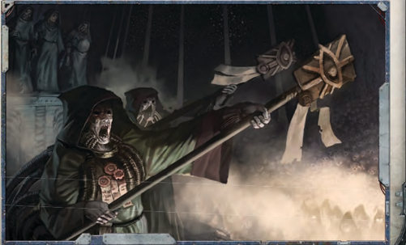

## Astropaths

The great sweep of The Imperium of Man far outstrips the reach of  normal  communications  in  [Size](character-traits.md)  and  breadth.  Astropaths are  capable  of  broadcasting  and  receiving  messages  across the  vastness  of  space,  although  a  message  may  be  delayed, mangled or even lost by the turbulence of warp space. By their powers, the astropaths can do what no others can; reach beyond the limits of time and space to allow humanity to continue communicating between its scattered domains in the vastness of interstellar space. At times the [Availability](economy-availability-rules.md) of an astropath has determined whether entire worlds have lived or died, and whether millions  have  survived  in  the  glorious  light  of  the Emperor, or fallen to the [Darkness](combat-special-circumstances.md) of humanity's enemies. In the nightmare depths of the empyrean, the astropaths listen to the missives of mankind, and occasionally, those of a viler cast, braving terrible and constant danger to their sanity and souls in order to allow the Imperium to function as a coherent entity. The Adeptus Astra Telepathica oversees the arduous task of recruiting and training astropaths in service to the Imperium, and regulating their number in operations.

Astropaths themselves are born with the psyker's gift; taken by the Inquisitional Black Ships and selected-owing to the nature  of  their  gifts  and  other  arcane  criteria-to  become astropaths,  by  undergoing  years  of  training  and  extensive indoctrination culminating in a techno-arcane ritual initiation called 'soul binding' to the God Emperor. This process is what makes an astropath what he is, and without it there would be no astropaths. The benefits of the soul binding are that it allows the astropaths some safety while opening their minds to [The Warp](warp-imperial-space-travel.md)'s currents in communications from afar, and sifting the truth from the psychic static and perilous lies whispered beyond, and projecting their own messages into that void to be heard by others of their own kind. The soul binding is not without its price however, and despite the quality of candidates selected  and  their  extensive  preparation,  not  all  survive  or retain their sanity . Those that do are almost all permanently [Blinded](character-injury.md) by the ordeal, although in most cases their abilities more than make up for this deficiency, and others might never know, but for their disturbing whited-out eyes or in some cases, empty, shrunken eye sockets. What the soul binding does on a fundamental level is combine the psyker's own abilities with the merest fraction of those of the Emperor which transforms him and protects him in a way that makes the astropath unique among human psykers.

## Imperial Sanctioned Psykers

Psykers that are strong enough to be trained to control their abilities are all indoctrinated into service to the Imperium in some way, according to the nature of their gifts and raw power. Their survival was made possible by a stringent processes of selection, indoctrination, and training known as sanctioning; a  process  similar  to,  but  nowhere  near  as  thorough  or  allencompassing as the soul binding an astropath must endure, nor as secure. Sanctioning exists both to weed out the weak and  the  already  corrupted  as  well  as  to  determine  what shape the psyker's future will take in the Imperium's grand design. Some will serve The Administratum, others the vastforces of the Imperial military or as vassals to The Adeptus Astra Telepathica or even be assigned to the households of powerful  members  of  the  Imperial  nobility.  It  is  also  not unheard  of  for  certain  agents  of  the  Imperium  to  serve  in a far less restricted fashion due to their strength of will or training, most infamously, for those of supreme iron will, the Holy Inquisition. Rumours persist that a few Rogue Traders over the millennia have been psykers as well, although such individuals have been rare. The teachings of the Scholastica Psykana can vary greatly however, both in their purpose and effect, and no image of the psyker in service to the Emperor should be considered definitive; [The Warp](warp-imperial-space-travel.md)'s perils, as well as human vice and weakness, have undone many.

Rules  for  playing  Sanctioned  Psykers  can  be  found  in detail in the daRk HeResy Role Playing Game.

## Navigators

This hereditary line of [Abhumans](equipment-abhumans.md) serves the Emperor and the Imperium  by  using  their  innate  ability  to  visually  perceive the  treacherous  shoals  and  stormy  courses  of  the  warp,  via a psychic 'warp eye' which often itself manifests as a visible [Mutation](character-mutations-list.md).  They  are  not  psykers  in  the  standard  sense,  but rather the inheritors of a specifically engineered ability whose true nature is not fully understood, even by those who possess it. Their gifts allow them to [Peer](talents-descriptions.md) into the same Immaterium beheld by those gifted with psychic prowess but with singular purpose and acuity, enabling them to actively navigate a ship through [The Warp](warp-imperial-space-travel.md) itself with a skill unmatched by psyker or machine alike. Their noble houses form an ancient Imperial institution known as the Navis Nobilite, which has close ties to  every  major  aspect  of  wider  Imperial  society,  from  The Imperial Navy, to The Adeptus Mechanicus and the diverse mercantile powers of the Imperial Commercia, to those brash and infamous explorers of the unknown, the Rogue Traders.

## Latent Psykers

Across the breadth of the Imperium and indeed beyond it, there are individuals whose psychic abilities, while present, have not fully manifested. They may have seen some changes in  their  personal  [Fortune](chargen-stage2-origin-path.md)  at  a  small  level,  been  subject  to strange  premonitions,  or  indeed,  been  haunted  by  dark and otherworldly influences. Depending on their place and society others may see them as lucky or accursed, or the mark of [The Warp](warp-imperial-space-travel.md) upon them may have gone unnoticed, and their latent abilities may never reach their flowering, for good or ill. Unfortunately these latent psykers walk a daily precipice whether they know it or not, as [The Warp](warp-imperial-space-travel.md) and the hungering creatures that inhabit it will often be attracted to feed upon these untrained souls or worse yet, to use them as a gateway to enter the physical world if they can. For this reason Imperial authorities and the Holy Ordos are always on the look out for these latent psykers, handing them over to the infamous Black Ships that patrol the Imperium and return their harvest for processing.

## Sacrifices

The  Black  Ships  of  the  Inquisition  sweep  up  great  tides  of psykers as they ply their way across the Imperium. The vast majority of the psykers gathered in this way are found to be too weak and pliant in soul to stand against the [Corruption](character-corruption.md) of [The Warp](warp-imperial-space-travel.md). They are passed to the care of the Adeptus Astronomica. This august body helps the Emperor maintain [The Astronomican](warp-travel-navigation.md), the great psychic beacon of Terra. By burning the very stuff of

their  souls,  the  Astromonican's martyrs power the Emperor's Golden Throne, sending astral light flaring through the warp. By providing a single fixed point, the Astronomican forms a vital  part  of  warp  travel,  allowing  Navigators  to  effectively triangulate  their  position.  Perhaps  a  thousand  such  martyrs are sacrificed to the Emperor in this manner each day. Most consider this a small price to pay in return for the protection and guidance offered by the Master of Mankind.

## Renegade Psykers

There are psykers who manage to exist without the benefits of Imperial Sanction, both some few who manage somehow to evade the authorities and those born either in outlaw or isolated communities or on worlds completely outside of the Imperium. The majority of these die  through  the  perils  of their burgeoning condition, but some few manage to survive the full manifestation of their powers and gain some measure of control. Known by many names; witch, [Renegade](chargen-stage2-origin-path.md), wyrd, hellspawn  and  worse,  these  psykers  rarely  can  match  the control or mental stability of those who have benefited from Imperial Sanctioning, but some are frighteningly powerful, and their services are often highly sought after by those of nefarious purpose. A careful [Renegade](chargen-stage2-origin-path.md) psyker might be able to exist for some time before calling ruin down upon himself and  his  companions-if  they  are  sane  enough  to  try  and blend in.  But  in  the  end,  the  only  sure  way  to  safeguard's one soul is in service to the Emperor, and the renegade lives always in danger from the [Darkness](combat-special-circumstances.md) beyond as much as from the mob that would burn him for a witch.

## Sorcerers

There  are  those  psykers  who  have  given  themselves  over body  and  soul  to  the  dark  realms  beyond;  warp  witches, sorcerers, the possessed and worse. In these individuals-be they tortured victims of their own gifts, power-crazed cultleaders  or  sadistic  megalomaniacs  who  view  humanity  as puppets to dance for their pleasure-the worst nightmares of the Imperium become horrific truth. They are living conduits to [The Warp](warp-imperial-space-travel.md), daemon-summoners and the sworn servants of the Ruinous Powers of Chaos. The powers of these children of [Darkness](combat-special-circumstances.md) are many and often savage, fuelled by bloodshed, and utterly corrupted and poisonous.

## The Scholastica Psykana

The Scholastica Psykana serves as the primary source of instruction for all psykers who exist as a lawful part of the Imperial society. Those trained by the Scholastia Psykana  are  expected  at  all  times  to  honour  their painfully learned lesions and be watchful in themselves for any deviance or [Corruption](character-corruption.md) and die by their own hands if needs be; such is the scared burden they must bear. Their code of conduct is ingrained from the first lessons, and it doesn't cease even after the student has left the Schola.

## Xenos Psykers

Outside of humanity's multitudes there are also alien races  who  possess  psykers  of  their  own,  although  in  often staggeringly different forms and ranges of ability than their human counterparts;  from  the  brutish,  thunderous  force  of the  ork  'weirdboyz'  to  the  nightmarish  psy-arcana  of  the mysterious  fra'al.  Of  these,  the  ever-dwindling  number  of warlocks and farseers of the insidious eldar are known to be among the most subtle and powerful, but also caged by ritual and [Fear](character-fear-and-damnation.md) lest they be consumed by their own race's primordial sins. Their mastery of the psyker's arts is measured by long and cautious centuries and most will never attain the brief, bright-burning power of the humans they so scorn.

## Untouchables

Untouchables  are  individuals  who  have  no  warp  signature. They are  not  psykers-in  fact,  they  are  completely  the  opposite. Their presence frequently acts as a damper on psychic activity, lessening or even completely halting its effects. Untouchables, like psykers, actually have different grades of 'ability,' though few savants have actually been able to study them closely due to  their  extreme  rarity .  Their  strange  aura  makes  most  folk uncomfortable  around  them,  and  for  this  reason  they  are often loners, outcasts, and pariahs.

*Source:* `Roguetrader Corerulebook, pages 155–157`
