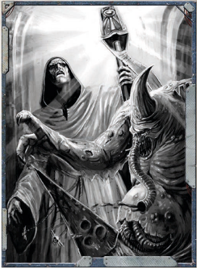

## Banishment

Activation Time: Full Action

Maintainable: Varies by technique

Range: a 1 km x Psy Rating radius around the psyker

Focus Power Test: Psyniscience

Power Scale: At Psy Rating 1-3, the psyker is able to detect psychic  disruptions  and  warp  disturbances,  however  the direction of these events are hazy and the psyker only knows that they are being used in the area around him. At Psy Rating 4-6, these feelings become clearer and the psyker is able to determine if they are coming from in front of him or behind him. At Psy Rating 7+, the psyker is able to pin-point the source of the disturbances with accuracy.

Technique Trees:

Warp Manipulation

## Rebuke the Mutant

Theosophamers are able to detect the small and fragile cracks that exist between the material world and the Immaterium. This  includes  gateways  and  passages,  and  also  daemonic incursions  and  uses  of  psychic  powers  that  draw  upon  the very realm of Chaos.

As a Full Action, the psyker is able to focus his concentration upon the area  around  him  and  determine  if  any  gateways, portals,  or  channels  exist.  Use  of  this  technique  requires  a Focus Power Test, with every Degree of Success narrowing the  direction  of  the  breach  down  as  follows:  1  Degree  of Success  allows  the  psyker  to  determine  that  some  kind  of breach exists within range, 2 Degrees of Success narrows the direction down to front or back, and 3 Degrees of Success or more allows the psyker to pinpoint the direction. This power can also be used to detect if the warp has been breached by an incursion, however, the psyker must be near the incursion site within 1d5 minutes of the event from occurring (possession, warp gates, etc).

If  the  psyker  maintains  the  power  in  the  area,  he  can increase his Degrees of Success by +1 per minute the power is  maintained,  eventually  gaining  the  needed  number  to pinpoint any type of incursion or breach.

## Sanctuary

Many of the  techniques  listed  in  this  section  refer  to  the  psyker's soul-bond. In fact, this specifically refers to Astropaths and their  soul-bond  with  the  God-Emperor,  as  Astropaths  can learn to tap into their bond with the Master of Mankind for use against the unholy daemon. Psykers other than Astropaths who might make use of Theosophamy have found a way to tap into their boundless faith in the God-Emperor and use that  power  to  stand  against  the  horrors  of  the  warp. This  can  include  Sanctioned  Psykers,  Inquisitors, and other psykers of the Imperium.## Seal the Breach

Masters of Theosophamy are relatively common in the Koronus Expanse. The Astropaths referred to as Transubstantial Initiates are particularly drawn to Theosophamy .

## Soul of Adamantium

Value:

500xp

Prerequisites:

Seal the Breach

Focus Power Test:

Opposed Willpower

Focus Power Time:

Full Action

Range:

5m x Psy Rating

Sustained:

No

By  tapping  into  the  ability  to  sense  tenuous  connections between  the  warp  and  warp-entities,  the  psyker  is  able  to attack the ties and create a discordant resonance within them. Banishment disrupts  the  connection  between  daemons  and the warp, and thus only affects target with the Daemonic Trait (or creatures determined to be warp-entities by the GM). To use the power, the psyker makes an Opposed Willpower Test against the target. For every Degree of Success on the Focus Power Test, the target takes 1d10 points of damage, ignoring armour and Toughness. Should the psyker win the Test by 5 or more Degrees of Success, the entity is flung screaming back into the warp, and is utterly destroyed!

## Warp Weapon

Value:

200xp

Prerequisites:

None

Focus Power Test:

Psyniscience

Focus Power Time:

Half Action

Range:

10m x Psy Rating (max. 50m)

Sustained:

Yes

The foul mutant cannot bear to stand against he who has stood before the God-Emperor. Those who dare gaze upon him have their  own  imperfections  reflected  back  upon  them;  only  the most corrupt and stalwart can stand against this. When using this technique, the psyker opens himself up to the currents of the warp and acts as a mirror, revealing to the viewer what he truly is. This technique only affects individuals with mutations (including minor ones) and Navigators-who are themselves mutants. It does not affect abhumans and aliens. A successful Focus Power Test grants the psyker the Fear (1) Trait against those affected by the technique. Each turn they begin within 10 metres of the psyker, they must make a Hard (-20) Willpower Test or take 1d10 R damage as their tainted body rebels. This damage is not reduced by armour or Toughness.

*Source:* `Battle Fleet of the Koronus, pages 198–199`
