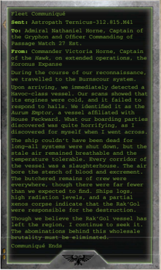

[Hull](starship-anatomy-detailed.md): Transport

Class: Xenos vessel

Dimensions: 2 km long, 0.6 km abeam at widest point, approx.

Mass: 9.4 megatons approx.

Crew: Unknown number of xenoforms

Accel: 1.8 gravities max sustainable acceleration

Very rarely found alone, the 'Butcher' is used on the rare occasions when [The Rak'gol](faction-rakgol-overview.md) [Attack](combat-attack-rules.md) planetary targets. While Very rarely found alone, the 'Butcher' is used on the rare occasions when the Rak'Gol attack planetary targets. While

capable of assisting in [Combat](rules-combat-overview.md), these starships are relatively poorly armed and lightly capable of assisting in combat, these starships are relatively poorly armed and lightly

armoured. Their slow speed and lack of manoeuvrability exacerbates the issue. In combat, they prefer to stand off from the main fight and inundate their opposition with swarms of [Small Craft](attack-craft-small-craft.md) and [Boarding Torpedoes](weapons-boarding-torpedoes.md). Once opposition is eliminated, they enter low orbit over a target world and mercilessly pound targets with warhead swarms while launching waves of assault craft. armoured. Their slow speed and lack of manoeuvrability exacerbates the issue. In combat, they prefer to stand off from the main

Speed: 5

Manoeuvrability: -5

[Void Shields](components-void-shields.md): 1

[Armour](armour.md):

16

Morale: 100

Crew Population:

100

Turret Rating: 4

Weapon Capacity: 2 Prow, 2 Keel

## Essential Components

'Stutter' Class Fission-pulse Drive, Xenos [Warp Drive](warp-drive-rules.md), Warp Charms, [Single Void Shield Array](starship-essential-components.md), Clutchmaster's [Bridge](starship-anatomy-detailed.md), Rad Fume Sustainer, Brood-warren, Void-watcher

## Supplemental Components

Prow [Howler Cannons](weapons-howler-cannons.md): (Macrobattery; Strength 7; [Damage](character-injury.md) 1d5+3; Crit Rating 5; Range 4)

Prow [Clanger Torpedo Tubes](weapons-clanger-torpedo-tubes.md): (Torpedo Tubes; Strength 2; Damage 2d10+10; Range 40; Terminal Penetration [2]) These [Torpedo Tubes](components-torpedo-tubes.md) are loaded with [Boarding Torpedoes](weapons-boarding-torpedoes.md) and follow all the rules for boarding torpedoes (page 8). This ship carries 20 [Torpedoes](weapons-torpedoes.md).

2 Keel [Landing Bays](components-landing-bays.md)

(Launch Bay; Strength 2) Each bay holds three [Squadrons](squadrons-overview.md) of Bloodflayers for six total.

Warrior Brood-warrens:

This ship gains a +10 on any Command Tests made as part of a Boarding Action.

## Modifier Summery

The following modifiers apply to the Invader: -10 on all Silent Running Tests.

Detection:

+8

[Hull](starship-anatomy-detailed.md) Integrity:

35

Crew Rating:

Competent (30)

*Source:* `Battle Fleet of the Koronus, page 99`
