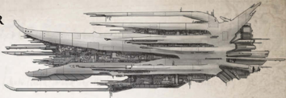

[Hull](starship-anatomy-detailed.md): Light Cruiser

Class: Xenos light cruiser

Dimensions: aprox 3.1 km long, 1.2 km abeam

at widest point, approx.

Mass: 18 megatons approx.

Crew: Unknown number of xenoforms

Accel: 5 gravities max sustainable acceleration

'Manglers' vessels are full sized warships.  These (mercifully rare) ships are generally found accompanied by at least one to three Butchers or Maulers. In a few rare instances, Manglers have led larger [Squadrons](squadrons-overview.md). The examples that have been identified share a common core design and armament, but vary significantly in their architecture. This may be due to extensive repairs or may indicate that they were designed by different artisans. Thus far, only Manglers are large enough to mount Rak'Gol lance [Weapons](weapons-general.md). 'Manglers' vessels are full sized warships.  These (mercifully rare) ships are generally found accompanied by at least one to three

These warships, especially when accompanied by a support squadron, are fully capable of launching a planetary assault against  smaller  colonies.  In  addition,  the  wings  of  assault  craft  in  concert  with  their  beam  weapons  can  be  an  absolutely devastating combination against any but the largest of vessels.

Speed: 7

Manoeuvrability: +1

Detection:

+12

[Void Shields](components-void-shields.md): 1

[Armour](armour.md):

17

Hull Integrity:

55

Morale:

100

Crew Population:

100

Crew Rating: Crack (40)

Turret Rating: 5

Weapon Capacity: Dorsal 2, Keel 1, Prow 1

## Essential Components

'Stutter' Class Fission-pulse Drive, Xenos [Warp Drive](warp-drive-rules.md), Warp Charms, [Single Void Shield Array](starship-essential-components.md), Clutchmaster's [Bridge](starship-anatomy-detailed.md), Rad Fume Sustainer, Brood-warren, Void-watcher

## Supplemental Components

2 Prow [Howler Cannons](weapons-howler-cannons.md): (Macrobattery; Strength 7; [Damage](character-injury.md) 1d5+3; Crit Rating 5; Range 4)

Prow [Roarer Beam](weapons-roarer-beam.md):

(Lance; Strength 3; Damage 1d10+1; Crit Rating 3; Range 5)

Keel Landing Bay:

(Launch Bay; Strength 2) This bay holds three [Squadrons](squadrons-overview.md) of Bloodflayers.

## Modifier Summary

The following modifiers apply to the Reaver: -10 on all Silent Running Tests.

*Source:* `Battle Fleet of the Koronus, page 101`
