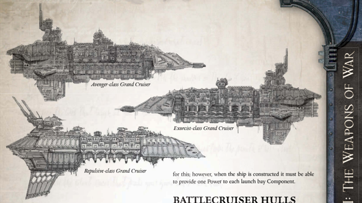

Dimensions: 7.4km long, 1.5km abeam at fins approx.

Mass: 39 megatonnes approx.

Crew: 134,000 crew, approx.

Accel: 2.4 gravities max sustainable acceleration.

In the superstitious and hidebound realm of Imperial starship construction, entire classes of vessel can come to be regarded as cursed since the design stage. Spacefarers mutter that these ships  are  star-crossed,  [Prone](combat-special-circumstances.md)  to  dragging  entire  crews  with them into [The Warp](warp-imperial-space-travel.md) at a moment's notice, there to leave them starving or bedevilled, until the ship re-emerges in the eye of terror, [Ready](rules-combat-overview.md) to serve the twisted lords of Chaos.

This dark reputation has followed the [Grand Cruisers](ships-grand-cruisers-overview.md) of the Repulsive-class  since  their  inception  in  the  Imperium's  early days.  A  disturbingly  large  number  of  the  Repulsives  (their original  names  long-lost  to  antiquity)  have  turned  traitor  or been  captured  into  the  arch-enemy's  service  since  the  class became  operational-so  many  that  some  have  forgotten  the ships were originally constructed in the Emperor's service.

This is a tragedy indeed for the Imperium, for these are graceful  and  powerful  spacecraft,  with  a  radically  different [Weapons](weapons-general.md)  fit  from  all  other  grand  [Cruisers](hulls-overview.md),  fully  realising the  ancient  doctrine  of  a  fast  and  manoeuvrable  heavy warship. Their design cannot be duplicated, as the secrets of constructing powerful enough [Plasma Drives](components-plasma-drives.md) has since been lost. Only a handful of these ship hulls remain uncorrupted, and these are either mothballed, sealed, and guarded in the Reserve Fleets of the various Segmentum Fortresses, or under the command of certain Rogue Traders.

Speed: 5

Manoeuvrability: +8

Detection:

+10

[Hull](starship-anatomy-detailed.md) Integrity:

85

[Armour](armour.md):

19

Turret Rating: 3

Space:

90

SP: 69

Weapon Capacity:

Port 2, Starboard 2, Prow 1, Dorsal 1

Grand Cruiser: This ship can use 'cruisers only' Components Cursed: The  advanced  experimental  warp  drive  of  the  class creates  unusual  harmonics  which  can  cause  the  Gellar  field  to flicker  momentarily during warp transit, escalating navigational

difficulties. All navigation tests carried out by the ship's Navigator during warp travel take a -10 penalty .

Ancient Grand Cruiser: The older types of Grand Cruiser were finely balanced. As such, this vessel may not gain any Components that increase the ship's armour.

*Source:* `Battle Fleet of the Koronus, page 21`
