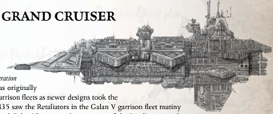

[Hull](starship-anatomy-detailed.md): Grand Cruiser

Class: Retaliator Grand Cruiser

Dimensions: 6.2 km long, 1.4 km abeam approx.

Mass: 38 megatonnes approx

Crew: 140,000 approx

Acceleration: 2.5 gravities max sustainable acceleration

The Retaliator, like many Chaos vessels, was originally an Imperial ship, delegated to reserve and garrison fleets as newer designs took the fore. However, the Treachery of Galan in M35 saw the Retaliators in the Galan V garrison fleet mutiny in mass. After a two day pitched battle around Galan V's moons, the remnants of the Retaliator squadron disengaged outsystem. In the millennia since, they have plagued Segmentums Obscuras, Solar, and Ultima, and served in the fleets of prominent [Renegade](chargen-stage2-origin-path.md) Warmasters and Traitor Legions. In response, the Navy has discontinued the use of most remaining Retaliators.

The  Retaliator  is  a  dangerous  ship,  similar  in  purpose  to  the  Imperial  Exorcist.  It  combines  [Lances](starship-supplemental-components.md),  launch  bays,  and macrobatteries for an 'all comers' warship. Only one Retaliator is known to be operating in the Koronus Expanse, the infamous Monarch of Whispers . However, it is certainly possible other Retaliators operate amongst the distant stars.

Speed: 5

Manoeuvrability: +5

Detection:

+5

[Void Shields](components-void-shields.md): 3

[Armour](armour.md): 20

Hull Integrity:

90

Morale: 98

Crew Population:

100

Crew Rating: Veteran (50)

Turret Rating: 3

Weapon Capacity: Port 3, Starboard 3

## Essential Components

Ancient Saturine-pattern drive, [Warp Drive](warp-drive-rules.md), Gellar Field, Triple Void Shield Bank, Flight [Command Bridge](starship-essential-components.md), Pirate Quarters, [Life Sustainers](components-life-sustainers.md), Tight-beam [Augur Arrays](components-augur-arrays.md)

## Supplemental Components

Port and Starboard Retaliation [Landing Bays](components-landing-bays.md): (Landing Bay; Str 2) 2 [Squadrons](squadrons-overview.md) of Swiftdeath Fighters and 2 squadrons of Dreadclaw Assault Pods in each, for four of each total.

Port and Starboard Macrocannon broadsides:

(Macrobattery, Strength 5; [Damage](character-injury.md) 1d10+2; Crit Rating 5; Range 5)

Port and Starboard Lance Battery: Str 2; (Lance, Strength 2; Damage 1d10+3; Crit Rating 3; Range 8.)

[Barracks](starship-supplemental-components.md): This ship has a significant contingent of pirate [Scum](rules-allies-enemies-rivals.md) and murderous mutants aboard (bonus included in Modifiers). Corrupted Shrine: Fanatical worship of the Ruinous Powers grants the crew loyalty (bonus included in Modifiers).## Special Rules and Modifier Summary

The  following  modifiers  apply  to the  Retaliator,  taking  [Components](starship-anatomy-detailed.md) into account:

- All  Command  Tests  involving boarding  actions  and  Hit  and [Run](rules-combat-overview.md) attacks gain +20.
- All Command Tests to command [Attack Craft](attack-craft-rules.md) squadrons gain a +5.
- Reduce all Morale loss by 1 to a minimum of 1.

*Source:* `Battle Fleet of the Koronus, pages 107–108`
