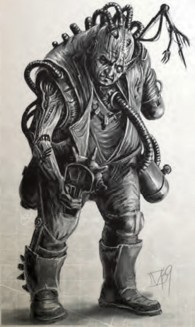
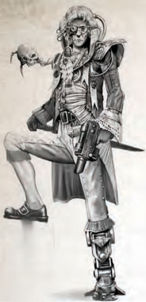
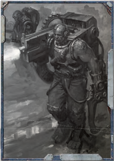

## The Masses of Humanity

W hile the individual entries in this section represent important, dangerous, or in other ways interesting NPCs  Explorers  may  encounter,  the  following can be used as a rough series of templates for the countless common souls of humanity besides, themed towards the [Hardy](talents-descriptions.md) survivors of the Koronus Expanse.

Humanity  has  spread  across  the  stars  like  a  plague  in uncounted numbers. Many are born into toil and die knowing little else, while others slaved to the Imperium's labyrinthine bureaucracy spend years copying words from decaying parchment to fresh, never understanding a single word they write. Life beyond the Imperium's borders is if anything more uncertain  and  dangerous,  with  hardscrabble  colonists  eking out  lives  on  the  edge  of  starvation,  threatened  at  all  sides from strange creature, rampaging xenos, and the laughter of thirsting gods.

### Colonist

#### Colonist Profile

<!-- image -->

|   WS |   bS |   S |   T |   Ag |   Int |   Per |   WP |   Fel |
|------|------|-----|-----|------|-------|-------|------|-------|
|   25 |   20 |  30 |  30 |   30 |    25 |    25 |   25 |    30 |

Movement:

3/6/9/18

[Wounds](character-injury.md): 9

Skills: Awareness (Int), Common Lore (Imperium) (Int), Drive (pick one) (Ag), Speak Language (Low Gothic) (Int), Trade (pick one) (Int).

Talents: [Basic Weapon Training](talents-descriptions.md) (SP), [Melee Weapon Training](talents-descriptions.md) (Primitive).

[Gear](equipment-gear.md): Poor quality [Clothing](equipment-gear.md), trinket, or votive item.

The following offer examples of different Minor NPCs using the Colonist as a template with the listed additions.

### Adept

Their  fingers  stained  in  ink,  their  backs  hunched  over parchment strewn desks, adepts and scribes can be found in every dark niche of the Imperium and beyond it, tabulating data  and  recording  the  ending  of  lives  as  thoughtlessly  as they might the day's precipitation.

Char:

Int 30

Skills: Common Knowledge (Imperium) (Int) +10, Literacy (Int) +10, Speak Language (High Gothic) (Int).

[Gear](equipment-gear.md):

Quills, ink bottles, parchment, [Data-slate](equipment-tools.md).

### Bloodskinner

Many worlds on the frontier are dependant of a steady supply of  butchered  meat,  either  from  local  livestock  or  hunted  and culled from feral worlds by red-stained roving provender vessels. Bloodskinners serve that need. Many are ferals themselves, others are inveterate wanderers-none have a wholesome reputation.

Char:

WS 35, BS 30, Per 35

Skills: Navigation  (Surface)  (Int),  Survival  (Int),  Tracking (Int), Wrangling (Int).

Talents: [Basic Weapon Training](talents-descriptions.md) (Primitive), [Melee Weapon Training](talents-descriptions.md) (Chain, [Primitive](weapons-general.md)).

[Armour](armour.md): Leather and hide [Armour](armour.md) (All 2, [Primitive](weapons-general.md)).

[Gear](equipment-gear.md): Knife  (1d5+3  R,  Primitive),  and  either  a  chainaxe (1d10+7 R, Tearing) or a crossbow (30m; S/-/-; 1d10 R; Pen 0; Clip 1; 2 Full; Primitive) and 12 quarrels.

### Entertainer

Given  the  often  crushing  misery  of  life,  it  is  no  [Surprise](starship-combat-rules.md) that  a  little  [Escape](combat-escape-action.md)  is  often  desirable  for  the  masses,  and entertainment on most human worlds has a tendency toward the simple, direct and visceral.

Char:

Fel 35

Skills: Carouse  (T),  [Charm](equipment-gear.md)  (Fel),  Deceive  (Fel)  and  either Acrobatics (Ag), Gamble (Int), or Performer (Fel).

[Gear](equipment-gear.md): Any [Tools](equipment-tools.md) of the trade such as outlandish or revealing clothes, gewgaws, decks of cards, or musical instruments.

### Hired Gun

Hired guns of moderate skill and expendable nature can be found across the Koronus Expanse. Some form the bulk of planetary  defence  forces,  and  more  the  personal  guards  of nobles and Merchants. They can also be found as part of the numerous mercenary groups or [Criminal](chargen-stage2-origin-path.md) gangs that abound, and even serving as enforcers to maintain what passes as law and order on colony worlds.

Char:

BS 35, [Wounds](character-injury.md) 12

Skills:

Climb (S), Intimidate (S).

Talents: [Basic Weapon Training](talents-descriptions.md) (Universal), Pistol Weapon

Training (Universal).

[Armour](armour.md):

Light flak coat (Arms 2, Body 2, Legs 2).[Gear](equipment-gear.md): [Lasgun](weapons-general.md)  (30m;  S/3/-;  1d10+3  E;  Pen  0;  Clip  60; [Reload](rules-combat-overview.md)  Full;  [Reliable](weapons-general.md))  or  pump-action  shotgun  (30m;  S//-; 1d10+4 I; Pen 0; Clip 8; [Reload](rules-combat-overview.md) 2 Full; Scatter), stub automatic (30m; S/3/-; 1d10+3 I; Pen 0; Clip 9; Reload Full), 2 clips for each weapon, knife, truncheon, hand vox.

### Scum

The frontier, no less that the underbelly of the Imperium, is rife with all manner of thugs, narco-dealers, gangers, degenerates, and worse. Such scum prefer to prey on the weak and most live by victimising those even worse-off than themselves, but many will take their chances against more dangerous targets if the prospect of payoff is high enough.

Char:

WS 30, Per 30

Skills: Carouse (T), Chem-Use (Int), Deceive (Fel), Gamble (Int) Silent Move (Ag).

Talents: [Jaded](talents-descriptions.md), [Pistol Weapon Training](talents-descriptions.md) (Universal).

[Gear](equipment-gear.md): Stub  revolver  (30m;  S/-/-;  1d10+3  I;  Pen  0;  Clip 6;  [Reload](rules-combat-overview.md)  2Full;  [Reliable](weapons-general.md)),  spare  [Reload](rules-combat-overview.md),  [Knife](weapons-general.md)  (1d5+3  R, Primitive), 1d5 doses of assorted chems, stolen goods.

### Voidfarer

Any large star vessel requires a crew in the hundreds if not thousands.  It  is  dangerous  and  back-breakingly  laborious work  for  the  most  part,  where  life-expectancy  is  low  and slow  death  through  radiation  exposure  and  pressure-ague commonplace. However, without their blood and sweat, travel between the stars would not be possible.

Char:

S 38 T 38

Skills:

Speak Language (Void Cant) (Int), Tech-Use (Int).

[Armour](armour.md): Heavy work [Gear](equipment-gear.md) (All 2).

[Gear](equipment-gear.md):

Respirator or void-suit as needed.

### Free Trader Captain

The Imperium's myriad worlds are connected in vast intertwining networks of commerce, with many planets unable to sustain themselves without imports of food, technology, or manpower. It is this merchant navy which acts to move trade and  tithe  goods  from  one  system  to  another,  transporting untold  quantities  of  essential  freight  across  the  stars.  Free traders are normally part of commercial fleets and travel where their masters decree, but some small operators continue to act independently of the conglomerate, while others are [Hardy](talents-descriptions.md) (or desperate enough) to strike out for border areas in search of greater profits on the very edge of the Imperium. While their passages are normally quiet, they know at any time they and their crews might be called upon to lay down their lives in battle and no passage in [The Warp](warp-imperial-space-travel.md) is ever safe.

| Free Trader Captain Profile   | Free Trader Captain Profile   | Free Trader Captain Profile   | Free Trader Captain Profile   | Free Trader Captain Profile   | Free Trader Captain Profile   | Free Trader Captain Profile   | Free Trader Captain Profile   |     |
|-------------------------------|-------------------------------|-------------------------------|-------------------------------|-------------------------------|-------------------------------|-------------------------------|-------------------------------|-----|
| WS                            | bS                            | S                             | T                             | Ag                            | Int                           | Per                           | WP                            | Fel |
| 29                            | 35                            | 31                            | 35                            | 32                            | 36                            | 32                            | 37                            | 33  |

Movement:

3/6/9/18

[Wounds](character-injury.md): 12

Skills: Awareness  (Per),  Barter  (Fel)  +10,  Common  Lore (Imperium, Merchant) (Int), Navigation (Stellar) (Int), Speak Language (High Gothic, Low Gothic) (Int), Trade (Merchant, Voidfarer) (Int) +10.

Talents: Basic  Weapon  Training  (Las,  SP),  Melee  Weapon Training (Primitive, Universal), [Peer](talents-descriptions.md) (void born), Pistol Training (Universal).

[Armour](armour.md): Reinforced uniform (Arms 1, Body 2, Legs 1).

[Weapons](weapons-general.md): Hellpistol (Pistol; 30m; S/2/-; 1d10+4 E; Pen 7; Clip 20; [Reload](rules-combat-overview.md) 2Full).

[Gear](equipment-gear.md): 1 spare hellpistol clip, personal vox, seal of captaincy or commercia warrant, [Data-slate](equipment-tools.md), master security key for ship.

## Mutant Outcast

[Mutation](character-mutations-list.md) is a fact of human existence in the 41st Millennium. On many worlds, particularly those who have been cut off from  contact  for  centuries  and  even  millennia,  the  human gene-pool has become irrevocably damaged by generations of exposure to pollutants and alien biospheres, and worst of all, to genetic tampering and exposure to the reality distorting effects of [The Warp](warp-imperial-space-travel.md). As a result, increasing numbers are born with obvious and often grievous [Mutations](character-mutations-list.md), most often in the form  of  gross  physical  deformities  and  mental  deviancies. Within the Imperium the most terribly afflicted are ruthlessly and systematically purged, however beyond the Imperium's border, their treatment can vary widely, from exploitation to dominance among those worlds lost to the taint of Chaos. On some worlds steeped in commonplace superstition and [Fear](character-fear-and-damnation.md), or where fanatical interpretations of the Imperial creed and local hatreds have taken hold, the merest hint  of  physical  deviancy  is  likely  to  end  in  a pyre. On other largely industrial worlds where mutation is sometimes viewed as a balefulbut unavoidable fact among the lower classes, whole mutant populations are allowed to form as a harshly repressed and utterly  disposable  workforce,  and  only  the  most  excessive cases of mutation are culled.

There  are  numerous  forms  of  mutant,  but  the  most common exhibits some base physical degeneracy or deviation from the excepted norms of the human form. Also known as an abhuman, sub or twist, these degenerates are often found as slaves and outcasts on The Fringes of human Settlement in the Koronus Expanse, and in abominable profusion on those worlds touched by [The Warp](warp-imperial-space-travel.md).

### Mutant Outcast Profile

<!-- image -->

|   WS |   bS |   S |   T |   Ag |   Int |   Per |   WP |   Fel |
|------|------|-----|-----|------|-------|-------|------|-------|
|   28 |   22 |  35 |  35 |   22 |    18 |    25 |   18 |    15 |

Movement:

2/4/6/12

[Wounds](character-injury.md):

12

Skills: Climb (S), Intimidate (S), Survival (Int), Trade (labourer or [Scavenger](chargen-stage2-origin-path.md)) (Int).

Talents: Basic  Weapon  Training  (Primitive),  [Frenzy](talents-descriptions.md),  [Jaded](talents-descriptions.md), Resistance (Poisons).

[Traits](character-traits.md): [Mutation](character-mutations-list.md) (roll once on table 14-2 [Mutation](character-mutations-list.md) on page 369, re-rolling any result higher than 50).

[Weapons](weapons-general.md): [Improvised](weapons-general.md) club (1d10+1 I; Primitive).

[Gear](equipment-gear.md): Rags, tatters and scraps of scavenged detritus.

### Mutant Abomination

Far worse than the abhuman dregs are those lost and damned souls  whose  bodies  bear  the  corrupting  stigmata  of  Chaos and who have embraced insanity and the favour of the Dark Gods. Use the Mutant Outcast profile modified as follows to represent them.

Char:

WS 35, S 45, [Wounds](character-injury.md) 22

[Traits](character-traits.md): roll 1d5 times on Table 14-3 [Mutations](character-mutations-list.md) on page 369 , re-rolling any duplicate results.

[Gear](equipment-gear.md): [Warhammer](weapons-general.md) (1d10+6 I; [Primitive](weapons-general.md))  or  great  weapon (2d10+4 I; Primitive, Unbalanced).

## Navy Officer

A military aristocracy of the stars that spans the Imperium, the  Officer  Corps  of  the  Imperial  Navy  are  an  institution that dates back millennia in a tradition of service, bellicosity, and sacrifice that some would argue is unmatched. To serve in  the  Imperial  Navy  is  to  act  as  the  glue  that  holds  the Imperium together, for without [Warp Travel](warp-imperial-space-travel.md) the vast armies of humanity would be left stranded, impotent, and swiftly torn apart by its enemies. Just as the Navy itself binds together the Imperium, so do its officer class bind and regulate the Navy.

Proud,  warlike,  and  honourable,  often  descended  from

bloodlines that have served for centuries, it is they who keep the [Ratings](crew-ratings.md) and the indentures in line, uphold the  traditions  of  service  and  loyalty  and  most importantly hold the line against the [Darkness](combat-special-circumstances.md) of the void beyond.

### Navy Officer Profile

<!-- image -->

|   WS |   bS |   S |   T |   Ag |   Int |   Per |   WP |   Fel |
|------|------|-----|-----|------|-------|-------|------|-------|
|   38 |   32 |  30 |  30 |   35 |    35 |    30 |   38 |    31 |

Movement:

3/6/9/18

[Wounds](character-injury.md):

12

Skills: Awareness  (Per),  Climb  (S),  Command  (Fel)  +10, Common Lore (Imperium, Void, Imperial Navy, War) (Int), Navigation (Stellar) (Int), Speak Language (High Gothic, Low Gothic) (Int).

Talents: [Basic Weapon Training](talents-descriptions.md) (Las, SP), [Nerves of Steel](talents-descriptions.md), Melee Weapon Training (Primitive, Universal), Peer (Imperial Navy), Pistol Training (Universal).

[Armour](armour.md): Flak reinforced uniform (Arms 3, Body 3, Legs 3). [Weapons](weapons-general.md): Naval pistol (20m; S/3/-; 1d10+4 I; Pen 0; Clip 6; [Reload](rules-combat-overview.md) Full; [Tearing](weapons-general.md)), mono-sword (1d10+3 R; Pen 2) or officer's cutlass (1d10+3 R; Shocking).

[Gear](equipment-gear.md): 2 spare naval pistol clips, personal vox, officer's seal, respirator.

## Oathsworn Bodyguard

The exploitation of the Expanse has resulted in the amassing of  many  great  fortunes  and  a  great  many  vendettas  and intrigues in turn. Both are equally perilous in a realm where little  law  is  recognised  beyond  raw  power  and  the  void  of space swallows the dead without trace. In such a world no one,  no  matter  how  famed  or  mighty,  is  beyond  the  reach of an assassin's hand, and the need for trustworthy personal protection is paramount. While dumb muscle and hired guns of dubious provenance are ten-a-throne, a skilled professional, or Oathsworn as they are known in the parlance of the Expanse, is  another  matter.  Depending  on  their  contract,  those  who offer  their  services  as  such  bodyguards  range  in  their  role from simple escort duty, to laying their life down for their employer, to acting as their personal agents and 'dealing' with those who offended their masters. Reputable bodyguards can become  quite  wealthy  and  respected  themselves,  assuming they survive, and some establish familial contracts which last as  long  as  their  employer's  Lineage  does.  Others  specialize in  dangerous  locales,  using  their  familiarity  with  the  local environs to offer protection in that area.

### Oathsworn Bodyguard Profile

<!-- image -->

|   WS |   bS |   S |   T |   Ag |   Int |   Per |   WP |   Fel |
|------|------|-----|-----|------|-------|-------|------|-------|
|   42 |   35 |  35 |  40 |   35 |    35 |    38 |   35 |    28 |

Movement:

3/6/9/18

[Wounds](character-injury.md):

18

Skills: Awareness  (Per)  +10,  Common  Lore  (Imperium, Underworld)  (Int),  [Dodge](rules-combat-overview.md)  (Ag)  +10,  Drive  (Land  Vehicle) (Ag), Inquiry (Int), Intimidate (S) +10, Scrutiny (Per) +10, Security (Ag) +10, Shadowing (Ag) +10, Silent Move (Ag). Talents: [Basic Weapon Training](talents-descriptions.md) (Las, SP, Bolt), [Crack Shot](talents-descriptions.md), Disarm, Melee Weapon Training (Primitive, Universal), Nerves

of Steel, Pistol Training (Universal), Quick Draw .

[Armour](armour.md): [Flak Armour](armour.md#flak-armour) with carapace chest plate (Arms 4, Body 6, Head 4, Legs 4).

[Weapons](weapons-general.md): [Autopistol](weapons-general.md) with manstopper [Rounds](rules-combat-overview.md) and a [Red-dot Laser Sight](weapons-upgrades.md) (30m; S/-/6; 1d10+2 I; Pen 3, Clip 18; Reload Full), [Compact](weapons-upgrades.md) laspistol (15m; S/-/-; 1d10+1 E; Pen 0, Clip 15; Reload Full; Reliable), shock glove (1d10+3 I; Shocking). [Gear](equipment-gear.md): Quality [Clothing](equipment-gear.md) suitable to their surroundings, microbead, 2 autopistol manstopper clips, 1 blind grenade, filtration plugs, silencer, photo-contacts.

## Renegade

There  are  many  that  flee  the  Imperium  and  turn  [Renegade](chargen-stage2-origin-path.md), and just as many reasons for doing so. Failed revolutionaries, refugees,  Imperial  deserters,  outlaws,  heretics  and  worse  all make their way to the Expanse in the hopes of freedom from pursuit and to do as they will. Many attempt to found their own societies on shadowed and undiscovered worlds, or lurk on the edge of more established colonies, but an equal number are drawn to raiding and piracy to survive. Many human pirates and [Raiders](hulls-overview.md) are not worshippers of Chaos or in league with aliens, but simply criminals out to take what they can, or who have fallen into an unforgiving cycle of plunder and flight in order to sustain their outlaw existence. There remains a darker core however, of those that have fallen far from the light and are  prey  to  the  most  appalling  appetites  and  savagery .  It  is these that are the most feared of renegades, hated by colonist, Imperial, Rogue Trader and fellow outlaw alike.

### Renegade Profile

|   WS |   bS |   S |   T |   Ag |   Int |   Per |   WP |   Fel |
|------|------|-----|-----|------|-------|-------|------|-------|
|   38 |   28 |  35 |  40 |   30 |    25 |    33 |   35 |    22 |

Movement: 3/6/9/18

[Wounds](character-injury.md): 12

Skills: Awareness (Per), Common Lore (Expanse, Imperium) (Int),  Chem-Use (Int),  Intimidate  (S)  +10,  Speak  Language (Low Gothic) (Int), either  Deceive  (Fel)  and  Tech-Use  (Int) or  Forbidden  Lore  (pick  one)  (Int)  and  Secret  Tongue  (as appropriate) (Int).

Talents: [Basic Weapon Training](talents-descriptions.md) (SP), [Jaded](talents-descriptions.md), Melee Weapon Training  (Chain,  [Primitive](weapons-general.md),  Thrown),  Pistol  Training  (Las, SP), Peer (Criminal or [Renegade](chargen-stage2-origin-path.md)).

[Armour](armour.md): Composite [Armour](armour.md) (Arms 2, Body 3, Legs 3).

[Weapons](weapons-general.md): Knife (1d5+3 R; Primitive), hand cannon (30m; S/-/-;  1d10+4;  Pen  2;  Clip  5;  [Reload](rules-combat-overview.md)  2Full),  and  either a  sword  (1d10+3  R;  Balanced,  Primitive)  or  chainsword (1d10+5  R;  Balanced,  Tearing),  autopistol  (30m;  S/-/6; 1d10+2  I;  Pen  0;  Clip  18;  [Reload](rules-combat-overview.md)  Full),  autogun  (90m; S/3/10; 1d10+4 I; Pen 0; Clip 30; Reload 2Full), or pumpaction shotgun (30m; S/-/-; 1d10+4; Pen 0; Clip 8; Reload 2Full; Scatter).

[Gear](equipment-gear.md): Tattered miss-matched [Clothing](equipment-gear.md), spare [Ammunition](economy-wealth-and-acquisitions.md) for weapons, and either a hand vox and respirator, or gruesome trophies,  human  meat,  and  skins.  Void  pirates  will  also  be equipped in armoured void suits.

## Void Pirate Captain

It takes a brave and capable individual to lead a pirate crew in the reaches beyond Imperial space. One must be cunning and ruthless, as well as able to command a crew of renegades and killers through respect or [Fear](character-fear-and-damnation.md). A pirate [Captain](rank-captain.md) can be as  cruel  as  [Vacuum](character-injury.md)  or  affect  the  manner  of  a  rakish  noble or  Rogue  Trader  depending  on  his  nature  and  crew,  but he must be successful or risk his command to mutiny. The most successful are more than the leaders of cutthroats; they are  savvy  operators  with  extensive  intelligence  gathering networks,  knowledge  of  dark  secrets  uncovered  in  their voyages and contacts on both sides of the law.

| Void Pirate Captain Profile   | Void Pirate Captain Profile   | Void Pirate Captain Profile   | Void Pirate Captain Profile   | Void Pirate Captain Profile   | Void Pirate Captain Profile   | Void Pirate Captain Profile   | Void Pirate Captain Profile   |     |
|-------------------------------|-------------------------------|-------------------------------|-------------------------------|-------------------------------|-------------------------------|-------------------------------|-------------------------------|-----|
| WS                            | bS                            | S                             | T                             | Ag                            | Int                           | Per                           | WP                            | Fel |
| 44                            | 38                            | 34                            | 42                            | 34                            | 34                            | 38                            | 42                            | 36  |

Movement:

3/6/9/18

[Wounds](character-injury.md): 15

Skills: Awareness (Per), [Charm](equipment-gear.md) (Fel), Barter (Fel), Command (Fel) +10, Common Lore (Imperium, Merchant, Underworld) (Int), Deceive (Fel), Intimidate (S), Interrogation  (Fel)  +10,  Inquiry  (Fel),  Navigation (Stellar) (Int) +10, Pilot (Space Craft) (Ag), TechUse (Int), Speak Language (Void Cant) (Int). Talents: Air  of  Authority,  Basic  WeaponTraining (Universal), [Decadence](talents-descriptions.md), [Exotic Weapon Training](talents-descriptions.md) (any one), Jaded, Light Sleeper, Melee Weapon Training (Primitive, Universal),  Paranoia,  Pistol  Training  (Universal),  Resistance (Fear), Peer (Criminals or Renegades), Swift Attack.

[Armour](armour.md): Light carapace (Arms 4, Body 5, Legs 4). [Weapons](weapons-general.md): Bolt pistol (30m; S/2/-; 1d10+5 X; Pen 4; Clip 8; [Reload](rules-combat-overview.md) Full; [Tearing](weapons-general.md)), hand cannon (30m; S/-/-; 1d10+4 I;  Pen  2;  Clip  5;  [Reload](rules-combat-overview.md)  2Full),  chainsword  (1d10+5  R; Balanced, Tearing), [Exotic](weapons-ammunition.md) pistol (any one).

[Gear](equipment-gear.md): Motley uniform, bionic eye, 2 bolt pistol clips, 4 hand cannon clips, 1 clip for [Exotic](weapons-ammunition.md) weapon, dubious charts. Some may have extensive further cybernetic implants.

## Warp Witch

Among the Void Born, there are those psykers who flee the Imperial authorities upon the awakening of their powers or have  been  born  beyond  their  reach.  Those  that  manage  to survive this dark transfiguration are rare, and often insane, but no less sought after in certain quarters because of this. This is because these Warp Witches possess among their psyker's gifts  some,  albeit  crude,  ability  to  navigate  the  warp  and whisper upon its unseen winds, although never with anything approaching the certainty and proficiency of a true Navigator or Astropath. For those renegades and corsairs who strike a devil's bargain with a Warp Witch, they may find the price levied by these fickle and spiteful psykers even steeper than they can guess at. Often, the powers they have to track [The Warp](warp-imperial-space-travel.md) are conveyed not by their own gifts, but by the daemons sitting invisibly on their shoulders.

| WarpWitch Profile   | WarpWitch Profile   | WarpWitch Profile   | WarpWitch Profile   | WarpWitch Profile   | WarpWitch Profile   | WarpWitch Profile   | WarpWitch Profile   | WarpWitch Profile   |
|---------------------|---------------------|---------------------|---------------------|---------------------|---------------------|---------------------|---------------------|---------------------|
| WS                  | bS                  | S                   | T                   | Ag                  | Int                 | Per                 | WP                  | Fel                 |
| 28                  | 28                  | 30                  | 40                  | 36                  | 28                  | 37                  | 45                  | 23                  |

Movement:

3/6/9/18

[Wounds](character-injury.md): 13

Skills: Awareness (Per), Ciphers (Occult) (Int), Common Lore (Imperium, Koronus Expanse) (Int), Command (Fel), Deceive (Fel) +10, Forbidden Lore (Cults, Daemonology, Warp) (Int) +10, Intimidate (S) +10, Invocation (WP) +10, Psyniscience (Per),  Secret  Tongue  (Cult)  (Int),  Speak  Language  (Low Gothic) (Int), Trade (Seer) (Int).

Talents: [Dark Soul](talents-descriptions.md), [Fearless](talents-descriptions.md), Jaded, Melee Weapon Training (Primitive),  Peer  (Renegade),  Pistol  Weapon  Training  (SP), Psy Rating 6, Resistance (Psychic Techniques).

[Traits](character-traits.md): Dark Pact†, one [Mutation](character-mutations-list.md) from Table 14-3.

†Dark  Pact: In  addition  to  her  psyker  abilities,  a  Warp Witch can summon daemons and unclean spirits in order to try to navigate [The Warp](warp-imperial-space-travel.md) and to do their bidding; these rituals are complex and dangerous and cannot be performed during [Combat](rules-combat-overview.md) encounters.

Disciplines:

Telepathy, Telekinesis. [Short Range](combat-special-circumstances.md) Telepathy, Mind Reinforced [Void Suit](equipment-gear.md) (Arms 2, Body

Pyschic Techniques: Probe, [Terrify](psychic-disciplines-list.md), [Delude](psychic-disciplines-list.md), Beastmaster, Compel.

[Armour](armour.md): 3, Legs 2).

[Weapons](weapons-general.md): Sacrificial blade (1d5+4  R;  [Primitive](weapons-general.md)), stub automatic (30m; S/3/-; 1d10+3 I; Pen 0; Clip 9; Rld Full). [Gear](equipment-gear.md): Tattered clothes, trinkets and fetishes, ragged reinforced void suit, respirator.

*Source:* `Roguetrader Corerulebook, pages 371–375`
