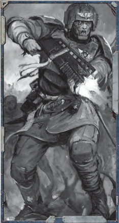
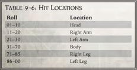

## Narrative Time Vs. Structured Time

The passage of time is [Flexible](weapons-general.md) in a game of Rogue Trader and subject to the GM's discretion based on the needs of the story and the choices the players make. Sometimes the GM only needs to convey a very loose sense of time, which is known as narrative time. In other situations, especially combats, more precise time keeping is necessary, and the GM should adopt what is known as structured time.

### Narrative Time

Many situations in a game of Rogue TRadeR do not require precise time keeping. It is usually enough to know if a certain action takes a few minutes, or about an hour, or several weeks, or  anything  in  between.  Narrative  time  is  most  often  used outside  of  combat  and  other  situations  where  the  precise order of actions is unimportant.

### Structured Time

In contrast to the abstract  approach  of  narrative  time, structured time is important for resolving complex encounters, such as combat, when every second counts and the order in which  things  happen  is  crucial.  Structured  time  is  divided into Rounds, Turns, and Actions.

### Rounds

A  Round  consists  of  every  character  participating  in  the encounter taking one Turn each. It assumed that characters act more or less simultaneously in an encounter, so a Round is approximately five seconds long, regardless of how many characters are involved.

### Combat Abstractions

Combat in Rogue TRadeR is fast and furious, designed so  games  don't  become  bogged  down  with  minutia. As  such,  the  rules  take  certain  licenses  with  reality and  assumptions  must  be  made  about  what  is  really going on during a fight. One such assumption is that nearly all combatants are at least somewhat concerned for their own safety and are constantly side-stepping, twisting, and ducking, to avoid attacks or assume more favourable  combat  positions.  With  this  in  mind,  the default  difficulty  for  all  combat  tests  is  Challenging (+0), unless a specific rule states otherwise.

### Turns

Each character in an encounter gets one Turn each Round. During  a  character's  Turn,  he  can  perform  one  or  more Actions. While characters' Turns overlap each other slightly, Turns  are  resolved  in  a  specific  order  known  as  [Initiative](starship-combat-rules.md) Order (see page 236).

### Actions

A character can perform one or more Actions on his Turn. If a character is performing multiple Actions during his Turn, the order in which they are resolved may or may not matter. For [Example](rules-tests.md), a character could draw his pistol and then move a few metres, or he could move first and then draw his pistol, and either way the end result is the same. But, if the same character  wants  to  shoot  his  pistol,  he  obviously  needs  to draw it first. Actions are described in detail on page 238.

## Combat Overview

Combat is usually resolved using structured time divided into Rounds, Turns, and Actions. Each character, including NPCs, takes one Turn each Round. The order in which Turns are resolved depends on [Initiative](starship-combat-rules.md) Order. When a new combat begins, follow these steps to determine what happens.

### Step 1: Surprise

At  the  beginning  of  a  combat,  the  GM  determines  if  any characters are Surprised. This can only happen once at the beginning  of  a  combat,  and  there  will  be  many  combats where nobody is Surprised. A Surprised character loses his Turn  on  the  first  Round  of  combat  because  he  has  been caught unawares by his enemies. If no one is Surprised, move immediately to Step Two.

### Step 2: Roll Initiative

At the start of the first Round, each character rolls for [Initiative](starship-combat-rules.md). Each character rolls  1d10  and  adds  his  Agility  Bonus  (the tens digit of his Agility characteristic). The result of the roll applies for all successive Rounds in the combat.### Step 3: Determine [Initiative](starship-combat-rules.md) Order

The GM ranks all the Initiative rolls, including those of the NPCs, from highest to lowest. This is the order in which the characters take their Turns during each Round of combat.

### Step 4: Combatants Take Turns

Starting with the character at the top of the [Initiative](starship-combat-rules.md) Order, each character takes a Turn. The character currently taking his Turn is known as the active character. During his Turn, the active character can perform one or more Actions. Once his  Actions  have  been  resolved,  the  next  character  in  the [Initiative](starship-combat-rules.md)  Order  becomes  the  active  character  and  takes  his Turn, and so forth.

### Step 5: Round Ends

Once each character has taken a Turn, the Round is over. Any lingering effects that specify a duration of 'until [The End of the Round](starship-combat-rules.md)' now end.

### Step 6: Repeat Steps 4-5 as Needed

Continue  to  play  successive  Rounds  until  the  combat  is complete  or  until  the  event  that  triggered  the  switch  from narrative time to structured time is resolved.

## Tactical Combat Maps (optional)

During large combats, some players may want visual references to help keep track of enemy positions, as well as their own. The GM can accomplish this by sketching out simple overhead maps on paper. Many game stores also sell large game mats that you can draw on with wet-erase markers. These mats are usually pre-printed with squares grids or hex patterns to make measuring distances  quick  and  easy.  Tactical  combat  maps  can be  drawn  to  any  scale,  and  some  roleplayers  like  to combine large-scale maps with miniatures where a one inch square represents one square metre.

While  tactical  combat  maps  can  be  very  useful, they are not necessary to play Rogue TRadeR . Many roleplayers prefer to use rich narrative descriptions to allow fellow players to simply imagine all the action. This requires players to keep a snapshot of the relative positions of all combatants in their heads, but it also allows for greater freedom in detailing the events of a combat.

## Surprise

[Surprise](starship-combat-rules.md) only affects the beginning of a new combat. It is up to the GM to decide if any of the combatants are Surprised. Ultimately, this comes down to a judgement call on the GM's part, based on the circumstances and the Actions of the various combatants leading up to the encounter. The GM should take the following into account when determining [Surprise](combat-surprise-rules.md):

- Is anyone hiding? Successful use of the Concealment Skill · before the combat may mean that some combatants are hidden. Extremely wary characters may oppose this with an Awareness Test.
- Is anyone sneaky? Successful use of the Silent Move Skill · may have positioned some characters for an ambush. Again, wary opponents may oppose this with an Awareness Test.
- Are there any unusual circumstances that would mask the · approach of attackers? This can [Cover](combat-special-circumstances.md) nearly anything, from pouring Rain to whining engines to nearby explosions.
- Are  there  any  distractions?  It's  possible  that  something · quite distracting is going on. A cultist's attention may be so fixated on the sermon of his confessor that he doesn't notice his attackers approaching.

Bearing  all  of  this  in  mind,  the  GM  must  decide  which combatants are Surprised. Whilst it's often the case that one entire side or the other is Surprised, there can be individual exceptions.

If no one is Surprised, proceed with the combat as normal.

A Surprised character loses his Turn in the first Round. He can  do  nothing  except  stand  dumbfounded.  Furthermore,  a non-Surprised attacker receives a +30 bonus to Weapon Skill and Ballistic Skill Tests made to [Attack](combat-attack-rules.md) a Surprised target. After the Surprise Round completely resolves, all Surprised characters recover their wits and can act normally. All combatants then roll for [Initiative](starship-combat-rules.md) and the combat proceeds normally .

### Example

Castella and Ramirez are being followed by a group of unsavoury thugs. Rather than waiting for the situation to take a turn for worst, Castella and Ramirez decide to quickly plan an ambush. Turning the corner into a shadowy alley, Castella hides using her Concealment Skill. Ramirez remains visible, and when the thugs enter the alley, he attempts to create a distraction with a bit of roguish [Charm](equipment-gear.md) and fast-talk nonsense. The GM has Ramirez make a Blather Test, which is opposed by the thugs' Willpower scores.  Ramirez  wins  the  Opposed  T est  and  the  thugs  are sufficiently distracted, allowing Castella to leap out of the shadows and strike. The GM rules that thugs are all Surprised, allowing both Castella and Rameriez to take any Combat Actions they wish for one Round. Additionally, any W eapon Skill and Ballistic Skill T ests they make to [Attack](combat-attack-rules.md) the thugs receive +30 bonuses. After the [Surprise](starship-combat-rules.md) R ound is resolved, everyone involved in the combat, including Rameriez and Castella, rolls for [Initiative](starship-combat-rules.md).## Initiative

Initiative  determines  the  order  in  which  participants  act during each Round. To determine Initiative, roll 1d10 and add the result to the character or NPC's Agility Bonus. The GM rolls the Initiative for any NPCs and creatures present. To keep things simpler, it is recommended that the GM make one Initiative roll for an entire group of similar enemies.

### Example

Drake,  Deavon,  and  Y olanda  are  three  explorers  who  have  just  been attacked by a group of four gangers. The three players controlling Drake, Deavon,  and  Y olanda  each  determine  their  own  Initiatives  by  rolling 1d10 and adding their explorer's Agility Bonus. Drake ends up with an [Initiative](starship-combat-rules.md) of 8, Deavon also gets 8, and Y olanda gets 11. Since the four gangers all have similar [Characteristics](starship-anatomy-detailed.md), the GM makes one [Initiative](starship-combat-rules.md) roll for all of them and gets 9.

After  each  combatant  (or  group  of  combatants)  has determined  his  Initiative,  the  GM  makes  a  list  and  places them in order, from highest to lowest. This is known as the Initiative Order, which is the order the combatants act in each Round, until the combat is over.

If more than one character has the same Initiative, they act in order from the highest Agility to the lowest. If they also have the same Agility then each should roll a die, with the highest going first.

### Example

Using the [Initiative](starship-combat-rules.md) rolls in the above [Example](rules-tests.md), the GM ranks them in  order  from  highest  to  lowest.  Yolanda  will  act  first  with  her [Initiative](starship-combat-rules.md) of 11, followed by all of the gangers with their Initiative of 9. Drake and Deavon both ended up with 8 for Initiative, but Drake's Agility Bonus is higher, so he will act third, followed by Deavon who will act last.

Most combats last for multiple Rounds, but each combatant's Initiative is only determined once at the start of the combat. Once  the  Initiative  Order  has  been  established,  it  usually remains the same from Round to Round. If new combatants join in the middle of the fight, simply determine their Initiatives normally and insert them into the Initiative Order.

## Actions

During each normal Round, every character gets a Turn to act. On his Turn, a character can take one or more Actions. There are five types of Actions in Rogue TRadeR , and every action also has one or more subtypes.

### Types of Actions

Every Action is categorised into one of the following types:  Full  Actions,  Half  Actions,  Reactions,  Free Actions, and [Extended Actions](starship-combat-rules.md).

#### Full Actions

A  Full  Action  requires  a  character's  complete  attention  to accomplish. A character can take one Full Action on his Turn and cannot take any Half Actions. Grappling an opponent is an [Example](rules-tests.md) of a Full Action.

#### Half Actions

A  Half  Action  is  fairly  simple;  it  requires  some  effort  or concentration, but not so much that it consumes a character's entire Turn. A character can take two different Half Actions on his Turn instead of taking one Full Action. A character cannot take the same Half Action twice in the same Turn. Readying a weapon or making a Standard Attack are both examples of Half Actions.

#### Reactions

A Reaction is a special Action made in response to some event, such as an [Attack](combat-attack-rules.md). A character receives one Reaction each Round, which may only be used when it is not his Turn. Examples include making a Dodge Test or Parrying an attack.

#### Free Actions

A Free Action takes only a moment and requires no real effort by the character. Free Actions may be performed in addition to any other Actions on a character's Turn, and there is no formal limit to the number of Free Actions one character can take.  The  GM  should  use  common  sense  to  set  reasonable limits on what can be done in a few seconds. Examples of Free  Actions  include  dropping  an  item  or  speaking  a  few words.

#### Extended Actions

Some  Actions  take  more  time  than  a  single  Round  to complete. Once a character commits to an Extended Action, he is considered to be working towards completing it for as long  as  necessary.  If  the  character  abandons  the  Extended Action, or is interrupted, all progress towards completing the Extended Action is lost.

#### Example

Zaddion, an [Arch-militant](career-arch-militant.md), needs to reload his meltagun in the middle of a combat. A meltagun's reload time is two Full Actions. On his Turn, Zaddion shouts for his companions to [Cover](combat-special-circumstances.md) him (a Free Action) and then declares Reload as his Full Action. On his following Turn, he finishes the reloading by spending another Full Action. If he had chosen to abandon his reloading efforts after the first R ound, the Extended Action would have been aborted and he would need to start the whole process over again, if he still wanted to reload.

### Action Subtypes

Into addition to its type, every Action is also categorised into one or more subtypes. Action subtypes don't do anything in of themselves, but they are used to clarify what a character is| Table 9-4: Combat   | Actions Type   | Subtype(s)                             | [Description](career-path-format-guide.md)                                                                           |
|---------------------|----------------|----------------------------------------|---------------------------------------------------------------------------------------|
| Aim                 | Half/Full      | Concentration                          | +10 bonus to hit as a Half Action or +20 to hit as a Full Action on your next [Attack](combat-attack-rules.md). |
| All Out Attack      | Full           | Attack, Melee                          | +20 to WS, cannot Dodge or Parry.                                                     |
| Brace Heavy Weapon  | Half           | Miscellaneous                          | Prepare to fire a heavy weapon.                                                       |
| Called Shot         | Full           | Attack, Concentration, Melee or Ranged | Attack a specific location on your target with a -20 to WS or BS.                     |
| Charge              | Full           | Attack, Melee, Movement                | Must move 4 metres, +10 to WS.                                                        |
| Defensive Stance    | Full           | Concentration, Melee                   | Gain an additional Reaction, opponents suffer -20 to WS.                              |
| Delay               | Half           | Miscellaneous                          | Before your next Turn take any Half Action.                                           |
| [Disengage](starship-combat-rules.md)           | Full           | Movement                               | Break off from melee and move.                                                        |
| Dodge               | Reaction       | Movement                               | Test Dodge to negate a hit.                                                           |
| [Feint](combat-feint-action.md)               | Half           | Attack, Melee                          | Opposed WS Test, if you win, your next attack cannot be Dodged or Parried.            |
| [Focus Power](psychic-techniques-list.md)         | Varies         | Varies                                 | Use a Psychic Power.                                                                  |
| Full Auto Burst     | Full           | Attack, Ranged                         | +20 to BS, additional hit for every degree of success.                                |
| Grapple             | Half/Full      | Attack, Melee                          | Affect a Grappled opponent or [Escape](combat-escape-action.md) from a Grapple.                                  |
| Guarded Attack      | Full           | Attack, Concentration, Melee           | -10 WS, +10 to Parry and Dodge.                                                       |
| Jump or Leap        | Full           | Movement                               | Jump vertically or leap horizontally.                                                 |
| Knock-Down          | Half           | Attack, Melee                          | Try and knock an opponent to the ground.                                              |
| Manoeuvre           | Half           | Attack, Melee, Movement                | Opposed WS Test, if you win, move enemy 1 metre.                                      |
| Move                | Half/Full      | Movement                               | Move up to your movement as a Half Action or twice your movement as a Full Action.    |
| Multiple Attacks    | Full           | Attack, Melee or Ranged                | Attack more than once in the same round-requires two [Weapons](weapons-general.md) or a talent.             |
| Overwatch           | Full           | Attack, Concentration, Ranged          | Shoot targets coming into a set kill zone, -20 to BS.                                 |
| Parry               | Reaction       | Defence, Melee                         | Test Weapon Skill to negate a hit.                                                    |
| Ready               | Half           | Miscellaneous                          | Ready a weapon or item.                                                               |
| Reload              | Varies         | Miscellaneous                          | Reload a ranged weapon.                                                               |
| Run                 | Full           | Movement                               | Move triple, enemies -20 BS and +20 WS.                                               |
| Semi-Auto Burst     | Full           | Attack, Ranged                         | +10 to BS, additional hit for every two degrees of success.                           |
| Stand/Mount         | Half           | Movement                               | Stand up or mount a riding animal.                                                    |
| Standard Attack     | Half           | Attack, Melee or Ranged                | Make one melee or ranged attack.                                                      |
| [Stun](weapons-general.md)                | Full           | Attack, Melee                          | Try to Stun an opponent.                                                              |
| Suppressing Fire    | Full           | Attack, Ranged                         | Force opponents to take [Cover](combat-special-circumstances.md), -20 to BS.                                             |
| Tactical Advance    | Full           | Concentration, Movement                | Move from [Cover](combat-special-circumstances.md) to cover.                                                             |
| Use a Skill         | Varies         | Concentration, Miscellaneous           | You may use a Skill.                                                                  |

and is not allowed to do in a variety of special circumstances. For [Example](rules-tests.md), a character that is Immobilised cannot perform any Actions with the Movement subtype.

### Using Actions

During his Turn, a character may perform one Full Action or two different Half Actions. A character could, for [Example](rules-tests.md), make a charge [Attack](combat-attack-rules.md) (Full Action) or aim and shoot (two Half Actions). It's important to remember that a Round is only a few seconds long, so the character's Turn within that Round is but a few moments.

Any Action can be combined with talking, banter, battle cries and other short verbal expressions-these are considered Free  Actions.  It  is  left  to  the  GM  to  decide  what  a  player might be able to say in that amount of time. A wry aside to a companion or a terse insult of an enemy is always reasonable, but recounting the intimate details of one's seven duels-tothe-death between swings of a power [Sword](weapons-general.md) should probably count as something more than just a Free Action.

Most Actions are started and completed within the active character's  same  Turn.  For  [Example](rules-tests.md),  a  character  does  not begin  a  Charge  on  one  Turn  and  finish  it  on  a  later  Turn or a later Round; he performs the entire Charge (which is a Full Action) at once on his Turn. But, there are two broad exceptions.  Reactions  are  always  performed  when  it  is  not the reacting character's Turn, and [Extended Actions](starship-combat-rules.md) always take more than one Round to complete.## Action Descriptions

These Actions provide players with a variety of options in combat.

### Aim

Type: Half Action or Full Action Subtype: Concentration The active character takes extra time to make a more precise [Attack](combat-attack-rules.md). Aiming as a Half Action grants a +10 bonus to the character's next attack, while aiming as a Full Action grants a +20 bonus to the character's next attack. The next action the Aiming character performs must be an attack or the benefits of Aiming are lost. Aiming benefits are also lost if the character performs a Reaction before making his attack. Aiming can be used with both melee and ranged attacks.

### All Out Attack

Type: Full Action Subtypes: [Attack](combat-attack-rules.md), Melee The character makes a furious melee attack at the expense of personal safety. He gains a +20 bonus to his next Weapon Skill Test, but he cannot Dodge or Parry until the start of his next Turn.

### Brace Heavy Weapon

Type: Half Action Subtype: Miscellaneous Heavy  [Weapons](weapons-general.md)  must  be  braced  before  they  can  be  fired accurately.  Bracing  a  Heavy  weapon  can  involve  using  a bipod or tripod, propping the weapon up on a windowsill or sandbags, or simply assuming a wide stance or kneeling. When a Heavy weapon is  fired  without  being  braced,  the attacker suffers a -30 to his Ballistic Skill Test. Once a Heavy weapon has been braced, the firer cannot move without losing the benefits of bracing. However, the firer can still traverse his  weapon 45 degrees or more depending on the type of bracing. Melee, Thrown, Pistol, and Basic [Weapons](weapons-general.md) gain no special benefit from bracing.

### Called Shot

Type: Full Action Subtypes: [Attack](combat-attack-rules.md), Concentration, Melee or Ranged

The active character attempts to attack a specific or vulnerable area  on  his  target.  The  attacker  declares  a  location  on  his target (e.g., Head, Body, Left Arm, Right Arm, Left Leg, or Right Leg) and makes a Hard (-20) Weapon Skill Test or a Hard (-20) Ballistic Skill Test . If he succeeds, he skips the Determine Hit Location step of the attack and instead hits the declared location.

### Charge

Type: Full Action

Movement

The  character  rushes  at  his  target  and  delivers a  single  melee  [Attack](combat-attack-rules.md).  The  target  must  be  at least four metres away, but still within the

Subtypes:

Attack, Melee,

attacker's Charge Move (see Table 9-31: Structured Time Movement ). The last four metres of the Charge must be in a straight line so the attacker can build speed and line up with his  target.  The  attacker  gains  a  +10  bonus  to  his  Weapon Skill Test made at the end of the Charge.

If  the  Charging  character  is  unarmed,  he  can  attempt to  Grapple  his  opponent  instead  of  inflicting  [Damage](character-injury.md).  See Grappling , page 246.

### Defensive Stance

Type: Full Action Subtype: Concentration, Melee The character makes no attacks and instead concentrates entirely on self-defence. Until the start of his next Turn, the character can make one additional Reaction, and all opponents suffer a -20 penalty to Weapon Skill Tests made to [Attack](combat-attack-rules.md) him.

### Delay

Type: Half Action Subtype: Miscellaneous Instead  of  acting  immediately,  the  character  waits  for  an opportunity. When a character chooses Delay, his Turn ends, but he reserves a delayed Half Action for later use. Any time before the start of his next Turn, the character can perform a delayed Half Action of his choice. If the delayed Half Action is  not  used  before  the  start  of  the  character's  next  turn,  it is  lost.  If  two  or  more  characters  both  attempt  to  perform delayed Half Actions at the same time, they must make an Opposed Agility Test to see who acts first.

### Example

It is Castella' s Turn in the [Initiative](starship-combat-rules.md) Order, and she wants to shoot the mutant  that  is  currently  Grappling  her  friend  Ramirez.  If  Castella shoots now , she will suffer a -20 penalty to her Ballistic Skill T est for [Shooting Into Melee Combat](combat-special-circumstances.md). But, she thinks Ramirez has a good chance of breaking free of the mutant's Grapple on his Turn, so she chooses to Delay, which takes a Half Action and ends her Turn. Later in the same Round, it is Ramirez's Turn. He breaks free of the Grapple and moves away from the mutant, which is exactly the opportunity Castella was hoping for. Castella now performs her Delayed action, which must be a Half Action since that is all she has remaining, so she chooses Standard Attack and shoots the mutant.

### Disengage

Type: Full Action Subtype: Movement The character breaks off from melee combat and may take a Half Move. Opponents that were engaged with the character do not gain any free attacks. See the Fleeing sidebar for more details.

### Dodge

Type:

Reaction

Subtype:

Movement

Dodge is a Reaction that a character can perform when it is not his Turn. After a character is hit, but before [Damage](character-injury.md) is rolled, the  character  can  attempt  to  avoid  the  [Attack](combat-attack-rules.md)  by  making  a Dodge Test . A character must be aware of the attack in order### Fleeing

Sometimes the best course of action in combat is to get away from danger by any means necessary. A character can voluntarily flee from an opponent or be forced to flee because of [Fear](character-fear-and-damnation.md), a Psychic Power, or some other effect. When a character flees under his own control, he may take any of the following actions: [Disengage](starship-combat-rules.md), Move, or Run. When a character flees against his will, he must perform  the  Run  action.  If  a  character  is  engaged  in melee with one or more opponents and he flees without using the [Disengage](starship-combat-rules.md) action, each of his opponents gets a free Standard Attack against the fleeing character. Such a free attack is made in addition to any other attacks the combatant receives during his Turn.

to make the test. If the test succeeds, the character gets out of the way at the last moment and the attack is considered to have missed (and thus no [Damage](character-injury.md) is rolled). If the Dodge Test fails, the attack connects and deals Damage normally. Dodge can be used to avoid both melee and ranged attacks.

#### Dodging Auto-fire and Area Effect Attacks

Some  attacks,  such  as  those  made  with  grenades,  flamers, or  guns  firing  semi-automatic  or  fully-automatic  bursts  are especially difficult to avoid.

When Dodging an area effect weapon (such as a flamer), a successful Dodge Test moves the character to the edge of the area of effect, as long as it is no further away than the character's  Agility  Bonus  in  metres.  If  the  character  would need to move further than this to avoid the attack then the Dodge Test automatically fails.

When Dodging Fully-Automatic or Semi-Automatic Bursts, each degree of success on the Dodge Test negates one additional hit.

#### Example

Confessor V arn, a [Missionary](career-missionary.md), has just finished beheading a heretic in the name of the Emperor when he is [Shot](weapons-ammunition.md) at by a brute with an [Autogun](weapons-general.md). The brute fires a Full Auto Burst and gets two degrees of success on his Ballistic Skill T est for a total of three hits on Confessor V arn. Being wise in the ways of the galaxy, Confessor V arn decides to use his Reaction to attempt to Dodge the attack. His Agility is 38 and he has Dodge trained, so he needs to roll 38 or less on his Dodge T est. He rolls a 15 and gets two degrees of success. He has avoided all hits from the Full Auto Burst and escaped all [Damage](character-injury.md)-a miracle!

### Feint

Type: Half Action Subtype: [Attack](combat-attack-rules.md), Melee The character attempts to use guile and combat training to trick his opponent into a mistake. The character and his target make an Opposed Weapon Skill Test . If the active character wins, his next melee attack against that same target cannot be Dodged or Parried. If the active character's next Action is anything other than a Standard Attack, the advantage of Feinting is lost.

### Focus Power

Type: Half, Full, Free, or Extended Action (Varies by Power) Subtype: Varies by Power

This Action is used to manifest Psychic Powers in combat. Every Psychic Power specifies an action type and one or more subtypes. For more information, see Chapter Vi: Psychic Powers .

### Full Auto Burst

Type: Full Action Subtype: [Attack](combat-attack-rules.md), Ranged The character hurls a roaring burst of fully automatic gunfire at  his  enemies.  The  attacker  must  be  wielding  a  ranged weapon capable of fully automatic fire to take this action. If the character has a pistol in each hand, both capable of fully automatic fire, he may fire both with this action (see TwoWeapon Fighting , page 246).

The  attacker  makes  a Ballistic  Skill  Test with  a  +20 bonus. A dice result of 94 to 00 indicates the weapon has Jammed.  If  he  succeeds,  the  attack  scored  a  hit  normally. Furthermore, each degree of success scores an extra hit. The number of extra hits scored in this manner cannot exceed the weapon's fully automatic rate of fire. Extra hits can either be allocated  to  the  original  target  or  any  other  targets  within two  metres,  provided  none  of  the  new  targets  would  have been harder to hit than the original target. If extra hits are allocated to the same target, use Table 9-5: Multiple Hits to determine the extra Hit Locations. Remember, the first hit is  always  determined by reversing the numbers of the dice result made to perform the test (see The Attack , page 244). A  character  using  this  Action  with  a  Pistol-  or  Basic-class weapon may also move up to his Agility Bonus in metres. However, if he does so, he gains no bonus to his Ballistic Skill Test and instead suffers a -10% penalty.

| Table     | 9-5: Multiple Hits   | 9-5: Multiple Hits   | 9-5: Multiple Hits   | 9-5: Multiple Hits   | 9-5: Multiple Hits   |
|-----------|----------------------|----------------------|----------------------|----------------------|----------------------|
| First Hit | Second Hit           | Third Hit            | Fourth Hit           | Fifth Hit            | Additional Hits      |
| Head      | Head                 | Arm                  | Body                 | Arm                  | Body                 |
| Arm       | Arm                  | Body                 | Head                 | Body                 | Arm                  |
| Body      | Body                 | Arm                  | Head                 | Arm                  | Body                 |
| Leg       | Leg                  | Body                 | Arm                  | Head                 | Body                 |

#### Example

Grak fires a Full-Auto Burst with his heavy stubber (which he earlier Braced) at a vicious alien. The heavy stubber has a full-auto Rate of Fire of 10, so regardless of what else happens, Grak expends 10 rounds of ammo. Grak's Ballistic Skill is 45 +20 for firing a Full-Auto Burst for a modified total of 65. He rolls a 32 on his Ballistic Skill T est and succeeds with three degrees of success (65, 55, 45, 35). Grak scores one hit because he succeeded and three extra hits because of his three degrees of success. The first hit strikes the alien' s left arm, which is determined by reversing his Ballistic Skill T est roll (32 becomes 23). T able 9-5: Multiple Hits is then consulted which indicates that the second hit also strikes the alien' s arm, the third hit strikes its body, and the fourth strikes its head. Grak would then make four [Damage](character-injury.md) rolls, one for each hit.If the weapon has the [Scatter](weapons-general.md) special quality and is fired with a Full-Auto Bust at [Point Blank Range](combat-special-circumstances.md), any extra hits from [Scatter](weapons-general.md) and Full-Auto Burst are calculated separately and both applied.

#### Example

Quint fires a Full-Auto Burst with a rare xeno artefact weapon at a rogue psyker who is at [Point Blank Range](combat-special-circumstances.md). The xeno artefact weapon has a full-auto Rate of Fire of 6 and has the [Scatter](weapons-general.md) special quality. Quint's Ballistic Skill is 38 +20 for firing a Full-Auto Burst, +30 for being at [Point Blank Range](combat-special-circumstances.md), and -20 because he does not have training with the weapon for a modified total of 68. Quint rolls a 37 on his Ballistic Skill Test and succeeds with three degrees of success (58, 48, 38). He scores one hit on the rogue psyker because he succeeded and three extra hits thanks his three degrees of success. Furthermore, the [Scatter](weapons-general.md) special quality grants an extra hit for every two degrees of success when the weapon is fired at Point Blank Range, which means Quint scores another extra hit for a grand total of five hits. Things are not looking good for the rogue psyker!

### Grapple

Type: Half or Full Action Subtype: [Attack](combat-attack-rules.md), Melee This action is only used when a character is already engaged in a Grapple. See Grappling , page 246, for rules on starting a Grapple.

If  the  active character is controlling the Grapple, the first thing he must do on his Turn is declare Grapple as a Full Action in order to maintain the Grapple; if he does not declare Grapple as a Full Action, the Grapple immediately ends. After that, he can choose one of the following Controller Grapple Options:

#### Controller Grapple Options

- [Damage](character-injury.md) Opponent: · The controller of the Grapple can attempt  to  [Damage](character-injury.md)  his  opponent  with  brute  force  by making an Opposed Strength Test with the Grappled opponent. If the active character wins, he inflicts unarmed Damage (1d5-3+SB, [Primitive](weapons-general.md)) to his opponent's body location and one level of Fatigue. If the grappled opponent wins the Opposed Strength Test, no damage is dealt, but he is still grappled. This action can benefit from [Assistance](rules-tests.md). There are certain Talents and [Traits](character-traits.md) that may modify these numbers.
- Throw  Down  Opponent: · The  controller of the Grapple can attempt to wrestle his Grappled opponent to the ground by making an Opposed Strength Test . This test  can  benefit  from  [Assistance](rules-tests.md).  If  the  active  character wins, the Grappled opponent becomes [Prone](combat-special-circumstances.md).
- Push  Opponent: · The  controller  of  the  Grapple  can attempt to force his Grappled opponent to move. This is resolved with an Opposed Strength Test , which can benefit from Assistance. If the active character succeeds, he pushes his opponent one metre in a direction of his choice,  plus  one  additional  metre  for  each  degree  of success.  This  pushed  distance  cannot  exceed  the active character's Half Move distance. The active character must move with his Grappled opponent in order to maintain the Grapple,
- or he can choose to let go of his opponent, which ends the Grapple, but allows the active character to keep his ground.
- Ready: · The  controller  of  the  Grapple  can  ready  one of his own items. Or if the GM allows, he can use the Ready Action to grab an item belonging to his Grappled opponent.
- Stand: · If both Grappling participants are on the ground, the controller of the Grapple can regain his feet with this action. He can also attempt to drag his Grappled opponent up  with  him  by  making  an Opposed Strength Test . This test can benefit from Assistance. If the controller of the Grapple wins, both participants stand.
- Use  Item: · The  controller  of  the  Grapple  can  use  a readied item.

#### Grappled Target Options

If  the  active  character  is  the  target  of  the  Grapple  the  first thing he must do on his Turn is declare Grapple as a Half Action-this is part of the penalty for being Grappled. After that,  he  can  choose  one  of  the  following  Grappled  Target Options:

- Break Free: · The Grappled target can attempt to break free of the Grapple by making an Opposed Strength Test with  the  controller  of  the  Grapple.  This  test  can benefit from [Assistance](rules-tests.md). If the active character wins, he breaks free and may perform any Half Action.
- Slip Free: · The Grappled target can attempt to wriggle out  of  the  Grapple  by  making  a Challenging  (+0) Contortionist Skill Test .  If  he  succeeds, he slips free and may perform any Half Action.
- Take  Control: · The  Grappled  target  can  attempt  to take  control  of  the  Grapple  by  making  an  Opposed Strength Test with his Grappling opponent. This test can benefit from [Assistance](rules-tests.md). If the active character wins, he becomes the controller of the Grapple and his opponent becomes the Grappled target. The active character may then immediately perform one of the Controller Grapple Options, but he cannot take any other Half Actions.

#### Example

Brutis,  a  [Seneschal](career-seneschal.md),  is  Grappling  a  mercenary  named  Eli  atop  an elevated platform. It is Brutis's Turn in the [Initiative](starship-combat-rules.md) Order, and since he is in control of the Grapple, he decides to attempt to push Eli toward the edge of the platform. The GM calls for an Opposed Strength Test. Brutis has a Strength of 40 and rolls a 34-a success. Eli  has  a  Strength  of  37  and  rolls  a  68-a  failure.  Brutis  wins the Opposed Test and pushes Eli one metre toward the edge of the platform. Brutis also moves with Eli because he wants to maintain control of the Grapple.

On  Eli's  Turn,  he  decides  to  attempt  to  take  control  of  the Grapple by making an Opposed Strength Test with Brutis. Eli rolls a 22 and gets one degree of success, and Brutis rolls a 39 and gets a success. Eli wins the Opposed Test because he counted more degrees of success than Brutis. Eli is now in control of the Grapple and will have more options on his next Turn.#### [Size](character-traits.md) Differences

If  one  participating  Grappler  is  larger  than  the  other  (see [Size](character-traits.md) , page 249), the larger Grappler counts an extra degree of success per size category difference on all successful [Opposed Tests](rules-tests.md) performed within the Grapple.

#### Example

Brutis is being Grappled by an [Ork Freebooter](faction-xenos-overview.md). Both combatants have Strengths of 40, but the Ork's [Size](character-traits.md) is Hulking, which is one [Size](character-traits.md) category larger than Brutis's Average size. On his Turn, Brutis attempts to break free of the Grapple by making an Opposed Strength Test. Brutis rolls a 26 and gets one degree of success. The Ork rolls a 22 and also gets one degree of success, plus another for his size difference, for a total of two degrees of success, which is enough to win the Opposed T est. Brutis remains held fast by the Ork.

### Guarded Attack

Type: Full Action Subtype: [Attack](combat-attack-rules.md), Concentration, Melee The character performs a careful attack, making sure he remains well  poised  to  defend  himself.  The  character  suffers  a  -10 penalty to his Weapon Skill Test, but he gains a +10 bonus to all Dodge and Parry Tests until the start of his next Turn.

### Jump or Leap

Type: Full Action Subtype: Movement The character can Jump vertically, or Leap horizontally. If the character is [Engaged in Melee](combat-special-circumstances.md), each opponent he is engaged with can make a free Standard Attack against the character. See Movement , page 264, for details on [Jumping and Leaping](combat-movement.md).

### Status Conditions

During combat, a character in Rogue Trader can often end up in various states, usually not to his benefit! A brief Overview of some common conditions includes:

Helpless  (See  page  248): Helpless  characters can take no actions. A Helpless character is no longer Helpless  at  the  GM's  discretion  (when  a  sleeping character wakes up, when a trapped character breaks free, etc.).

[Stunned](character-injury.md) (See page 249): [Stunned](character-injury.md) characters can take  no  actions.  A  Stunned  Character  is  no  longer Stunned  after  a  set  duration  (usually  one  or  two Rounds). Also, a Stunned Character can spend a Fate Point to no longer be Stunned.

Unaware (See page 249): Unaware characters can take no actions. An Unaware Character is no longer Unaware  after  he  has  been  attacked  (successfully  or otherwise!).

### Knock-down

Type: Half Action Subtype: [Attack](combat-attack-rules.md), Melee The attacker smashes his opponent in the hopes of knocking him  off  his  feet.  Make  an Opposed Strength  Test .  If  the attacker wins, the target is knocked [Prone](combat-special-circumstances.md) and must use a Stand Action on his Turn to regain his feet. If the attacker succeeds by two or more degrees of success, the target also suffers 1d53+SB [Damage](character-injury.md), with [Armour](armour.md) counting as double, and one level of [Fatigue](character-injury.md).

If the target wins the Opposed Strength Test, he keeps his footing. If the target wins by two or more degrees of success, the attacker is knocked [Prone](combat-special-circumstances.md) instead.

If the attacker spent a Half Action to move before performing the Knock-Down attack, he gains a +10 bonus to the test.

### Manoeuvre

Type: Half Action Subtype: [Attack](combat-attack-rules.md), Melee, Movement By using superior footwork and aggression, the attacker can force his opponent to move one metre in any direction by succeeding at an Opposed Weapon Skill Test . If desired, the attacker can [Advance](combat-advance-action.md) one metre as well. The opponent cannot be forced into another character or some other obstacle (such as wall).

### Move

Type: Half or Full Action Subtype: Movement The  active  character  can  spend  a  Half  Action  to  move  a number of metres equal to his Agility Bonus. As a Full Action, he may move twice that distance. If the Active character ends his movement adjacent to an opponent, he may engage that opponent in melee. If the active character moves away from an opponent with whom his in engaged, that opponent may make a free Standard Attack against the active character.

### Multiple Attacks

Type: Full Action Subtype: [Attack](combat-attack-rules.md), Melee or Ranged This  action  allows  the  active  character  to  make  more  than one  attack  on  his  Turn,  provided  he  has  the  Swift  Attack or [Lightning Attack](talents-descriptions.md) Talent, or is wielding a weapon in his secondary hand. See Two-Weapon Fighting , page 246.

### Overwatch

Type: Full Action Subtype: [Attack](combat-attack-rules.md), Concentration, Ranged The active character guards a specific area or target, poised to shoot at an opportune moment. When Overwatch is declared, the active character establishes a kill zone, which is any general area, such as a corridor or tree line, which encompasses a 45 degree arch in the direction that active character is facing.

The active character then specifies either Full Auto Burst, Semi-Auto  Burst,  or  Suppressing  Fire,  along  with  the conditions  under  which  he  will  perform  the  chosen attack. At any time the specified conditions are met before the start of the character's next Turn, he can perform that attack. If this attack occurs at  the  same  time  as  another  character's

Action, the character with the higher Agility Bonus acts first. If both characters have the same Agility Bonus, they make an Opposed Agility Test to see who acts first.

Additionally, targets caught in the kill zone must make a Hard (-20) [Pinning](combat-special-circumstances.md) Test or become Pinned (see [Pinning](combat-special-circumstances.md) on page 248).

If  a  character  on  Overwatch  performs  any  Actions  or Reactions, such as Dodge, his Overwatch immediately ends. Note this does not include Free Actions, such as speech.

### Parry

Type: Reaction Subtype: Defence, Melee If the active character is wielding a melee weapon capable of parrying, he can attempt to thwart an incoming melee [Attack](combat-attack-rules.md) by making a Challenging (+0) Weapon Skill Test . If the test  succeeds,  the  incoming  attack  is  considered  to  have missed. If the test fails, the attack connects and [Damage](character-injury.md) is rolled normally. Parrying requires no special Skill or Talent, but Parry can only be used to negate a melee attack.

### Ready

Type:

Half Action

Subtype:

Miscellaneous

The active character draws a weapon or retrieves an object stowed in a pouch or pocket. A weapon or item can also be properly stowed away with this action (but note that simply dropping an item is considered a Free Action). This Action can also be used to do things such as apply a medi-patch, inject stimm or some other kind of drug, coat a blade with poison, and so forth. Ready can be declared twice in the same Turn if it is used on two different [Weapons](weapons-general.md) or items.

### Reload

Type:

Half, Full, or Extended Action (Varies by Weapon)

Subtype:

Miscellaneous

The active character can reload a ranged weapon. The amount of time the Reload Action takes depends on the weapon. See Chapter  V:  Armoury for  details.  Note  that  any  Reload Action  that  is  spread  across  more  than  one  Round  is  an Extended Action.

### Run

Type: Full Action Subtype: Movement The active character runs, covering a distance equal to his Run Movement (see Table 9-31: Structured Time Movement ). This makes the character harder to hit with ranged [Weapons](weapons-general.md), but easier prey for melee attacks. Until the beginning of the character's next turn, ranged [Attack](combat-attack-rules.md) made against him suffer a -20 penalty to Ballistic Skill Tests, but melee attacks gain a +20 bonus to Weapon Skill Tests.

### Semi-auto Burst

Type: Full Action Subtype: [Attack](combat-attack-rules.md), Ranged With cold precision, the active character shoots a burst of semiautomatic gunfire at his enemies. The attacker must be wielding a  ranged  weapon capable of semi-automatic fire to take this action. If the character has a pistol in each hand, both capable of semi-automatic fire, he may fire both with this action (see Two-Weapon Fighting , page 246).

The attacker makes a Ballistic Skill T est with a +10 bonus. A dice result of 94 to 00 indicates the weapon has Jammed (see [Weapon Jams](combat-special-circumstances.md) , page 249). If he succeeds, the attack scores a hit normally. Furthermore, every two degrees of success scores an extra hit. The number of extra hits scored in this manner cannot exceed the weapon's semi-automatic rate of fire. Extra hits can either be allocated to the original target or any other targets within two metres, provided none of the new targets would have been harder to hit than the original target. If extra hits are allocated to the same target, use Table 9-5: Multiple Hits to determine the extra Hit Locations. Remember, the first hit is always determined by reversing the numbers of the dice result made to perform the test (see The Attack , page 244). A character using this Action with a Pistol- or Basic-class weapon may also move up to his Agility Bonus in metres. However, if he does so, he gains no bonus to his Ballistic Skill Test.#### [Example](rules-tests.md)

Titus fires a Semi-Auto Burst with his [Lasgun](weapons-general.md) at a mutant. The [Lasgun](weapons-general.md) has a semi-auto Rate of Fire of 3, so regardless of what else happens, Titus expends three shots from his [Charge Pack](weapons-ammunition.md). Titus' s Ballistic Skill is 42 +10 for firing a Semi-Auto Burst for a modified total of 52. He rolls a 23 on his Ballistic Skill T est and succeeds with two degrees of success (52, 42, 32). Titus scores one hit because he succeeded and one extra hit because of his two degrees of success. The first hit strikes the mutant' s left arm, which is determined by reversing his Ballistic Skill T est roll (52 becomes 25). Table 9-5: Multiple Hits is then consulted which indicates that the second hit also strikes the mutant' s arm. Titus would then make two [Damage](character-injury.md) rolls, one for each hit.

If the weapon has the Scatter special quality and is fired with a Semi-Auto Bust at [Point Blank Range](combat-special-circumstances.md), any extra hits from Scatter  and  Semi-Auto  Burst  are  calculated  separately and both applied.

#### Example

Brutis fires a Semi-Auto Burst with his [Crux Beam Gun](weapons-general.md) at a pirate who is at [Point Blank Range](combat-special-circumstances.md). Brutis' s Ballistic Skill 46 +10 for firing a SemiAuto Burst, and +30 for being at [Point Blank Range](combat-special-circumstances.md), for a modified total of 86. Brutis rolls a 17 on his Ballistic Skill T est and succeeds with an amazing six degrees of success (76, 66, 56, 46, 36, 26). He scores one hit because he succeeded and two additional hits thanks to four of his extra degrees of success. Even though he rolled enough extra degrees of success for another hit, Brutis' s [Crux Beam Gun](weapons-general.md) has a semi-automatic Rate of Fire of three, so he cannot score more than three hits with a Semi-Auto Burst no matter how well he shoots. However, the Crux Beam Gun also has the Scatter special quality, which grants an extra hit for every two degrees of success when fired at Point Blank Range. Brutis therefore scores three more extra hits for a total of six hits on the pirate, who is almost certainly reduced to a bloody mist.

### Stand/mount

Type: Half Action Subtype: Movement If the active character is on the ground, he can stand. If he is already standing, he can mount a riding beast or a vehicle.

### Standard Attack

Type: Half Action Subtype: [Attack](combat-attack-rules.md), Melee or Ranged The active character makes either one melee attack by testing Weapon Skill, or one ranged attack by testing Ballistic Skill.

If  the  attacking  character  is  unarmed,  he  can  attempt to  Grapple  his  opponent  instead  of  inflicting  [Damage](character-injury.md).  See Grappling , page 246.

### Stun

Type: Full Action Subtype: [Attack](combat-attack-rules.md), Melee If  the  active  character  is  unarmed  or  armed  with  a  melee  weapon, he can strike to [Stun](weapons-general.md) instead of attempting to land a killing blow. The attacker makes a Hard (-20) Weapon Skill Test . If the attack succeeds, roll 1d10 and add the attacker's Strength Bonus.  The  target  then  rolls  1d10  and  adds  his  Toughness Bonus +1 per [Armour](armour.md) Point protecting his head (if the attack is unarmed, or if the attacking weapon is [Primitive](weapons-general.md), the [Armour](armour.md) Points are doubled). If the attacker's roll is equal or higher, the target is [Stunned](character-injury.md) for a number of rounds equal to the difference between the rolls and gains one level of [Fatigue](character-injury.md).

### Suppressing Fire

Type: Full Action Subtype: [Attack](combat-attack-rules.md), Ranged The active character unleashes a devastating hail of firepower to  force  his  opponents  to  take  [Cover](combat-special-circumstances.md).  This  action  requires  a weapon capable of fully automatic fire (see Rate of Fire, page 114) When Suppressing Fire is declared, the active character establishes  a  kill  zone  (or  uses  one  previously  established, see Overwatch ,  page  241),  which  is  any  general  area,  such as a corridor or tree line, that encompasses a 45 degree arch in  the  direction  the  active  character  is  facing.  Then,  the active character fires a fully automatic burst and expends the appropriate ammo.

All targets within the kill zone must a Hard (-20) [Pinning](combat-special-circumstances.md) Test or become Pinned (see page 248).

Additionally, the active character must make a Hard (-20) Ballistic Skill Test to determine if his wild spray of gunfire hits anyone, friend or foe, within the kill zone. A roll of 94-100 on the test indicates the weapon has Jammed (see Weapon Jams , page 249). If the Ballistic Skill Test succeeds, the GM assigns the hit to a random target within the kill zone. Furthermore, every two degrees of success scores an extra hit against another random victim.  Use  of  the  Suppressive  Fire  action  does  not affect the [Defensive](weapons-general.md) benefits of [Armour](armour.md) or cover. The number of  hits  scored  may  not  exceed  the  weapon's  fully  automatic Rate of Fire. Use Table 9-5: Multiple Hits to determine Hit Locations for  f  against  the  same  target.  The  active  character cannot choose to fail this Ballistic Skill Test.

Note that Suppressing Fire is a separate Full Action from Full Auto Burst and therefore does not benefit from +20 attack bonus Full Auto Burst provides.

### Tactical Advance

Type: Full Action Subtype: Concentration, Movement The  active  character  moves  from  one  position  of  [Cover](combat-special-circumstances.md) to  another  position  of  [Cover](combat-special-circumstances.md).  In  so  doing,  he  may  cover  a distance up to his Full Move. For the duration of the move, he is considered to benefit from the cover he left, even though he is moving in the open for a brief time.

### Use a Skill

Type: Half, Full, or Extended Action (Varies by circumstance) Subtypes: Concentration, Miscellaneous

The active  character  may  use  a  Skill.  This  usually  involves making  a  Skill  Test.  This  can  be  an  Extended  Action, depending on the Skill and the circumstances.### Other Actions

If a player wants to do something not covered by the Actions described here, the GM should make a judgement about how long something might take and what type of Action it would be.  Generally,  most  Actions  should  be  resolved  with  some sort of test: Characteristic Test, Skill Test or Opposed Test. Keep in mind that a Round is only a few seconds long, which is a very limited amount of time to accomplish a task.

## The Attack

The  most  common  Action  in  combat  is  the  [Attack](combat-attack-rules.md)-the characters are fighting, after all. Whether armed with a melee or ranged weapon, the process is the same. Before an attack is made, the GM should verify that the attack is even possible by checking the basic [Requirements](economy-endeavours.md) for the attack.

Melee attacks require the attacker to be [Engaged in Melee](combat-special-circumstances.md) combat with his target. Ranged attacks cannot be made if the attacker is [Engaged in Melee](combat-special-circumstances.md) unless he is firing a pistol class weapon. In either case, the attacker must be aware of his target. See the Spray and Pray sidebar for additional information.

Assuming the attack is possible, follow these steps:

- Step One: Apply Modifiers to Attacker's Characteristic ·
- Step Two: Attacker Makes a test ·
- Step Three: Attacker Determine Hit Location ·
- Step Four: Attacker Determines Damage ·
- Step Five: Target Applies Damage ·

### Step One: Apply Modifiers to Attacker's Characteristic

A melee [Attack](combat-attack-rules.md) requires the attacker to make a Weapon Skill Test. A ranged attack requires the attacker to make a Ballistic Skill  Test.  There  are  many  instances  where  one  or  more factors make performing an attack easier or more difficult than normal. For [Example](rules-tests.md), using the Full Auto Burst attack action grants a +20 bonus to the attacker's Ballistic Skill Test.

If a situation calls for two or more bonuses or penalties, simply combine all modifiers together and apply the total to the appropriate Characteristic.

The maximum total bonus that can be applied to a test is +60. Conversely, the maximum total penalty that can be applied to a test is -60.

When  adjudicating difficulty, common  sense should prevail. Regardless of the usual limits on test penalties, some actions are simply impossible.

| Table 9-6: Hit Locations   | Table 9-6: Hit Locations   |
|----------------------------|----------------------------|
| Roll                       | Location                   |
| 01-10                      | Head                       |
| 11-20                      | Right Arm                  |
| 21-30                      | Left Arm                   |
| 31-70                      | Body                       |
| 71-85                      | Right Leg                  |
| 86-00                      | Left Leg                   |

#### Example

Grak wants to use a Standard Attack action to shoot his [Laspistol](weapons-general.md) at a ferocious creature that is trying to eat his friend Titus. Grak's Ballistic Skill is 45 and he is at [Short Range](combat-special-circumstances.md), which grants him a +10 bonus. Grak spends a Half Action to Aim, granting him another +10 bonus. However, there is a lot of heavy mist in the area so Grak will suffer a -20 penalty for that, and his target, the creature, is [Engaged in Melee](combat-special-circumstances.md) with Titus, so Grak will also suffer -20 penalty for shooting into melee combat. After all bonuses and penalties have been combined, Grak will need to roll 25 or less on his Ballistic Skill Test to hit the creature (45 + 10 + 10 - 20 - 20 = 25).

### Step Two: Attacker Makes a Test

After  the  modified  Characteristic  has  been  determined,  the attacker makes a Weapon Skill Test if he is performing a melee [Attack](combat-attack-rules.md) or a Ballistic Skill Test if performing a ranged attack. Both of these are resolved like any other test. If the roll is equal or less than the modified Characteristic, the attack hits (but see Dodge and Parry Reactions , below).

#### Example

Grak makes a Ballistic Skill Test by rolling percentile dice and gets 14, which is less than his modified Ballistic Skill of 25. His [Attack](combat-attack-rules.md) hits the ferocious creature.

#### Dodge and Parry Reactions

When a target is hit by an [Attack](combat-attack-rules.md), it may have a chance to negate the hit with a Dodge (see page 238) or Parry (see page 242) reaction. If the Dodge or Parry attempt is successful, the attack is negated and no [Damage](character-injury.md) is dealt.

#### Example

After Grak's [Laspistol](weapons-general.md) [Shot](weapons-ammunition.md) hits the ferocious creature, the GM rules that  the  creature  will  attempt  to  dodge  the  [Attack](combat-attack-rules.md).  The  creature's Agility is 30, but it does not have the Dodge Skill trained, so it can only use half its Agility score of 15 for the Dodge Test. The GM rolls for the creature and gets a 57. The creature fails to dodge the attack.

### Step Three: Attacker Determines Hit Location

On a successful hit, the attacker needs to determine where the hit landed. Using the percentile dice result from the attacker's Weapon Skill or Ballistic Skill Test, reverse the order of the digits (e.g., a roll of 32 becomes 23, a roll of 20 becomes 02, and so on) and compare this number to Table 9-6: Hit Locations .#### Spray and Pray

One of the basic [Requirements](economy-endeavours.md) for making an [Attack](combat-attack-rules.md) is  that  the  attacker  needs to aware of his target. But why can't someone just blast away into the [Darkness](combat-special-circumstances.md) in hopes of hitting whatever might be hiding there? This is possible of course, but it shouldn't be treated as  a  normal  attack.  Instead,  the  GM  should  simply decide the likely outcome of such an action, taking all appropriate factors into consideration. For [Example](rules-tests.md), if the GM knows there is a hulking xenos monstrosity lurking in the [Darkness](combat-special-circumstances.md), it makes sense that it would be hit by a random volley of gunfire [Shot](weapons-ammunition.md) in its general direction.

#### Example

Grak's Ballistic Skill Test to hit the ferocious creature resulted in a  percentile  dice  roll  of  14.  He  reverses  these  digits  and  gets  41. Consulting Table 9-6: Hit Locations , he sees he as hit the creature's body.

### Step Four: Attacker Determines Damage

After  the  hit  location  has  been  determined,  the  attacker determines the [Damage](character-injury.md) dealt by his [Attack](combat-attack-rules.md). Each weapon has a [Damage](character-injury.md) listing, which is usually a die roll, plus or minus a number. Roll the appropriate die and apply any indicated modifiers. Finally, if the attack involved a melee weapon, add the attacker's Strength Bonus. The result is the damage total. For all attack rolls, count the degrees of success. The attacker may choose to replace the result on a single damage dice with the number of degrees of success from his attack roll. If the attack inflicts more than one dice of damage, the attacker may replace the result on one dice of his choice with the degrees of success from the attack roll.

If  a  natural  10  is  rolled  on  any  damage  die,  there  is  a chance of Righteous Fury .

#### Righteous Fury

When  rolling  [Damage](character-injury.md)  after  a  successful  [Attack](combat-attack-rules.md),  if  any  die rolled results in a natural 10, there is a chance the Emperor's favour is with the attacker. (This also includes a result of 10 when rolling 1d5 for [Damage](character-injury.md).) This calls for a second attack roll  that  is  identical,  all  modifiers  included,  to  the  original attack. If that second attack hits, the attacker may make an additional damage roll and add it to the damage total.

If the additional damage roll also results in a natural 10, the  Emperor  has  indeed  smiled  upon  the  attacker  and  the attacker  may  make  yet  another  damage  roll  and  add  it  to the damage total. This process continues as long at least one damage die results in a natural 10.

#### Example

Grak has hit the ferocious creature with his [Laspistol](weapons-general.md) and proceeds to make his [Damage](character-injury.md) roll. A [Laspistol](weapons-general.md) deals 1d10+2 points of [Damage](character-injury.md). Grak rolls 1d10 and gets a 10, a possible Righteous Fury! Grak then  makes  a  second  [Attack](combat-attack-rules.md)  roll  identical  to  his  first,  which  is  a Ballistic  Skill  Test  using  Grak's  modified  Ballistic  Skill  of  25. Grak makes a percentile roll and gets 22, which is a hit! Grak now makes a second damage roll of 1d10+2 and gets 4+2 for 6. Grak's damage total for this attack is 18 (10 + 2 + 4 + 2 = 18). The Emperor has truly smiled upon Grak this day.

### Step Five: Target Applies Damage

From  the  [Damage](character-injury.md)  total,  the  target  subtracts  his  Toughness Bonus and any [Armour](armour.md) Points that protect the location hit by the attack. If this reduces the [Damage](character-injury.md) to zero or less, the target shrugs off the attack. Any remaining damage is recorded by the target as Damage. If the target's Damage equals or exceeds his Wounds, he notes any excess damage as Critical Damage and  the  GM  consults  the  appropriate  table  based  on  the type of damage, the location hit, and the amount of Critical Damage accumulated. See Critical Damage on page 250 for more information.

#### Example

Grak's [Laspistol](weapons-general.md) [Shot](weapons-ammunition.md) has struck the ferocious creature's body for 18 total [Damage](character-injury.md). The GM notes the creature's Toughness Bonus is 3 and it does not have any [Armour](armour.md) Points protecting its body. He subtracts three points from the total [Damage](character-injury.md), leaving 15. The creature has only 12 Wounds, so it thuds to the ground dead.

## Unarmed Combat

Not every fight in Rogue TRadeR requires bolters and power swords. Some conflicts can be settled the old-fashioned way with fists (not to mention feet and, if you're a dirty scummer, teeth).

To make an unarmed [Attack](combat-attack-rules.md), the attacker must be engaged in  melee  with  his  opponent.  The  attacker  then  makes  a Challenging (+0) Weapon Skill Test , or if his opponent is armed with a weapon, a Hard (-20) Weapon Skill Test.

If the unarmed attack hits, it deals 1d5-3 Impact [Damage](character-injury.md), plus the character's Strength Bonus. Normal unarmed attacks are [Primitive](weapons-general.md) (see page 116). In addition, a successful hit that inflicts [Damage](character-injury.md) equal to or greater than the target's Toughness Bonus also inflicts one level of Fatigue.

During  unarmed  combat,  if  a  10  is  rolled  on  a  die  for damage, the rules for Righteous Fury apply with 10s counting as 5s in terms of damage caused.

As  with  most  melee  attacks,  an  Unarmed  attack  can  be Parried.## Grappling

Instead  of  inflicting  damage  with  an  unarmed  attack,  a character can attempt to Grapple his opponent. Attempting a Grapple is a melee attack that uses either a Charge Action or a Standard Attack Action. The attacker makes a Weapon Skill  Test  as  normal.  The  target  of  the  Grapple  may  use  a Reaction, if able, to avoid the attack. If the attack is successful, the attacker and the target are Grappling, with the attacker controlling the Grapple. The controller of the Grapple can end it any time as a Free Action.

In a Grapple, all of the following apply:

-  Participants in a Grapple cannot use Reactions.
-  Participants in a Grapple are considered to be [Engaged in Melee](combat-special-circumstances.md) combat.
-  Participants  in  a  Grapple  can  only  use  the  Grapple Action.
-  As  a  Free  Action,  the  controller  of  the  Grapple  can voluntarily end the Grapple on his Turn.
-  Other attackers gain a +20 bonus to Weapon Skill Tests to hit any target engaged in a Grapple.

Only two characters can be engaged in the same Grapple, but up to two other characters can lend [Assistance](rules-tests.md) to each Grappler in certain situations. See the Grapple Action on page 240 for details.

## Two-weapon Fighting

Many warriors fight with a weapon in either hand. There are advantages and disadvantages to this style of fighting. While it offers some improved opportunities to make attacks, it reduces the chances of successfully striking a target. Unless the a twoweapon fighter has the [Ambidextrous](talents-descriptions.md) talent, it important to consider  which  hand  is  his  primary  hand  and  which  is  his secondary  hand;  players  should  have  these  details  noted  on their Explorers' character sheets.

The following apply when a character is fighting with two [Weapons](weapons-general.md):

-  The  character  may  use  any  melee  [Weapons](weapons-general.md)  or  ranged weapons that can be reasonably used in one hand.
-  The  character  may  use  either  hand  to  make  an  [Attack](combat-attack-rules.md). Attacks made using the character's secondary hand suffer a -20 penalty to Weapon Skill or Ballistic Skill Tests.
-  If the character has the [Two-weapon Wielder](talents-descriptions.md) Talent, he may  use  the  Multiple  Attacks  combat  action  to  attack with both weapons, but each suffers a -20 penalty to the Weapon Skill or Ballistic Skill Test. If the character has the Ambidextrous Talent, these penalties drop to -10.
-  If the character is wielding at least one melee weapon he may perform a Parry Reaction once each Round as normal with this weapon, though he still may not Parry more than once in a Round. This Weapon Skill Test is not an attack, and therefore it does not suffer the standard penalty for attacks made using a secondary hand.
- If  a  character  with  the  Two-Weapon  Wielder  talent  is armed with a melee weapon in one hand and a pistol in the other, he may attack with both whilst [Engaged in Melee](combat-special-circumstances.md) combat using the Multiple Attacks combat action. Resolve each attack separately by testing Weapon Skill for the melee weapon
- and Ballistic Skill for the pistol.
-  When firing a ranged weapon with each hand, the character may fire each weapon on a different mode, for [Example](rules-tests.md), one on full automatic and one on semi-automatic. When firing a full automatic weapon in each hand, the character may only lay down one area of suppressive fire.
-  The character may fire two weapons at different targets, though  the  targets  must  be  within  10  metres  of  each other.

*Source:* `Roguetrader Corerulebook, pages 235–247`
