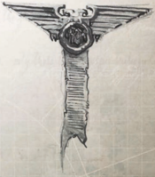

## Fallen From Grace

During the Age of Apostasy, the Imperium was plunged into anarchy  when  the  insane  High  Lord  of  the  Administratum Goge  Vandire  took  absolute  control  of  the  Senatorum Imperialis and the Ecclesiarchy. For decades, the galaxy was split as Vandire's armies sought to enforce his mad rule across the Imperium. Many worlds were razed, while others resisted. Still  more  sought  to  bide  their  time,  unwilling  or  unable to commit to one faction or another. The Age of Apostasy culminated  in  an  assault  upon  Vandire's  stronghold  on Terra by a combined force of Adeptus Astartes and Adeptus Mechanicus, but it was only when Vandire's own guardians turned upon him, executing him at the height of the siege, that the civil war was finally ended.

A  Rogue  Trader  House  established  in  the  midst  of  this turbulent period will have been forged in the fire of adversity, for  many  charters  granted  at  that  time  were,  often  literally , reduced to ashes within scant decades. Vandire was an unstable and paranoid man, prone to fits of anger and contradiction. A recipient of a charter he himself granted days before might be declared a heretic before even undertaking his mission, or a  favourite  promised  the  highest  of  rewards  executed  upon the day of investiture. As such, very few of the Houses that came into being during the Age of Apostasy are extant in the 41st Millennium, and those that are keep the details of their founding far from prying eyes. Some have disappeared entirely, though  even  millennia  since,  rumours  of  far-flung  empires established by Vandire's favourites continue to surface.

In  the  immediate  aftermath  of  the  Age  of  Apostasy,  it  is said that the Houses established by the hand of Vandire were required  to  renew  their  oaths,  in  person,  to  Sebastian  Thor, the  figurehead  of  the  movement  that  overthrew  him.  Some of those charters were revoked, it is suggested, for they were judged to have been granted for deeds later found contrary to the good of the Imperium. Others were ratified, the recipients  bending  knee  before  Thor  and  pledging the fealty of their Houses for all eternity .

Ship Points: 8

Profit Factor: 6## Struggling

The Age of Redemption was a second great time of re-conquest and expansion beginning in the immediate aftermath of the Age of Apostasy, which some believe increased the Imperium's size to its greatest extent, however temporarily . The Warrants of  Trade  issued  in  this  period,  particularly  at  its  dawning, reflect  the  spirit  of  the  times.  Following  the  example  set  by the  great  Saint  Sebastian  Thor,  the  Imperium  experienced  a renaissance in faith and fervour, and many of the Rogue Traders commissioned were men of great outward zeal, while others were warriors and captains rewarded for their deeds both great and terrible in the Apostasy's wars. Confessors preached the renewed Imperial Creed across the length and breadth of the Imperium, mustering many thousands of crusades to take the True Faith to those who had turned from its ways. Many of these  crusades  were  led  by  celebrated  generals  and  admirals of the Imperium and some by the lords of the Ecclesiarchy or mighty Space Marines themselves, but a great many smaller and further flung enterprises in crusade and conquest on this era were spearheaded by a new generation of Rogue Traders.

At the beginning of the Age of Redemption, the crusades were  preached  in  order  to  bring  back  into  the  fold  those systems  and  sectors  that  had  strayed  from  the  light  of  the Imperial Creed during the Age of Apostasy. Initially at least only those who would not denounce the errors of their ways would be punished, while those willing to hear the truth and make  contrition  would  be  spared  the  terrible  wrath  of  the crusades. In time, the crusades pushed beyond areas lost during the Apostasy, and onwards, into regions of space that had never known  the  word  of  the  Imperial  Creed.  Such  fragments  of mankind found among these distant stars had been isolated for many millenia, long back into the near-mythical Age of Strife and most could not be reasoned with, save perhaps beneath the guns of the crusades' warships. More often than not the crusaders  resorted  to  the  fires  of  purgation,  either  through intransigence by those they found, or in horror of what these far-flung children of humanity had become, wiping out any sign of what they deemed heresy, and consigning the souls of the slain to make their own representations before the Emperor. An  age  that  had  dawned  amidst  hope  soon  became  one  of relentless bloodshed and terror, often waged for little gain.

As the crusades of the Age of Redemption ground on into centuries  and  the  centuries  into  millennia,  more  resources were ploughed into their maintenance. Many became simple wars of attrition, meat grinders on a galactic scale, spurred on by fear, xenocidal hatred and worst of all, simple habit. Inexorably, the worlds of the Imperium began to be stripped of their warriors, and the Imperium's resources and fleets spread ever-thinner as the demands of eternal war at the fringes of the galaxy required. These wars were fought against those for whom the Emperor represented not the salvation of Man's soul, but its monstrous corpse-puppeteer.

The  scion of a Rogue  Trader  House  established during this age will be steeped in duty and zeal, ever determined to take the word of the Imperial Creed to those who would deny it.

Ship Points: 6 Profit Factor: 4

## Stable

As the glories of the Age of Redemption recede into a bloody present,  the  Imperium  is  slowly  descending  into  another dark age of anarchy and war. So depleted were the defences of many worlds by endless crusade that internal strife soon erupted  into  outright  rebellion,  and  small-scale  alien  raids escalated into full-scale invasions. Most dreadful of all, as the grip of the Adeptus Terra weakens across countless thousands of worlds, psykers have been left to come into their powers before they can be culled, and soon their errant powers are creating gateways into warp from which a legion of daemonic horrors  erupt.  Within  a  comparably  few  generations,  the Imperium has lost untold numbers of worlds to the traitor, the alien and the daemon and humanity's future seems bleak.

Yet  even  in  such  a  turbulent  age,  the  High  Lords  have continued to grant new Warrants of Trade. As war and strife has claimed more and more worlds, so the need to redress the balance has grown all the more apparent, and nor is the weakening of the Imperium's fabric by any means universal or irreparable. Many Rogue Traders have been granted their charters in recent centuries with the express condition that they  undertake  missions  of  to  re-conquer  worlds  lost  to anarchy and invasion.

Many of these charters are little more than political tools, granted in the hope that the Rogue Traders will have the drive to succeed or at least wear down an enemy where depleted local  forces  either  had  failed,  or  been  redeployed  away  to more vital duties, leading some Rogue Traders of more ancient pedigree to mockingly name them 'suicide notes.' Countless Rogue Traders lost all they owned, including their lives and souls, in the attempt to satisfy the nigh impossible demands placed on them in the granting of these Warrants. Yet, some do  succeed  and  claw  back  both  territory  and  millions  of lost souls from the darkness. The most exceptional of these individuals have gone on to found the mightiest of the Rogue Trader Houses active at the present time. Though young in comparison to the ten thousand year old Imperium of Man, these upstart houses now rank above many older lines, for they were forged in the fires of adversity and driven by a will to endure rarely seen before or since.

Ship Points:

4

Profit Factor: 2

## Ascending

The future  of  your  Rogue  Trader  House  rests  in  your  hands, but you may first have to rescue it from the state in which a predecessor left it. Or perhaps yours is the unenviable task of living up to the successes of your forebears. Whatever the case, you can be sure than the eyes of generations yet to come will be upon you, and history will be the judge of your actions.

## Rising Star

The galaxy is a harsh place, and none are owed the success they seek. Countless numbers of Rogue Traders lose their livelihoods each year. Indeed, the entire institution of the Warrant of Trade could be said to rely upon a constant 'pruning' of the dynasties as  a  form  of  natural  selection,  ensuring  that  only  the  most driven and skilled of individuals continue to prosper.

A  House  that  has  fallen  from  grace  might  retain  scant resources-perhaps just a vessel and a skeleton crew of bonded retainers.  Such  a  Rogue  Trader  would  be  fully  aware  of  his situation and might be driven to extreme measures just to get by.  Although  the  Warrant  of  Trade  grants  even  the  lowliest Rogue Trader unimaginable rights, there are activities even the most powerful would be wise to avoid. A Rogue Trader with nothing to lose might be tempted to seek dealings with xenos or to explore regions long forbidden, even to his kind.

Having  fallen  from  grace  does  not  imply  permanent  misfortune, however. Perhaps a very powerful Dynasty has suffered a reversal in political status, finding formally staunch allies turning their backs and fractious competitors aligning themselves against it. And so the Rogue Trader's fortunes might turn full circle, the rising star falling from grace in the blink of an eye.

Ship Points: 4

Profit Factor: 2

*Source:* `Battle Fleet of the Koronus, pages 36–38`
