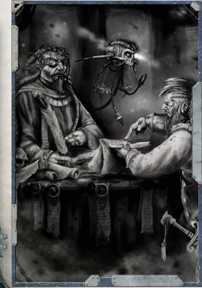

'Fascinating. I did not expect your proposed 'hostile takeover' of this venture to be quite so...hostile.'

-Magos Kell, to Rogue Trader Aspyce Chorda

T he ROGUE TRADER Core Rulebook presents the basic mechanics  behind  gameplay  in  Chapter  9:  Playing the Game. In this chapter, several aspects of gameplay are expanded, to create a more versatile ruleset and richer game experience.

The  four  primary  focuses  for  this  chapter  are  Social interaction  Challenges,  Meta  and  Background  Endeavours, Expanded Acquisition Rules, and rules covering Ship Roles. Of these, the Meta and Background Endeavours and Expanded Acquisition  Rules  are  expanded  developments  on  existing rules, while social interaction Challenges and Ship Roles are new (however, social interaction Challenges are very similar to Exploration and Investigation Challenges).

*Source:* `Into the Storm, page 205`
