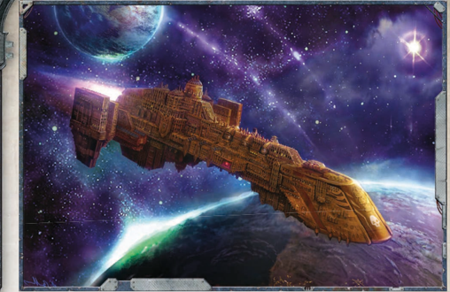

## Essential Components

Hull,  Strelov  2  Warp  Engine,  Geller  Field,  Jovian  Pattern Class 3 Drive, Void Shield, Explorator Bridge, Vitae Pattern Life Sustainer, Voidsmen Quarters, Deep Void Auger Array

## Supplemental Components

Prow  Titanforge  Lance  Battery,  Port  Mars  Pattern  Macrocannon Broadside, Starboard Mars Pattern Macrocannon Broadside, Crew Reclamation  Facility,  Extended  Supply  Vaults,  Cargo Hold and Lighter Bay

## Complications

Haunted, Resolute

## Choosing the Measured Response

Hull: Raider

Class: Converted Cobra class Naval destroyer

Dimensions: 1.5 km long, .3 km abeam at fins approx

Mass: 5.5megatonnes, approx.

Crew: 15500 crew, approx.

Accel: 6.6 gravities max. sustainable acceleration

The Measured  Response is  a  heavily  converted  Cobra  Class destroyer.  Laid  down  in  Scintilla's  primary  naval  drydocks in  the  year  M40.980,  it  spent  the  next  250  years  serving uneventfully  throughout  the  Calixis  Sector  until  it  was decommissioned from Battlefleet Calixis and sold.

The buyer, a wealthy noble's son, removed the ship's torpedo tubes-replacing them with multiple plasma macrocannonsand used the torpedo stowage for cargo holds. He christened the new ship the Measured Response and departed for Port Wander and the Koronus Passage, but the ship was soon hijacked by a succession  of  ruthless  pirate  captains.  Eventually ,  the  Rogue  Trader Van  Royyl  met  the Measured  Response in  M41.692,  boarding, capturing, and taking it as a prize, then selling it to recoup costs. Although its pirate days are over, there are still many who desire revenge against the ship, no matter who crews it.

Some crew report that the ship's auger arrays are unusually sensitive when searching for other vessels, as though hundreds of years of piracy leave the ship eager for its next victim.

Speed:

10

Manoeuvrability: +27

Detection:

+20

Hull Integrity:

30

Armour:

14

Turret Rating: 1

Space:

35 (Used: 35) Power: 45 (Used: 42)

Weapon Capacity: Dorsal 1, Prow 1

SP Total Cost: 35

*Source:* `Battle Fleet of the Koronus, pages 166–167`
