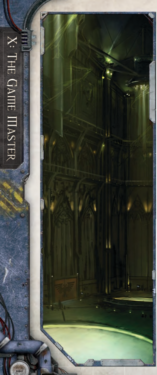

'Defeat is all too often the fate of the bold-clawing victory from the jaws of defeat is a fate we make for ourselves.'

-Excerpt from 'A Cold Trader's Tale'

W here there is opportunity and glory, so to will there be pitfalls and perils to assail the Explorers at every turn. This is where Misfortunes rear their ugly heads. These are plot hooks and obstacles that represent events which [Damage](character-injury.md) the Explorers' [Profit Factor](economy-wealth-and-acquisitions.md). They are devices-much like [Endeavours](economy-endeavours.md)-that the GM can use to simulate the vast and varied interests, allies, and [Influence](economy-influence-rules.md) of the Explorers' dynasty . They help to capture the feel of a sprawling organisation with power spread across the stars. The GM can use Misfortunes in one of two ways: either as a method of representing an event, player-generated  or  not,  in  which  harm  befalls  the  power and wealth of the PCs' dynasty or as part  of  [Complications](ships-npc-vessels.md) arising  around  an  Endeavour.  In  both  cases,  when  the  GM feels that the Explorers are at risk of a Misfortune, he can use Table 9-41: Misfortunes to determine if one occurs and its level of severity . To keep the players on their toes the GM may choose to roll  once  on  this  table  at  the  start  of  any  session in  which  they  are  involved  in  one  or  more  Endeavoursrepresenting the myriad of perils faced by their dynasty .

If a Misfortune occurs, regardless of its [Size](character-traits.md), the GM should then  roll  on Table  9-42:  Misfortune  Details to  find  the nature of the problem. Alternately, the GM can choose whether a Misfortune occurs and the details of the Misfortune to reflect his own plots and adventures.

## The Cost of Misfortunes

As soon as a Misfortune is created, [Profit Factor](economy-wealth-and-acquisitions.md) is reduced by the amount shown in Table 9-41: Misfortunes . The worse the Misfortune, the more [Profit Factor](economy-wealth-and-acquisitions.md) is lost. If the players act rapidly to overcome a Misfortune, however, some or all of this loss can be restored-so it is important for the Game Master to record the amount of Profit Factor lost with each new Misfortune.## Overcoming Misfortunes

When  a  Misfortune  occurs,  the  Explorers  are  faced  with two  choices:  they  can  deal  with  it  or  ignore  it.  Ignoring  a Misfortune means that the Profit Factor lost to it is permanent, and at the GM's discretion, there may be other consequences as  well,  as  plagues  are  allowed  to  [Run](rules-combat-overview.md)  rampant,  charges  are gathered against the Explorers, or worlds slowly fall into chaos. If the Explorers choose to deal with the Misfortune, then they must allocate time and resources to combating it-perhaps at the expense of current [Endeavours](economy-endeavours.md) or missions. It then falls to the GM to decide if they have acted both swiftly enough and decisively enough to overcome the Misfortune. If they have, then he should allow them to recover any Profit Factor lost to the Misfortune.

| Table d100   | 9-41: Misfortunes Result                         | Profit Factor Lost   |
|--------------|--------------------------------------------------|----------------------|
| 01-49        | Fate smiles upon the Rogue Trader: no Misfortune | -                    |
| 50-65        | Nuisance Misfortune                              | 1                    |
| 66-90        | Grim Misfortune                                  | 2                    |
| 90-00        | Calamitous Misfortune                            | 1d5                  |

| Table   | 9-42: Misfortune Details                                                                                                                                                                                                                                                           |
|---------|------------------------------------------------------------------------------------------------------------------------------------------------------------------------------------------------------------------------------------------------------------------------------------|
| 1d100   | Misfortune Details                                                                                                                                                                                                                                                                 |
| 01-05   | Administratum tithe clerks flock for an assessment, empowered by their superiors to bleed the Rogue Trader a little more in the name of the God-Emperor.                                                                                                                           |
| 06-10   | Departmento Munitorum officers have come into evidence that the Rogue Trader has siphoned materiel from their Port Wander vaults, and are pressing upon him with the full force of Imperial law. The evidence is all false, of course, but what [Motivation](chargen-stage2-origin-path.md) is behind this outrage? |
| 11-15   | A setback in the tending of coffers: ledgers are errant and Thrones are lost. Is this a careless accident or hidden embezzlement?                                                                                                                                                  |
| 16-20   | A dire plague is abroad, and the merest threat of it is enough for quarantines and panic. Even places unaffected by the plague are disrupted by the havoc it wreaks many worlds away.                                                                                              |
| 21-25   | An accident fells many skilled hirelings, leaving too few possessing a rare talent in a vital position. Is it really an accident, however?                                                                                                                                         |
| 26-30   | A [Corruption](character-corruption.md) takes hold in one of the Rogue Trader's interests: cultists of the Dark Gods, a wayward Imperial Cult, or an unruly Crew Brotherhood act to sow toil and make trouble.                                                                                                |
| 31-35   | Zealots amongst the Rogue Trader's interests are stirring up the workers to make pilgrimage to the shrine worlds of the Drusus Marches. Toil is slackening, and servants are slipping away or rising up to petition the Rogue Trader to grant them leave to be pilgrims.           |
| 36-40   | An ambitious Magos demands a new [Compact](weapons-upgrades.md) of tech-ritual and prayer, one much more favourable to Machine Cult coffers.                                                                                                                                                              |
| 41-45   | A Grand Assemblage of the Omnissiah's Grace is called by an Archmagos, and all Tech-Adepts pledged to the Rogue Trader are much withdrawn, the Machine Cult distant from what its Magi perceive as trivial responsibilities towards compacts and Imperial brethren.                |
| 46-50   | The sub-sector trade market enters one of its doleful periods of crisis, loss, and hand-wringing. Merchant houses suffer and cut short their [Endeavours](economy-endeavours.md).                                                                                                                           |
| 51-55   | A new dictate of mercantile law has come to the Drusus Marches from Scintilla, and the upheaval that attends it is dire indeed. Many important guilders are ruined or driven to other lines of commerce, and many compacts are now worthless.                                      |
| 56-60   | Pirates from Iniquity, thought broken and scattered, strike at the Rogue Trader's interests, assaulting vessels and raiding resource worlds.                                                                                                                                       |
| 61-65   | The vile Ork emerges to loot and destroy the Rogue Trader's interests in the Koronus Expanse.                                                                                                                                                                                      |
| 66-70   | Calixian leaders of a great Imperial organisation suddenly display far less respect for Rogue Traders. This change of opinion will spread from the top down and out into the broader Imperial class if not stopped.                                                                |
| 71-75   | The Rogue Trader is supposed by some to be an adherent of one of the unseemly Imperial cults of Footfall, placing him well on the outside of civilised Imperial society in Port Wander and the Drusus Marches.                                                                     |
| 76-80   | An influential noble or powerful Imperial hierarch chooses to denigrate the Rogue Trader, and all the sycophants follow that lead. This disrespect will spread from the top down into the broader Imperial class if not stopped.                                                   |
| 81-85   | The Rogue Trader is rumoured to have died. Administratum adepts now move slowly and inexorably towards the legal annulment of his Warrant of Trade.                                                                                                                                |
| 86-90   | Adeptus Arbites find, or are provided with, evidence of rebellion fomented amongst the Rogue Trader's hirelings. A lord perceived to hold an unruly estate will suffer in the eyes of his peers.                                                                                   |
| 91-95   | A [Rival](talents-descriptions.md)'s [Hatred](talents-descriptions.md) for the Rogue Trader becomes well known, and many lesser figures prefer not to become involved with either side whilst such an enmity exists. Now, the rival has begun to strike openly against the Rogue Trader's interests.                                     |
| 96-100  | The Rogue Trader receives an unexplained and unexpected visitation from highly ranked members of The Inquisition, an event guaranteed to harm his prospects when word gets out.                                                                                                    |

*Source:* `Roguetrader Corerulebook, pages 284–285`
