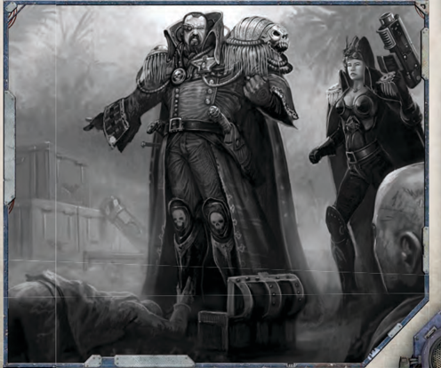

## Skill Tests

The  most  common  type  of  test an explorer performs during the game is Skill Tests. Each Skill is governed by a characteristic. For example, the [Dodge](rules-combat-overview.md) Skill is governed by the  Agility  Characteristic.  To  make  a  Skill  Test,  add  any relevant modifiers to the skill's governing Characteristic, then make a percentage roll. If the result is equal to or less than the modified Characteristic, the test succeeds. If the result is greater than the modified Characteristic, the test fails.

Success is more likely to occur in a Skill Test where the character  has  training  in  the  Skill.  An  explorer  can  still attempt a Skill Test with an Untrained Basic Skill, but in such cases,  the  governing Characteristic is halved (round down). If a Untrained Basic Skill Test involves situational modifiers, those modifiers are applied after the governing characteristic is  halved.  A  character  cannot  attempt  a  Skill  Test  with  an Untrained Advanced Skill.

| Table 9-1:                       | Skill Tests                              |
|----------------------------------|------------------------------------------|
| Type of Skill                    | Effect on Skill Test                     |
| Untrained Basic Skill            | Test at half Characteristic (round down) |
| Untrained Advanced Skill         | Cannot perform a test with this Skill    |
| Trained Basic or Advanced Skill  | Test at full Characteristic              |
| Mastered Basic or Advanced Skill | Test at full Characteristic +10 or +20   |

### Example

Drake wants to slip past a guard so he can gain access to a highsecurity area. The GM declares that Silent Move is most appropriate for  this  situation,  which  is  a  Skill  governed  by  Agility.  Drake's Agility  is  34,  but  he  doesn't  have  training  in  Silent  Move.  Since Silent Move is a Basic Skill, Drake can still make the attempt at half his normal Agility, which is 17. Drake's player makes a percentile roll and gets a 29, which is higher than 17, so the test fails.

The guard, now alerted to Drake's presence, hits Drake with a shock maul. Drake has one chance to avoid [The Attack](rules-combat-overview.md) by attempting a [Dodge](rules-combat-overview.md) Test. Dodge is a Basic Skill governed by Agility, and Drake has Training in Dodge, so he gets to use his full Agility score for the test, which is 34. Drake's player makes a percentile roll and gets a 33-a narrow success! Drake dodges the attack just in time.

## Characteristic Tests

Sometimes  an  explorer  wants  to  attempt  something  not covered  by  a  Skill.  In  such  cases,  a  Characteristic  Test  can be used instead of a Skill Test. The GM determines the most appropriate  Characteristic  for  the  test,  and  then  the  player makes a percentage roll. If the roll is equal to or less than the Characteristic, the test succeeds. If the roll is greater than the Characteristic, the test fails.

It  is  important  to  note  that,  despite  their  names,  both [Weapons](weapons-general.md) Skill and Ballistics Skill are [Characteristics](starship-anatomy-detailed.md).

| Table 9-2:      | [Characteristics](starship-anatomy-detailed.md) Tests                                                         |
|-----------------|-------------------------------------------------------------------------------|
| Characteristic  | Example Tests                                                                 |
| Weapon Skill    | Make an [Attack](combat-attack-rules.md) with a melee weapon.                                           |
| Ballistic Skill | Make an attack with a ranged weapon.                                          |
| Strength        | Break down a door, restrain a captive, push over a Grox.                      |
| Toughness       | Resist poison or disease, tolerate temperature extremes, stave off hunger.    |
| Agility         | Maintain balance on a narrow surface, navigate treacherous terrain.           |
| Intelligence    | Recall an important detail, identify a familiar face, solve a puzzle.         |
| Perception      | Notice a hidden enemy, locate a secret door, gauge another person's attitude. |
| Willpower       | Resist a Psychic Power, torture or [Fear](character-fear-and-damnation.md).                                      |
| Fellowship      | Make a good impression, [Inspire](psychic-disciplines-list.md) confidence, seduce a target.                  |## The Core Mechanic

- Determine the Skill or Characteristic to test ·
- Add or subtract any relevant modifiers to the Skill · or Characteristic
- Make a percentile roll (1d100) ·
- If the percentile roll is less than or equal to the Skill · or Characteristic being tested, the test succeeds
- If  the  percentile  roll  is  greater  than  the  Skill  or · Characteristic being tested, the test fails

## Degrees of Success and Failure

For  most  tests,  it  is  enough  to  know  whether  a  character succeeded or failed. Sometimes, however, it is useful to know how well a character succeeded, or how badly he failed. This is particularly important with social Skills, such as [Charm](equipment-gear.md) and Inquiry, as well certain [Combat](rules-combat-overview.md) situations, such firing a gun capable of a semi-automatic or fully automatic burst.

Measuring  degrees  of  success  and  failure  in  a  Skill  or Characteristic  Test  is  straightforward.  After  the  percentage roll is made, compare the roll with the modified Characteristic score. For each full 10 points by which the Characteristic was exceeded, one degree of success is achieved. Conversely, for each 10 full points by which the test failed, one degree of failure is gained.

## Example

Yolanda's freighter has been intercepted by patrol ships from a nearby planet  who  are  demanding  a  hefty  20%  of  Y olanda's  precious  cargo as a 'safety tax.' Y olanda doesn't want stir up a lot of trouble, so she tries to negotiate with the patrol. The GM calls for a Barter Skill T est. Yolanda's Fellowship is 42, and she has Barter trained. Her player makes a percentage roll and gets an 18! Y olanda not only succeeds, she achieves two degrees of success (success because her roll was 42 or less, one degree of success because her roll was 32 or less, and a second degree of success because her roll was 22 or less). The GM rules that Y olanda manages to talk the patrol into reducing their tax to only 5% of the cargo.

## Extended Tests

Some tasks are quite complicated and may take extra time or effort to finish. In these cases, the GM may decide that

it takes more than one successful Skill Test to complete the task. This is known as an Extended Test. Generally, the Skill in question describes whether it requires an Extended Test, though the GM may adjust the time represented by each test depending on what is in fact being attempted.

## Opposed Tests

Sometimes  an  explorer  needs  to  test  himself  against  an opponent. This is known as an Opposed Test. For example, if an explorer needed to hide from a guard, he could test his Concealment Skill against the guard's Awareness Skill.

In  an  Opposed  Skill  Test,  both  participants  make  tests normally. Whoever succeeds at his test wins. If both participants succeed, the one with the most degrees of success wins. If the both degrees of success are the same, the highest Characteristic Bonus wins. If the result is still a tie, the lowest dice roll wins.

Should both parties fail, one of two things occurs. Either there is a stalemate and nothing happens or both parties should re-roll until there is a clear winner.

## Example

Drake is trying to convince a planet's security director that his cargo load of high explosives is for the iron mining conglomerate, and in no way will the cargo fall into the hands of the local rebels. The GM knows Drake's true intentions and calls for a Drake to make a Deceive T est, which will be opposed by the security director's Scrutiny T est. Drake' s player rolls and succeeds. The GM rolls for the security director and succeeds with one degree of success, which causes him to win the Opposed T est. The security director doesn' t buy Drake' s story and has the cargo impounded.

## Test Difficulty

Not all tests are equal. A routine landing at a spaceport and navigating  a  dense  asteroid  field  at  high  speed  may  both require Piloting Tests, but the latter is clearly harder than the former. This is where test difficulty and the roll of the GM both come into play.

In some cases, the difficulty of a test is pre-determined by the rules; in other cases, the GM should decide the difficulty and  consult Table  9-3:  Test  Difficulty to  determine  the appropriate modifier. The difficulty modifier is applied to the governing Characteristic associated with the test.

## Example

Yolanda has discovered some ancient documents that could be a clue in her search for lost Imperial technology, if only she can parse the content. The GM calls for a Hard (-20) Scholastic Lore: Legend T est. Yolanda's Intelligence is 44, and she has Scholastic Lore: Legend trained, but because of the difficulty of the test, she subtracts 20 from her Intelligence, which means she needs to roll 24 or less on her percentage roll to succeed.

## Assistance

In some situations, multiple characters working together have a  better  chance  of  completing  the  task  than  if  a  character attempts it alone. With the GM's permission, a character can assist  another  character  that  is  performing  a  test.  Only  the character that is actually performing the test rolls dice. Each character assisting reduces the difficulty by one step. If the test succeeds, the character performing the test gains an extra degree of success.

### Limits on Assistance

Characters can assist each other in most tasks but there are limits:

- To  give  assistance  on  a  Skill  Test,  a  character  must  have · training in the skill
- The  assisting  character  must  be  adjacent  to  the  character · performing the test
- Assistance cannot be given for [Reactions](rules-combat-overview.md) or [Free Actions](rules-combat-overview.md) ·
- Assistance cannot be given on tests made to resist disease, · poison, [Fear](character-fear-and-damnation.md), or anything else the GM deems inappropriate
- No more than two characters may attempt to assist another · on a single test

### Example

Deavon is locked in a cell and his companion Drake wants to set him free. The lock on the cell is old and not particularly sophisticated, but Drake doesn't have the Security Skill trained, so he is unlikely to succeed at the test on his own. Deavon does have the Security Skill trained, so he lends assistance by talking Drake through the whole process. The GM declares the normal difficulty for this test is Ordinary (+10), but with Deavon's Assistance, the test  becomes  R outine  (+20).  Furthermore, if Drake succeeds at the test, he will automatically gain an extra degree of success.

| Table 9-3: Test Difficulty   | Table 9-3: Test Difficulty   |
|------------------------------|------------------------------|
| Difficulty                   | Test Modifier                |
| Trivial                      | +60                          |
| Elementary                   | +50                          |
| Simple                       | +40                          |
| Easy                         | +30                          |
| Routine                      | +20                          |
| Ordinary                     | +10                          |
| Challenging                  | +0                           |
| Difficult                    | -10                          |
| Hard                         | -20                          |
| Very Hard                    | -30                          |
| Arduous                      | -40                          |
| Punishing                    | -50                          |
| Hellish                      | -60                          |

*Source:* `Roguetrader Corerulebook, pages 231–233`
