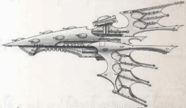

## Using Eldar Cruisers

Eldar escorts are a significant but not insurmountable challengetheir  powerful  weaponry  and  ability  to  avoid hits  [Balanced](weapons-general.md)  by  their  lack  of  [Armour](armour.md)  and  [Hull](starship-anatomy-detailed.md) Integrity.  If  one  can  land  a  hit,  it  is  likely  to do  serious  [Damage](character-injury.md).  Eldar  [Cruisers](hulls-overview.md)  are  another matter. Their additional Hull Integrity gives them durability and while their manoeuvrability and  speed  are  lower,  they  still  [Rival](talents-descriptions.md)  the  best Imperial  escorts.  Both  cruisers  are  some  of  the most dangerous  Eldar ships, a difficult match for anything less than a full cruiser one on one.

Eclipses  dance  around  the  edges  of  a  conflict, barraging their opposition with fighters and bombers. If  a  damaged target presents itself,  they  dart  in  and destroy it with Pulsar Lance fire before falling back. Shadows  can  be  slightly  more  aggressive,  shaking targets with [Torpedoes](weapons-torpedoes.md) before closing to deliver punishing volleys of starcannon fire. Both generally retreat if reduced to 5 Hull Integrity or less. retreat if reduced to 5 Hull Integrity or less.

The Shadow class combines tremendous speed, manoeuvrability, and offensive firepower into a single, highly-effective package. The bane of Imperial shipping in the Koronus Sector, Shadow-class cruisers normally form the centre of a Corsair strike fleet. The Shadow class combines tremendous speed, manoeuvrability, and offensive firepower into a single, highly-effective package.

Speed: 9

Manoeuvrability: +26

Detection:

+20

[Void Shields](components-void-shields.md): -

Armour:

15

Hull Integrity:

60

Morale:

100

Crew Population:

100

Crew Rating:

Veteran (50)

Turret Rating: 1

Weapon Capacity: Prow 3, Keel 1

## Essential Components

Large Solar Sails, Warp-Plotter, [Command Bridge](starship-essential-components.md), Eldar Life Sustainer, Eldar Crew Quarters, Sensor Array

## Supplemental Components

3 Prow Starcannon Cluster Batteries: (Macrobattery; Strength 4; [Damage](character-injury.md) 1d10+2; Crit Rating 4; Range 4; Superior Accuracy) Keel  Torpedo  Tubes: (T orpedo  Tubes;  Strength  4;  Damage 2d10+14; Range 40; [Defensive](weapons-general.md) Holofield, Terminal Penetration [3]) These [Torpedo Tubes](components-torpedo-tubes.md) are loaded with Eldar plasma [Torpedoes](weapons-torpedoes.md), though they could also be loaded with different torpedoes at the

- GM's discretion. This Component has 32 torpedoes.

Holofield: See page 86 for full rules.

[Stowage Bays](ships-npc-vessels.md): Corsair vessels aren't interested in trade, and store whatever cargo they acquire from a captured vessel in these smaller bays. However, if this ship is captured with this Component intact, the captors gain 50 [Achievement Points](economy-endeavours.md).

## Modifier Summery

The following modifiers apply to the Shadow:

- -1  Movement  if  heading  towards  the  nearest  sun,  +1 Movement if at right angle, no effect if moving away.
- Add 1 to Crew Population loss suffered.
- Subtract 1 from Morale loss suffered. (to a minimum of 1).
- -40 on any Test to hit the ship with [Lances](starship-supplemental-components.md), [Torpedoes](weapons-torpedoes.md), [Attack](combat-attack-rules.md)  craft  or  by  ramming.  -20  to  hit  the  ship  with macrobatteries.
- -30 on any Extended Action involving Detection.
- +10  to  all  Ballistics  Tests  involving  the  Starcannon Cluster Battery.
- Torpedoes  negate  Turret  Rating  bonuses  and  use Seeking Rules.

*Source:* `Battle Fleet of the Koronus, page 91`
