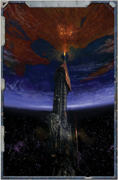

[Triage](starship-combat-rules.md) reflects the efforts of the unit's medics and chirugeons to  treat  casualties  throughout  the  [Combat](rules-combat-overview.md)  as  quickly  as possible. With a Hard (-20) Medicae Test , the Explorer can reduce lost Unit Strength by half and lost morale by one-quarter. This only applies to [Damage](character-injury.md) suffered during the previous Strategic Turn.

*Source:* `Battle Fleet of the Koronus, page 137`
