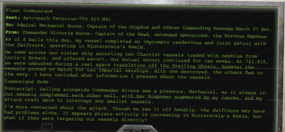
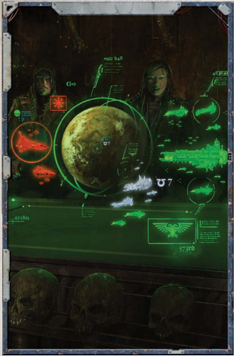

Terrifyingly  potent  vessels,  battleships  normally  mount  the equivalent  armament  of  two  [Cruisers](hulls-overview.md)  or  a  small  squadron  of frigates or [Raiders](ships-raiders-overview.md). The average battleship is slow and lacking in

manoeuvrability, but extremely resilient in terms of [Armour](armour.md), [Hull](starship-anatomy-detailed.md) integrity and layers of void shielding. Depending on armament and configuration, a battleship may be able to direct four or five weapon Components at a single target, a potentially crippling amount of firepower for any smaller vessel.

*Source:* `Battle Fleet of the Koronus, page 117`
