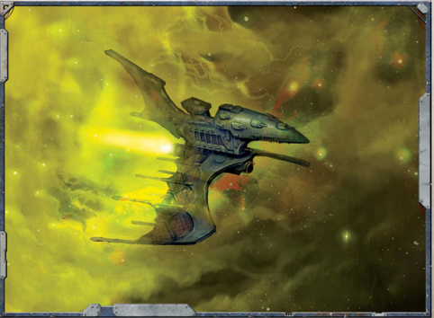

Eldar  starships,  when  compared  to  the  massive  [Cruisers](hulls-overview.md)  of  the Imperium, seem almost fragile. Their ships lack the thick plating, heavy  prows,  and  bristling  towers  of  Imperial  Navy  vessels, instead  sporting  long  masts  which  support  the  vessel's  sail-like solar collectors. Their ships also have a sleeker shape, generally possessing  rounded,  almost  oval  hulls,  and  an  'organic'  look

(although nowhere near the quasi-insectoid appearance of Tyranid vessels). Naval officers sighting Eldar voidships for the first time often dismiss them as easy prey for Imperial [Macrobatteries](starship-supplemental-components.md) and lances. Nothing, however, could be further from the truth.

[The Eldar](faction-eldar-overview.md) are perhaps the most accomplished starfarers in the  galaxy .  Their  ships  are  significantly  more  advanced  than those of the Imperium, and are equipped with technologies far beyond the abilities of The Adeptus Mechanicus to understand, much less duplicate. The [Hull](starship-anatomy-detailed.md) of an Eldar ship is made not from adamantium plating, but from a material called 'wraithbone.' Molded by Eldar craftsmen known as Bonesingers, wraithbone is literally grown into what ever shape is needed, be it [Armour](armour.md), [Weapons](weapons-general.md),  buildings,  or  kilometres-long  voidships.  Durable, difficult  to  [Damage](character-injury.md),  and  even  capable  to  a  certain  degree  of self-repair,  wraithbone  is  psychically  active  and  on  Eldar ships replaces the vox units and cogitators found on Imperial vessels.  Wraithbone  also  manifests  innate  psychic  shielding, partially  protecting  the  vessel  (and  its  crew)  against  certain manifestations from the void.

Instead of crude [Plasma Drives](components-plasma-drives.md), the Eldar use vast solar sails to collect the light of the stars. These sails allow Eldar ships to move swiftly and securely, and are one of the reasons behind their impressive and unparalleled manoeuvrability. [Small Craft](attack-craft-small-craft.md) may only have a single solar sail, while larger craft may have two or three, giving the ships the appearance of winged creatures.

Defensively, Eldar forego the use of [Void Shields](components-void-shields.md) and instead rely on their holofields for protection. A holofield confuses a ship's targeting sensors by creating multiple 'ghost ships'

randomly across an area of space. These ghosts mask the actual location of the Elder ship. While this means an Eldar ship can be nigh-impossible to hit, their lack of void shields renders them vulnerable to those shots that do find their target. While immensely  sophisticated,  even  Eldar  construction  is  not  as durable as multi-metre thick adamantium armour layers and thousands of redundant components and replacement crew.

*Source:* `Battle Fleet of the Koronus, page 85`
