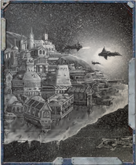
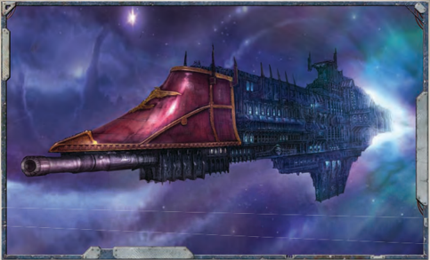

## Wolfpack Raider

[Hull](starship-anatomy-detailed.md): Raider

Class: Pirate vessel of Unknown type

Dimensions: aprox 1.7 km long, 0.3 km abeam approx.

Mass: 6.5 megatons approx.

Crew: 18,000 crew, approx.

Accel: 5 gravities max sustainable acceleration

Pirates  are  known  for  using  whatever  vessels  they  can  lay their hands on. If possible, they prefer light, fast raiding ships to  strike  fast  and  flee  quickly .  Speed  is  essential,  since  few pirate vessels can stand toe-to-toe with a true warship.

Speed:

10

Manoeuvrability: +30

Detection: +10

[Armour](armour.md):

15

[Void Shields](starship-essential-components.md): 1

[Hull](starship-anatomy-detailed.md) Integrity:

30

Space:

35 (Used: 35)

Power: 45 (Used: 40)

Turret Rating: 1

Weapon Capacity: Dorsal 1, Prow 1

### Essential Components

[Strelov 1 Warp Engine](starship-essential-components.md), [Geller Field](starship-essential-components.md), Jovian Pattern Class 2 Drive, Single Void Shield Array, Standard [Bridge](starship-anatomy-detailed.md), Vitae Pattern Life Sustainer, Voidsmen Quarters, M-100 Auger Array

### Supplemental Components

Dorsal  Mars  Pattern  Macrocannons,  Prow  Sunsear  Laser Battery, [Augmented Retro-thrusters](starship-supplemental-components.md)

### Stowage Bays

Pirate  ships  do  not  often  bother  with  true  cargo  holds, preferring smaller bays where valuable cargos can be stored. Small: This  Component  allows  for  Trade  [Endeavours](economy-endeavours.md),  but provides no bonus.

## Onslaught Ork Raider

[Hull](starship-anatomy-detailed.md): [Frigate](starship-anatomy-detailed.md)

Class: Onslaught-class ork pirate raider

Dimensions: aprox 1.5 km long, .4 km abeam approx.

Mass: 9.5 megatons approx.

Crew: countless boyz, even more grots.

Accel: 2-4 gravities acceleration

Though  many  Orks  naturally  take  to  piracy,  their  tactics differ from those preferred by human buccaneers. Orks are unlikely to flee from a scrape, and their ships always reflect that, with giant armoured prows, lumbering engines, and as many [Weapons](weapons-general.md) as the meks can strap on.

Speed: 5

Manoeuvrability: +15

Detection:

+10

[Armour](armour.md):

18

[Void Shields](starship-essential-components.md): 1

Hull Integrity: 40

Space: 40 (Used: 40)

Power: 40 (Used: 35)

Turret Rating: 1

Weapon Capacity:

Dorsal 1, Prow 2

### Essential Components

Looted Drive: This may have been an STC-standard drive... once.

Warp Engine: 'Ere we go, 'ere we go!

Really Big Teef: Protects the vessel in the immaterium, and functions similarly to a Gellar field.

[Single Void Shield Array](starship-essential-components.md)

Air Pumps: Best not ask how it works.

Boyz [Barracks](starship-supplemental-components.md): No self respecting ork goes anywhere without his boyz!

### Armoured Kaptin's Bridge

There's a lot of metal between the ork boss and space.

If this Component takes a Critical Hit, becomes damaged, or suffers power loss, roll 1d10. On a 4 or

Reinforced [Armour](armour.md): higher, the component is unharmed.

Big Red Button: If this vessel chooses not to turn, it may move an additional 1d5 VUs during its [Manoeuvre](rules-combat-overview.md) Action.

### Lotsa Boyz

This Component grants +10 to all Command Tests involving boarding actions and [Hit and Run](starship-combat-rules.md) Actions.

### Supplemental Components

2x Looted Prow Macrocannons: These macrocannons used to be on an Imperial ship. Not anymore.

(Macrobattery; Strength 3; [Damage](character-injury.md) 1d10+2; Crit Rating 5; Range 5)

Dorsal  [Gunz](weapons-ork-gunz.md):  Technically  [Macrobatteries](starship-supplemental-components.md),  'improved'  with orky tek.

(Macrobattery; Strength 1d5 † ; [Damage](character-injury.md) 1d10+4; Crit Rating 6; Range 4)

† Roll Strength before firing this weapon each turn.### Stowage Bays

Pirate  ships  do  not  often  bother  with  true  cargo  holds, preferring smaller bays where valuable cargos can be stored. Cargo bay.

Booty!: If this ship is captured with this Component intact, the captors gain 50 [Achievement Points](economy-endeavours.md).

### Ork Armoured Prow

Only an ork would add a gigantic [Armoured Prow](starship-supplemental-components.md) to such a small ship.

Good an' Ard: [Macrobatteries](starship-supplemental-components.md) may still be prow [Weapons](weapons-general.md) on this vessel. This ship gains +4 [Armour](armour.md) in its fore arc only. This ship also does 1d10 additional [Damage](character-injury.md) when ramming.

### Complications

Orky Tek: This ship may not be piloted by a non-ork crew. [Components](starship-anatomy-detailed.md) from this vessel will not function if added to non-ork ships.

## Wayfarer Station

[Hull](starship-anatomy-detailed.md): Space Station

Class: Wayfarer-class station

Dimensions: 5 km in diameter, approx.

Mass: 22.1 megatons approx.

Crew: 10000 crew, 80000-100000 inhabitants (many of whom also perform 'crew' duties), approx.

A general class of small space stations, designed to operate without constant support on the frontier. Many have evolved into independent trading communities or refuelling depots, cut of from regular contact with the Imperium.

Speed: -

Manoeuvrability: -

Detection: +20

[Armour](armour.md):

18

[Void Shields](starship-essential-components.md): 2

[Hull](starship-anatomy-detailed.md) Integrity: 60

Space: 80 (Used: 78)

Power:

50 (Used: 47)

Turret Rating: 2

Weapon Capacity:

Keel 3

### Essential Components

Station Genatorium: The station's power generation facilities. [Multiple Void Shield Array](starship-essential-components.md) [Vitae Pattern Life Sustainer](starship-essential-components.md)

### Stationmaster Bridge

The  [Bridge](starship-anatomy-detailed.md)  of  a  space  station  is  equipped  to supervise fast repairs.

[Damage](character-injury.md) Control Station: As long as the

[Bridge](starship-anatomy-detailed.md) remains undamaged, all Tech-Use Tests to repair the station gain +10.

### Supplemental Components

2 Keel [Mars Pattern Macrocannons](starship-supplemental-components.md)

(Macrobattery; Strength 3; [Damage](character-injury.md) 1d10+2; Crit Rating 5; Range 6)

Keel [Starbreaker Lance Weapon](starship-supplemental-components.md)

(Lance; Strength 1; [Damage](character-injury.md) 1d10+2; Crit Rating 4; Range 4)

3 Civitas Decks: All aspects of a thriving, bustling community with  many  thousands  of  inhabitants  can  be  found  on  these decks.

Docks: Any [Size](character-traits.md) of ship smaller than a [Cruiser](starship-anatomy-detailed.md) may dock with station on- and off-loading supplies and cargo.

### Hydroponics Decks

Essential  for  providing  food  and  clean  air  to  a  void-born population.

Sustaining: This  station  suffers  no  penalties  to  Crew  Population or Morale for remaining in space for an extended period.

### Complications

Space Station: By its very nature a space station is completely immobile  (including  realspace  and  warp  travel),  and  does not  require  the  same  [Components](starship-anatomy-detailed.md)  as  a  starship.  A  space station  requires  the  following  Essential  [Components](starship-anatomy-detailed.md):  Hull, Genatorium, Void Shield Array, Bridge, and Life Sustainer. In [Combat](rules-combat-overview.md), a space station never moves or performs [Manoeuvre Actions](starship-combat-rules.md). Otherwise, it should be treated as a starship during [Combat](rules-combat-overview.md).

*Source:* `Roguetrader Corerulebook, pages 210–211`
