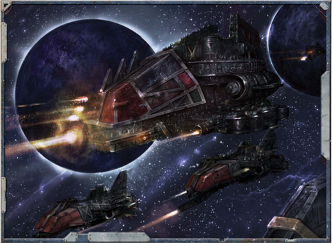

While  not  graceful  or  particularly  skilled  starfarers,  the  low cunning and reckless enthusiasm of [The Orks](faction-ork-overview.md) combined with their prodigious [Endurance](chargen-stage2-origin-path.md) and unrelenting persistence makes them as deadly in the cold and silent void as they are on the ground.  Ork  ships  are  extremely  durable,  able  to  withstand greater punishment than an Imperial vessel of similar mass, and often  clad  in  thick  [Armour](armour.md)  that  [Turns](rules-combat-overview.md)  aside  all  but  the  most concerted  assaults.  Their  tactics  are  simplistic  but  brutally efficient, [Flying](combat-movement.md) towards their foes as swiftly as possible, firing all the while. As they close, the holds and caverns of an Ork ship  echo  with  bellowed  war  cries  from  the  teeming  masses

of Orks within, eagerly awaiting the moment when they can board an enemy vessel and sate their lust for battle.

The  heavy  armour  and  massive  superstructures  of  Ork vessels afford them considerable resilience, a trait bolstered further  by  the  innate  durability  of  Ork  technology,  which remains functional almost in spite of [Damage](character-injury.md). For additional defence, crackling force fields wreathe Ork vessels, whether projected  from  salvaged  void  shield  generators  or  bizarre mek-built 'kustom' force field projectors.

It is in the realm of weaponry that the Orks truly excel. Their starships are more heavily armed than Imperial vessels of  comparable  [Size](character-traits.md).  Massive  batteries  of  macrocannons  dot the  [Hulls](hulls-overview.md)  of  every  Ork  ship,  turrets  and  barrels  protruding from every gap in the ship's [Hull](starship-anatomy-detailed.md), capable of battering through a  ship's  void  shields  and  ripping  chunks  out  of  their  hull. In a matter of minutes, an Ork vessel can unleash thousands of [Shells](weapons-ammunition.md) at a target, filling the void around an enemy with debris,  shrapnel  and  unexploded  shells.  Powerful,  [Unstable](weapons-general.md) explosive [Warheads](weapons-warheads.md) are loaded onto Ork fighta-bommaz and into [Torpedoes](weapons-torpedoes.md), to be hurled at the enemy with great abandon.

*Source:* `Battle Fleet of the Koronus, page 75`
